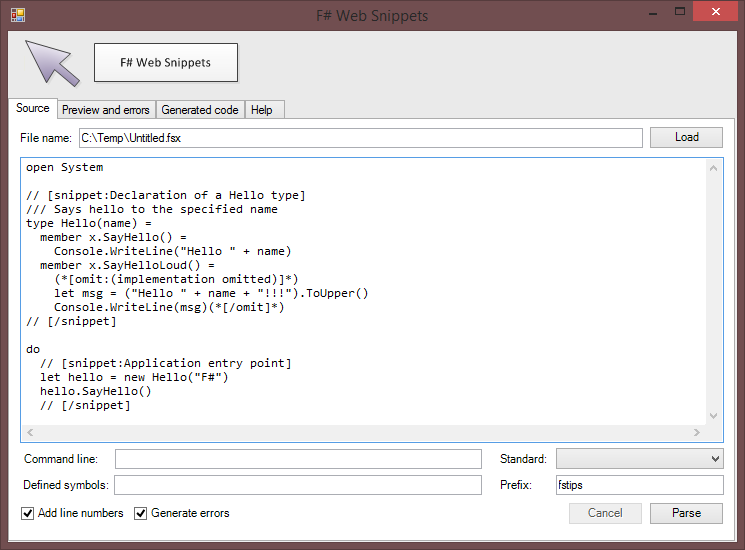
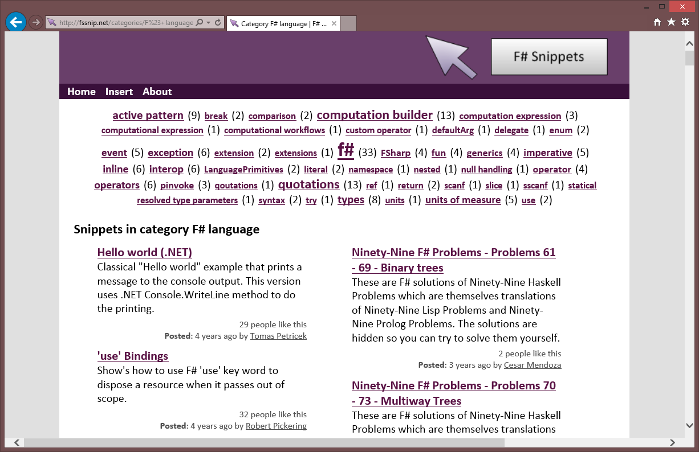
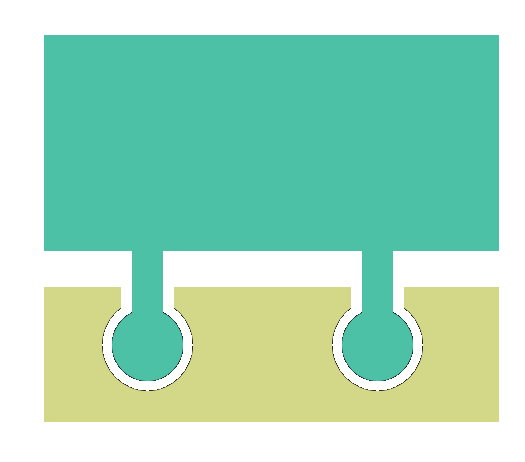
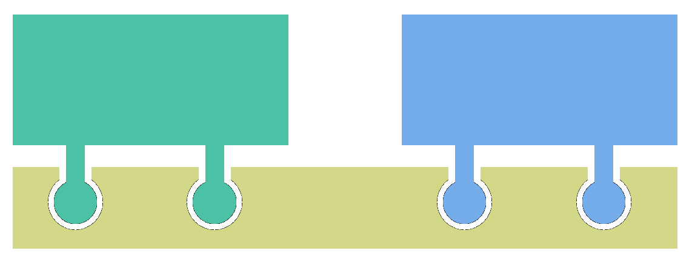
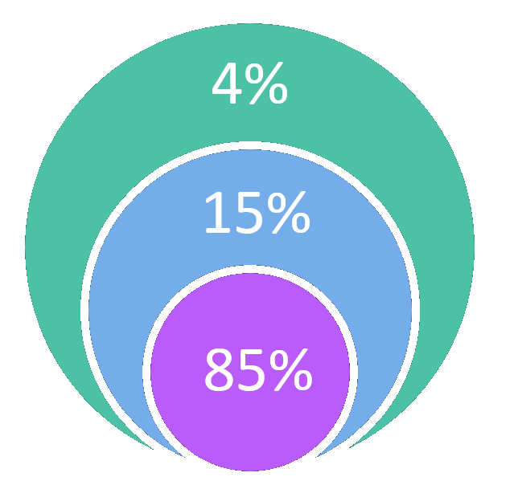
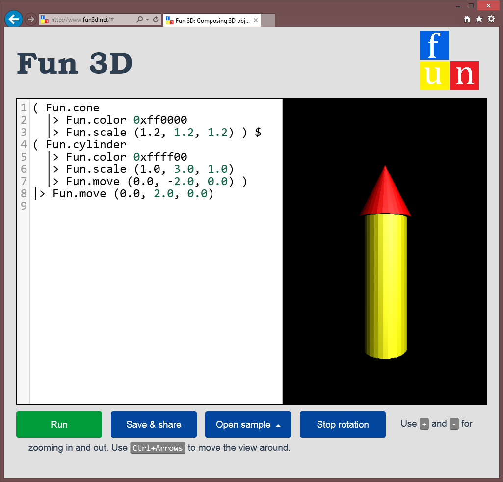

- title : Functional library design
- description : What is the difference between frameworks and libraries
    and why (and how) you should design libraries & avoid frameworks.
- author : Tomas Petricek
- theme : night
- transition : none

***************************************************************************************************

# Functional library design  <small>NCrafts.io, Paris, 21-22 May</small>

**Tomas Petricek**, fsharpWorks  
[@tomaspetricek](http://twitter.com/tomaspetricek)
| [tomasp.net](http://tomasp.net)
| [fsharpworks.com](http://fsharpworks.com)

***************************************************************************************************

## Case study: F# Formatting

I don't know **the answer**, but this  
worked nicely for one library!

 

 1. Formatting _F# snippets_
 2. Parsing _Markdown_ documents
 3. _Literate_ programming tools
 4. _Documentation_ for .NET libraries

---------------------------------------------------------------------------------------------------

## From highlighting _F# snippets_

---------------------------------------------------------------------------------------------------

## And highlighting _F# snippets_

---------------------------------------------------------------------------------------------------

## To documenting _.NET libraries_

---------------------------------------------------------------------------------------------------

## The story of F# Formatting

+------------------------------+-------------+
| F# Snippets web site         | _Sept 2010_ |
+------------------------------+-------------+
| Markdown parser (TryJoinads) | _Jan 2012_  |
+------------------------------+-------------+
| F# Data documentation        | _Jan 2013_  |
+------------------------------+-------------+
| Deedle + ProjectScaffold     | _Oct 2013_  |
+------------------------------+-------------+
| FsLab Journal                | _Apr 2014_  |
+------------------------------+-------------+
| FsReveal project             | _Jul 2014_  |
+------------------------------+-------------+

---------------------------------------------------------------------------------------------------

## The story of F# Formatting

 - **Took a long time and changed**  
   _Many good things start as dirty hacks!_

 - **Does things we did not plan**  
   _Composed and evolved from experiments_

 - **Used in unexpected ways**  
   _Even these slides! How cool is that?_

***************************************************************************************************

# Functional library design principles

---------------------------------------------------------------------------------------------------

## Functional library design principles

 

 - <i class="fa clr fa-magic"></i> Evolving design
 - <i class="fa clr fa-cubes"></i> Composability
 - <i class="fa clr fa-fax"></i> Avoid callbacks
 - <i class="fa clr fa-tasks"></i> Layers of abstraction

***************************************************************************************************

# <i class="fa clr fa-magic"></i> Evolving design

---------------------------------------------------------------------------------------------------

# <i class="fa clr2 fa-keyboard-o"></i> DEMO <i class="fa clr2 fa-keyboard-o"></i>

 

## From script to a library

---------------------------------------------------------------------------------------------------

<table><tr><td style="padding-right:40px">

### <i class="fa fa-pencil-square clr"></i> From script...

 - [Paket](http://fsprojects.github.io/Paket/) dependencies
 - Expose internals!
 - Copy and paste!

</td><td style="padding-left:40px">

### <i class="fa fa-book clr"></i> ...to library

 - Publish on NuGet
 - Documentation
 - Reusable API

</td></tr></table>

***************************************************************************************************

# <i class="fa clr fa-cubes"></i> Composability

---------------------------------------------------------------------------------------------------

# <i class="fa clr2 fa-keyboard-o"></i> DEMO <i class="fa clr2 fa-keyboard-o"></i>

 

## Markdown with code formatting

---------------------------------------------------------------------------------------------------

## Markdown with code formatting

    let rec collectSnips par = seq {
      match par with
      | CodeBlock(code, "fsharp", _) ->
          // Extract F# code block for formatting!
          yield code
      | Matching.ParagraphNested(_, pars) ->
          for p in pars do
            yield! collectSnips p
      | _ -> () }

    let codes = doc.Paragraphs |> Seq.collect collectSnips

---------------------------------------------------------------------------------------------------

## Markdown with code formatting

    let rec replaceSnips lookup par =
      match par with
      | CodeBlock(code, "fsharp", _) ->
          // Replace F# snippet with formatted HTML
          Literal(lookup.[code])
      | Matching.ParagraphNested(pn, nested) ->
          let pars = List.map (replaceSnips lookup) nested
          Matching.ParagraphNested(pn, pars)
      | other -> other

    let newPars = doc.Paragraphs |> List.map replaceSnips

***************************************************************************************************

# <i class="fa clr fa-fax"></i> Avoid callbacks

---------------------------------------------------------------------------------------------------

<table><tr><td style="padding-right:40px;text-align:center;">

### Libraries

Call methods or functions

</td><td style="padding-left:40px;text-align:center;" class="fragment">

### Frameworks

Implement an interface

</td></tr></table>

No _formal_ definitions, but callbacks are indicators!

---------------------------------------------------------------------------------------------------

## Avoid callbacks and frameworks

Frameworks do not compose _nicely_!

---------------------------------------------------------------------------------------------------

## Avoid callbacks and frameworks

Composing libraries is _easy_!

---------------------------------------------------------------------------------------------------

# <i class="fa clr2 fa-hand-o-right"></i> SAMPLE <i class="fa clr2 fa-hand-o-left"></i>

 

## Framework vs. library style

---------------------------------------------------------------------------------------------------

## In the F# Formatting context

We want to customize the document:

 - Parse Markdown document
 - _Split multi-language snippets_
 - Format F# & other snippets
 - _Generate HTML with tabs_
 - Produce final HTML document

Used in [Alea GPU tutorial](http://quantalea.com/static/app/tutorial/quick_start/quick_start_example.html)
by QuantAlea.

---------------------------------------------------------------------------------------------------

## Framework approach

Pass interface implementation to `Literate.Process`:

    type IDocProcessor =
      abstract OnParseDoc : Document -> Document
      abstract OnFormatDoc : Document -> Document
      abstract OnParseSnippet : Node -> Node
      abstract OnFormatSnippet : Node -> Node
      // Lots of methods we can override!

---------------------------------------------------------------------------------------------------

## Framework approach

    type MultiLangHandler() =
      inherit DocProcessor()
      let mutable snippets = []
      let mutable transformed = None
      // Collect all parsed snippets for later
      override x.OnParseSnippet(snip) =
        snippets <- snip::snippets
      // Transform when we have all & format
      override x.OnFormatSnippet(snip) =
        if transformed = None then
          transformed <- transformAll snippets
        lookup transformed snip

 - Frameworks lead to _uninitalized states_
 - Frameworks lead to _mutation_
 - Frameworks lead to _inheritance complexity_

---------------------------------------------------------------------------------------------------

## Library approach

Provide more _fine-grained_ functions:

    let doc = Literate.ParseScriptString(input) // Library
    let snips = collectCodeSnippets doc         // us
    let snips = transformSnippets snips         // us
    let doc = Literate.FormatLiterateNodes(doc) // Library
    let doc = replaceSnippets snips doc         // us
    Literate.WriteHtml(doc)                     // Library

 - We control the _control flow_
 - We control _our additional state_
 - Still call library-provided steps!

---------------------------------------------------------------------------------------------------

# <i class="fa clr2 fa-hand-o-right"></i> WALKTHROUGH <i class="fa clr2 fa-hand-o-left"></i>

 

## Inverting the flow in games

---------------------------------------------------------------------------------------------------

    [hide]
    type DrawingContext = DC

## Class in a game framework

    type Game =
      abstract Initialize : unit -> unit
      abstract Draw : DrawingContext -> unit
      abstract Update : unit -> unit

 

### User just implements an abstract class!

 - Web frameworks love this!
 - But what is the contract?

---------------------------------------------------------------------------------------------------

## Using a game framework

    type MyGame() =
      inherit Game()
      let mutable x = 0
      let mutable mario = None

      override this.Initialize() =
        mario <- Some(Image.Load("mario.png"))
      override this.Update() =
        x <- x + 1
      override this.Draw(ctx) =
        mario |> Option.iter (fun mario ->
          ctx.Draw(x, 0, mario))

    Game.Start(new MyGame())

 - Frameworks often need _mutation_
 - Framewokrs often need _uninitalized state_

---------------------------------------------------------------------------------------------------

## Designing a game _library_

How to put the user in control? _Use events!_

 

    type Game =
      member Update : IEvent<unit>
      member Draw : IEvent<DrawingContext>
      member IsRunning : bool

---------------------------------------------------------------------------------------------------

## Designing a game _library_

    // Initialize game and resources
    let game = new Game()
    let mario = Image.Load("mario.png")

    // Recursive loop that runs until the end of the game
    let rec loop x = async {
      if game.IsRunning then
        let! evt = Async.AwaitObservable
          (game.Update, game.Draw)
        match evt with
        | Choice1Of2() -> return! loop (x + 1)
        | Choice2Of2(ctx) ->
            ctx.Draw(x, 0, mario)
            return! loop x }

    loop 0  // Start with x=0

***************************************************************************************************

# <i class="fa clr fa-tasks"></i> Layers of abstraction

---------------------------------------------------------------------------------------------------

## Layers of abstraction

---------------------------------------------------------------------------------------------------

## Case study: F# lists

<table><tr><td style="padding-right:30px">

### High-level

 - Higher-order funcs
 - `map`, `filter` etc
 - 85% of cases

</td><td style="padding-left:30px">

### Low-level

 - Recursive funcs
 - `x::xs` and `[]`
 - Remaining 15%

</td></tr></table>

---------------------------------------------------------------------------------------------------

## Case study: Functional 3D

---------------------------------------------------------------------------------------------------

# <i class="fa clr2 fa-keyboard-o"></i> DEMO <i class="fa clr2 fa-keyboard-o"></i>

 

## FsReveal and F# Formatting

***************************************************************************************************

# Summary

---------------------------------------------------------------------------------------------------

## Libraries and frameworks

<table><tr><td style="padding-right:30px">

### Libraries <i class="fa fa-thumbs-o-up" style="color:#4AEF4A"></i>

 - Use multiple libs
 - Clear control flow
 - Layers of abstraction

</td><td style="padding-left:30px">

### Frameworks  <i class="fa fa-thumbs-o-down" style="color:#FF4255"></i>

 - One framework only
 - Many entry points
 - One way of doing things

</td></tr></table>

---------------------------------------------------------------------------------------------------

## Functional library design principles

 <i class="fa clr fa-magic"></i> _Evolving design_  
Encourage early experiments

 <i class="fa clr fa-cubes"></i> _Composability_  
Allow unexpected uses

 <i class="fa clr fa-fax"></i> _Avoid callbacks_  
Let the caller control things

 <i class="fa clr fa-tasks"></i> _Layers of abstraction_  
Make 85% tasks easy, 99% possible

---------------------------------------------------------------------------------------------------

# Thank you!

 

<table><tr><td style="vertical-align:middle;padding-right:30px;">

</td><td style="padding-left:30px;">

</td></tr></table>

 

**Tomas Petricek**, fsharpWorks  

See [functional-programming.net](http://functional-programming.net/) for books & trainings!  
[@tomaspetricek](http://twitter.com/tomaspetricek)
| [tomasp.net](http://tomasp.net)
| [fsharpworks.com](http://fsharpworks.com)  
