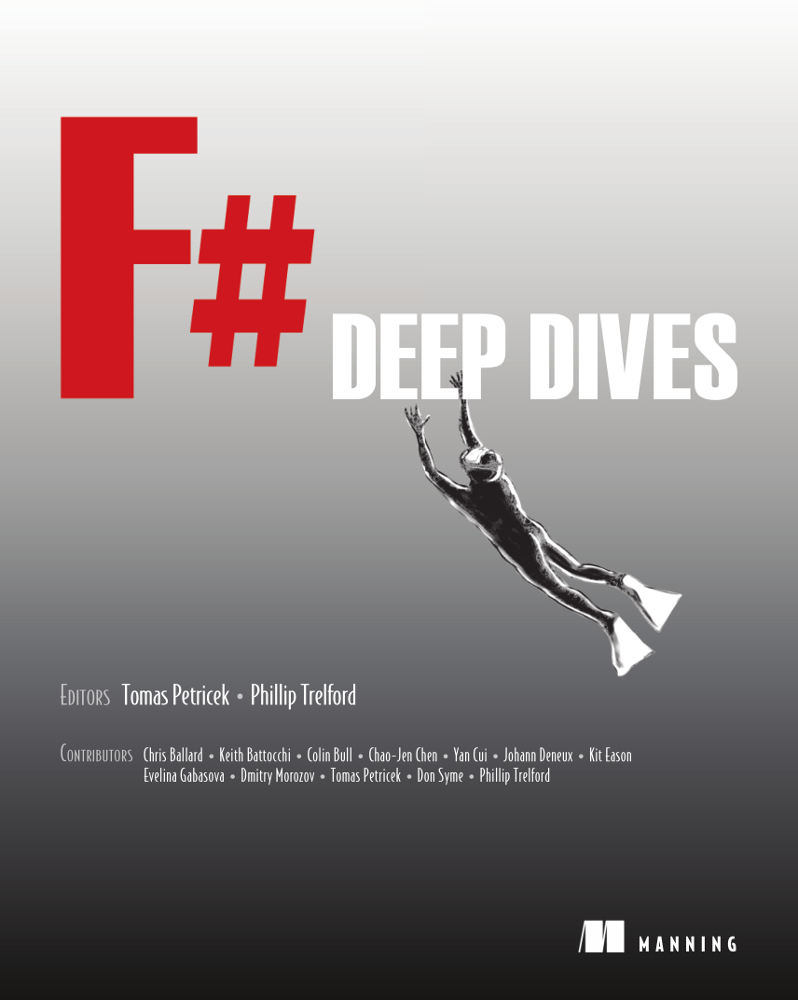
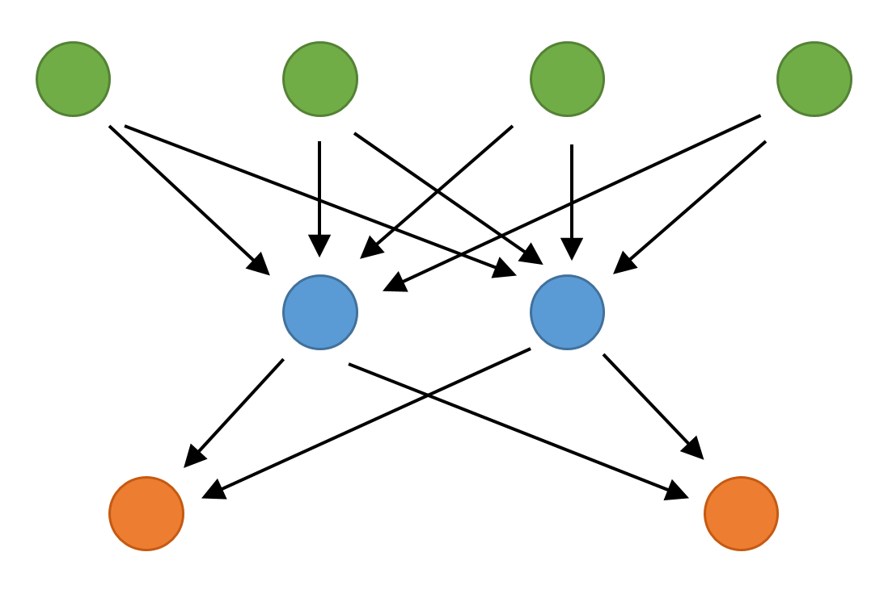
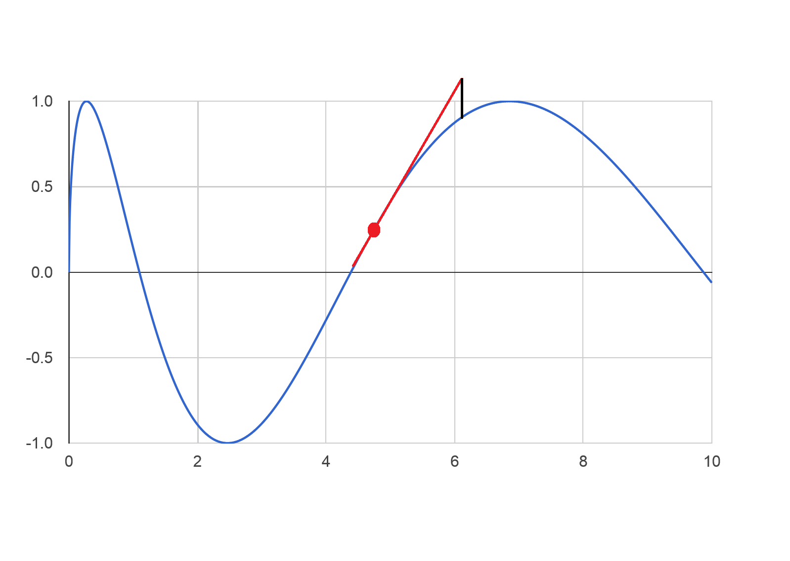

- title : Machine Learning with Functional Programming and F#
- description : In this presentation, we look how to use F# data science tools in the finance
     industry. The talk introduces business reasons for using F# and then looks at a number of
     practical examples of accessing, exploring and visualizing financial data sets.
- author : Evelina Gabasova, Tomas Petricek
- theme : white
- transition : none

****************************************************************************************************

# Machine Learning

##  with Functional Programming and F# 

Evelina Gabasova ([@evelgab](http://www.twitter.com/evelgab))  
Tomas Petricek ([@tomaspetricek](http://www.twitter.com/tomaspetricek))

----------------------------------------------------------------------------------------------------

# About us

 

## Evelina Gabasova

 - Bioinformatics at Cambridge University
 - F# and Machine Learning speaker

## Tomas Petricek

 - Trainings and consulting at [fsharpWorks](http://www.fsharpworks.com)
 - Functional languages research
 - F# language and OSS contributor 

****************************************************************************************************

# The F# Software Foundation

## [www.fsharp.org](http://www.fsharp.org)

The mission of the non-profit _F# Software Foundation_ is to promote, protect, and
advance the F# programming language.

 

 - Independent registered non-profit
 - Open-source community & contributors
 - Microsoft, Xamarin, Tachyus, Jet.com,...

----------------------------------------------------------------------------------------------------

# F# for Machine Learning

_"F# empowers users to tackle complex computing problems with simple, maintainable and robust code."_

 

## What this really means

 - Can implement complex ML algorithms
 - Code is easy to understand
 - We can integrate it with .NET

****************************************************************************************************

# PART 1
## Recognizing languages   using letter pair frequency

----------------------------------------------------------------------------------------------------

# The plan

 - **Get sample text** from from Wikipedia pages (_done_)
 - **Calculate features** frequencies of _letter pairs_
 - **Compare languages** using their _features_
 - **Classify language** find the _most similar_ one

----------------------------------------------------------------------------------------------------

# STEP 1
## Calculating frequencies

Example using sample English text _"the three"_

 
<table><tr><td class="noborder">

+----+---+
| _t | 1 |
+----+---+
| th | 2 |
+----+---+
| he | 1 |
+----+---+

</td><td class="noborder">

+----+---+
| e_ | 1 |
+----+---+
| _t | 1 |
+----+---+
| hr | 1 |
+----+---+

</td><td class="noborder">

+----+---+
| re | 1 |
+----+---+
| ee | 1 |
+----+---+
| e_ | 1 |
+----+---+

</td></tr></table>

----------------------------------------------------------------------------------------------------

# STEP 1
## Calculating frequencies

Now calculate _probabilities_ of the pairs

 
<table><tr><td class="noborder">

+----+------+
| _t | 0.11 |
+----+------+
| th | 0.22 |
+----+------+
| he | 0.11 |
+----+------+

</td><td class="noborder">

+----+------+
| e_ | 0.11 |
+----+------+
| _t | 0.11 |
+----+------+
| hr | 0.11 |
+----+------+

</td><td class="noborder">

+----+------+
| re | 0.11 |
+----+------+
| ee | 0.11 |
+----+------+
| e_ | 0.11 |
+----+------+

</td></tr></table>

----------------------------------------------------------------------------------------------------

# STEP 2
## Calculating distance between features

+------------+-----+-----+-----+-----+
|            | th  | e_  | ee  | el  |
+------------+-----+-----+-----+-----+
| English    | 0.3 | 0.2 | 0.2 | 0.1 |
+------------+-----+-----+-----+-----+
| Portuguese | 0.0 | 0.2 | 0.1 | 0.3 |
+------------+-----+-----+-----+-----+

Distance is the _sum of squares of differences_.

----------------------------------------------------------------------------------------------------

# STEP 2
## Calculating distance between features

+------------+-----+-----+-----+------+
|            | th  | e_  | ee  | el   |
+------------+-----+-----+-----+------+
| English    | 0.3 | 0.2 | 0.2 | 0.1  |
+------------+-----+-----+-----+------+
| Portuguese | 0.0 | 0.2 | 0.1 | 0.3  |
+------------+-----+-----+-----+------+
| Difference | 0.3 | 0.0 | 0.1 | -0.2 |
+------------+-----+-----+-----+------+

_Sum of squares_: $0.09+0.0+0.01+0.04 = 0.14$

----------------------------------------------------------------------------------------------------

# STEP 3
## Classifying unknown text

+--------------+------------+---------+---------+-------+
|              | Portuguese | Spanish | English | Czech |
+--------------+------------+---------+---------+-------+
| Unknown text | 0.10       | 0.14    | 0.25    | 0.27  |
+--------------+------------+---------+---------+-------+

----------------------------------------------------------------------------------------------------

# PART 1

## [github.com/tpetricek/QCon.Languages](http://github.com/tpetricek/QCon.Languages)

****************************************************************************************************

# PART 2
## Recognizing languages   using simple neural net

----------------------------------------------------------------------------------------------------

# How neural networks work

----------------------------------------------------------------------------------------------------

# Network with single neuron

----------------------------------------------------------------------------------------------------

# Learning the weights

 - **Initial weights** can be generated randomly
 - **Improve weights** using gradient descent
 - **Repeat recursively** until certain error or number of steps

----------------------------------------------------------------------------------------------------

# Improving using gradient descent

----------------------------------------------------------------------------------------------------

# Gradient descent in more dimensions

****************************************************************************************************

# Conclusions

## Learning more

---------------------------------------------------------------------------------------------------

# Learning more about F#

## More talks at QCon Rio

 - _10 Ways of Getting Started with F#_, Thursday, 12:05
 - _Data science the functional way_, Friday, 16:45

## Web sites to check out

 - The F# Foundation [www.fsharp.org](http://www.fsharp.org)
 - FsLab Package [www.fslab.org](http://www.fslab.org)
 
---------------------------------------------------------------------------------------------------

# Thank you!

 

## Evelina Gabasova - [@evelgab](http://www.twitter.com/evelgab)
## Tomas Petricek - [@tomaspetricek](http://www.twitter.com/tomaspetricek)

 
 

Personal: [evelinag.com](http://evelinag.com)
| [tomasp.net](http://tomasp.net)  
Work: [fsharpworks.com](http://fsharpworks.com)
| [functional-programming.net](http://functional-programming.net/)
