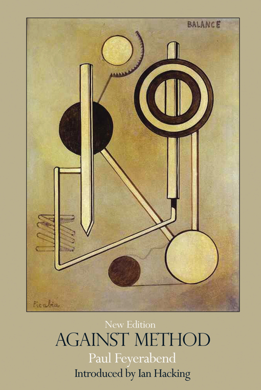

- title : Paul Feyerabend's Against Method
- description : How is computer science research done? What we take for granted and what we 
   question? And how do theories in computer science tell us something about the real world? 
   Those are some of the questions that may inspire computer scientist like me (and you!) to look 
   into philosophy of science. I’ll present the work of one of the more extreme (and interesting!) 
   philosophers of science, Paul Feyerabend. In “Against Method”, Feyerabend looks at the history 
   of science and finds that there is no fixed scientific methodology and the only methodology 
   that can encompass the rich history is ‘anything goes’. We see (not only computer) science as 
   a perfect methodology for building correct knowledge, but is this really the case? 
- author : Tomas Petricek
- theme : white
- transition : none

***************************************************************************************************

# Paul Feyerabend's Against Method

**Tomas Petricek**, University of Cambridge  
[http://tomasp.net](http://tomasp.net) | [tomas@tomasp.net](mailto:tomas@tomasp.net) | [@tomaspetricek](http://twitter.com/tomaspetricek)

$$$
\definecolor{mc}{RGB}{0,32,172}
\definecolor{cc}{RGB}{172,0,32}

***************************************************************************************************

## Philosophy of Science

 

---------------------------------------------------------------------------------------------------

## Philosophy of Science

> The success of physics over the last three hundred years is to be 
> attributed to the application of ‘the scientific method’. If other 
> disciplines are to emulate the success of physics then that is to 
> be achieved by understanding and applying this method. 

Alan Chalmers (1999). **What Is This Thing Called Science?** 

---------------------------------------------------------------------------------------------------

Karl Popper (1934/1959)  
**The Logic of Scientific Discovery**

Thomas Kuhn (1962)  
**The Structure of Scientific Revolutions**

Imre Lakatos (1978)  
**The Methodology of Scientific Research Programmes**

Paul Feyerabend (1975)  
**Against Method**

Bruno Latour (1987)  
**Science in Action**

***************************************************************************************************

## Anything goes

 

---------------------------------------------------------------------------------------------------

## Anything goes

> To those who look at the rich material provided by history,
> it will become clear that there is only one principle that can be
> defended under all circumstances. It is the principle: _anything goes_.

 

> _Anything goes_ is not a 'principle' I hold... but the terrified 
> exclamation of a rationalist who takes a closer look at history.

***************************************************************************************************

## Galilei and heliocentrism

 

---------------------------------------------------------------------------------------------------

> For Galileo uses propaganda. He uses _psychological tricks_ 
> in addition to whatever intellectual reasons he has to offer.

---------------------------------------------------------------------------------------------------

## Natural interpretations

**Against the movement of Earth**

 - We do not feel any movement
 - Stone falling from a tower argument

**Galileo invents a new story**

 - Relativity of all movement
 - Law of circular inertia

---------------------------------------------------------------------------------------------------

## Natural interpretations

**Assumptions that we do not question**

 - Hard core of research programmes

**Common in any computer science field**

 - Pure functional programming & mutation
 - Computations are modelled as monads
 - Type systems are sound & prevent errors

---------------------------------------------------------------------------------------------------

## Galileo and telescope

> The first telescopic observations of the sky are indistinct and in conflict 
> with what everyone can see with his unaided eyes.

> The problem is different for celestial and terrestrial objects (...)
> because of the contemporary idea that celestial and terrestrial objects
> are made from different materials and obey different laws.

---------------------------------------------------------------------------------------------------

## Language may have to be revised

> The language in which we express our observations may have to be revised so that
> the new cosmology is not endangered by an unnoticed collaboration of older ideas.

---------------------------------------------------------------------------------------------------

## Language may have to be revised

**Avoid unnoticed interaction with older ideas**

 - F# computation expressions and monads
 - Union types in type providers

---------------------------------------------------------------------------------------------------

## The Galileo trial

> The experts declared the doctrine to be 'foolish  and absurd in philosophy' (unscientific to use
> a modern term) based  exclusively on the scientific situation of the time. 
>
> _It was incorrect._

---------------------------------------------------------------------------------------------------

## Unscientific $\neq$ wrong

> Science is much more ‘sloppy’ and ‘irrational’  than its methodological image.

***************************************************************************************************

## Against method

 

---------------------------------------------------------------------------------------------------

> Theoretical anarchism is more humanitarian and is more likely to 
> encourage progress than its law-and-order alternatives. 

---------------------------------------------------------------------------------------------------
  
## Consistency condition

**New hypotheses should agree with accepted theories**

> The consistency condition is unreasonable because it preserves the older theory,
> and not the better theory.

**In computer science**

Follow the framework used by other solutions

---------------------------------------------------------------------------------------------------

## Structure of science

> The methodological unit to which we must refer is a whole set of 
> partly overlapping, factually adequate, but mutually inconsistent theories. 

**In programming languages**

Types in Dart, TypeScript, Idris and F#

---------------------------------------------------------------------------------------------------

## Empirical observations

> This need to wait and to ignore large masses of critical observations is hardly 
> ever discussed in our methodologies.

**In programming languages**

Purely functional programming cannot do I/O

---------------------------------------------------------------------------------------------------

## Clarity requirement
  
> To 'clarify' the terms does not mean to study the additional properties of the domain in 
> question, it means to fill them with existing notions from the entirely different domain of 
> logic and to take care that the process of filling obeys the accepted laws of logic.

 
> So the course of an investigation is deflected into the narrow channels of things already 
> understood and the possibility of fundamental conceptual discovery is significantly reduced.

***************************************************************************************************

## Theoretical anarchism

 

---------------------------------------------------------------------------------------------------

## Alternative theories

> The alternatives may be taken from the past as well. As a matter of fact, they may be 
> taken from wherever one is able to find them - from ancient myths and modern prejudices; 
> from the lucubrations of experts and from the fantasies of cranks.

---------------------------------------------------------------------------------------------------

## Alternative theories

**Charles Babbage**

Builds on Adam Smith and division of labor

**Ada Lovelace**

Builds on poetry and music

**John von Neumann**

Computer model as a model of brain

---------------------------------------------------------------------------------------------------

## Metaphors in programming

Concurrency?

Language?

Libraries?

---------------------------------------------------------------------------------------------------

## Rationalism as after-thought

> 'Voice of reason' is but a _causal after-effect_ of the training.

**We only present perfect after-version in papers**

 - Science does not start with problems
 - Discovery and justification is intertwined
 - Metaphors behind theories matter
  

**Be careful when reading papers we love :-)**

***************************************************************************************************

## Summary

 

---------------------------------------------------------------------------------------------------

## Summary

There is no rule of thumb for distinguishing good and bad science.

Epistemological anarchism is more likely to encourage progress than its law-and-order alternatives.

---------------------------------------------------------------------------------------------------

> I make my selection in a highly individual way. Science needs people who are adaptable 
> and inventive, not rigid imitators of ‘established’ behavioural patterns.

 

[http://tomasp.net](http://tomasp.net) | [tomas@tomasp.net](mailto:tomas@tomasp.net) | [@tomaspetricek](http://twitter.com/tomaspetricek)
