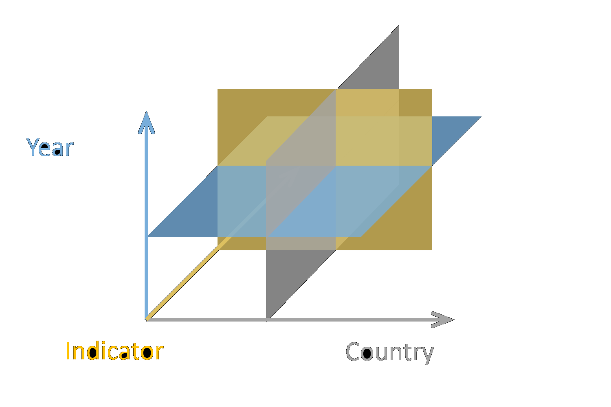

- title : The Gamma
- description : Data journalism
- author : Tomas Petricek
- theme : night
- transition : none

***************************************************************************************************
 - class: intro

# Understanding the World  with Type Providers 

[www.thegamma.net](http://thegamma.net)

    

**Tomas Petricek**  
[_@tomaspetricek_](http://twitter.com/tomaspetricek) |
[_tomas@tomasp.net_](mailto:tomas@tomasp.net)

***************************************************************************************************
 - data-background : images/matrix.png

***************************************************************************************************

# Data journalism

---------------------------------------------------------------------------------------------------

Illustration from: [Data journalism handbook](http://datajournalismhandbook.org/)

---------------------------------------------------------------------------------------------------

The Economist: [The East is Grey](http://www.economist.com/news/briefing/21583245-china-worlds-worst-polluter-largest-investor-green-energy-its-rise-will-have?fsrc=scn/fb/wl/pe/eastisgrey) 
The Guardian: [China overtakes US as world's biggest CO2 emitter](http://www.theguardian.com/environment/2007/jun/19/china.usnews)

---------------------------------------------------------------------------------------------------

## Data driven articles

Not just text with visualizations, but...

 - Can it be _modified and reproduced_?
 - Is the _source code_ available?
 - Are the _data sources_ referenced?

 

> **Data driven article is really a program!**

  

***************************************************************************************************

# The Gamma

---------------------------------------------------------------------------------------------------

### Data driven article in The Gamma

The Gamma: [The world's biggest polluters](http://thegamma.net/carbon)  

---------------------------------------------------------------------------------------------------

## Article is a program view

There is no magic. It is just [code and text](https://github.com/tpetricek/TheGamma/blob/master/web/demos/carbon.md)!

 - We see the _journalist's story_ first
 - Readers can _modify the parameters_
 - Power users can _see and modify the code_

  

---------------------------------------------------------------------------------------------------

## Programming language problem

Typed functional language with type providers

 - Simple code with _functional programming_
 - Editor support via **static types** 
 - Data access with _F# type providers_

  

***************************************************************************************************

# Theory of type providers

---------------------------------------------------------------------------------------------------

---------------------------------------------------------------------------------------------------

---------------------------------------------------------------------------------------------------

***************************************************************************************************

# The Gamma technology

---------------------------------------------------------------------------------------------------

## World bank data source

---------------------------------------------------------------------------------------------------

## World bank data source

---------------------------------------------------------------------------------------------------

## World bank data source

---------------------------------------------------------------------------------------------------

## World bank data source

---------------------------------------------------------------------------------------------------

## World bank type provider

---------------------------------------------------------------------------------------------------

## Auto-generated options

One of members of the same type

    let co2 =
      world.byYear.``2010``.``Climate Change``
        .``CO2 emissions (kt)``
        

List with sub-set of properties

    let topCountries =
      [ world.byCountry.China
        world.byCountry.India
        world.byCountry.Japan ]    

---------------------------------------------------------------------------------------------------

## Suave.io web server

`Request -> Response`

---------------------------------------------------------------------------------------------------

## Suave.io web server

Light-weight, composable, cross-platform

 

    let app =
      choose
        [ Editor.webPart checker
          Document.webPart fsi
          Evaluator.webPart fsi
          Visualizers.webPart checker
          staticWebFile
          RequestErrors.NOT_FOUND("Not found") ]

***************************************************************************************************

# Why F# matters

---------------------------------------------------------------------------------------------------

## For innovative technologies

### Powerful language

 - Supports quick _prototyping_
 - **Correctness** via static types

 
### Awesome community
 
 - Fantastic _open-source infrastructure_
 - Source of **interesting ideas**
 

***************************************************************************************************

## Summary

Is programming the new literacy?

 - _Understanding_ information is
 - **Programming** needs to evolve
 - Check out the _prototype_!

 

Do not forget to vote!

[thegamma.net](http://thegamma.net) |
[_@tomaspetricek_](http://twitter.com/tomaspetricek) |
[_tomas@tomasp.net_](mailto:tomas@tomasp.net)

