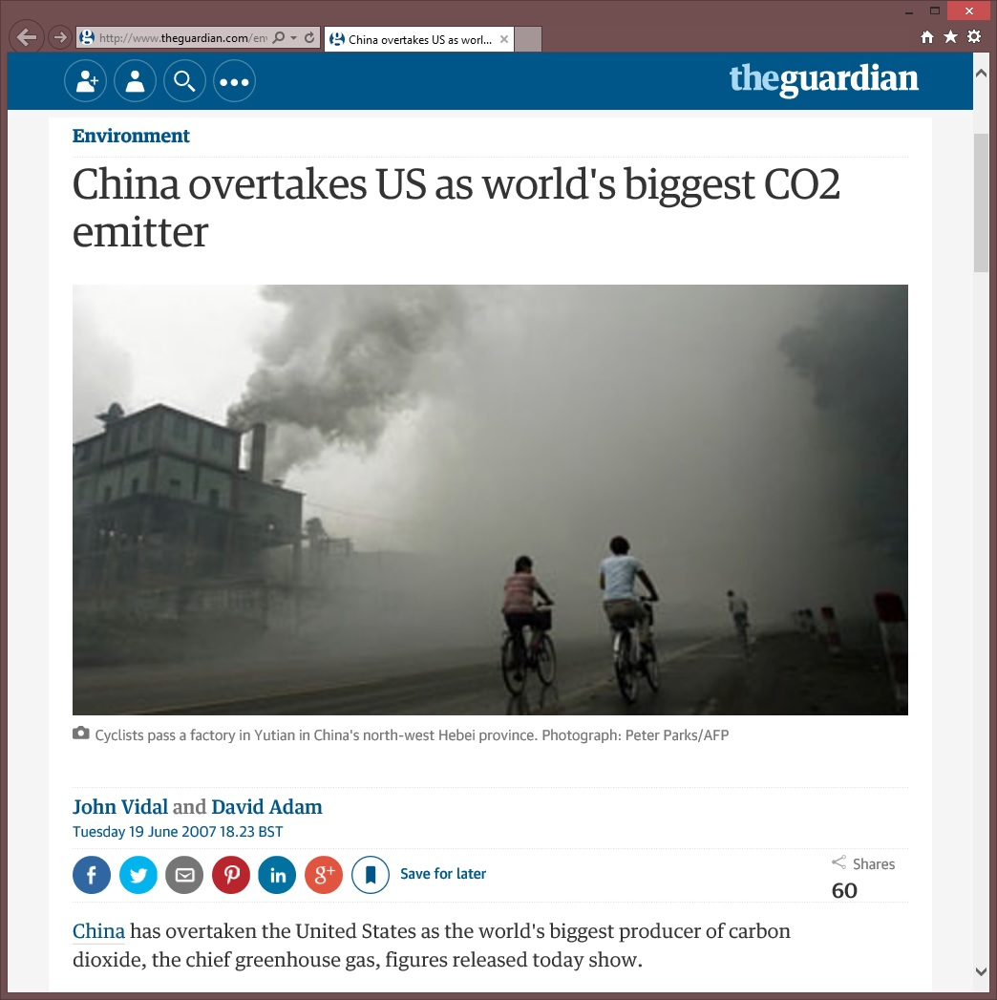
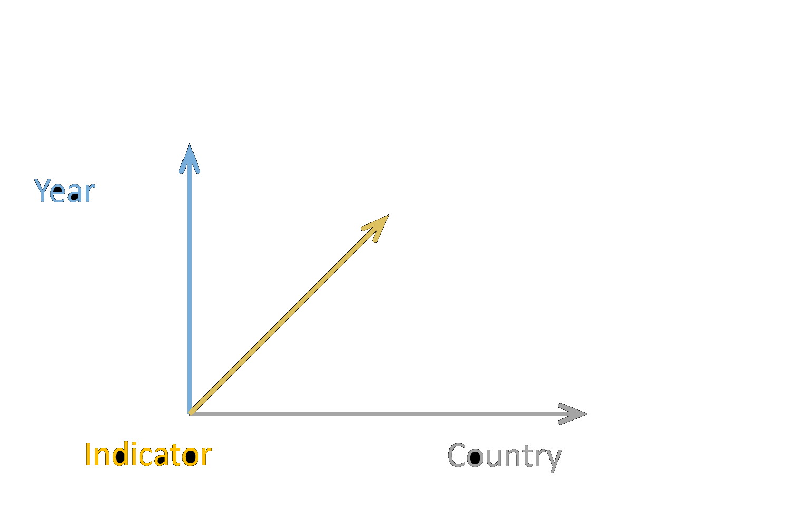

- title : The Gamma
- description : Data journalism
- author : Tomas Petricek
- theme : night
- transition : none

***************************************************************************************************
 - class: intro

# The Gamma

[www.thegamma.net](http://thegamma.net)

    

**Tomas Petricek**  
[_@tomaspetricek_](http://twitter.com/tomaspetricek) |
[_tomas@tomasp.net_](mailto:tomas@tomasp.net)

---------------------------------------------------------------------------------------------------

The Guardian: [China overtakes US as world's biggest CO2 emitter](http://www.theguardian.com/environment/2007/jun/19/china.usnews) 
The Economist: [The East is Grey](http://www.economist.com/news/briefing/21583245-china-worlds-worst-polluter-largest-investor-green-energy-its-rise-will-have?fsrc=scn/fb/wl/pe/eastisgrey)

---------------------------------------------------------------------------------------------------

### Transparency  **Is it misleading?**

 - Is China the _biggest pulluter_?
 - _University enrollment_ in Czech Republic

### Reproducibility  **Is it correct?**

 - Critique of _Piketty's Capital_
 - _Reinhart-Rogoff_ Growth in Time of Debt

 
---------------------------------------------------------------------------------------------------

<h2 style="margin:0px">Data journalism</h2>

Illustration from: [Data journalism handbook](http://datajournalismhandbook.org/)

***************************************************************************************************

# The Gamma

---------------------------------------------------------------------------------------------------

<h3 style="padding-left:75px">Data driven article in The Gamma</h3>

The Gamma: [The world's biggest polluters](http://thegamma.net/carbon)  

---------------------------------------------------------------------------------------------------

## Data driven articles

Not just text with visualizations, but...

 - Can it be _modified and reproduced_?
 - Is the _source code_ available?
 - Are the _data sources_ referenced?

 

> **Data driven article is really a program!**

  

---------------------------------------------------------------------------------------------------

## Article is a program view

There is no magic. It is just **code and text**!

 - We see the _journalist's story_ first
 - Readers can _modify the parameters_
 - Power users can _see and modify the code_

  

---------------------------------------------------------------------------------------------------

## Programming language research

Typed functional language with type providers

 - Simple code with _functional programming_
 - Editor support via **static types** 
 - Data access with _F# type providers_

  

---------------------------------------------------------------------------------------------------

<h3 style="padding-left:50px">Programming articles in The Gamma</h3>

The Gamma: [The world's biggest polluters (source code)](https://github.com/tpetricek/TheGamma/blob/master/web/demos/carbon.md)  

***************************************************************************************************

# Theory of type providers

---------------------------------------------------------------------------------------------------

---------------------------------------------------------------------------------------------------

---------------------------------------------------------------------------------------------------

***************************************************************************************************

# Technology behind

---------------------------------------------------------------------------------------------------

## World bank data source

---------------------------------------------------------------------------------------------------

## World bank data source

---------------------------------------------------------------------------------------------------

## World bank data source

---------------------------------------------------------------------------------------------------

## World bank data source

---------------------------------------------------------------------------------------------------

## World bank type provider

---------------------------------------------------------------------------------------------------

## Auto-generated options

One of members of the same type

    let co2 =
      world.byYear.``2010``.``Climate Change``
        .``CO2 emissions (kt)``
        

List with sub-set of properties

    let topCountries =
      [ world.byCountry.China
        world.byCountry.India
        world.byCountry.Japan ]    

***************************************************************************************************

# Future directions

---------------------------------------------------------------------------------------------------

## Future directions

Programming experiences research

Programming experiences: [Sean McDirmid on Lambda the Ultimate](http://lambda-the-ultimate.org/node/5247)

 - Usable _literate programming_
 - Use PL for **provenance, context** and more!
 - Mapping for _large-scale open government data_
 - Grammar of **interactive visualizations**
 
  

***************************************************************************************************

## Looking for early adopters :-)

### Summary

 - Information _literacy_
 - Article is a _program_
 - Future _usable programming_

Prototype [http://thegamma.net](http://thegamma.net)  
Contact [@tomaspetricek](http://twitter.com/tomaspetricek) |
[tomas@tomasp.net](mailto:tomas@tomasp.net)

