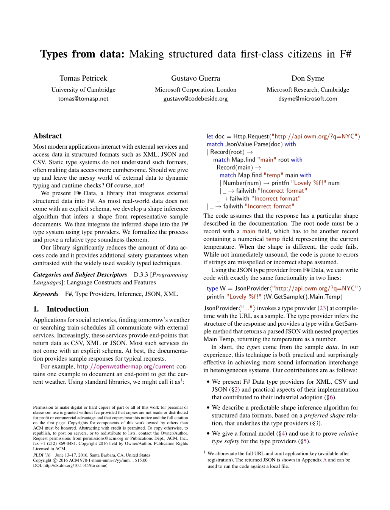

- title : Analysing Big Data in the Cloud
- description : Working with small time-series data is fun. You can easily load daily Microsoft stock
    prices into memory and find the most successful year it its history.  But what if you have prices
    at millisecond frequency for thousands of stocks or high-resolution temperatures for the entire globe?
- author : Tomas Petricek
- theme : night
- transition : none

***************************************************************************************************
 - data-background : images/houses3.jpg
 - class : withbackground

# Analysing  _Big Time-Series Data_   in the Cloud

 
 
 
 
 

### Tomas Petricek  [@tomaspetricek](http://twitter.com/tomaspetricek) | [tomasp.net](http://tomasp.net) 

***************************************************************************************************

## _Programming experience_ research

***************************************************************************************************

### The _most interesting_ programming experience is about _telling stories with data_

***************************************************************************************************

Distinguished paper at _PLDI 2016_

***************************************************************************************************
 - data-background : images/houses1.jpg
 - class : withbackground

# DEMO

## UK housing crisis (April 2016)

***************************************************************************************************

***************************************************************************************************

# www.**ionide**.io

 

_Atom_ and _VS Code_ bindings for F#

_Open_ with support for _community tooling_

  

***************************************************************************************************

## HTML formatters

 

Supported in _Ionide_ and _FsLab Journals_

Planned support in _Jupyter_ notebooks

***************************************************************************************************

## HTML formatters

 

    fsi.AddHtmlPrinter(fun (table:Table) ->
      [ "style", "" ],
      table.InlineHtml )

***************************************************************************************************
 - data-background : images/houses3.jpg
 - class : withbackground

# DEMO

## UK housing crisis (1995 - 2016)

***************************************************************************************************

***************************************************************************************************

## Deedle and Big Deedle

 

Exploratory _data frame_ and _time-series_ library

_In-memory_ data and _virtual_ data sources

 

Define addressing `IRangeKeyOperations<'A>`  
and data souurces `IVirtualVectorSource<'T>`

***************************************************************************************************
 - data-background : images/clouds.jpg
 - class : withbackground

# DEMO

## Processing house  prices in the cloud

***************************************************************************************************

***************************************************************************************************

<code class="fragment" style="font-size:70pt">async { .. }</code>

***************************************************************************************************

<code style="font-size:70pt;color:#ec7c4B;">cloud { .. }</code>

***************************************************************************************************

# www.**mbrace**.io

 

## Run your _computations_  where your _data_ is

***************************************************************************************************

## Analysing big data with F#

 - _fsharp.org_ for expressive, efficient & correct code
 - _ionide.io_ for modern extensible tooling
 - _fslab.org_ for all things data science
 - _mbrace.io_ for interactive scalable computing

 - _Deedle_ for time-series and data frames
 - _R Provider_ for world-class stats packages
 - _XPlot_ for rich HTML5 charting

***************************************************************************************************

# **Thank you!**

  

Full-length version of the talk: 
[https://vimeo.com/171317247](https://vimeo.com/171317247)

  

<h3 style="position:relative;top:20px">Tomas Petricek</h3>

[tomasp.net](http://tomasp.net) | [@tomaspetricek](http://twitter.com/tomaspetricek) | [tomas@tomasp.net](mailto:tomas@tomasp.net)
