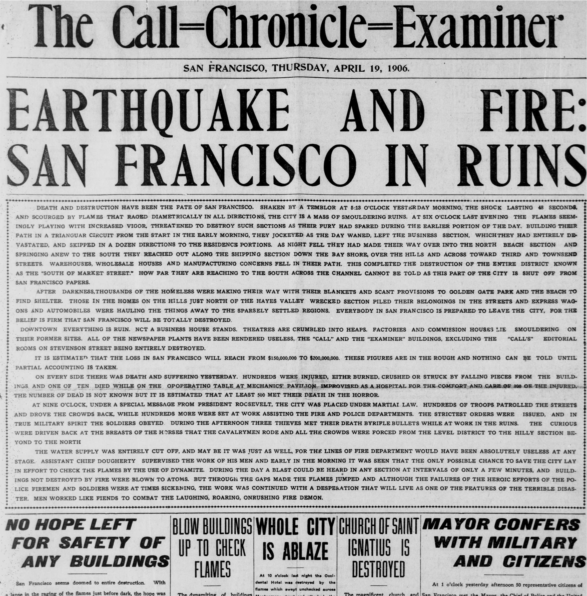

- title : End-to-end functional web development
- description : One of the myths about F# is that it is only good for complex
    mathematics. This could not be further from truth. In this talk, I'’'m going to walk through a
    complete web development story with F#. We’ll start with a script file to test a couple of ideas,
    wrap the code into a web server and we’ll finish by deploying our system to Azure and Heroku.
- author : Tomas Petricek
- theme : night
- transition : none

***************************************************************************************************

# End-to-end functional web development

**Tomas Petricek**, fsharpWorks  
[@tomaspetricek](http://twitter.com/tomaspetricek)
| [tomasp.net](http://tomasp.net)
| [fsharpworks.com](http://fsharpworks.com)

***************************************************************************************************

# The web is _functional_!

  

<pre style="font:175% consolas; background:transparent;text-align:center;" class="fragment">
Request -&gt; Response
</pre>

---------------------------------------------------------------------------------------------------

# The web is _asynchronous_!

  

<pre style="font:175% consolas; background:transparent;text-align:center;" class="fragment">
Request -&gt; Async&lt;Response&gt;
</pre>

***************************************************************************************************

<table><tr><td style="padding-right:50px;padding-top:60px">

# DEMO

Hello world and  _type providers_

</td><td style="padding-left:50px">

</td></tr></table>

---------------------------------------------------------------------------------------------------

# Demo summary

 

 - <i class="fa clr fa-rocket"></i> _Lightweight_ and _asynchronous_
 - <i class="fa clr fa-database"></i> Great with _type providers_
 - <i class="fa clr fa-cog"></i> Build and package _infrastructure_

---------------------------------------------------------------------------------------------------

# Package management with Paket

Specify dependencies in `paket.dependencies`

    [lang=text]
    source https://nuget.org/api/v2
    nuget Suave

Locked version numbers in `paket.lock`

    [lang=text]
    NUGET
      remote: https://nuget.org/api/v2
      specs:
        FSharp.Core (3.1.2.1)
        FsPickler (1.2.1)
        Suave (0.28.1)
          FSharp.Core (>= 3.1.2.1)
          FsPickler (>= 1.0.7)

---------------------------------------------------------------------------------------------------

# Building and live reloading script

_FAKE_ for building and _F# Compiler Service_ for reloading

    let reloadAppServer () =
      currentApp.Value <- reloadScript()

    Target "run" (fun _ ->
      let app ctx = currentApp.Value ctx
      let _, server = startWebServerAsync serverConfig app
      Async.Start(server)

      use watcher =
        !! (__SOURCE_DIRECTORY__ @@ "*.*")
        |> WatchChanges (fun _ -> reloadAppServer())
      Console.ReadLine()
    )

---------------------------------------------------------------------------------------------------

<table><tr><td style="padding-right:60px;padding-top:100px">

# DEMO

Building _chat app_  with agents

</td><td style="padding-left:60px;">

</td></tr></table>

---------------------------------------------------------------------------------------------------

# Demo summary

 

 - <i class="fa clr fa-arrow-circle-right"></i> _Composable library_ for REST APIs
 - <i class="fa clr fa-building-o"></i> Works with _agent-based_ architecture
 - <i class="fa clr fa-cloud"></i> Scale with _Akka.net_, _Cricket_ and _M-Brace_

---------------------------------------------------------------------------------------------------

# Routing and handling headers

Using F# power for _domain-specific languages_

    choose
      [ path "/" >>= setMimeType "text/html" >>= index
        path "/chat" >>= GET >>= noCache >>= getMessages
        path "/post" >>= POST >>= noCache >>= postMessage
        NOT_FOUND "Found no handlers" ]

---------------------------------------------------------------------------------------------------

<table><tr><td style="padding-right:60px;padding-top:100px">

# DEMO

Deploying chat app  to _Azure_ and _Heroku_

</td><td style="padding-left:60px;">

</td></tr></table>

---------------------------------------------------------------------------------------------------

# Demo summary

 

 - <i class="fa clr fa-cloud"></i> Easy _Heroku_ and _Azure_ deployment
 - <i class="fa clr fa-external-link"></i> See [blog post by Scott Hanselman](http://www.hanselman.com/blog/RunningSuaveioAndFWithFAKEInAzureWebAppsWithGitAndTheDeployButton.aspx)
 - <i class="fa clr fa-external-link"></i> See [two](https://channel9.msdn.com/Blogs/Seth-Juarez/Type-Providers-in-F-with-Tomas-Petricek) [part](https://channel9.msdn.com/Blogs/Seth-Juarez/Deploying-an-F-Web-Application-with-Suave) video on _Channel 9_.

---------------------------------------------------------------------------------------------------

<table><tr><td style="padding-right:60px;padding-top:100px">

# DEMO

Testing _chat app_  with FsCheck

</td><td style="padding-left:60px;">

</td></tr></table>

---------------------------------------------------------------------------------------------------

# Demo summary

 

 - <i class="fa clr fa-check-square-o"></i> Nice _unit testing_ with _simple syntax_
 - <i class="fa clr fa-trophy"></i> Powerful random testing with _FsCheck_
 - <i class="fa clr fa-institution"></i> Integrated with _FAKE_ and _CI servers_

***************************************************************************************************

# Summary

---------------------------------------------------------------------------------------------------

# Functional web development

 

 - <i class="fa clr fa-cogs"></i> _Request_ to _response_ function
 - <i class="fa clr fa-globe"></i> _F#_ but also _Elixir_, _Clojure_ and more..

---------------------------------------------------------------------------------------------------

# Web dev with Suave and F# 

 

 - <i class="fa clr fa-home"></i> [www.fsharp.org](http://www.fsharp.org)
 - <i class="fa clr fa-video-camera"></i> [www.fsharpconf.com](http://www.fsharpconf.com)
 - <i class="fa clr fa-server"></i> [www.suave.io](http://www.suave.io)
 - <i class="fa clr fa-edit"></i> [www.ionide.io](http://www.ionide.io)

 

[@tomaspetricek](http://twitter.com/tomaspetricek)
| [tomasp.net](http://tomasp.net)
| [fsharpworks.com](http://fsharpworks.com)  
