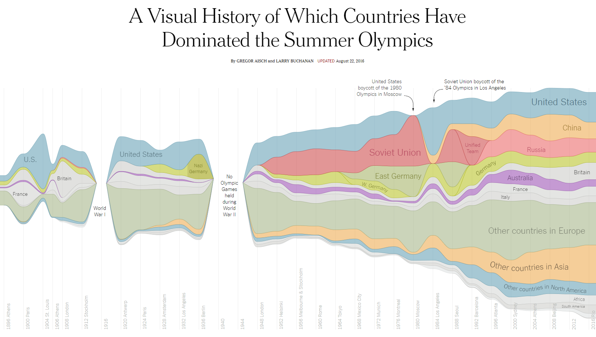

- title : Visualizing Olympic Medals with F# and Fable
- description : What if you could right-click on every number, table or chart you see in 
    online media and choose "view source" to understand how the information has been obtained,
    processed and visualized? In this talk, I'll present a project that tries to make this 
    possible and I'll cover how F# and Fable helped along the way.
- author : Tomas Petricek
- theme : night
- transition : none

***************************************************************************************************
 - data-background : images/rio.jpg
 - class : withbackground

<br /><br /><br />

# _Visualizing Olympic Medals_<br /> with F# and Fable

<br /><br /><br />

### Tomas Petricek, <small style="margin-left:10px;">Alan Turing Institute & fsharpWorks</small><br /> [@tomaspetricek](http://twitter.com/tomaspetricek) | [tomasp.net](http://tomasp.net) | [fsharpworks.com](http://fsharpworks.com)

***************************************************************************************************
 - data-background : images/post-fact.jpg
 - class : withbackground

## Living in a _post-fact_ society

***************************************************************************************************
 - data-background : images/post-fact.jpg
 - class : withbackground

### Technology democratized _opinions_, <br />but can it also democratize _facts_?

***************************************************************************************************
 - class : whitebackground



***************************************************************************************************

# **DEMO**

### Visualizing Olympic Medalists

***************************************************************************************************

## What if we could _view source_?

 - **Verify facts** with original source
 - Let users find **related facts**
 - **Invalidate** when data change

***************************************************************************************************
- data-background : images/world.jpg
- class : withbackground

# Accessing data<br />with _type providers_

***************************************************************************************************

# **DEMO**

### World Bank type provider

***************************************************************************************************

# **DEMO**

### Pivot type provider in F#

***************************************************************************************************

# **DEMO**

### Pivot type provider in The Gamma

***************************************************************************************************

## Using F# for _domain modelling_

 - Tools for **thinking** about problem
 - Describe domain with **functional types**

***************************************************************************************************

## Modelling data transformations

    [hide]
    type Paging = Paging
    type SortDirection = SortDirection
    
```
type Aggregation = 
  | CountAll
  | Sum of string
  | Mean of string
  | CountDistinct of string

type Transformation = 
  | DropColumns of string list
  | SortBy of (string * SortDirection) list
  | GroupBy of string list * Aggregation list
  | Paging of Paging list
```

***************************************************************************************************
- data-background : images/dragon.jpg
- class : withbackground

# _Fable_

### The F# to JavaScript<br /> compiler for the 21st century

***************************************************************************************************
- data-background : images/dragon.jpg
- class : withbackground

## Why _Fable_ is amazing

 - Reasonably nice **modern JavaScript**
 - Active and welcoming **community**
 - Pragmatic **functional-first** style
 
<br /><br /> 

See [fable.io](http://fable.io) for demos and docs! 

***************************************************************************************************
- data-background : images/elm.jpg
- class : withbackground

# _Elm-style_ architecture

***************************************************************************************************

## Functional reactive programming

    [hide]
    type Html = Html
    type State = State
    type Event = Event

<br />

Update **state** when **event** happens

```    
val update : State -> Event -> State
```

<br />

Render **HTML** given current **state**

```
val render : (unit -> Event) -> State -> Html
```

<br /><br />

***************************************************************************************************

## Implementing _Elmish_ TODO list

```    
type Update = 
  | Input of string
  | Remove of int
  | Create 

type Model = 
  { Input : string
    Items : (int * string) list
    NextId : int }
```

***************************************************************************************************

# **DEMO**

### Elm-style TODO list

***************************************************************************************************

# Summary

***************************************************************************************************
 - class : wordcloud

software stacks _trainings_

_mac and linux_ **cross platform** tutorials

## F# Software Foundation

user groups **open source** _Xamarin_

community **[www.fsharp.org](http://www.fsharp.org)** research

support  _contributions_ diversity

***************************************************************************************************

# Thank you!

<br />

 - Technology can _democratize facts_!
 - The Gamma is _open source_ & you can help
 - _Pivot table package_ coming soon!

<br /><br /><br />

<h3 style="position:relative;top:20px">Tomas Petricek</h3>

[tomasp.net](http://tomasp.net) | [fsharpworks.com](http://www.fsharpworks.com)<br />
[@tomaspetricek](http://twitter.com/tomaspetricek) | [tomas@tomasp.net](mailto:tomas@tomasp.net)
