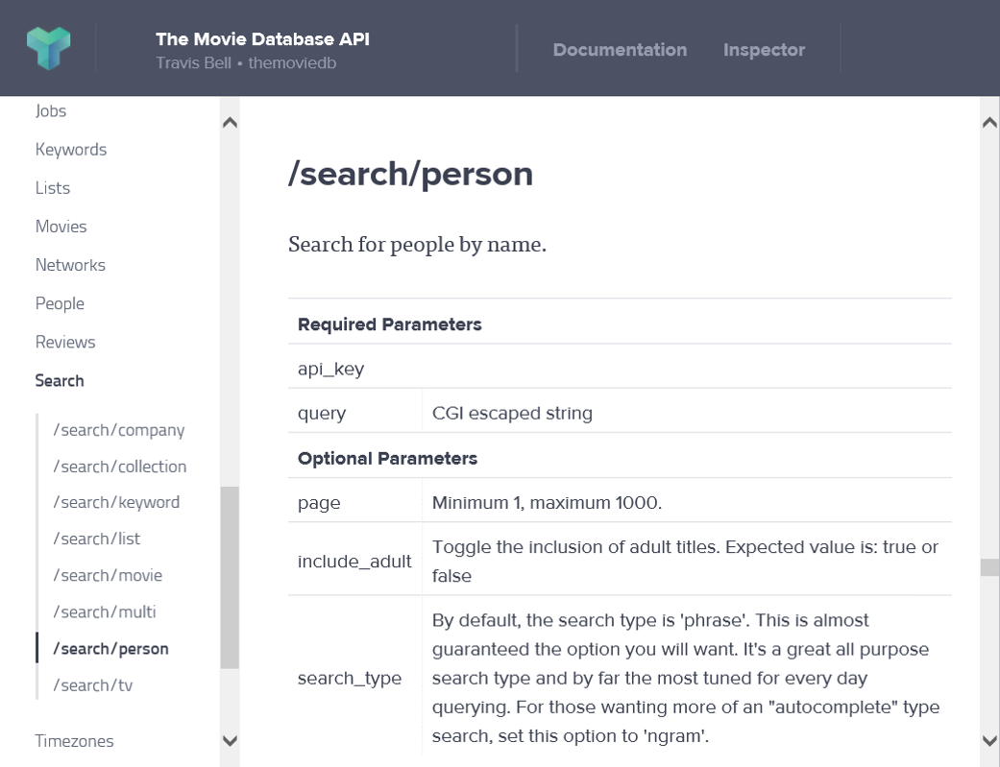

- title : FsReveal
- description : Introduction to FsReveal
- author : Tomas Petricek
- theme : night
- transition : none

****************************************************************************************************

# Types from data
## Making structured data first-class citizens in F#

    

Tomas Petricek, University of Cambridge 
[tomas@tomasp.net](mailto:tomas@tomasp.net) | [@tomaspetricek](http://twitter.com/tomaspetricek)

Don Syme, Microsoft Research 
[donsyme@fastmail.fm](mailto:donsyme@fastmail.fm) | [@dsyme](http://twitter.com/dsyme)

Gustavo Guerra, Microsoft 
[@ovatsus](http://twitter.com/ovatsus)

****************************************************************************************************

## Unsafe dynamic access

    [lang=csharp]
    var url = "http://dvd.netflix.com/Top100RSS";
    var rss = XDocument.Load(topRssFeed);
    var channel = rss.Element("rss").Element("channel");

    foreach(var item in channel.Elements("item")) {    
      Console.WriteLine(item.Element("text").Value);
    }

  

  
Not found!

****************************************************************************************************

## Unsafe dynamic access

    [lang=csharp]
    var url = "http://dvd.netflix.com/Top100RSS";
    var rss = XDocument.Load(topRssFeed);
    var channel = rss.Element("rss").Element("channel");

    foreach(var item in channel.Elements("item")) {    
      Console.WriteLine(item.Element("title").Value);
    }

  

   

****************************************************************************************************
 - data-transition:fade

****************************************************************************************************
 - data-transition:fade

****************************************************************************************************

## Tedious handwritten mappings

    [lang=csharp]
    public class SearchResults
    {  
      public int Page { get; set; }  
      public List<Result> Results { get; set; }
      public int TotalPages { get; set; }  
      public int TotalResults { get; set; }
    }
    public class Result
    {  
      public int ID { get; set; }  
      public List<KnownFor> KnownFor { get; set; }  
      public string Name { get; set; }  
      public double Popularity { get; set; }  
      public string ProfilePath { get; set; }
    }

  
And more...

****************************************************************************************************

## Tedious handwritten mappings

    [lang=csharp]
    public class KnownFor
    {  
      public bool Adult { get; set; }  
      public string BackdropPath { get; set; }  
      public List<int> GenreIDs { get; set; }  
      public int ID { get; set; }  
      public string Overview { get; set; }  
      public string ReleaseDate { get; set; }  
      public string PosterPath { get; set; }  
      public double Popularity { get; set; }  
      public string Title { get; set; }  
      public double VoteAverage { get; set; }  
      public int VoteCount { get; set; }  
      public string Name { get; set; }
    }

  
Much much more...

****************************************************************************************************

# _DEMO_

## Reading news from RSS feed

****************************************************************************************************

  {title&nbsp;:&nbsp;string,&nbsp;author&nbsp;:&nbsp;{age&nbsp;:&nbsp;int}}
  {author&nbsp;:&nbsp;{age&nbsp;:&nbsp;float}}

  

  {&nbsp;title&nbsp;:&nbsp;option&lt;string&gt;,
    &nbsp;author&nbsp;:&nbsp;{age&nbsp;:&nbsp;float}&nbsp;}

  

****************************************************************************************************

  {&nbsp;location&nbsp;:&nbsp;{lng:num,&nbsp;lat:num}&nbsp;}
  {&nbsp;location&nbsp;:&nbsp;string&nbsp;}

  

  
  {&nbsp;location&nbsp;:&nbsp;{lng:num,&nbsp;lat:num}&nbsp;}&nbsp;+&nbsp;{&nbsp;location&nbsp;:&nbsp;string&nbsp;}

  

****************************************************************************************************

# _DEMO_

## Getting weather via REST service

****************************************************************************************************

# Behind the scenes

  

  
Structural shape inference

  
Language integration via type providers

  
Relative type safety

  

****************************************************************************************************

# Relative type safety

Given _representative samples_ and _an input_ value

$S(d')\sqsubset S(d_1, \ldots, d_n)$

Any _program_ written user _type provider_ reduces

$e_{user}[x\leftarrow e_{provided}(d')] \rightsquigarrow^* v$

****************************************************************************************************

# _DEMO_

## Error handling and schema change

****************************************************************************************************

# Schema change and stability

_Inferred type_ can change only in _limited ways_

 

$C[e] \rightarrow C[e.M]$

$C[e] \rightarrow C[{\sf match}~e~{\sf with}~\ldots]$

$C[e] \rightarrow C[int(e)]$

 

****************************************************************************************************

# Addressing practical concerns

 

 * _Prefer records_ for tooling support
 * _Predictable and stable_ shape inference
 * _Open world_ assumption about top shapes

****************************************************************************************************

# Summary

****************************************************************************************************

### _Works in practice_

(148k downloads, 1900 commits, 47 contributors)

### _Type safety revisited_

Relative safety necessary for modern programs

   

Tomas Petricek, University of Cambridge 
[tomas@tomasp.net](mailto:tomas@tomasp.net) | [@tomaspetricek](http://twitter.com/tomaspetricek)

Don Syme, Microsoft Research 
[donsyme@fastmail.fm](mailto:donsyme@fastmail.fm) | [@dsyme](http://twitter.com/dsyme)

Gustavo Guerra, Microsoft 
[@ovatsus](http://twitter.com/ovatsus)

****************************************************************************************************

# Bonus slides

****************************************************************************************************

****************************************************************************************************

****************************************************************************************************

# Labelled top types

 

Fundamental _open world_ assumption

    [lang=xml]
    <doc>
      <heading>Working with JSON</heading>
      
Type providers make this easy.

      <heading>Working with XML</heading>
      
Processing XML is as easy as JSON.

      <image source="xml.png" />
    </doc>

****************************************************************************************************

# Labelled top types

 

_Top type_ annotated with _possible cases_

${\sf any}\langle \sigma_1, \ldots, \sigma_n \rangle$

 

Provides access to <em>$\sigma_1, \ldots, \sigma_n$</em>

Requires handling of _unknown case_

