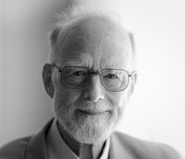

- title : History and Philosophy of Types
- description : What are types? We can try to answer this question with a formal definition. 
   But there are numerous incompatible definitions and they fail to capture important aspects 
   of what types actually are - how are they used in practice, how we talk about them and how 
   we think about them. Why we often cannot even find a common language when talking about types? 
- author : Tomas Petricek
- theme : white
- transition : none

***************************************************************************************************

# History and Philosophy of Types

**Tomas Petricek**, University of Cambridge  
[http://tomasp.net](http://tomasp.net) | [tomas@tomasp.net](mailto:tomas@tomasp.net) | [@tomaspetricek](http://twitter.com/tomaspetricek)

$$$
\definecolor{mc}{RGB}{0,32,172}
\definecolor{cc}{RGB}{172,0,32}

---------------------------------------------------------------------------------------------------

# What is a _type_?

 

# What are types _for_?

---------------------------------------------------------------------------------------------------

## Uses of types and type systems

1.	Detecting errors via type-checking
2.	Support for structuring large systems
3.	Documentation
4.	Efficiency
5.	Whole-language safety

Source: [Lecture notes from Types lecture](http://www.cl.cam.ac.uk/teaching/1314/Types/)

***************************************************************************************************

## History of types

### Archeology of computer science thought

 

---------------------------------------------------------------------------------------------------

### Theory of types and $\lambda$-calculus

Bertrand Russell, 1908

> Class of all classes that do not contain themselves as elements

Alonzo Church, 1940

$\lambda$-calculus and types as foundations of mathematics
(not programming!)

---------------------------------------------------------------------------------------------------

### Mathematical logic as based on the theory of types

Base formulas have type $0$

Formula that uses a formula of  
type $n$ has a type $n+1$.

> We must interpret “I am lying” as “There is a proposition of order 
> $n$ which I affirm and which is false”. This is a proposition of order $n+1$.

---------------------------------------------------------------------------------------------------

### Meaning of types in logic

> It is unnecessary, in practice, to know what objects belong to the lowest type (...). 
> In practice, only the relative types of variables are relevant.

> We refrain from making more definite the nature of the types $\omicron$ and $\iota$, 
> (...) the formal theory admits a variety of interpretations.

Types are not sets of values!

---------------------------------------------------------------------------------------------------

### Types appear in Algol 58 Zurich meeting

A data symbol falls in one of the following classes: 
a) Integer b) Boolean c) General

> It is also remarkable that (...) there is no clue that in this process
> the technical term “type” from mathematical logic had any role.

Source: [Several types of types in programming languages, Simone Martini](http://arxiv.org/abs/1510.03726)

---------------------------------------------------------------------------------------------------

### From expression types to computation types

John McCarthy, Tony Hoare, 1970s

> McCarthy’s theory was developed by Hoare, who proposed that 
> data types in PLs   could be understood as sets of data values.

Source: [Science of Operations, Mark Priestley](http://www.springer.com/us/book/9781848825543)

---------------------------------------------------------------------------------------------------

### From expression types to computation types

$r \leftarrow s$

---------------------------------------------------------------------------------------------------

### From expression types to computation types

${\color{cc} r:{ref}_\rho, s:{ref}_\sigma} \vdash r \leftarrow s : \color{mc} unit~\&~\{ write~\rho, read~\sigma \} $

---------------------------------------------------------------------------------------------------

### From expression types to computation types

What is the set of a type: $\color{mc} unit~\&~\{ write~\rho, read~\sigma \}$?

<h3 style="margin:50px 0px 20px 0px">Types are not sets but relations!</h3>

> Express meaning of high-level types as relational,   
> extensional constraints on the behaviour of compiled code

Source: [Nick Benton: What we talk about when we talk about types](http://research.microsoft.com/en-us/um/people/nick)

---------------------------------------------------------------------------------------------------

## Types in modern programming

- **Imperative** - Effects and monads
- **Unsound** - Dart, TypeScript
- **Super sound** - Idris, Agda, F*
- **Relatively sound** - F# type providers

We are not getting closer to one right definition!

***************************************************************************************************

## Philosophy of types

### Against a formal universal definition

 

---------------------------------------------------------------------------------------------------

## Francis Bacon and scientific method

Idols of the tribe

> The human Intellect, (...), easily supposes a 
> greater order and equality in things than it actually finds.

Idols of the market

> The confusions of language: one and the same name being applied 
> indifferently to things that are not of the same nature. 

---------------------------------------------------------------------------------------------------

## Feyerabend's epistemological anarchism

Should there be a clear definition of type?

> To 'clarify' the terms does not mean to study the additional properties of the domain in question,
> it means to fill them with existing notions from the entirely different domain of logic.

---------------------------------------------------------------------------------------------------

## Lakatos and research programmes

Science consists of multiple competing mutually inconsistent research programmes.

**Hard core** and protective   belt of **auxiliary assumptions**

> [Core assumptions] are not to be blamed for any apparent failure. 
> Rather, the blame is to be placed on the less fundamental components.

---------------------------------------------------------------------------------------------------

## Lakatos and concept stretching

A new counterexample of a previously inconceivable form is discovered

> In their critical zeal [the refutationists] stretched 
> the concept of polyhedron, to cover objects that were alien to the intended interpretation.

We do not notice it & we cannot unthink it!

---------------------------------------------------------------------------------------------------

## Concept stretching and functions

 

> I turn aside with a shudder of horror from 
> this lamentable plague of functions 
> which have no derivatives.
>
> Charles Hermite, 1893

---------------------------------------------------------------------------------------------------

## Concept stretching and types

 

> I turn aside with a shudder of horror from 
> this lamentable plague of type systems 
> which have no soundness proof.
>
> 
Anonymous on Hacker News, 2015

---------------------------------------------------------------------------------------------------

## Feyerabend's epistemological anarchism

What is the correct scientific method?

> To those who look at the rich material provided by history, it will become clear that there 
> is only one principle that can be defended under all circumstances. It is the principle: anything goes.

---------------------------------------------------------------------------------------------------

## Living without clear notion of 'type'

 

---------------------------------------------------------------------------------------------------

## Living without clear notion of 'type'

#### Meaning is use

How we use types in language?

Construct interesting contexts for types!

#### Types as scientific entities

What can we cause with types?

We can experiment without having theory!

***************************************************************************************************

## Summary

### There is one principle: Anything goes

 

---------------------------------------------------------------------------------------------------

## Summary

> Science is much more ‘sloppy’ and ‘irrational’  
> than its methodological image.

> Precise answers “hamper the growth of knowledge” and  
> “deflect the course of investigation into narrow  
> channels of things already understood”.

Paul Feyerabend, Against Method 
Imre Lakatos, Proofs and Refutations

---------------------------------------------------------------------------------------------------

## Where to find more?

What can programming language research learn from the philosophy of science? 
[tomasp.net/blog/2014/philosophy-pl](http://tomasp.net/blog/2014/philosophy-pl)

Against the definition of types 
[tomasp.net/blog/2015/against-types](http://tomasp.net/blog/2015/against-types)

Philosophy of science books every computer scientist should read 
[tomasp.net/blog/2015/reading-list](http://tomasp.net/blog/2015/reading-list)

 

[http://tomasp.net](http://tomasp.net) | [tomas@tomasp.net](mailto:tomas@tomasp.net) | [@tomaspetricek](http://twitter.com/tomaspetricek)
