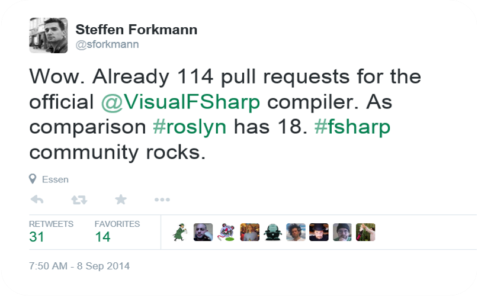
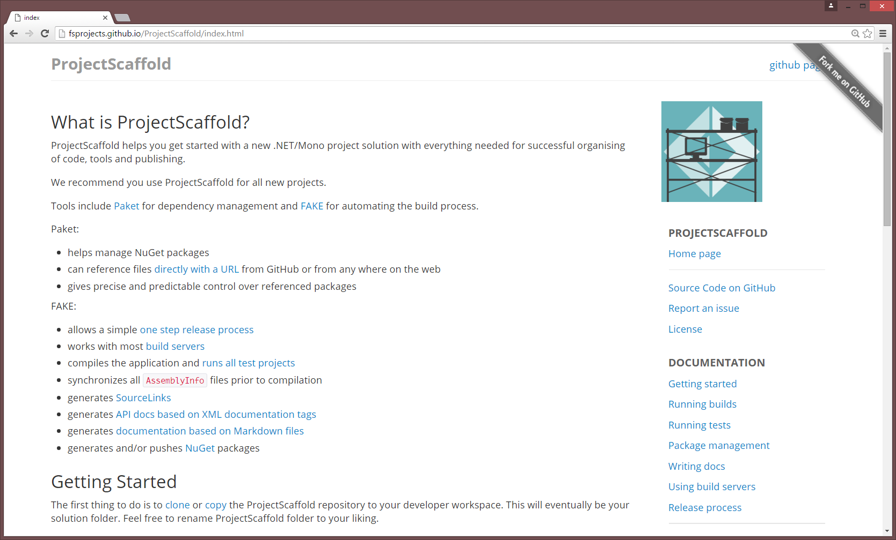

- title : Building stuff that works with F#
- description : F# is not good just for maths. In fact, it has an excellent set of tools
    for building reliable software. In this talk, you'll learn about using F# for testing,
    documenting, building and deploying .NET applications.
- author : Tomas Petricek
- theme : night
- transition : none

***************************************************************************************************

# Building _stuff that works_ with F#

 
 
 
 
 

### **Tomas Petricek**, fsharpWorks   [@tomaspetricek](http://twitter.com/tomaspetricek) | [tomasp.net](http://tomasp.net) | [fsharpworks.com](http://fsharpworks.com)

***************************************************************************************************
 - class : wordcloud

software stacks _trainings_

_mac and linux_ **cross platform** tutorials

## F# Software Foundation

user groups **open source** _Xamarin_

community **[www.fsharp.org](http://www.fsharp.org)** research

support  _contributions_ diversity

***************************************************************************************************

---------------------------------------------------------------------------------------------------

---------------------------------------------------------------------------------------------------

---------------------------------------------------------------------------------------------------

---------------------------------------------------------------------------------------------------

## Open source is fun, but...

### _Testing_ is pain

### _Build & releases_ are pain

### _Documentation_ is pain

---------------------------------------------------------------------------------------------------

***************************************************************************************************

# _TESTING TOOLS_

From scripts to user interface  
and property-based testing

---------------------------------------------------------------------------------------------------

_❶_ From scripts to tests

_❷_ Mocking without framework

_❸_ Property-based testing

_❹_ Web acceptance testing

---------------------------------------------------------------------------------------------------

# _PROJECT SCAFFOLD_

Reproducible builds and releases 
& pain-free documentation

---------------------------------------------------------------------------------------------------

[<small>project scaffold</small>](http://fsprojects.github.io/ProjectScaffold) <small>|</small>
[<small>live demo</small>](http://fslab.org/FSharp.Charting/) <small>|</small>
[<small>source code</small>](https://github.com/fslaborg/FSharp.Charting/blob/master/docs/content/index.fsx) 

---------------------------------------------------------------------------------------------------

_❶_ Project scaffold

_❷_ Dependency management

_❸_ Writing documentation

_❹_ Builds and releases

***************************************************************************************************

## Building stuff that works with F#

 - _F# + FsUnit_ for lightweight syntax
 - _FsCheck_ for property-based testing
 - _Canopy_ for friction-less web testing   
 - _ProjectScaffold_ for OSS and as a demo
 - _FAKE_ for automating all the things
 - _Paket_ for simpler dependency management

---------------------------------------------------------------------------------------------------

## _❶_ F# works great for **boring tasks** too

## _❷_ Tested by solid **open-source** ecosystem

## _❸_ **Risk-free** way of playing with F#

---------------------------------------------------------------------------------------------------

# _Thank you!_

 - **Pluralsight** - meet the author (Friday, 11:20)
 - **FP Labs** - at NDC London (Friday, 13:40)
 - **fsharpWorks** - trainings & consulting

   

<h2 style="position:relative;top:30px"><em>Tomas Petricek</em></h2>

[http://tomasp.net](http://tomasp.net) | [@tomaspetricek](http://twitter.com/tomaspetricek) | [tomas@tomasp.net](mailto:tomas@tomasp.net)
