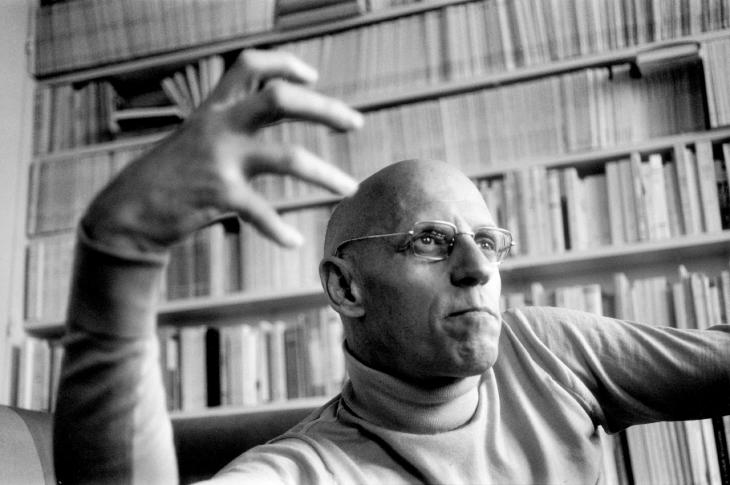
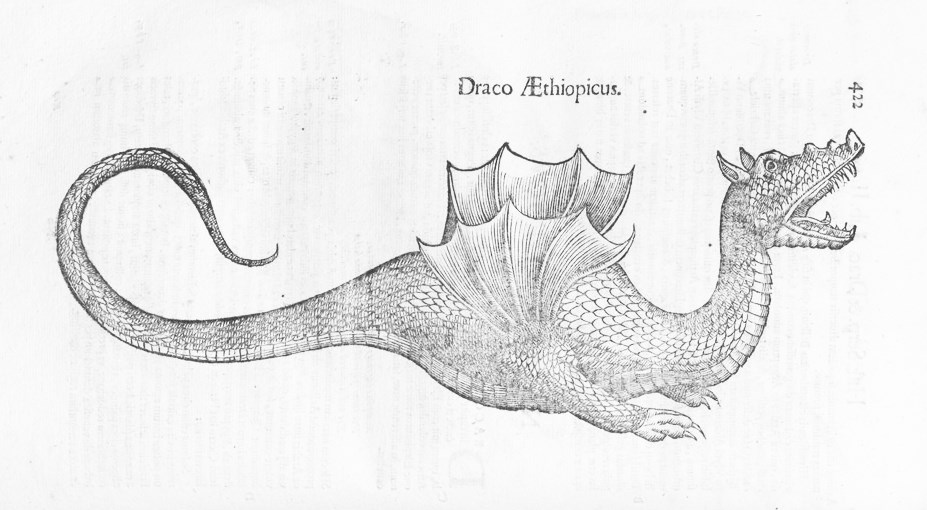
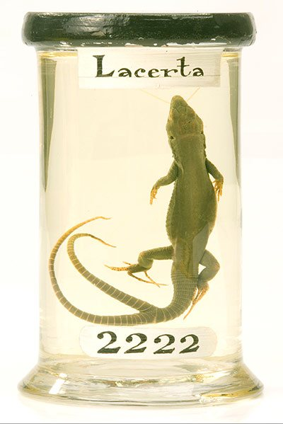

- title : Programming language theory: Thinking the unthinkable
- description : Our thinking is shaped by basic assumptions that we rarely question. What are some
    of the hidden assumptions that we never question and that determine how programming languages 
    are designed? And what might the world of programming look like if we based our thinking on 
    different basic principles?
- author : Tomas Petricek
- theme : white
- transition : none

***************************************************************************************************

# Thinking the unthinkable

**Tomas Petricek**, Alan Turing Institute  
[http://tomasp.net](http://tomasp.net) | [tomas@tomasp.net](mailto:tomas@tomasp.net) | [@tomaspetricek](http://twitter.com/tomaspetricek)

***************************************************************************************************

# Founding of natural sciences
### A story about incommensurability

 

---------------------------------------------------------------------------------------------------

# Founding of natural sciences

> The Order of Things Michael Foucault (1966)

 

 - Ulisse Aldrovandi (1522 - 1605)
 - Comte de Buffon (1707 - 1788)

   
 
---------------------------------------------------------------------------------------------------

# Founding of natural sciences

> Buffon was [astonished by Aldrovandi's] mixture of exact descriptions, reported 
> quotations, fables, remarks dealing indifferently with an animal’s anatomy, its use in 
> heraldry, its habitat, its mythological values or the uses to which it could be put 
> in medicine or magic.

---------------------------------------------------------------------------------------------------

# Incommensurability

Two theories do not share a basis that would  
allow evaluating them using a common metric.

 

#### Appears in multiple forms

- Foucault's episteme
- Kuhn's paradigms
- Lakatos' research programmes
- Polanyi's personal knowledge

***************************************************************************************************

# Hidden assumptions in programming

### Episteme, paradigms & research programmes

 

---------------------------------------------------------------------------------------------------

> Programming is error-prone. It is even worse when programming a quantum computer (...)
> because human intuition is much better adapted to the classical world than to the quantum world. 
>
> How can we build automatic tools for verifying correctness of quantum programs? 
> A logic for verification of both partial correctness and total correctness of quantum programs was developed (...).
>
> ([talks.cam.ac.uk/talk/index/66539](http://talks.cam.ac.uk/talk/index/66539))

  

---------------------------------------------------------------------------------------------------

## Algol research programme

> One of the goals of the Algol research programme was to utilize the resources of logic
> to increase the confidence that it was possible to have in the correctness of a program.
> 
> 
Science of Operations Mark Priestley (2012)

---------------------------------------------------------------------------------------------------

Episteme, paradigm or research programme

# Change what _questions_ we ask

 
 

---------------------------------------------------------------------------------------------------

## What does the <em>PL</em> community assume?

---------------------------------------------------------------------------------------------------

## What does the <em style="color:#c00000">PPIG</em> community assume?

---------------------------------------------------------------------------------------------------

## Mathematization of computer science

> The rise of theoretical computer science was anything but inevitable. (...) Advocates of 
> theoretical computer science pursued a strategy that served them well within the university, 
> but increasingly alienated them from their colleagues in the industry.
> 
> 
The Computer Boys Take Over Nathan Ensmenger (2012)

***************************************************************************************************

# Thinking the unthinkable

### What else could programming research be?

 

---------------------------------------------------------------------------------------------------

# Foucalt's classical episteme

 

 

_Museums_ and _encyclopedias_

Collections of _species_ as they are

Organized according to _taxonomy_

 
 

---------------------------------------------------------------------------------------------------

# Programming and sample species?

 

> Common Law is founded on precedent. (...) Courts [today] will follow the example of other courts which have decided similar cases in the past.

> This procedure recognizes the principle (...) that practical wisdom is more truly embodied in action than expressed in rules of action.
> 
> 
Personal Knowledge Michael Polanyi (1958)

---------------------------------------------------------------------------------------------------

# Renaissance episteme

 
 

Resemblances between _signs_

Across all areas of knowledge

   

---------------------------------------------------------------------------------------------------

# Programming with signs?

Resemblances between _signs_

 

Animal's anatomy, its habitat and the  
uses to which it could be put in magic.

   

---------------------------------------------------------------------------------------------------

# Programming with signs?

Resemblances between _signs_

 

Programming tool's theory and the  
uses to which it could be put in practice.

   

---------------------------------------------------------------------------------------------------

# Programming with signs?

 

Stories, metaphors and analogies bridge the  
boundaries across different forms of knowledge

  

> If a subject does not permit exactness, 
> it is not sufficient to be exact about something else.
>
> Personal Knowledge, Michael Polanyi (1958)

***************************************************************************************************

# Summary

### Animal's anatomy and its uses in magic

 

---------------------------------------------------------------------------------------------------

# Summary

### Programming tool anatomy its uses in magic

 

---------------------------------------------------------------------------------------------------

## Summary

> During the 18th century the French Academy of Sciences  
> stubbornly denied the evidence for the fall of meteorites.

> We no longer consider falling of meteorites to be incompatible with the scientific world view.
> But other doubts, which we now sustain as reasonable have only our beliefs to warrant them.

 

---------------------------------------------------------------------------------------------------

## More information

More philosophy of science 
[tomasp.net/blog/tag/philosophy](http://tomasp.net/blog/tag/philosophy/)

Current PPIG paper draft 
[tomasp.net/academic/drafts/unthinkable](http://tomasp.net/academic/drafts/unthinkable/)

What I'm also working on :-) 
[thegamma.net](http://thegamma.net/)

 

[http://tomasp.net](http://tomasp.net) | [tomas@tomasp.net](mailto:tomas@tomasp.net) | [@tomaspetricek](http://twitter.com/tomaspetricek)
