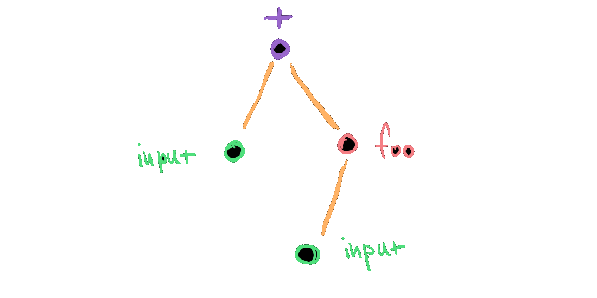

- title : Visualizing Olympic Medals with F# and Fable
- description : What if you could right-click on every number, table or chart you see in 
    online media and choose "view source" to understand how the information has been obtained,
    processed and visualized? In this talk, I'll present a project that tries to make this 
    possible and I'll cover how F# and Fable helped along the way.
- author : Tomas Petricek
- theme : night
- transition : none

***************************************************************************************************
 - data-background : images/rio.jpg
 - class : withbackground

<br /><br /><br />

# _Visualizing Olympic Medals_<br /> with F# and Fable

<br /><br /><br />

#### Tomas Petricek, <small style="margin-left:10px;">Alan Turing Institute & fsharpWorks</small><br /> [@tomaspetricek](http://twitter.com/tomaspetricek) | [tomasp.net](http://tomasp.net) | [fsharpworks.com](http://fsharpworks.com)

---------------------------------------------------------------------------------------------------


***************************************************************************************************
 - data-background : images/kiss.jpg
 - class : withbackground

<div class="fragment">

# Welcome to the _post-fact_ world

</div>

---------------------------------------------------------------------------------------------------

## Technology democratized _opinions_

<div class="fragment">

## Can it also democratize _facts_?

</div>

***************************************************************************************************
 - data-background : images/rowing.jpg
 - class : withbackground

# _Data-driven_ storytelling

---------------------------------------------------------------------------------------------------


---------------------------------------------------------------------------------------------------

### Can the result be _reproduced_?
   
### Is the visualization _misleading_?
 
### Can the reader _explore further_?
 
---------------------------------------------------------------------------------------------------

<h1>
  
  The Gamma
</h1>  

---------------------------------------------------------------------------------------------------

### _DEMO_: Visualizing Olympic medalists

***************************************************************************************************
- data-background : images/clock.jpg
- class : withbackground

<div class="fragment">

# _Domain_-oriented programming 

</div>

---------------------------------------------------------------------------------------------------

# _Domain_ over _mechanism_

<br />

#### Object-oriented programming

#### Functional programming

#### Test-driven development

<br />
<br />

***************************************************************************************************
- data-background : images/dragon.jpg
- class : withbackground

# _Fable_

### The F# to JavaScript<br /> compiler for the 21st century

---------------------------------------------------------------------------------------------------

### Reasonably nice _modern JavaScript_
### Active and welcoming _community_
### Pragmatic _functional-first_ style
 
---------------------------------------------------------------------------------------------------

# See [fable.io](http://fable.io) for docs & demos

***************************************************************************************************
- data-background : images/transform.jpg
- class : withbackground

# Modeling _data transformations_

---------------------------------------------------------------------------------------------------

### _DEMO_: Aggregating Olympic medalists

---------------------------------------------------------------------------------------------------

#### _Dot-driven_ programming via type providers

<br />
  


---------------------------------------------------------------------------------------------------

#### _Dot-driven_ programming via type providers

<br />
  


---------------------------------------------------------------------------------------------------

## What _actually is_ a transformation?

---------------------------------------------------------------------------------------------------

    [hide]
    type Paging = Paging
    type SortDirection = SortDirection

```
type Aggregation = 
  | CountAll
  | Sum of string
  | Mean of string
  | CountDistinct of string

type Transformation = 
  | DropColumns of string list
  | SortBy of (string * SortDirection) list
  | GroupBy of string list * Aggregation list
  | Paging of Paging list
```

---------------------------------------------------------------------------------------------------

### _DEMO_: Evaluating data transformation

***************************************************************************************************
- data-background : images/science.jpg
- class : withbackground

# Modeling _program structure_

---------------------------------------------------------------------------------------------------

## _Article as a program_<br />is a powerful paradigm

---------------------------------------------------------------------------------------------------

#### Validate facts with _original source_
#### Provide common _programming tools_
#### Let users find _related facts_

---------------------------------------------------------------------------------------------------

#### _DEMO_: Choosing disciplines for a timeline

***************************************************************************************************
- data-background : images/science2.jpg
- class : withbackground


---------------------------------------------------------------------------------------------------



---------------------------------------------------------------------------------------------------


***************************************************************************************************
- data-background : images/science.jpg
- class : withbackground

### _DEMO_: Writing tests for the parser

***************************************************************************************************
- data-background : images/elm.jpg
- class : withbackground

# Modeling _user interfaces_

---------------------------------------------------------------------------------------------------


---------------------------------------------------------------------------------------------------


---------------------------------------------------------------------------------------------------

### _DEMO_: Editor for pivot type provider

---------------------------------------------------------------------------------------------------

# _Elm-style_ architecture

---------------------------------------------------------------------------------------------------

## _Elm-style_ architecture

    [hide]
    type Html = Html
    type State = State
    type Event = Event


```    
// Calculate new state when event happens
val update : State -> Event -> State

// Render HTML from the current state
val render : (unit -> Event) -> State -> Html
```

---------------------------------------------------------------------------------------------------

## Implementing _Elmish_ TODO list

```    
type Update = 
  | Input of string
  | Remove of Guid
  | Create 

type Model = 
  { Items : (Guid * string) list 
    Input : string }
```

---------------------------------------------------------------------------------------------------

### _DEMO_: Implementing TODO list

---------------------------------------------------------------------------------------------------


---------------------------------------------------------------------------------------------------

### _DEMO_: Implementing editor for pivot

***************************************************************************************************
- data-background : images/rio.jpg
- class : withbackground

# Summary

***************************************************************************************************
- data-background : images/trump.jpg
- class : withbackground

# Make _facts_ great again!

***************************************************************************************************
- data-background : images/clock.jpg
- class : withbackground

# _Domain_-driven development

***************************************************************************************************
- data-background : images/tggh.png
- class : withbackground

#### Use _The Gamma_ for fun & profit

#### Use _F#_ for domain-driven development

#### Use _Fable_ to make JavaScript fun again

<br /><br /><br />

#### Tomas Petricek, [tomas@tomasp.net](tomas@tomasp.net)<br /> [@tomaspetricek](http://twitter.com/tomaspetricek) | [thegamma.net](http://thegamma.net) | [tomasp.net](http://tomasp.net) 
