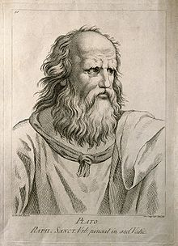
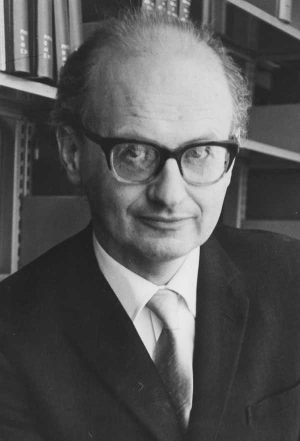
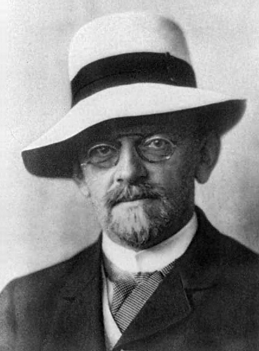
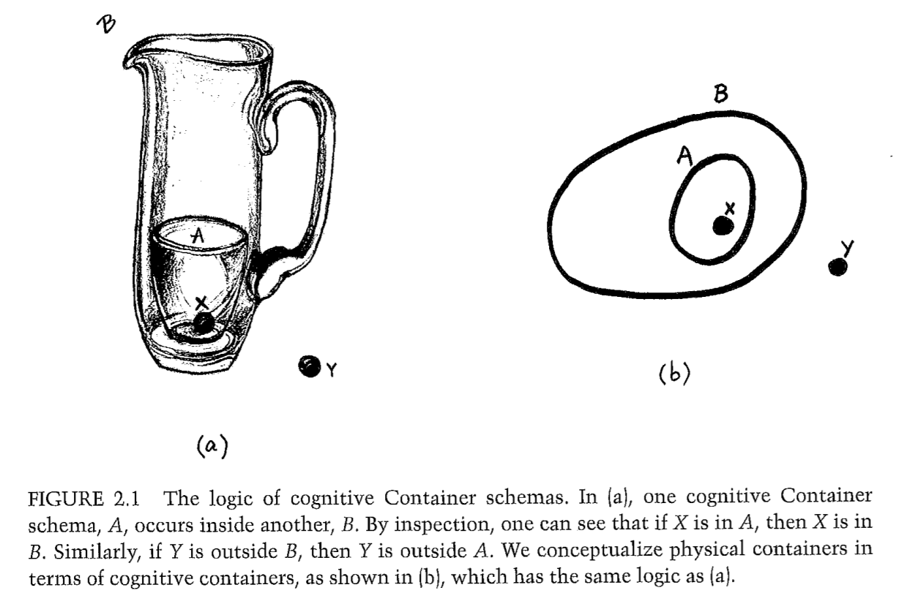

- title : Would Aliens Understand Lambda Calculus?
- description : Elegant programming constructions and mathematical theories like LISP and lambda 
    calculus often look timeless and universal. They are not invented, but discovered! If there are 
    intelligent aliens, they will sooner or later run into formal logics and computation and, 
    shortly thereafter, discover lambda calculus and LISP. Or will they?
- author : Tomas Petricek
- theme : white
- transition : none

****************************************************************************************************

# Would Aliens Understand  _Lambda Calculus?_

    

**Tomas Petricek**, fsharpWorks & Alan Turing Institute 
[tomasp.net](http://tomasp.net) | [tomas@tomasp.net](mailto:tomas@tomasp.net) | [@tomaspetricek](http://twitter.com/tomaspetricek)

****************************************************************************************************

### _"Are pure functions invented or discovered?"_

### **"I wonder if there is a paper about that?"**

### There is an entire discipline about that!

****************************************************************************************************

# _What is mathematics?_

Crash course in philosophy of mathematics

 

----------------------------------------------------------------------------------------------------

# _Platonism_

> The existence of mathematical objects is independent of us, our language, thoughts and practices.

<h2 style="font-size:30pt;margin:60px 0px 10px 0px"><strong>The sad consequences</strong></h2>

> The Romance of Mathematics makes a wonderful story, but it intimidates, it helps
> to maintain an elite, it rewards incomprehensibility.
>
> 
Lakoff, Núñez (2000)

----------------------------------------------------------------------------------------------------

# _Social mathematics_

> Mathematics does not grow through increase of the number of established theorems,
> but through improvement by specu- lation and criticism, by the method
> of proofs and refutations.
>
> 
Lakatos (1976)

<h2 style="font-size:30pt;margin:60px 0px 10px 0px"><strong>Counter-example causes refinement</strong></h2>

> "I turn aside with a shudder of horror from this lamentable plague of functions which have no derivatives."

----------------------------------------------------------------------------------------------------

# _Culture and mathematics_

> Culturally specific ideas often find their way into  the very fabric of mathematics itself.
>
> 
Lakoff, Núñez (2000)

<h2 style="font-size:30pt;margin:60px 0px 10px 0px"><strong>Ancient culture in maths</strong></h2>

1. The idea of essence
2. The idea that human reason is a form of logic
3. The idea of foundations for a subject matter

----------------------------------------------------------------------------------------------------

# _Embodied mathematics_

> The only mathematics we know or can know is  
> a brain-and-mind-based mathematics.
>
> 
Lakoff, Núñez (2000)

<h2 style="font-size:30pt;margin:60px 0px 10px 0px"><strong>How to study mathematics?</strong></h2>

It is up to cognitive science to apply the science of mind to human mathematical ideas. 

****************************************************************************************************

# _Embodied mathematics_

Cognitive science of mathematics

 

----------------------------------------------------------------------------------------------------

## _Metaphors are central to thought_

> Cognitive science [showed that], **abstract concepts [are] 
> understood, via metaphor**, in terms of more concrete concepts.
>
> 

>
> Many mathematical ideas are ways of **mathematicizing ordinary ideas**,   
> as when derivatives mathematicize the idea of instantaneous change.
>
> 

> 
Lakoff, Núñez (2000)

---------------------------------------------------------------------------------------------------

## Components of the analysis

***Innate arithmetic***  
Babies have some mathematical capacities

***Conceptual metaphors***  
Links concepts via neural conflations

***Layering metaphors***  
Explain more abstract mathematical concepts

---------------------------------------------------------------------------------------------------

## Innate arithmetic experiments

---------------------------------------------------------------------------------------------------

---------------------------------------------------------------------------------------------------

## Arithmetic is object collection

**Linguistic examples**  
_Add_ onions and carrots to the soup  
Which is _bigger_, 5 or 7?

**Equational properties**  
Adding A to B gives the same result as  
adding B to A for _object collections_

**Limitations of the metaphor**  
Zero in terms of collections?

****************************************************************************************************

### _"Type theory and the $\lambda$-calculus are eternal"_

### **"Libraries are ephemeral compared to maths"**

### "$\lambda$-calculus is discovered, Angular is invented!"

****************************************************************************************************

# _What is computer science?_

Lambda calculus, category theory and functional programs
 
 

----------------------------------------------------------------------------------------------------

<table class="examples"><tr>
<td style="padding-right:20px">

#### Programs

 * _type_
 * function
 * **tuple**

</td><td>

#### Proofs

 * _formula_
 * implication
 * **conjunction**

</td><td style="padding-left:20px">

#### Categories

 * _object_
 * arrow
 * **product**

</td></tr></table>

 
 

### _Is this a deep truth about the universe?_

----------------------------------------------------------------------------------------------------

## _Philosopher's answer_
 
#### Category mistakes

 - **Program** refers to empirical, a posteriori knowledge
 - **Proof** refers to non-physical world of logic  

 
 

#### Verification controversy

> The idea of program verification is what philosophers call "category mistake".
> Program verification is, literally, a form of nonsense.
>
> 
Fetzer (1988)

----------------------------------------------------------------------------------------------------

## _Sociologist's answer, Take 1_

Carefully constructed to fit well via the  method of _proofs and refutations_

 - **Cartesian closed** category
 - **Intuitionalistic** logic
 - **Simply typed** lambda calculus
 

----------------------------------------------------------------------------------------------------

## _Sociologist's answer, Take 2_

All three are product of the same network of mathematicians, solving the same problem.

Searching for **foundations of mathematics**, formalising reasoning based
on **inference** that could be done mechanically. 
 

----------------------------------------------------------------------------------------------------

## _Cognitive scientists's answer_

All three are derived from the same **embodied experience**
using a number of **conceptual** and **layering metaphors**. 

_What is the embodied experience?_
 

****************************************************************************************************

### _"Would aliens understand $\lambda$ calculus?"_ 

### "Any intelligent species is bound to have logic."

### **"They'd also run into the program-proof duality."**

****************************************************************************************************

# _Where lambda calculus comes from?_

Cognitive science and lambda calculus
 
 

----------------------------------------------------------------------------------------------------

# _Container schema_

----------------------------------------------------------------------------------------------------

## _Metaphors behind reduction, Part 1_

**Modus Ponens**   
Given two Container schemas A and B and an  
object X, if A is in B and X is in A, then X is in B.

**Function Application** 
Given two types $A$ and $B$ and a value $x$,  
if $f : A\rightarrow B$ and $x:A$ then $f(x):B$

----------------------------------------------------------------------------------------------------

## _Metaphors behind reduction, Part 2_

#### Evaluation using $\beta$-**reduction**

**reduce**, verb (used with object), reduced, reducing.

 1. _to bring down_ to a smaller extent, size, amount
 2. _to lower in degree_, intensity, etc.
 3. _to bring down_ to a lower rank, dignity, etc.

 

#### **Metaphor requires a sense of direction!**

****************************************************************************************************

### _"Would E.T. understand lambda calculus?"_ 

### "How about the planet in Lem's Solaris?"

### **"How about aliens from the Arrival movie?"**

****************************************************************************************************

# _Aliens and lambda calculus_

Cognitive science of extra-terrestrial beings
 
 

----------------------------------------------------------------------------------------------------
 - data-background:images/arrival.png

----------------------------------------------------------------------------------------------------
 - data-background:images/arrival-w.jpg

## Aliens from the Arrival movie

#### Circular language and time perception

No notion for _direction_

_Function application_ is directional!
  
Perhaps only _reversible_ computations?

----------------------------------------------------------------------------------------------------
 - data-background:images/solaris.jpg

----------------------------------------------------------------------------------------------------
 - data-background:images/solaris-w.jpg

## Stanislaw Lem's Solaris

#### The planet itself is a sentient being!

There is only _one_ being in the world

Would it have more numbers than _one_?

----------------------------------------------------------------------------------------------------
 - data-background:images/chaos.jpg

----------------------------------------------------------------------------------------------------
 - data-background:images/chaos-w.jpg

## Interstellar dust cloud

#### Aliens living in chaotic gaseous universe

There are no _boundaries_ in chaos!

There is no _inside_ and _outside_

No _container schema_ metaphors

****************************************************************************************************

# _Summary_

Would aliens understand lambda calculus?

 

----------------------------------------------------------------------------------------------------

## Would aliens understand lambda calculus?

_Is lambda calculus discovered or invented?_ 
Platonism is just one (religious) belief

**Philosophy of mathematics and computer science** 
Social, cultural enterprise, product of embodied mind

_So, would aliens understand lambda calculus?_ 
Stretch your imagination! Boring aliens might...

 

[tomasp.net](http://tomasp.net) | [tomas@tomasp.net](mailto:tomas@tomasp.net) | [@tomaspetricek](http://twitter.com/tomaspetricek)

----------------------------------------------------------------------------------------------------

## **Movies to watch & stories to read** 

#### _Arrival (2016)_ or Chiang's Story of your life
Aliens with circular language and time

 

#### _Solaris (2002)_ or Stanislaw's Lem Solaris
Not your grandma's sentient being 

----------------------------------------------------------------------------------------------------

## **Philosophy books to read** 

#### Imre Lakatos, _Proofs and refutations_ 
How mathematics actually works

 

#### Lakoff & Núñez, _Where mathematics comes from_ 
Cognitive account of mathematics via metaphors

 

#### Donald MacKenzie, _Mechanizing proof_ 
Category mistakes and dissenting voices in the community 
 