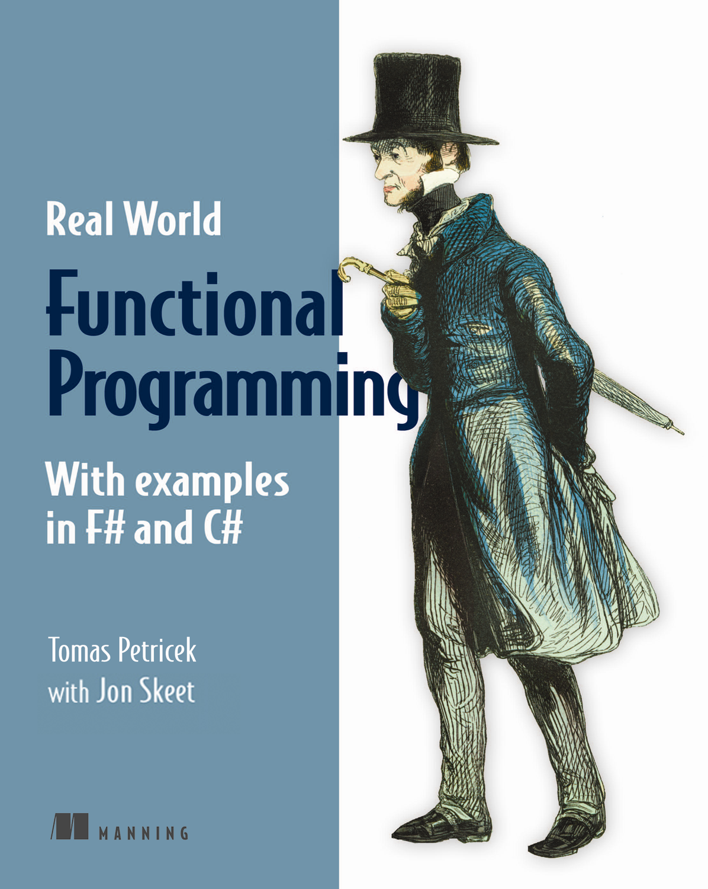

- title : Building Better Data Science Tools (while avoiding a real world job!)
- description : Building Better Data Science Tools (while avoiding a real world job!)
- author : Tomas Petricek
- theme : night
- transition : none

***************************************************************************************************

## _Building Better Data Science Tools_  (while avoiding a real world job!)

 
 
 
 
 

#### **Tomas Petricek**, Alan Turing Institute + fsharpWorks   [@tomaspetricek](http://twitter.com/tomaspetricek) | [tomasp.net](http://tomasp.net) | [fsharpworks.com](http://fsharpworks.com)

---------------------------------------------------------------------------------------------------

---------------------------------------------------------------------------------------------------

---------------------------------------------------------------------------------------------------

## Programming languages and tools

 

Surely, there must be a _better way_!

Change _how we think_ about the world?

Nice _open-source_ community!

 

***************************************************************************************************

# _DATA SCIENCE_

---------------------------------------------------------------------------------------------------

---------------------------------------------------------------------------------------------------

<table class="vtop"><tr><td>

# _DATA ACCESS_

## Understanding the world

</td><td>

</td></tr></table>

---------------------------------------------------------------------------------------------------

<table class="noborder">
<tr><td></td><td>

### F# Data

Access JSON, XML, CSV & more

</td></tr>
<tr><td style="height:20px"></td><td></td></tr>
<tr><td></td><td>

### R Provider

Call thousands of stats packages

</td>
</tr>
</table>

---------------------------------------------------------------------------------------------------

<table class="vtop"><tr><td>

# _DATA ANALYSIS_

## US government debt

</td><td>

</td></tr></table>

---------------------------------------------------------------------------------------------------

<table class="noborder">
<tr><td></td><td>

### Deedle

Analyze time-series and data frames

</td></tr>
<tr><td style="height:20px"></td><td></td></tr>
<tr><td></td><td>

### XPlot

Wrapper over Plot.ly and Google Charts

</td>
</tr>
</table>

***************************************************************************************************

# _DATA JOURNALISM_

---------------------------------------------------------------------------------------------------

## Welcome to the _post-fact_ world

 

### Technology democratized _opinions_

### Can it also democratize _facts_?

 

---------------------------------------------------------------------------------------------------

## _Data-driven_ storytelling

---------------------------------------------------------------------------------------------------

## _Open_ data-driven storytelling

 - Can the result be _reproduced_? 
   <small style="margin-bottom:20px">Reinhart–Rogoff, Growth in a Time of Debt</small>
   
 - Is the visualization _misleading_? 
   <small>One medal per boat or 8 medals per boat?</small>
 
---------------------------------------------------------------------------------------------------

<h1>
  
  The Gamma
</h1>  

---------------------------------------------------------------------------------------------------

<table class="vtop"><tr><td>

# _OLYMPICS_

## Visualizing medalists

### ([thegamma.net](http://thegamma.net))

</td><td>

</td></tr></table>

---------------------------------------------------------------------------------------------------

## Simple data journalism tools

 

Millions of _spreadsheet programmers_!

What is the _simplest language_?

Is _programming_ the new _literacy_?

 

---------------------------------------------------------------------------------------------------

<table class="vtop"><tr><td>

# _OLYMPICS_

## Choosing disciplines

### ([load demo](http://rio2016.thegamma.net/shared/12/table-tennis-medalists-timeline))

</td><td>

</td></tr></table>

---------------------------------------------------------------------------------------------------

## Code vs user interface 

 

Treat _article as a program_

Use _program analysis_ research!

How _theory_ helps in _practice_

 

***************************************************************************************************
- data-background : images/trump.jpg
- class : withbackground

# Make _facts_ great again!

***************************************************************************************************

***************************************************************************************************

# _SUMMARY_

---------------------------------------------------------------------------------------------------

## Computer science

 

_Can be_ biology, journalism, mathematics

Enough demand to get a _lot of freedom_

What is _fun_ and also _matters_?

 

---------------------------------------------------------------------------------------------------

## Open-source software

 

Not _1960s hippies_ culture anymore

Look for _new interesting_ technologies!

Meet _interesting_ people & get a _job_ too.

 

---------------------------------------------------------------------------------------------------

---------------------------------------------------------------------------------------------------

# Thank you!

 

 - [http://fsharp.org](http://fsharp.org)
 - [http://fslab.org](http://fslab.org)
 - [http://thegamma.net](http://thegamma.net)

  

<h3 style="position:relative;top:20px">Tomas Petricek</h3>

[tomasp.net](http://tomasp.net) | [@tomaspetricek](http://twitter.com/tomaspetricek) | [tomas@tomasp.net](mailto:tomas@tomasp.net)
