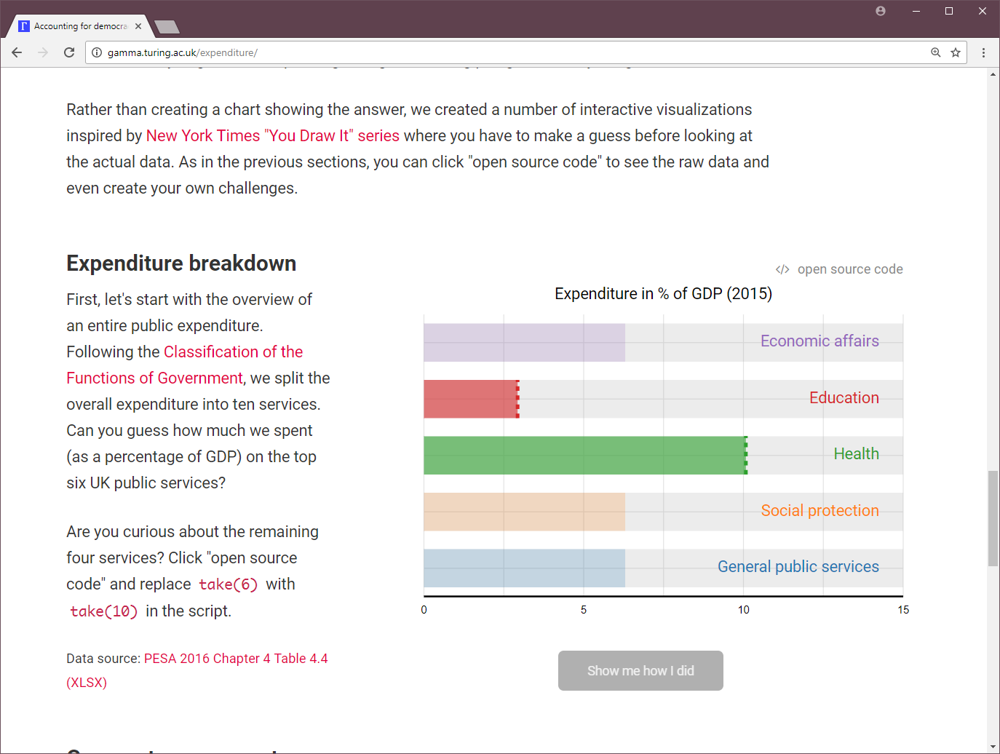

- title : Language Challenges of Targeting Multiple Runtimes 
- description : TBD
- author : Tomas Petricek
- theme : white
- transition : none

****************************************************************************************************

# Language Challenges of <br /> _Targeting Multiple Runtimes_

<div style="margin:40px 0px 40px 0px">

</div>

**_Tomas Petricek_**, The Alan Turing Institute <br />
[tomasp.net](http://tomasp.net) | [tomas@tomasp.net](mailto:tomas@tomasp.net) | [@tomaspetricek](http://twitter.com/tomaspetricek)

<link href="https://maxcdn.bootstrapcdn.com/font-awesome/4.7.0/css/font-awesome.min.css" rel="stylesheet"
  integrity="sha384-wvfXpqpZZVQGK6TAh5PVlGOfQNHSoD2xbE+QkPxCAFlNEevoEH3Sl0sibVcOQVnN" crossorigin="anonymous">

---------------------------------------------------------------------------------------------------


---------------------------------------------------------------------------------------------------


---------------------------------------------------------------------------------------------------



---------------------------------------------------------------------------------------------------


---------------------------------------------------------------------------------------------------

### F# as a multi-runtime language

<div class="fragment">

**The multi-runtime reality**

 - F# was _built for .NET_
 - F# _compilers to JavaScript_
 - F# subsets _runs on GPU_, _SQL_, etc.

**The unrealistic specification**<br />
The specification _assumes .NET_ runtime.

</div>

---------------------------------------------------------------------------------------------------

<table style="width:100%"><tr><td style="width:50%;text-align:center">

### __Deep targetting__

 - Keep semantics
 - Complicates interop
 - Can keep ecosystem
 
</td><td style="width:50%;text-align:center">

### __Shallow targetting__

 - Relax semantics
 - Makes interop easy
 - Harder portability
 
</td></tr></table>

****************************************************************************************************

# Semantic challenges

When F# does not match the F# specification

<br />


---------------------------------------------------------------------------------------------------

# DEMO<br/> _Rendering a fractal using Fable_

---------------------------------------------------------------------------------------------------

## Rendering a fractal using Fable

```
let render (canv:HTMLCanvasElement) = async {
  let ctx = canv.getContext_2d()
  let img = ctx.createImageData(U2.Case1 width, height)

  for x in 0 .. int width - 1 do
    for y in 0 .. int height - 1 do
      let x' = (float x / width * (snd w - fst w)) + fst w
      let y' = (float y / height * (snd h - fst h)) + fst h
      let it = countIterations palette.Length x' y'
      setPixel img x y width palette.[it]

    do! Async.Sleep(1)
    ctx.putImageData(img, 0.0, 0.0) }

match unbox (document.getElementById("go")) with 
| Some canv -> render canv
| None -> ()
```

---------------------------------------------------------------------------------------------------

## Interesting aspects

_**Using nice F# features**_

 - _Async_ for background processing
 - _Option_ to handle missing element
 - _Integer_ and _float_ numeric types

---------------------------------------------------------------------------------------------------

## Interesting aspects

_**They behave in JavaScript way**_

 - Async doesn't use _background threads_
 - Option types are _erased using nulls_
 - Computation uses _JavaScript numbers_

****************************************************************************************************

# Semantic challenges

When F# does not match the F# specification

<br />


---------------------------------------------------------------------------------------------------

## Option types

**F# on .NET**<br />
An instance of `Option<T>` class

**F# on JavaScript**<br />
Valid object or `null` value

---------------------------------------------------------------------------------------------------

## Option types

**Benefits**<br />
Can use pattern matching on JavaScript values!<br />

**Drawbacks**<br />
At runtime `None == Some(null)` 

---------------------------------------------------------------------------------------------------

## Numerical types

**F# on .NET**<br />
A range of `float`, `int`, `uint`, etc.

**F# on JavaScript**<br />
JavaScript numerical type

---------------------------------------------------------------------------------------------------

## Numerical types

**Benefits**<br />
Simulating _full .NET behavior_ is hard!<br />
Fable simulates integer `/` and `%`

**Drawbacks**<br />
Numerical computations will differ

---------------------------------------------------------------------------------------------------

## Asynchronous workflows

**F# on .NET**<br />
Runs work items using thread pool

**F# on JavaScript**<br />
Cooperative multi-tasking on single thread

---------------------------------------------------------------------------------------------------

## Asynchronous workflows

**Benefits**<br />
Can reuse code using familiar library<br />
Strictly speaking satisfies the spec

**Drawbacks**<br />
Lack of threads might cause deadlocks<br />
`Async.RunSynchronously` unsupported

---------------------------------------------------------------------------------------------------


## Unsafe downcasts

**F# on .NET**<br />
Object type checked at cast point

**F# on JavaScript**<br />
All checks delayed to member access

---------------------------------------------------------------------------------------------------

## Unsafe downcasts

**Benefits**<br />
Keep runtime manageable<br />
Interop with native JS objects

**Drawbacks**<br />
JavaScript-style error behaviour

---------------------------------------------------------------------------------------------------

## Further semantic challenges

<div class="fragment">

**Exceptions**<br />
JavaScript can throw anything, .NET cannot

</div><div class="fragment">

**Tail-calls**<br />
.NET supports them, JavaScript does not

</div><div class="fragment">

**Arrays**<br />
.NET has fixed length, JS does not

</div>

****************************************************************************************************

# Interop challenges

Making F# talk to JavaScript

<br />


---------------------------------------------------------------------------------------------------

# DEMO<br/> _Visualizing Whitehouse salaries_

---------------------------------------------------------------------------------------------------

## Visualizing Whitehouse salaries

```
let enigma = "https://api.enigma.io/v2/data/<key>"
let whitehouse = enigma + "/us.gov.whitehouse.salaries.2016"
let schema = "https://vega.github.io/schema/vega-lite/v2.0.json"

let work () = async {
  let! res = Http.Request("GET", whitehouse + "/sort/name+/limit/20")
  let people = jsonParse(res)?result
  let spec = 
    { ``$schema`` = schema
      width = Some 800; height = Some 800
      data = { values = unbox people }
      mark = "bar"
      encoding = 
        { y = { field = "name"; ``type`` = "ordinal"}
          x = { field = "salary"; ``type`` = "quantitative"} } }
  vega.embed("#chart", spec, {actions = false}) }

work () |> Async.StartImmediate
```

---------------------------------------------------------------------------------------------------

## Interesting aspects

_**Using nice F# features**_

 - Asynchronous workflows for _REST calls_
 - _F# records_ and types calling Vega
 - _Dynamic operator_ for member lookup

---------------------------------------------------------------------------------------------------

## Interesting aspects

_**They behave in JavaScript way**_

 - _Cannot wait_ and block an async 
 - Types serve merely _as a façade_
 - Unchecked _member lookup can fail_

****************************************************************************************************

# Interop challenges

Making F# talk to JavaScript

<br />


---------------------------------------------------------------------------------------------------

## Façade F# records and interfaces

Importing the Vega library API

```
type VegaData = 
  { values : obj[] }

type VegaSpec = 
  { ``$schema`` : string
    width : int option
    height : int option
    mark : string
    data : VegaData
    encoding : VegaEncoding }

type Vega =
  abstract embed : string * VegaSpec -> unit
```

---------------------------------------------------------------------------------------------------

## Façade F# records and interfaces

**Shallow targetting** <br />
_.NET member calls_ compile as _JS member calls_

**Deep targetting**<br />
Members could be _compiled as lookup table_

---------------------------------------------------------------------------------------------------

## Inline JavaScript annotations 

Defining global values and functions

```
[<Emit("vega")>]
let vega : Vega = failwith "JS only"

[<Emit("JSON.parse($0)")>]
let jsonParse<'R> (str:string) : 'R = failwith "JS Only"
```

---------------------------------------------------------------------------------------------------

## Inline JavaScript annotations 

**Shallow targetting** <br />
_Direct mapping_ to JS functionality

**Deep targetting**<br />
Leads to _unportable libraries_

---------------------------------------------------------------------------------------------------

## Dynamic object access and creation

Access any member dynamicaly

```
chart?size(768,480)?on("renderlet", fun chart ->
    (* do something *) )
```

Create empty object dynamically 

```
let x = createEmpty<Size>
x.width <- 800
```

---------------------------------------------------------------------------------------------------

## Dynamic object access and creation


**Shallow targetting** <br />
Special handling of _dynamic constructs_

**Deep targetting**<br />
Cannot create _empty object_

****************************************************************************************************

# Undefined behaviour

What should the F# specification look like?

<br />


---------------------------------------------------------------------------------------------------

## Undefined behaviour in C

> Behaviour is left undefined not to allow optimisation, but as 
> an inevitable consequence of two things. Firstly, the program
> containing it is an error—the language implementation
> is not required to support it. Secondly, no behaviour for
> detecting or handling the error can be prescribed in all cases.
>
> <p style="text-align:right;width:100%;margin-top:25px">Stephen Kell (2017)<br />Some Were Meant for C</p>

---------------------------------------------------------------------------------------------------

<table style="width:100%"><tr><td style="width:50%;text-align:center">

### __Deep targetting__

Minimize cases with undefined behaviour
 
</td><td style="width:50%;text-align:center">

### __Shallow targetting__

Leave undefined or under-defined for flexibility
 
</td></tr></table>

---------------------------------------------------------------------------------------------------

## Undefined behaviour

_**Leaves room for platform-specific implementation**_

 - Fine properties of _primitive types_
 - Anything involving `null` value  
 - _"Unsafe" operations_ like casts
 - What _erroneous member_ access does
 
---------------------------------------------------------------------------------------------------

## What is a language?

_**F# compiled to JavaScript breaks the spec!**_

 - ... but not the _spirit_!
 - _It is safe_ thanks to JavaScript
 - _Well-behaved core_ code works
 - Useful spec should be _runtime-neutral_

****************************************************************************************************

# Summary

Multi-runtime programming languages

<br />


---------------------------------------------------------------------------------------------------

> How can we compile one language to JVM, SQL, .NET, LLVM, <br />
> JavaScript, Squeak, GPUs, Arduino and other IoT platforms? 

---------------------------------------------------------------------------------------------------

### _Allow some under-defined behavior_

 - Minimum for portability (_"deep"_)
 - A lot for integration (_"shallow"_)
 
---------------------------------------------------------------------------------------------------

### _Escape hatches for good integration_

 - Explicit encoding of escape hatches (_"deep"_)
 - Dynamic language features (_"shallow"_)
 - Flexible or misusable object model (_"shallow"_)
 - Allow arbitrary unchecked effects (_"shallow"_)
 
---------------------------------------------------------------------------------------------------

# Discussion! & Questions?

<style>.ref p { font-size:85%; margin:10px 0px 10px 0px } 
.ref { padding:40px 0px 30px 0px !important }</style>
<div class="ref">

#### References

Noble & Biddle (2002). Notes on postmodern programming

Petricek, Syme & Bray (2014). In the Age of Web:<br />Typed Functional-First Programming Revisited

Stephen Kell (2017). Some Were Meant for C

</div>

**_Tomas Petricek_**, The Alan Turing Institute <br />
[tomasp.net](http://tomasp.net) | [tomas@tomasp.net](mailto:tomas@tomasp.net) | [@tomaspetricek](http://twitter.com/tomaspetricek)

<link href="https://maxcdn.bootstrapcdn.com/font-awesome/4.7.0/css/font-awesome.min.css" rel="stylesheet"
  integrity="sha384-wvfXpqpZZVQGK6TAh5PVlGOfQNHSoD2xbE+QkPxCAFlNEevoEH3Sl0sibVcOQVnN" crossorigin="anonymous">

---------------------------------------------------------------------------------------------------
