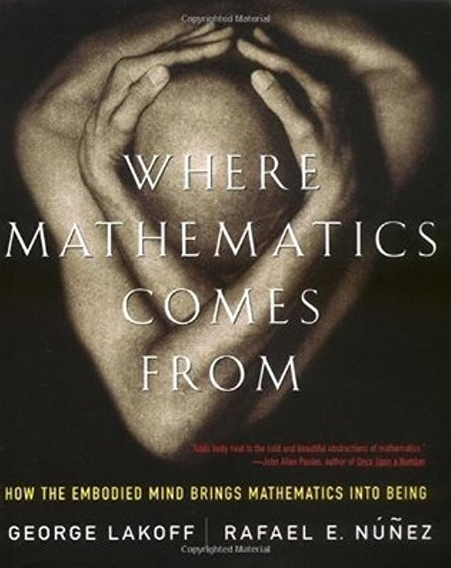
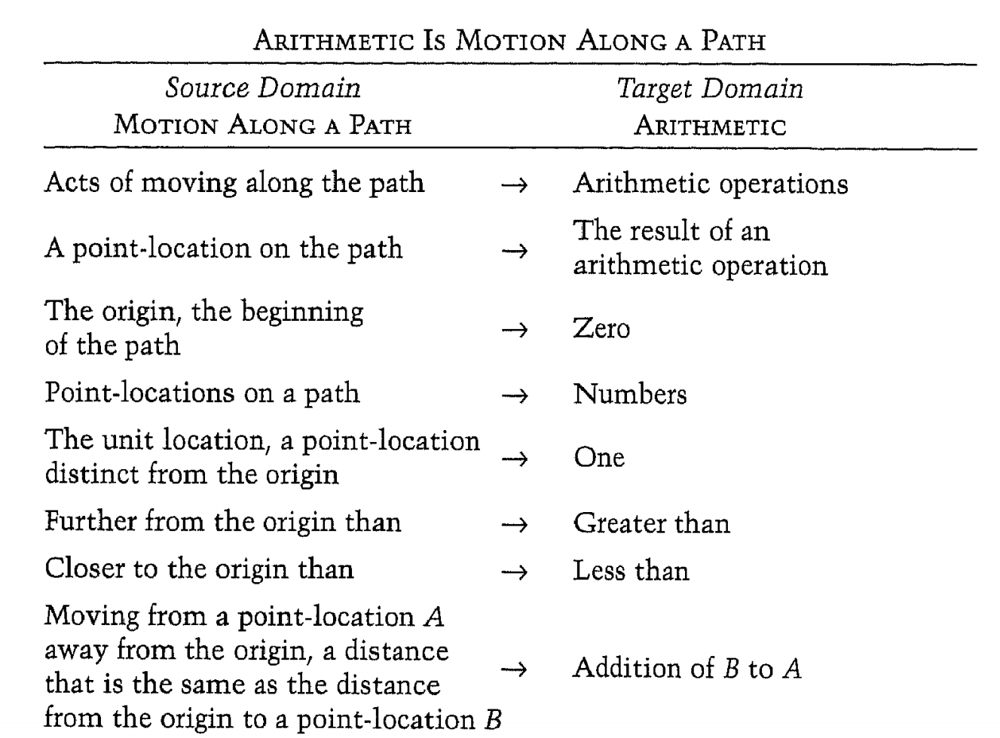
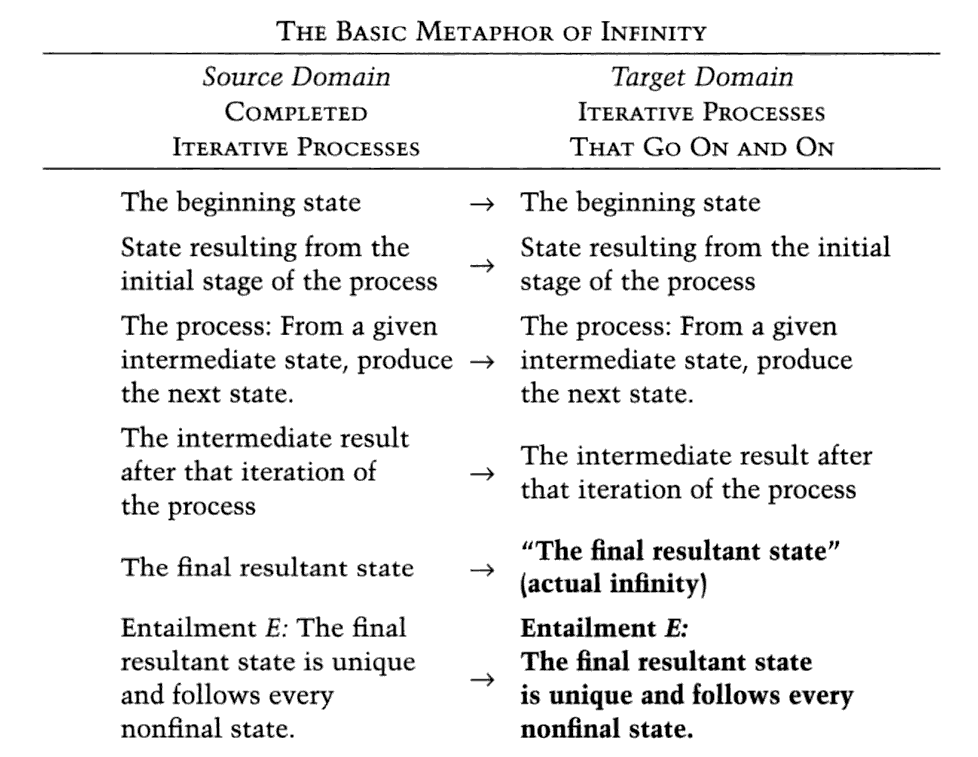
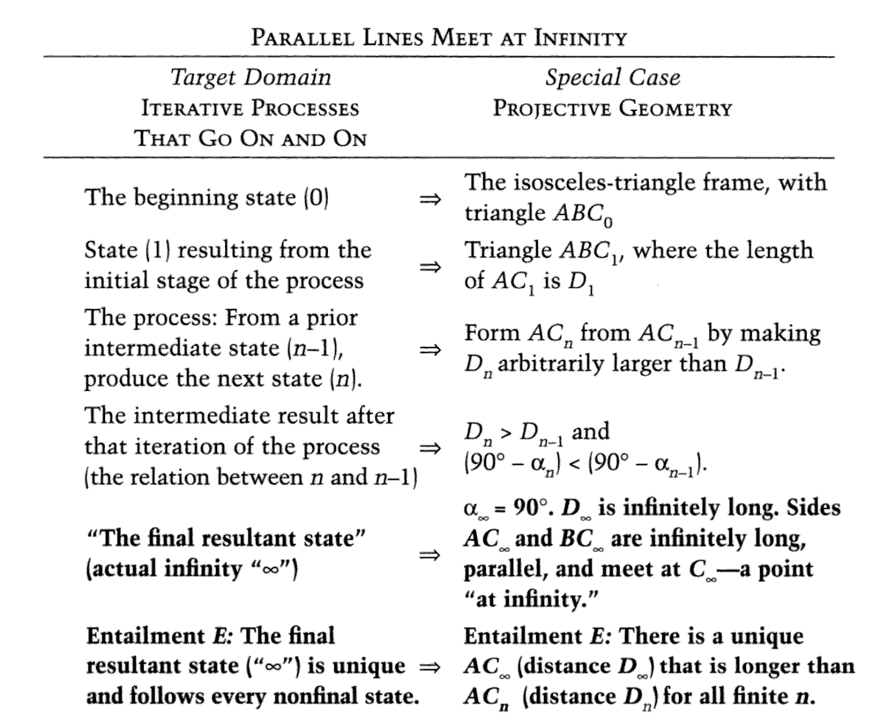

- title : Where Mathematics Comes From
- description : TBD
- author : Tomas Petricek
- theme : white
- transition : none

****************************************************************************************************

# Where mathematics comes from

**Tomas Petricek**, The Alan Turing Institute  
[tomasp.net](http://tomasp.net) | [tomas@tomasp.net](mailto:tomas@tomasp.net) | [@tomaspetricek](http://twitter.com/tomaspetricek)

****************************************************************************************************

# The nature of mathematics

Why does it matter & cognitive approach

 

---------------------------------------------------------------------------------------------------

## Why nature of mathematics matters

 * Where do _laws of arithmetic_ come from?
 * Would aliens have _lambda calculus_?
 * Why can mathematics _explain the world_?
 * How do we make _mathematics accessible_?

---------------------------------------------------------------------------------------------------
   
## Cognitive science of mathematics

> The only mathematics we know or can know is  
> a brain-and-mind-based mathematics.
>
> It is up to cognitive science and the neurosciences to (...)   
> apply the science of mind to human mathematical ideas. 
>
> 
Lakoff, Nunez (p1, xi)

---------------------------------------------------------------------------------------------------

## Components of the analysis

***Innate arithmetic***  
Babies have some mathematical capacities

***Conceptual metaphors***  
Links concepts via neural conflations

***Layering metaphors***  
Explain more abstract mathematical concepts

---------------------------------------------------------------------------------------------------

## Innate arithmetic experiments

****************************************************************************************************

# Metaphors

Cognitive reconstruction of mathematics

 

---------------------------------------------------------------------------------------------------

## Metaphors are central to thought

> One of the principal results in cognitive science is that abstract concepts
> are typically understood, via metaphor, in terms of more concrete concepts.
>
> 
Lakoff, Nunez (p39)

---------------------------------------------------------------------------------------------------

## Everyday mathematical understanding

> Mathematical ideas (...) are often grounded in everyday experience.
>
> Many mathematical ideas are ways of mathematicizing ordinary ideas, as when the 
> idea of a derivative mathematicizes the ordinary idea of instantaneous change.
>
> 
Lakoff, Nunez (p29)

---------------------------------------------------------------------------------------------------

## Analysing mathematical metaphors

***Grounding metaphors***  
Sets are like physical containers

***Linking metaphors***  
Numbers as sets, i.e. $\emptyset, \{\emptyset\}, \{\emptyset,  \{\emptyset\}\}$, ...

***Introduction of elements***  
Metaphors introduce concepts into target domain

****************************************************************************************************

# Arithmetic

Metaphors for arithmetic

 

---------------------------------------------------------------------------------------------------

## Metaphors for arithmetic
   
***Arithmetic is like...***

- Object collection   
- Object construction
- Motion along a path

***Arithmetic laws...***  
Come from physical experience!

---------------------------------------------------------------------------------------------------

---------------------------------------------------------------------------------------------------

## Arithmetic is object collection

**Linguistic examples**  
_Add_ onions and carrots to the soup  
Which is _bigger_, 5 or 7?

**Equational properties**  
Adding A to B gives the same result as  
adding B to A for _object collections_

**Limitations of the metaphor**  
Zero in terms of collections?

---------------------------------------------------------------------------------------------------

---------------------------------------------------------------------------------------------------

## Arithmetic is movement along a path

**Linguistic examples**  
4.9 is _near_ 5, result is _around_ 42

**Equational properties**  
Moving from A by B gives the same   
result as moving from B by A. 

**Nice features**  
Explains _zero_ and _fractions_ well

****************************************************************************************************

# Beyond arithmetic

Infinity, Booleans, sets and $e^{\pi i} + 1 = 0$

 

---------------------------------------------------------------------------------------------------

## Other mathematical metaphors

**Basic metaphor of infinity**  
Infinity as the end of _iterative process_

**Algebra**  
Folk theory of essences, substance and forms

**$e^{\pi i} + 1 = 0$**  
$\pi i$ as rotation, $e^x$ turns multiplication into addition

---------------------------------------------------------------------------------------------------

---------------------------------------------------------------------------------------------------

## Basic metaphor of infinity

**Adding concepts to target domain**  
Metaphor adds _actual infinity_

**Explaining actual infinity**  
$\infty$ as the end of an iterative process

---------------------------------------------------------------------------------------------------

****************************************************************************************************

# Implications

What can we learn from cognitive science?

 

---------------------------------------------------------------------------------------------------

## The Romance of Mathematics 

 - Mathematics is an objective feature of the universe
 - It has absolute truths about any possible universe
 - It characterizes the nature of rationality
 - Mathematical truths are universal and absolute

---------------------------------------------------------------------------------------------------

## The Romance of Mathematics 

> The Romance of Mathematics makes a wonderful story (...).  It perpetuates
> the mystique of the Mathematician [as someone who is] more rational,
> more probing, deeper, visionary. (...) But sadly, for the most part, it is not
> a true story.
>
> 
Lakoff, Nunez (p341)

---------------------------------------------------------------------------------------------------

## Is mathematics independent of culture?

> Everything in the universe has an essence (...). [S]ince Euclid (...)  
> essence can be given by a small number of obviously true postulates.
>
>
> [The idea] that theories, like buildings, must have secure, solid, permanent
> foundations on which all else is built is at least as old as Aristotle.
>
> It has been governing metaphor behind [Western] theories that   
> pretend to give an account of certain and absolute knowledge.
>
> 
Lakoff, Nunez (p355-358)

---------------------------------------------------------------------------------------------------
     
## Metaphors in computer science

***Metaphors matter***  
The choice of metaphors affects what we can think

***What metaphors we use?***  
What cognitive metaphors lead to $\lambda$-calculus, monads, etc.?

****************************************************************************************************

# Summary

 

---------------------------------------------------------------------------------------------------

## Would aliens understand $\lambda$-calculus?

---------------------------------------------------------------------------------------------------

## Would aliens understand $\lambda$-calculus?

***Metaphors for logic***  
Logic is derived from container schema.

***Would aliens have containers?***  
Imagine gaseous universe that does not have "in".

---------------------------------------------------------------------------------------------------

## Where mathematics comes from

***The nature of mathematics***  
Human-based, not Platonic ideals

***Constructed via metaphors***  
Grounding (physical experience) and linking

***Important consequences***  
Metaphors change how we think & teach 

 

[tomasp.net](http://tomasp.net) | [tomas@tomasp.net](mailto:tomas@tomasp.net) | [@tomaspetricek](http://twitter.com/tomaspetricek)
