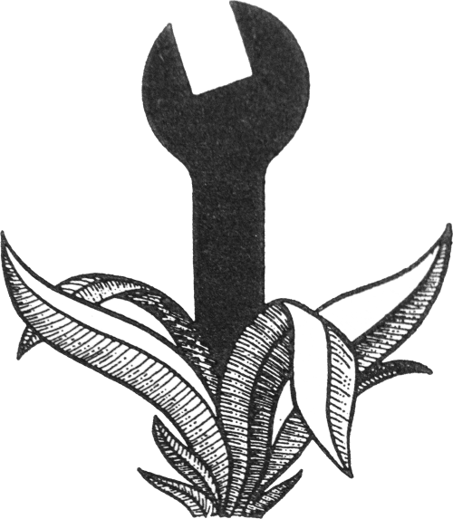
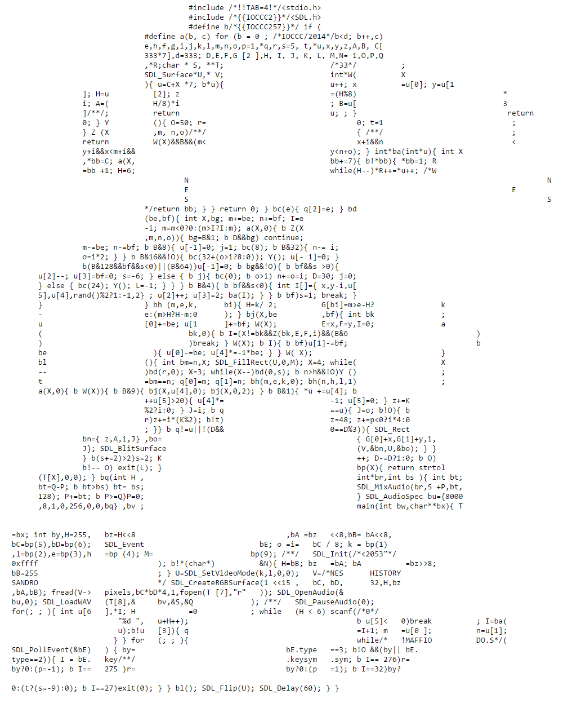

- title : Programming is Writing is Programming
- description : 
- author : Tomas Petricek
- theme : white
- transition : none

****************************************************************************************************

## Programming is Writing is Programming (Felienne Hermans)

**Tomas Petricek**, The Alan Turing Institute  
[tomasp.net](http://tomasp.net) | [tomas@tomasp.net](mailto:tomas@tomasp.net) | [@tomaspetricek](http://twitter.com/tomaspetricek)

****************************************************************************************************

## Formatting in programming and writing

----------------------------------------------------------------------------------------------------

(mario.c, International Obfuscated C Code Contest, 2014)

----------------------------------------------------------------------------------------------------

(Ať jde každý vlastní cestou, Antikódy, Václav Havel, 1964)

----------------------------------------------------------------------------------------------------

## Formatting and meaning

Can make consumption easier in _writing_ ✔ 
Can make consumption easier in _programming_ ✔

Can support the meaning in _writing_ ✔ 
Can support the meaning in _programming_ **?**

Can form the key component of meaning in _writing_ ✔ 
Can form the key component of meaning in _programming_ ✘ 

----------------------------------------------------------------------------------------------------

### What if _formatting_ was a proper part of _meaning_?

****************************************************************************************************

## Process of writing

----------------------------------------------------------------------------------------------------

## Process of writing and programming

  

(Programming is Writing is Programming, Hermans & Aldewereld)

----------------------------------------------------------------------------------------------------

## Pirsig on rules for "good writing"

> [T]he rule was pasted on to the writing after the writing was all done.  
> It was post hoc, after the fact, instead of prior to the fact. 
>
> And he became convinced that all the writers the students were supposed to 
> mimic wrote without rules, putting down whatever sounded right, then 
> going back to see if it still sounded right and changing it if it didn't.

 

(Zen and the art of motorcycle maintenance, Pirsig 1974)

----------------------------------------------------------------------------------------------------

### Do we mistake _descriptive_ for _prescriptive_?

### Is programming more _constrained_ because computer has to run your program?

****************************************************************************************************

How to learn from Programming is Writing is Programming?

### _Write programs for reading, not for execution!_

----------------------------------------------------------------------------------------------------

## _Programs just for reading_

****************************************************************************************************

<h2 style="margin:0px">Summary</h2>

### <em style="font-size:90%">Liberate programming from the tyranny of execution?</em>

- Explore how coding style can _carry meaning_
- What _rules_ might be worth _breaking_?
- Not joking! _Pseudocode_ is the same since 1960s

 
 
 

Tomas Petricek | [tomas@tomasp.net](mailto:tomas@tomasp.net) | [@tomaspetricek](http://twitter.com/tomaspetricek)

****************************************************************************************************

## The essence of program or text 

----------------------------------------------------------------------------------------------------

> Eventually, Estragon dozes off and Vladimir rouses him but then stops him before he can share his 
> dreams—another recurring activity between the two men. Estragon wants to hear an old joke, which 
> Vladimir cannot finish without going off to urinate. Upon Vladimir's return, Estragon suggests 
> that they hang themselves, but they abandon the idea when the logistics seem ineffective.

(Waiting for Godot, Samuel Beckett 1953)

----------------------------------------------------------------------------------------------------

## The essence of program or text

For text, we know _plot is not the essence_ of text.

For programs, we believe there is a succinct  
essence or high-level program description.

----------------------------------------------------------------------------------------------------
