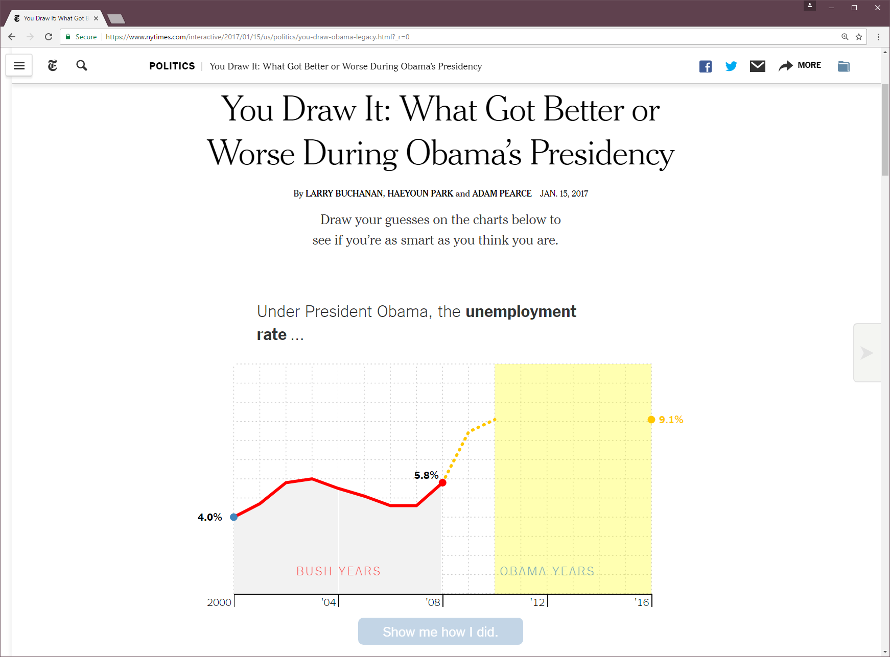

- title : The Gamma: Democratizing Data Science
- description : 
- author : Tomas Petricek
- theme : night
- transition : none

****************************************************************************************************
 - data-background : images/post-fact.jpg
 - class : withbackground

<br />

# _The Gamma_

## Democratizing Data Science

<br /><br /><br /><br />

#### Tomas Petricek, The Alan Turing Institute<br /> [@tomaspetricek](http://twitter.com/tomaspetricek) | [tomasp.net](http://tomasp.net) | [thegamma.net](http://thegamma.net)

---------------------------------------------------------------------------------------------------


****************************************************************************************************
- data-background : images/kiss.jpg
- class : withbackground

<div class="fragment">

# Welcome to the _post-fact_ world

</div>

****************************************************************************************************
- data-background : images/glacier.jpg
- class : withbackground

# _Facts_ and F# type providers

---------------------------------------------------------------------------------------------------


---------------------------------------------------------------------------------------------------

# *DEMO*

## Checking facts with type providers

---------------------------------------------------------------------------------------------------

### Easy way of getting started with F#
#### _fsharpworks.com/workshops_

### F# is great for data science
#### _www.fslab.org_

### Try it now in Azure Notebooks

****************************************************************************************************
- data-background : images/rowing.jpg
- class : withbackground

<div class="fragment">

## Can technology _democratize facts_?

</div>

---------------------------------------------------------------------------------------------------


---------------------------------------------------------------------------------------------------

#### Can the result be _reproduced_?
   
#### Is the visualization _misleading_?
 
#### Can it be done by _non-experts_?

#### Can the reader _explore further_?

---------------------------------------------------------------------------------------------------

<h1>
  
  The Gamma
</h1>  
  
---------------------------------------------------------------------------------------------------

# *DEMO*

## Carbon emissions in The Gamma

****************************************************************************************************
- data-background : images/dragon.jpg
- class : withbackground

## F# to JavaScript via _Fable_

---------------------------------------------------------------------------------------------------

### Reasonably nice _modern JavaScript_
### Active and welcoming _community_
### Pragmatic _functional-first_ style

****************************************************************************************************
 - data-background : images/rio.jpg
 - class : withbackground

# Dot-driven _data exploration_

****************************************************************************************************
 - data-background : images/rio-dark.jpg
 - class : withbackground

#### _Dot-driven_ programming via type providers

<br />
 


---------------------------------------------------------------------------------------------------

#### _Dot-driven_ programming via type providers

<br />
 


---------------------------------------------------------------------------------------------------


---------------------------------------------------------------------------------------------------


---------------------------------------------------------------------------------------------------


---------------------------------------------------------------------------------------------------


****************************************************************************************************
 - data-background : images/rio.jpg
 - class : withbackground

# *DEMO*

## Visualizing Olympic medals

****************************************************************************************************
- data-background : images/elm.jpg
- class : withbackground

# _Elm-style_ architecture

---------------------------------------------------------------------------------------------------

## _Elm-style_ architecture

    [hide]
    type Html = Html
    type State = State
    type Event = Event


```    
// Calculate new state when event happens
val update : State -> Event -> State

// Render HTML from the current state
val render : (unit -> Event) -> State -> Html
```

---------------------------------------------------------------------------------------------------

## Implementing _Elm-style_ TODO list

```    
type Update = 
  | Input of string
  | Remove of Guid
  | Create 

type Model = 
  { Items : (Guid * string) list 
    Input : string }
```

---------------------------------------------------------------------------------------------------

### _DEMO_: Getting started with Fable

---------------------------------------------------------------------------------------------------


****************************************************************************************************
 - data-background : images/budget.jpg
 - class : withbackground

# Making data more _engaging_

---------------------------------------------------------------------------------------------------



---------------------------------------------------------------------------------------------------

# *DEMO*

## Guess the government expenditure

****************************************************************************************************
- data-background : images/science.jpg
- class : withbackground

# _Composable_ functional charts

---------------------------------------------------------------------------------------------------


---------------------------------------------------------------------------------------------------

## _Composable_ functional charts

```    
type Shape = 
  | Style of ShapeStyle * Shape
  | Line of seq<Value * Value>
  | Shape of seq<Value * Value>
  | Layered of seq<Shape>
  | Axes of Shape
```

---------------------------------------------------------------------------------------------------

# *DEMO*

## Functional composable charts

****************************************************************************************************
- data-background : images/rio.jpg
- class : withbackground

# Summary

****************************************************************************************************
- data-background : images/trump.jpg
- class : withbackground

# Make _facts_ great again!

****************************************************************************************************
- data-background : images/tggh.png
- class : withbackground

#### _Type providers_ for data access magic

#### _Fable_ and Elm-style client-side

#### Functional _domain modelling_ for the win!

<br /><br /><br /><br />

#### Tomas Petricek, [tomas@tomasp.net](tomas@tomasp.net)<br /> [@tomaspetricek](http://twitter.com/tomaspetricek) | [thegamma.net](http://thegamma.net) | [tomasp.net](http://tomasp.net) 
