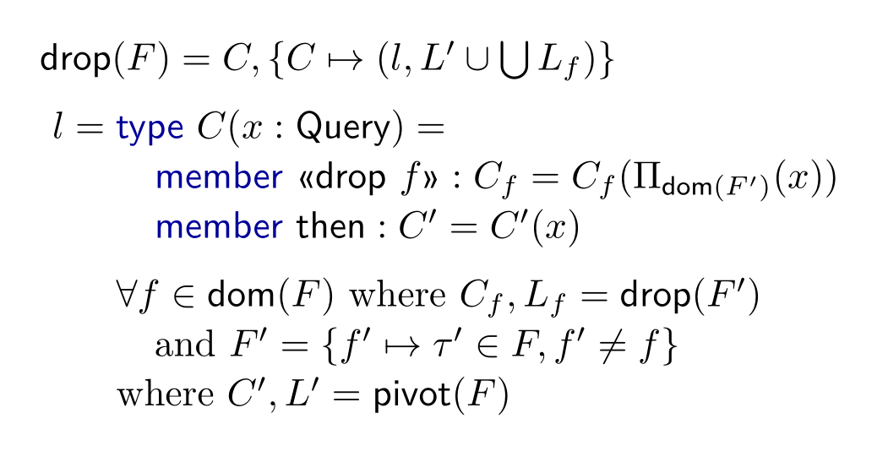

- title : Programming as Human Data Interaction
- description :
- author : Tomas Petricek
- theme : white
- transition : none

***************************************************************************************************

# _Programming_<br/>_as_ Human Data Interaction

<br /><br /><br />
<br /><br /><br />

### Tomas Petricek, _University of Kent_

_[http://tomasp.net](http://tomasp.net/academic) <span style="margin:0px 6px 0px 6px">|</span>
[tomas@tomasp.net](mailto:tomas@tomasp.net) <span style="margin:0px 6px 0px 6px">|</span>
[@tomaspetricek](http://twitter.com/tomaspetricek)_

***************************************************************************************************

<div class="sec">

# DATA SCIENCE

</div>

---------------------------------------------------------------------------------------------------

# Motivation
_Open, reproducible and accessible data science_

<br />

# Approach
_Human-centric programming languages and tools_

---------------------------------------------------------------------------------------------------


---------------------------------------------------------------------------------------------------

<div style="background:black;position:absolute;width:200%;right:51%;height:400%;top:-100%;z-index:-1000;"></div>

<table style="margin-top:140px"><tr><td style="width:45%;color:white" class="fragment">

<h3 style="color:white;">Spreadsheets</h3>

<div class="narrow" style="padding:20px 0px 105px 0px;">
<p><i class="fa fa-birthday-cake"></i> <em>Easy to use</em></p>
<p><i class="fa fa-table"></i> <em>Simple problems only</em></p>
<p><i class="fa fa-redo-alt"></i> <em>Not reproducible</em></p>
</div>

</td><td style="width:45%" class="fragment">

### Programming

<div class="narrow" style="padding:20px 0px 105px 0px;">
<p><i class="fa fa-university"></i> <em>Requires expert skills</em></p>
<p><i class="fa fa-globe"></i> <em>Internet-scale</em></p>
<p><i class="fa fa-code"></i> <em>Reproducible &amp; open</em></p>
</div>

</td></tr></table>

---------------------------------------------------------------------------------------------------

## _What makes spreadsheets successful?_

## _How can programming tools learn?_

<div class="fragment">

## Think of programming as interaction!

</div>

---------------------------------------------------------------------------------------------------

### DEMO

_Exploring World Bank with type providers <span class="ref"><span>DDFP 2013</span></span>_  

***************************************************************************************************

<div class="sec">

# WORKING WITH DATA

</div>

---------------------------------------------------------------------------------------------------

### Reading data

_Unsafe dynamic access in a typed language_

<div style="padding-top:20px">

    [lang=csharp]
    var url = "http://dvd.netflix.com/Top100RSS";
    var rss = XDocument.Load(topRssFeed);
    var channel = rss.Element("rss").Element("channel");

    foreach(var item in channel.Elements("item")) {    
      Console.WriteLine(item.Element("text").Value);
    }

</div>
<div class="fragment">
  <div class="tipbox" style="left:628px;top:-110px;width:84px;height:25px"></div>
  <div class="tiplbl" style="left:666px;top:-95px">Not found!</div>
</div>

---------------------------------------------------------------------------------------------------

### Reading data

_Unsafe dynamic access in a typed language_

<div style="padding-top:20px">

    [lang=csharp]
    var url = "http://dvd.netflix.com/Top100RSS";
    var rss = XDocument.Load(topRssFeed);
    var channel = rss.Element("rss").Element("channel");

    foreach(var item in channel.Elements("item")) {    
      Console.WriteLine(item.Element("title").Value);
    }

</div>
<div>
  <div class="tipbox" style="left:628px;top:-110px;width:100px;height:25px"></div>
  <br />
</div>

---------------------------------------------------------------------------------------------------

### Reading data

_Accessing data from external data sources_

<div class="narrow" style="padding:20px 0px 105px 0px;">
<p><i class="fa fa-file-excel"></i> <em>Languages do not understand data</em></p>
<p><i class="fa fa-tags"></i> <em>There is rarely explicit schema</em></p>
<p><i class="fa fa-code"></i> <em>Manually define types to caputre it</em></p>
<p><i class="fa fa-wrench"></i> <em>Easier in dynamic languages</em></p>
</div>


---------------------------------------------------------------------------------------------------

### Aggregating data

_Athletes by number of gold medals from Rio 2016_

<div style="padding:40px 0px 60px 0px">

```
olympics = pd.read_csv("olympics.csv")
olympics[olympics["Games"] == "Rio (2016)"]
  .groupby("Athlete")
  .agg({"Gold": sum})
  .sort_values(by="Gold", ascending=False)
  .head(8)
```

</div>
<div class="fragment">
  <div class="tipbox" style="left:455px;top:-324px;width:220px;height:25px"></div>
  <div class="tiplbl" style="left:550px;top:-415px">Unknown file</div>
  <div class="tipbox" style="left:364px;top:-254px;width:90px;height:25px"></div>
  <div class="tiplbl" style="left:390px;top:-245px">Column name</div>
</div>

---------------------------------------------------------------------------------------------------

### Aggregating data

_Language and data source features you need to know_

<div class="narrow" style="padding:20px 0px 105px 0px;">
<p><i class="fa fa-book"></i> <em>Python dictionaries <code>{"key": value}</code></em></p>
<p><i class="fa fa-eye"></i> <em>Generalised indexers <code>.[ condition ]</code></em></p>
<p><i class="fa fa-university"></i> <em>Operation names <code>sort_values</code></em></p>
<p><i class="fa fa-database"></i> <em>Data column names <code>"Athlete"</code></em></p>
</div>

***************************************************************************************************

<div class="sec">

# TYPE PROVIDERS

</div>

---------------------------------------------------------------------------------------------------

<div class="bigeq">

$\emptyset \vdash e : \tau$

</div>


---------------------------------------------------------------------------------------------------

<div class="bigeq bigeq2">

$\pi(~~~~~~~) \vdash e : \tau$


</div>

---------------------------------------------------------------------------------------------------

### DEMO

_Reading data from an RSS feed <span class="ref"><span>PLDI 2016</span></span>_

---------------------------------------------------------------------------------------------------

### F# Data library

_Type providers for structured data_

<div class="fragment narrow" style="padding:20px 0px 105px 0px;">
<p><i class="fa fa-adjust"></i> <em>Structural shape inference</em></p>
<p><i class="fa fa-sitemap"></i> <em>Language integration via type providers</em></p>
<p><i class="fa fa-bomb"></i> <em>Relative type safety</em></p>
</div>

---------------------------------------------------------------------------------------------------

<div class="diagram1">
<p>
  <span>{title&nbsp;:&nbsp;string,&nbsp;author&nbsp;:&nbsp;{age&nbsp;:&nbsp;int}}</span>
  <span style="margin-left:50px">{author&nbsp;:&nbsp;{age&nbsp;:&nbsp;float}}</span>
</p>  
<div class="fragment">
<p><span style="position:relative;top:55px;left:72px" class="arrow-down"></span></p>
<p>
  <span style="position:relative;top:30px;left:40px">{&nbsp;title&nbsp;:&nbsp;option&lt;string&gt;,
    &nbsp;author&nbsp;:&nbsp;{age&nbsp;:&nbsp;float}&nbsp;}</span>
</p>  
</div>
</div>

---------------------------------------------------------------------------------------------------

<div class="diagram2">
<p>
  <span>{&nbsp;coordinates&nbsp;:&nbsp;{lng:num,&nbsp;lat:num}&nbsp;}</span>
  <span style="margin-left:50px">string</span>
</p>  
<div class="fragment">
<p><span style="position:relative;top:55px;left:200px" class="arrow-down"></span></p>
<p>
  <span style="position:relative;left:70px;top:30px">
  {&nbsp;coordinates&nbsp;:&nbsp;{lng:num,&nbsp;lat:num}&nbsp;}&nbsp;+&nbsp;string&nbsp;</span>
</p>  
</div>
</div>

---------------------------------------------------------------------------------------------------

### Shape inference

_Pragmatic design choices for usability_

<div class="fragment narrow" style="padding:20px 0px 105px 0px;">
<p><i class="fa fa-wrench"></i> <em>Prefers records for tooling</em></p>
<p><i class="fa fa-clock"></i> <em>Predictable and stable</em></p>
<p><i class="fa fa-globe"></i> <em>Open world assumption about sums</em></p>
</div>

---------------------------------------------------------------------------------------------------

### DEMO

_Aggregating Olympic medallists <span class="ref"><span>ECOOP 2017</span></span>_  


---------------------------------------------------------------------------------------------------

### Dot-driven development

_Encoding complex logic via simple member access_

<div class="fragment narrow" style="padding:20px 0px 105px 0px;">
<p><i class="fa fa-cog"></i> <em>Type providers for member generation</em></p>
<p><i class="fa fa-tree"></i> <em>Laziness for scaling to large hierarchies</em></p>
<p><i class="fa fa-rocket"></i> <em>Fancy types for the masses!</em></p>
</div>

***************************************************************************************************

<div class="sec">

# BEHIND THE SCENES

</div>

---------------------------------------------------------------------------------------------------

### _Fancy types for the masses_

**Row types to track names and types of fields**

<div style="padding:10px 0px 30px 0px;position:relative;left:-90px;transform:scale(0.75)">

$$$
\definecolor{cc}{RGB}{204,82,34}
\definecolor{mc}{RGB}{0,0,153}
\frac
  {\Gamma \vdash e : {\color{cc}[f_1:\tau_1, \ldots, f_n:\tau_n]}}
  {\Gamma \vdash e.\text{drop}~f_i : {\color{cc} [f_1:\tau_1, \ldots, f_{i-1}:\tau_{i-1}, f_{i+1}:\tau_{i+1}, \ldots, f_n:\tau_n]}}

</div><div class="fragment">

**Embed row types in provided nominal types**

<div style="padding:0px 0px 30px 0px;position:relative;left:-90px;transform:scale(0.75)">

$$$
\frac
  {\Gamma \vdash e : {\color{mc} C_1}}
  {\Gamma \vdash e.\text{drop}~f_i : {\color{mc} C_2}}
\quad{\small \text{where}}

<div style="position:relative;top:-20px;">

$$$
\begin{array}{l}
\\[-0.5em]
{fields({\color{mc} C_1}) = {\color{mc} \{f_1:\tau_1, \ldots, f_n:\tau_n\}}}\\
{fields({\color{mc} C_2}) = {\color{mc} \{f_1:\tau_1, \ldots, f_{i-1}:\tau_{i-1}, f_{i+1}:\tau_{i+1}, \ldots, f_n:\tau_n\}}}
\end{array}

</div></div>

---------------------------------------------------------------------------------------------------

### Fancy types for the masses!

_Powerful idea that works in other contexts_

<div class="narrow" style="padding:20px 0px 105px 0px;">
<p><i class="fa fa-table"></i> <em>Row types and phantom types</em></p>
<p><i class="fa fa-phone"></i> <em>Session types for communication</em></p>
<p><i class="fa fa-question"></i> <em>Add your own fancy type here!</em></p>
</div>

---------------------------------------------------------------------------------------------------

### Relative type safety

<br />

_Well typed programs do not go wrong._

<div class="fragment">

<p><em style="color:#a00020">As long as the world is well-behaved.</em></p>

</div>

---------------------------------------------------------------------------------------------------

### F# Data and safety

<style>.reveal .math p em { font-style:italic; }</style>
<div style="margin-top:70px" class="math">

Given _representative samples_ and _an input_ value

$S(d)\sqsubset S(d_1, \ldots, d_n)$

</div><div class="fragment" style="margin-top:70px">

Any _program_ written using a _type provider_ reduces

$e_{user}[x\leftarrow {\color{mc}\text{new}}~C(d)] \rightsquigarrow^* v$

</div>

---------------------------------------------------------------------------------------------------

### DEMO
_Handling schema change and errors_

---------------------------------------------------------------------------------------------------

### F# Data and schema change

_Provided type can change only in limited ways_

<br />
<div class="fragment">

$C[e] \rightarrow C[e.M]$

$C[e] \rightarrow C[{\sf match}~e~{\sf with}~\ldots]$

$C[e] \rightarrow C[int(e)]$

</div>
<br />

---------------------------------------------------------------------------------------------------

### Structure of a type provider

<br /><div class="fragment">

_Context $L$ maps names to definitions and nested contexts_

<div style="padding:10px 0px 50px 60px">

$
L(C) = {\color{mc}\text{type}}~C(x:\tau) = \overline{m}, L'
$

</div></div><div class="fragment">

_Pivot takes schema and provides a class with context_

<div style="padding:10px 0px 50px 60px">

$
\text{pivot}(F) = C, L
$

</div></div>

---------------------------------------------------------------------------------------------------

### Pivot type provider

_Generate classes that drop individual columns_

<div style="padding:0px 0px 0px 0px">

</div>

---------------------------------------------------------------------------------------------------

### XML/JSON type provider

_Generate class corresponding to a record shape_

<div style="padding:0px 0px 0px 0px">

</div>

***************************************************************************************************

<div class="sec">

# HUMAN DATA INTERACTION

</div>

---------------------------------------------------------------------------------------------------

## Programming for data science

_<span class="circ"><span>1</span></span> Data analytics is an interactive process_

_<span class="circ"><span>2</span></span> Program against data, not abstract symbols_

---------------------------------------------------------------------------------------------------

### DEMO

_Learning from spreadsheets <span class="ref"><span>Programming 2017</span></span>_

---------------------------------------------------------------------------------------------------

### Future work

_Making programming with data easier_

<div class="narrow" style="padding:20px 0px 105px 0px;">
<p><i class="fa fa-table"></i> <em>Learning from spreadsheets</em></p>
<p><i class="fa fa-user"></i> <em>Understanding programmer interactions</em></p>
<p><i class="fa fa-exchange-alt"></i> <em>Calculus of interactions</em></p>
<p><i class="fa fa-balance-scale"></i> <em>Cognitive cost of interactions</em></p>
</div>

***************************************************************************************************

<div class="sec">

# SUMMARY

</div>

---------------------------------------------------------------------------------------------------

# Thank you!

<h2 style="font-size:28pt"><em>Programming as Human Data Interaction</em></h2>
<style type="text/css">.final strong { width:270px; display:inline-block; } .final p { margin:0px 0px 5px 0px; }</style>
<div class="final">

**Interaction** _Study programming not programs_

**Type providers** _Dot driven with fancy types_

**Properties** _Relative safety but also cognitive cost_


</div>
<br /><br />

Tomas Petricek, _University of Kent_

_<i class="fa fa-envelope"></i> [tomas@tomasp.net](mailto:tomas@tomasp.net) | [@tomaspetricek](http://twitter.com/tomaspetricek) | [tomasp.net](http://tomasp.net)<br/>
<i class="fa fa-globe"></i> [thegamma.net](http://thegamma.net) | [fslab.org](http://fslab.org) | [gamma.turing.ac.uk](gamma.turing.ac.uk)_

---------------------------------------------------------------------------------------------------

## References

_Don Syme, Keith Battocchi, Kenji Takeda, Donna Malayeri and Tomas Petricek.
   **Themes in Information-Rich Functional Programming for Internet-Scale Data Sources**. In proceedings of DDFP 2013_

_Tomas Petricek, Gustavo Guerra and Don Syme.
   **Types from data: Making structured data first-class citizens in F#**.  PLDI 2016_

_Tomas Petricek. **Data exploration through dot-driven development**. In proceedings of ECOOP 2017_
