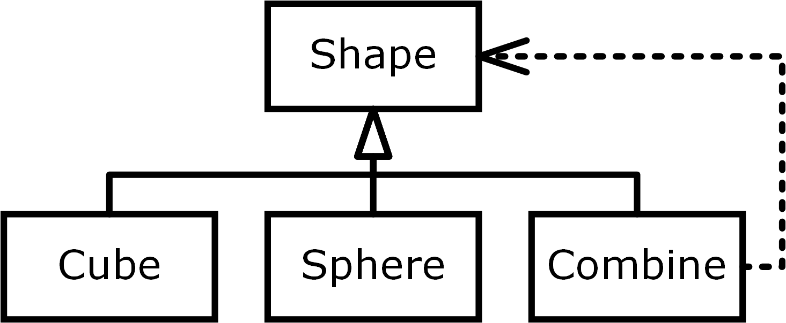

- title : Data exploration through dot-driven development 
- description : 
- author : Tomas Petricek
- theme : white
- transition : none

***************************************************************************************************

# _Programming_ _as_ Human Data Interaction

<h4 style="margin-bottom:0px;margin-top:300px">Dr Tomas Petricek</h4>

_[http://tomasp.net](http://tomasp.net/academic) |
[tomas@tomasp.net](mailto:tomas@tomasp.net) |
[@tomaspetricek](http://twitter.com/tomaspetricek)_

> Good morning! This talk combines two lines of thinking - it takes some ideas from a more 
> theoretical programming language research that I've done in my PhD with and it combines them 
> with more applied work on programming tools for data science that I've been doing recently.

***************************************************************************************************

# Motivation
_Easy, trustworthy and accessible data science_

 

# Vision
_The essence of programming process_ 

> The more immediate applied part of the research is making it easier to use data - and I see making
> facts more accessible and trustworthy as a way in which a computer scientist can fight with 
> dangerous trends in the society today. 
>
> The way data scientists program is very interesting from the programming language perspective,
> because it breaks some of the usual assumptions about programming.

---------------------------------------------------------------------------------------------------

> The data science I have in mind is often quite simple and it is done for example by journalists.
> For example, this Guardian article is using data to illustrate inequality in the world. Do
> we trust the data? Yes, we do, because we are academics and we trust The Guardian!
>
> But what if we wanted to verify this? That is quite hard - The Guardian says the source is
> the WorldBank, but how do we check that? The problem is that there is no source code!

---------------------------------------------------------------------------------------------------

<table style="margin-top:140px"><tr><td style="width:45%;color:white" class="fragment">

<h3 style="color:white;">Spreadsheets</h3>

<i class="fa fa-birthday-cake"></i> <em>Easy to use</em>

<i class="fa fa-table"></i> <em>Simple problems only</em>

<i class="fa fa-redo-alt"></i> <em>Not reproducible</em>

</td><td style="width:45%" class="fragment">

### Programming

<i class="fa fa-university"></i> <em>Requires expert skills</em>

<i class="fa fa-globe"></i> <em>Internet-scale</em>

<i class="fa fa-code"></i> <em>Reproducible &amp; open</em>

</td></tr></table>

> If you're doing data science, you can turn to the dark side and use spreadsheets. They are 
> very easy to use, but you can only deal with small tabular data and the results are not
> reproducible.
>
> If you want reproducibility and transparency, you can write a program. This gives you
> unlimited power, but it requires expert skills.

---------------------------------------------------------------------------------------------------

## _What makes spreadsheets successful?_

## _How can programming tools learn?_

## Think of programming as interaction!

> The interesting question for a programming language person is - what makes spreadsheets so
> successful? And more importantly, how can programming tools learn from spreadsheets?

> My key point is that we need to think about the process of programming. In spreadsheets,
> you work with data directly, which is quite different from how most programming systems work.

---------------------------------------------------------------------------------------------------

> To illustrate, I'll show you how to get the inequality data from the WorldBank using
> an F# script. This is using Jupyter notebook, hosted on Microsoft which comes with the
> F# Data library that I created in Microsoft Research.
>
> I wrote a PLDI paper about the theory behind this, which won a best paper award, but 
> let's focus on the interactions - how I actually write the code. 

## [DEMO](https://notebooks.azure.com/tomasp/libraries/interview-demo)

_Inequality index using F# Data PLDI 2016_  
[_https://notebooks.azure.com/tomasp_](https://notebooks.azure.com/tomasp/libraries/interview-demo)

---------------------------------------------------------------------------------------------------

## Programming for data science

_1 Data analytics is an interactive process_ 

_2 Program against data, not abstract symbols_

> As you can see in the demo, programming with data is a very interactive process.
> You write some code using autocomplete, run it, look at the results, then modify
> your code. This interactivity is super important. Also, you typically work with 
> real or sample data directly. Your variables actually have values that you could 
> use to help the programmer.
 
***************************************************************************************************

# Research vision
_Programming as human data interaction_

> My key research idea is that we need to focus on programming and see it as an interactive
> process of working with data - I'll focus on data, but the same applies to interactive
> theorem proving where you interact with your theorems.

---------------------------------------------------------------------------------------------------

### The essence of human data interaction
_Lambda calculus, but for programming interactions_

 

_<i class="fa fa-pencil-alt"></i> <em>Formal mathematical perspective</em>_

_<i class="fa fa-user"></i> <em>Human centric perspective</em>_

_<i class="fa fa-wrench"></i> <em>Enables new tools and methods</em>_

> To understand programming properly, we need to find some small tractable model of it.
> In functional programming, we use lambda calculus to understand what is going on, so we
> need a similar essence of programming interactions. Then we can analyze it formally, 
> use it to understand the human side of programming and use it as a basis for new
> tools and verification methods - and find new ways of working with data.

---------------------------------------------------------------------------------------------------

## Formal mathematical perspective

_1 Relative type safety_

_2 Provenance of interactionsICFP 2014 ICALP 2013_

_3 Properties of program construction_

> What can we say about interactions formally? There are standard ideas like type safety
> which gain a new meaning - because they might depend on data. We can also track provenance
> throughout the interaction. For example, if you make "copy and paste" a primitive, you can
> track provenance in ways that were previously impossible. I'm very interested in this, 
> because my PhD research on coeffects can help with this. Finally, there are also new properties
> that are related to how programs can be constructed interactively.

---------------------------------------------------------------------------------------------------

## Human centric perspective

_1 Cognitive cost of interactions_

_2 Programming by direct manipulation_

> From the human centric perspective, we can look at cognitive cost of individual interactions.
> For example, selecting an option from an autocomplete - as you can do in F# Data - is easier
> than if you have to type a column name from scratch. Can we solve more complex problems
> with such simpler modes of interaction?
>
> Second, we can also find ways to do some of programming not by writing code, but by 
> manipulating with the data directly like in spreadsheets. 

***************************************************************************************************

# Research plan
_Current and future research projects_

> I want to wrap up with a quick demo of my current work and a few of my short-term plans. 

---------------------------------------------------------------------------------------------------

## [DEMO](http://gamma.turing.ac.uk/playground/)

_Data exploration via dot-driven development ECOOP 2017_  
[_http://gamma.turing.ac.uk_](http://gamma.turing.ac.uk/playground/)

> This is a project I've been working on in the last year that makes simple data aggregations
> accessible to people like data journalists. I wrote an ECOOP paper about some of the 
> theory behind this, but I'll show you a new more interactive version. This is all available
> online and you can play with this, but please after my demo :-). 

---------------------------------------------------------------------------------------------------

## Programming as human data interaction

_1 Study programming, not programs_

_2 The essence of interactions_

_3 Easy, trustworthy data science and more_
 
> To summarize, I think a lot of the foundational programming language work has been 
> focusing on languages and programs - and I want to extend that to cover programming
> as an interactive process. The way to do this is to think about the essence - or a 
> minimal calculus - which then allows us to build new tools for easy trustworthy
> data science - and I think applications like data journalism make this an important
> research for our society.

---------------------------------------------------------------------------------------------------

## My next three papers

Implementing live programming environments  
_ Type checker and interpreter in TheGamma_ 

Interactive AI assistants for data wrangling  
_ Alan Turing Institute collaboration_

History and philosophy of programming errors  
_ Revised paper for ACM HOPL IV_

 

_[http://tomasp.net](http://tomasp.net/academic) |
[tomas@tomasp.net](mailto:tomas@tomasp.net) |
[@tomaspetricek](http://twitter.com/tomaspetricek)_

> To wrap up, I'll end with a slide that lists the three next papers that I plan to write.
> The first one is about implementing live programming environments, which is surprisingly
> tricky and the second one is extending the data aggregation work to cover data cleaning with
> AI assistants. Finally, I talked about one of the things that I'm interested in, but I also
> work on philosophy and history of programming and I got invited to submit a paper to an
> ACM HOPL conference, so that's my third. I have ideas about coeffects too, but I only wanted
> to list three.

***************************************************************************************************

_(slide intentionally left blank)_

***************************************************************************************************

<h1 style="font-size:38pt">Domain specific languages</h1>

<h2 style="font-size:30pt"><em>Software engineering (Year 2)</em><h2>

<h4 style="margin-bottom:0px;margin-top:300px">Dr Tomas Petricek</h4>

_[http://tomasp.net](http://tomasp.net/academic) |
[tomas@tomasp.net](mailto:tomas@tomasp.net) |
[@tomaspetricek](http://twitter.com/tomaspetricek)_

> For the teaching part of the presentation, I will talk about domain specific languages.
> I'm happy to teach theoretical lectures, but I picked this because I do a lot of talks at
> industry conferences and this is based on one such talk. It is a topic that would fit well
> as a more advanced topic at the end of the software engineering course and I like it because
> it is a nice way to relate some object-oriented and functional programming ideas.

***************************************************************************************************

> Domain specific languages is an engineering idea that has become very popular in the last
> few years. It is equally popular in object-oriented languages like Java, but also in 
> functional languages like Scala (for the JVM) and Haskell or F#.

---------------------------------------------------------------------------------------------------

## Engineering problem

_1 Repeated problem with numerous variations_

_2 Think tests, reports, contracts..._

_3 Accessible to non-programmers_

> When do you need domain specific languages? The typical case is when you have a large
> number of problems of a similar kind. Your management keeps coming with new reports
> or financial contracts to model. They are all very similar, but not quite the same.
> Ideally, you'd like to let your domain experts do most of the work on their own.

---------------------------------------------------------------------------------------------------

# _Build a_ language _for a given_ domain!

> The key idea is to build a small language for the given domain. Domain experts can then
> use it to define new tests, reports or whatever they need.

---------------------------------------------------------------------------------------------------

## Domain specific languages

_1_ **External** – _New language with custom syntax_

_2_ **Internal** – _Library in an existing language_

> There are two basic ways of doing this. You can create a new language - a good example
> is SQL which is a domain specific language for writing queries. Or you can write a library
> that looks almost like a language in an existing language. I'll focus on the second style.

---------------------------------------------------------------------------------------------------

## [DEMO](http://fun3d.net)

_Language for composing 3D objects_  
[_http://www.fun3d.net_](http://www.fun3d.net)

> To give you an example, I'll show you a small domain specific language for composing
> 3D objects. This is a toy example, but it is not too far from reality. 

---------------------------------------------------------------------------------------------------

> This is a photo of the Louvre Museum in Abu Dhabi and the ceiling of the building was
> actually designed with F# - and you could nicely do that using a small domain specific language.

---------------------------------------------------------------------------------------------------

# _DSL =_ SYNTAX _+ MODEL_

> So, how do you build a domain specific language? There are two parts to this. First, 
> you need to think about the model - what does the language describe. Then, you need to
> think about a nice syntax that will make it readable. I'll start with the syntax.

---------------------------------------------------------------------------------------------------

### Functional languages
_Custom operators and function composition_

    (Fun.cone |> Fun.color Color.red) $
    (Fun.cylinder |> Fun.move (0, -1, 0))

### Object-oriented languages
_Fluent interfaces and the builder pattern_

    [lang=csharp]
    fun.cone().withColor(color.red).
      combineWith(fun.cylinder().moveBy(0, -1, 0))

> In functional languages, you can often define a nice syntax by having a couple of 
> operators and composing functions. Here, we have primitives like cone and cylinder,
> transformations using pipe and composition using dollar.
>
> In object oriented languages, you can achieve very similar thing using "fluent interfaces"
> and dot. If you read the code, it is fairly readable and you can explain this to 
> non-programmers.

---------------------------------------------------------------------------------------------------

# _DSL = SYNTAX +_ MODEL

> The more important part of a domain specific language is the model. Here, you really
> need to think about what I want to describe in the language. This is the important part
> that you need to design carefully.

---------------------------------------------------------------------------------------------------

### Object-oriented languages
_Modelling using class hierarchies_

> In object oriented languages, you can model the domain as a class hierarchy. Using our
> shapes example, we will have an abstract base class for a shape and a couple of concrete
> shapes. Here, cube and sphere are primitives and move with combine are composed and contain
> other shapes.
 
---------------------------------------------------------------------------------------------------

### Functional languages
_Modelling using algebraic data types_

    type Shape = 
      | Cube 
      | Sphere
      | Move of Shape * float * float * float
      | Combine of Shape * Shape

> The object oriented model directly maps to a functional model. In functional languages, you
> will model the same thing using algebraic data types. Here, I say that a shape is either
> a primitive (cube or sphere) or a more complex case - move contains another shape and an 
> offset and combine combines two other shapes.

---------------------------------------------------------------------------------------------------

<table><tr><td style="width:45%">

### Object-oriented

_One class per shape_

_Operations as methods_ 

_Easy to add cases_

</td><td style="width:45%" class="fragment">

### Functional

_One case per shape_ 

_Operations separate_

_Easy to add operations_

</td></tr></table>

_<i class="fa fa-lightbulb"></i>_ Add both cases and operations?  
_ The expression problem!_

> How do these two styles compare? In the object-oriented style, you will have one 
> class per shape. Operations like rendering will be written as abstract methods.
> This means that it is easy to add new cases - you just define a new class, but 
> it is harder to add new methods, because you need to modify all classes.
>
> In functional style, you define one case per shape and operations will be just functions
> that use pattern matching to handle all cases. This means that it is easy to add new
> operations, but if you add a new case, you need to modify all operations.
>
> This is why it is nice to know both object oriented and functional programming!
> An interesting problem is if you wanted to add both cases and operations - I don't
> have the time for this, but if you are interested, search for "the expression problem"
> and you'll see there are some interesting solutions to this!

***************************************************************************************************

### Domain specific languages

**When?** _Repeated problem with variations_

**What?** _Financial contracts, queries, tests, etc._

**How?** _Define model, provide readable syntax_

 

_Contacts for follow-up questions_ 
_[tomas@tomasp.net](mailto:tomas@tomasp.net) |
[@tomaspetricek](http://twitter.com/tomaspetricek)_

> What should you remember from this lecture? Domain specific languages are useful if you
> have repeated problem with small variations. This includes things like financial and insurance
> contracts, but also queries for reports and tests. Domain specific languages make this 
> easier, because you define a model with a nice syntax and you can then use the domain
> specific language to easily solve new instances of the problem.
