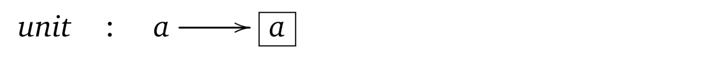
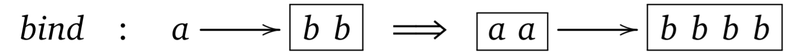

- title : Monads are not what they seem
- description : The notion of monad (in the mathematical sense) and its use in functional 
    programming has popularized category theory (a branch of abstract algebra) in programming 
    community. Many programmers believe that they now need to understand category theory in order 
    to become better functional programmers. But how do computer scientists and programmers 
    actually use the monad structure in their research narratives and in practice? 
    In this talk, I will briefly introduce monads and then discuss the different metaphors 
    that programmers use when explaining monads. I will look at the kinds of questions that 
    researchers attempt to answer with monads, but also what questions become valid (and 
    ill-formed) once we start looking at programming through the perspective of category theory. 
    Monads are an interesting topic not just because of their popularity, but because they serve 
    as a prime example of abstraction in programming - and can illustrate the strengths and 
    weaknesses of the theoretical programming language research paradigm.
- author : Tomas Petricek
- theme : white
- transition : none

****************************************************************************************************

# What we talk about when we talk about monads

 Tomas Petricek, The Alan Turing Institute  
[tomasp.net](http://tomasp.net) | [tomas@tomasp.net](mailto:tomas@tomasp.net) | [@tomaspetricek](http://twitter.com/tomaspetricek)

$$$
\definecolor{mc}{RGB}{137,64,96}
\newcommand{\mbnd}{>\!\hspace{-0.25em}>\!\hspace{-0.27em}=}

----------------------------------------------------------------------------------------------------

> A monad is just a monoid in the category  
> of endofunctors. What is the problem?

----------------------------------------------------------------------------------------------------

### What is a monad?

### _I will not give you an answer!_

----------------------------------------------------------------------------------------------------

### What do we say when we talk about monads?

### **I will add philosophical and cognitive context!**

****************************************************************************************************

# Internal history of monads

From category theory to programming

 

----------------------------------------------------------------------------------------------------

### Monads in category theory

> A _monad_ over a category $\mathcal{C}$ is a triple **$(T, \eta, \mu)$**
> where  **$T : \mathcal{C} \rightarrow \mathcal{C}~$** is a functor, **$\eta : {Id}_{\mathcal{C}} \rightarrow T$** and 
> **$\mu : T^2 \rightarrow T$** are natural transformations such that:
> 
> $$$
> \begin{array}{l}
> \mu_{A} \circ T \mu_A = \mu_{A} \circ \mu_{T A} \\
> \mu_{A} \circ \eta_{T A} = \mathit{id}_{T A} = \mu_{A} \circ T \eta_{A}
> \end{array}

----------------------------------------------------------------------------------------------------

<h3 style="margin-bottom:10px"> Monads in programming</h3>

> A _monad_ is a triple **$(M, \mathit{unit}, \mbnd)$** consisting of a type  
> constructor **$M$** and two operations of the following types:
> 
> $$$
> \begin{array}{lcl}
> \mbnd &::& M x \rightarrow (x\rightarrow M y) \rightarrow M y\\ 
> \mathit{unit} &::& x\rightarrow M x\\
> \end{array}
> 
> These operations must satisfy the following laws: 
> 
> $$$
> \begin{array}{l}
> \mathit{unit}~a~\mbnd~f ~=~ f a\\
> m~\mbnd~\mathit{unit} ~=~ m\\
> (m~\mbnd~f)~\mbnd~g ~=~ m~\mbnd~(\lambda x.f x~\mbnd~g)
> \end{array}

----------------------------------------------------------------------------------------------------

## What has changed?

#### **Purpose of monads**
Reasoning about effects _vs._ Introducing effects

 

#### **Kind of entity**
A priori knowledge _vs._ A posteriori knowledge

****************************************************************************************************

# Explaining monads

Understanding monads using metaphors

 

----------------------------------------------------------------------------------------------------

# Monads as a formal entity

#### _Monad is a data type_

 

> Data type `M a` with the two operations satisfying **monad laws**:
>
> Operation `return` has a type `a -> M a` 
> Operation `>>=` has a type `(a -> M b) -> (M a -> M b)`

 
 
 

----------------------------------------------------------------------------------------------------

# Monads as containers

#### _Monad is like a box of things_

----------------------------------------------------------------------------------------------------

# Monads as computations

#### _Monad is like a railway track_

 
 

----------------------------------------------------------------------------------------------------

# Monads as computations

#### _Monad is like a railway track_

 
 

----------------------------------------------------------------------------------------------------

# Monads as computations

#### _Monad is like a railway track_

 
 

----------------------------------------------------------------------------------------------------

# Monads as computations

#### _Monad is like a railway track_

 
 

----------------------------------------------------------------------------------------------------

## Why metaphors matter

> One of the principal results in cognitive science is that abstract concepts are typically
> understood, via metaphor, in terms of more concrete concepts.
>
> 
(Lakoff & Núñez, 2000)

----------------------------------------------------------------------------------------------------

## Embodied cognition

Metaphors link _abstract concepts_ with _bodily experience_

 - **Movement** formal symbol manipulation
 - **Inside vs. outside** for containers and boxes
 - **Movement** for composing railway tracks
 
****************************************************************************************************

# Monads in research

Reasoning about programs with monads

 

----------------------------------------------------------------------------------------------------

> This paper is about logics for reasoning about programs, 
> in particular for proving equivalence of programs.
>
> 
Moggi (1991)

----------------------------------------------------------------------------------------------------

# Origins of algebraic program laws

#### **Intuition about programming constructs**

 

${\color{mc} \mathit{if}}~\,b~{\color{mc} \mathit{then}}~\,p~{\color{mc} \mathit{else}}~p = p$

----------------------------------------------------------------------------------------------------

# Origins of monad laws

#### **Composition of morphisms in category theory**

 

$(f^\ast \circ g^\ast) \circ h = f^\ast \circ (g^\ast \circ h)$

$\mathit{unit}^\ast \circ f = f = f^\ast \circ \mathit{unit}$

----------------------------------------------------------------------------------------------------

## Reasoning about programs with monads

 - Monadic query comprehensions _(Grust, 2004)_
 - Monad laws + concrete monads _(Gibbons, Hinze, 2011)_
 - Refactoring using monad laws _(To appear... never?)_
 
----------------------------------------------------------------------------------------------------

## Algol research paradigm

> One of the goals of the Algol programme was to utilize the resources of 
> logic to increase the confidence (...) in the correctness of a program.
>
> 
(Priestley, 2011)

****************************************************************************************************

# Monads in programming

From abstractions to syntactic sugar

 

----------------------------------------------------------------------------------------------------

### Code reuse via monadic abstraction

    [lang=haskell]
    mapM :: Monad m => (a -> m b) -> [a] -> m [b]        

    
    [lang=haskell]
    mapM f x = loop x []
      where loop [] acc = return (reverse acc)
            loop (x:xs) acc = f x >>= \y. loop xs (y:acc)

  

----------------------------------------------------------------------------------------------------

### Sequencing of effects with monads

    [lang=haskell]
    main :: IO ()                

    
    [lang=haskell]
    main = do
      putStr "What is your name?"
      n <- readLn
      putStr ("Hello " ++ n)

  

----------------------------------------------------------------------------------------------------

### Non-standard computations

    let getLength url = async {
      try
        let! html = downloadAsync url
        return html.Length
      with e ->
        return 0 }

  

----------------------------------------------------------------------------------------------------

### Useful syntactic sugar

    [lang=haskell]
    sayHello :: String -> Html 

    
    [lang=haskell]
    sayHello name = H.body $ do
      H.header "Welcome"
      H.p ("Hello " ++ name)
      
  

----------------------------------------------------------------------------------------------------

## How programming concepts evolve

> Mathematics does not grow through **increase of the number of established theorems**, 
> but through _improvement_ by speculation and criticism, by the method of _proofs and 
> refutations_. 
>
> 
Lakatos (1979)

****************************************************************************************************

# How monads evolve

The nature of programming entities

 

----------------------------------------------------------------------------------------------------

## The nature of programming entities

#### _Metaphorical level_

**Intuitively understanding** concepts

#### _Technical level_

**Implementing things** in programs

#### _Formal level_

**Reasoning and proving** about programs

----------------------------------------------------------------------------------------------------

## Shifts and adaptations

**Motivation at formal level** 
Monads are logic for _reasoning about effects_

**Used differently for implementation** 
Language abstraction for _encoding effects_

**Shift at implementation level** 
Abstraction and _notation_ for effects

**Causes adaptation at metaphorical level** 
Think of monads as _railway tracks_

****************************************************************************************************

# Sociology of monads

Monads as religious objects

 

----------------------------------------------------------------------------------------------------

****************************************************************************************************

# Uses of monads

A case for wider understanding

 

----------------------------------------------------------------------------------------------------

### When monads are not the right tool

Monad is a _resource of logic_

Monads are _cool and exciting_

Monads are _discovered, not invented!_

----------------------------------------------------------------------------------------------------

### _Monad_ can be the uninteresting part

The `Par` monad for modelling parallel computations

 - Spawn a new process `spawn : Par a -> Par (IVar a)`
 - Read and write shared variables `get : IVar a -> Par a` and `put : IVar a -> a -> Par ()`

Also supports monadic `return : a -> Par a` 
and `>>= : (a -> Par b) -> (Par a -> Par b)`

----------------------------------------------------------------------------------------------------

### _Monad_ can be the uninteresting part

---------------------------------------------------------------------------------------------------

### _Monad_ as tempting harmful abstraction

`Parser a` reads input string and produces value `a`

 - Parse one thing and then another thing 
   `Parser a -> Parser b -> Parser (a * b)`

 - Try parsing in two ways, use the first success 
   `Parser a -> Parser a -> Parser a`
   

Parsers can be extended to support monadic `>>=` and `return`.

---------------------------------------------------------------------------------------------------

### _Monad_ as tempting harmful abstraction 

> The normal disadvantages of conventional [monadic] parsers,  such as
> their lack of speed and their poor error reporting are remedied.
>
> The techniques [do not] extend to monadic parsers. [T]he monadic 
> formu-lation [causes] the evaluation of the parser construction over and over (...).
>
> 
Swierstra & Duponcheel (1996)

---------------------------------------------------------------------------------------------------

### _Monad_ as the wrong structure

> Wadge proposed that the semantics of the dataflow language Lucid (...), could be structured
> by a monad. 
> 
> Ten years later, Uustalu and Vene gave a semantics for Lucid in
> terms of a comonad, and stated that "dataflow cannot be structured with
> monads".
>
> 
Orchard (2012)

----------------------------------------------------------------------------------------------------

### _Monad_ as the wrong structure

 - Has the **right type** of join operation
 - Does not **provide plumbing**

  

    [lang=haskell]
    latest : Stream (Stream a) -> Stream a

****************************************************************************************************

# Conclusions

What we talk about when we talk about monads

 

----------------------------------------------------------------------------------------------------

### What we talk about when we talk about monads

Strong roots in the _Algol paradigm_

**Meaning evolves** at three levels

_Metaphors_ are a fundamental part

 
 
 

Tomas Petricek, The Alan Turing Institute 
[tomasp.net](http://tomasp.net) | [tomas@tomasp.net](mailto:tomas@tomasp.net) | [@tomaspetricek](http://twitter.com/tomaspetricek)

