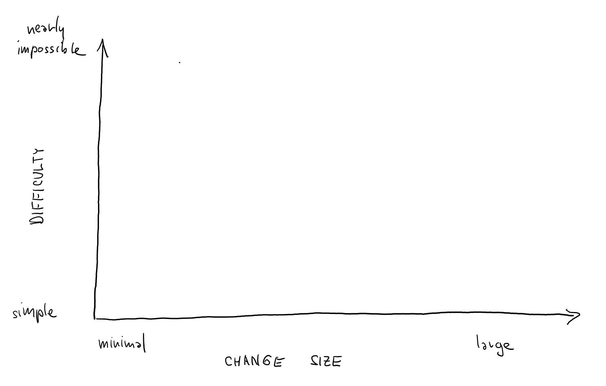
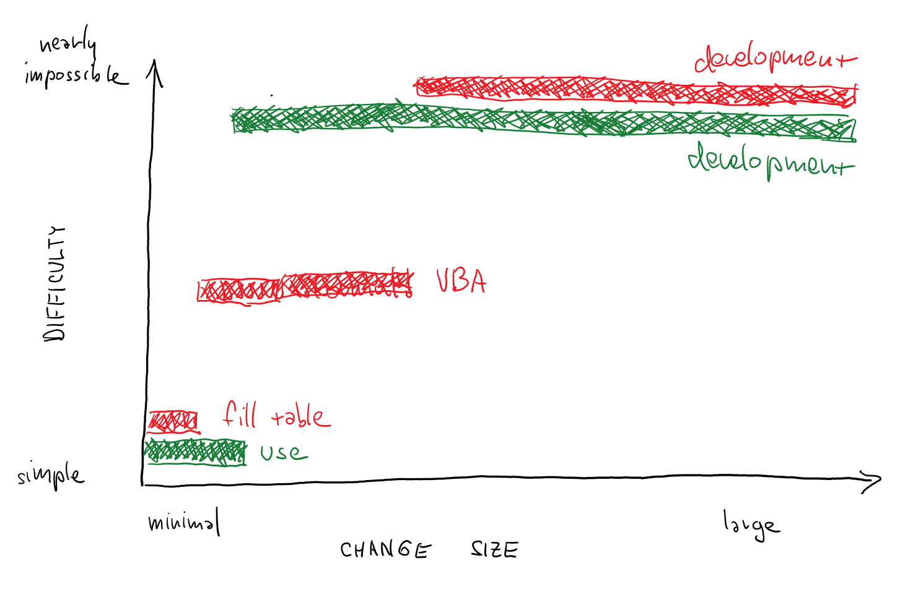
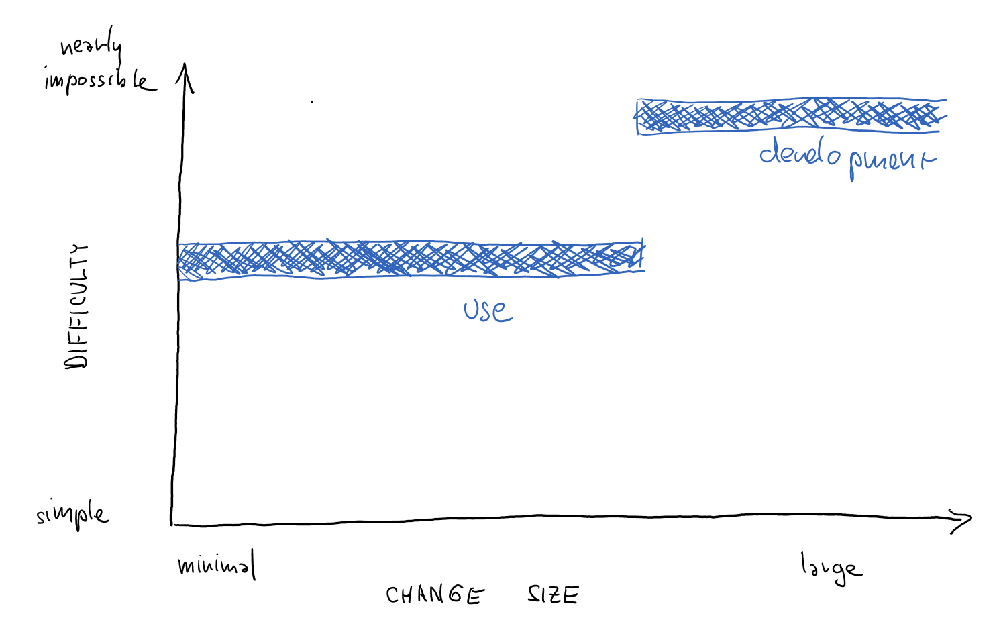

- title : Critique - An anatomy of interaction: Co-occurrences and entanglements 
- description : 
- author : Tomas Petricek
- theme : white
- transition : none

****************************************************************************************************

## An anatomy of interaction: Co-occurrences and entanglements (Basman, Tchernavskij, Bates & Beaudouin-Lafon)

    

Tomas Petricek 
[tomasp.net](http://tomasp.net) | [tomas@tomasp.net](mailto:tomas@tomasp.net) | [@tomaspetricek](http://twitter.com/tomaspetricek)

****************************************************************************************************

## Enabling active participation

----------------------------------------------------------------------------------------------------

## _Making creation simpler_

_TOMAS_: How do we tell what is simpler?

_ANTRANIG_: We just know. Don't be silly!

_TOMAS_: But how do we sensibly talk about it?

----------------------------------------------------------------------------------------------------

## _Substrate complexity map_

----------------------------------------------------------------------------------------------------

----------------------------------------------------------------------------------------------------

----------------------------------------------------------------------------------------------------

----------------------------------------------------------------------------------------------------

----------------------------------------------------------------------------------------------------

****************************************************************************************************

## Open systems 

----------------------------------------------------------------------------------------------------

#### _Closed system_
Separates low level and high level

High level open to simple modification

 

#### _Open system_

Can be modified within itself, i.e. Smalltalk 

Does it need to be written within itself?

  

----------------------------------------------------------------------------------------------------

## _How simple can open system be?_

_Turing completeness_ 
Given some elementary power, we can encode 
everything, but inherit certain problems.

_Open system-ness?_ 
Minimal complexity required to make open system?

----------------------------------------------------------------------------------------------------

----------------------------------------------------------------------------------------------------

****************************************************************************************************

## Metaphors in programming

----------------------------------------------------------------------------------------------------

# _Three levels of programming concepts_

 - Metaphorical intuitive level
 - Technical source code level
 - Formal reasoning level

  

(See "What we talk about when we talk about monads")
 
----------------------------------------------------------------------------------------------------

## Metaphorical level

----------------------------------------------------------------------------------------------------

## _Metaphors in the paper_

 - Chemical elements and reactions
 - Quantum physics
 - Cooking and recipes
 
----------------------------------------------------------------------------------------------------

#### _Methodological_
How do we know it's a good metaphor? What can we do with them?

 

#### _Practical_
Use multiple metaphors to program one thing?

----------------------------------------------------------------------------------------------------

## Formal and source code level

----------------------------------------------------------------------------------------------------

## _Related work_

Several related closed abstractions

Is there a path to make them open?

----------------------------------------------------------------------------------------------------

# _Join calculus_

Introduced as formal _chemical machine_

 

----------------------------------------------------------------------------------------------------

# _Eve language_

Logical roots and _pattern matching_

 

----------------------------------------------------------------------------------------------------

# Can we make those open?

#### _Technically_
Make it possible to modify the "source code"

#### _Simplicity_
Make "source code" simpler and provide tools

#### _Politically_
A way to bootstrap the community and tools

****************************************************************************************************

## _Summary_

- _Simplicity_ and enabling active participation
- _Open systems_ and their limits
- _Metaphors_ as a useful programming tool

 
 
 

Tomas Petricek | [tomas@tomasp.net](mailto:tomas@tomasp.net) | [@tomaspetricek](http://twitter.com/tomaspetricek)
