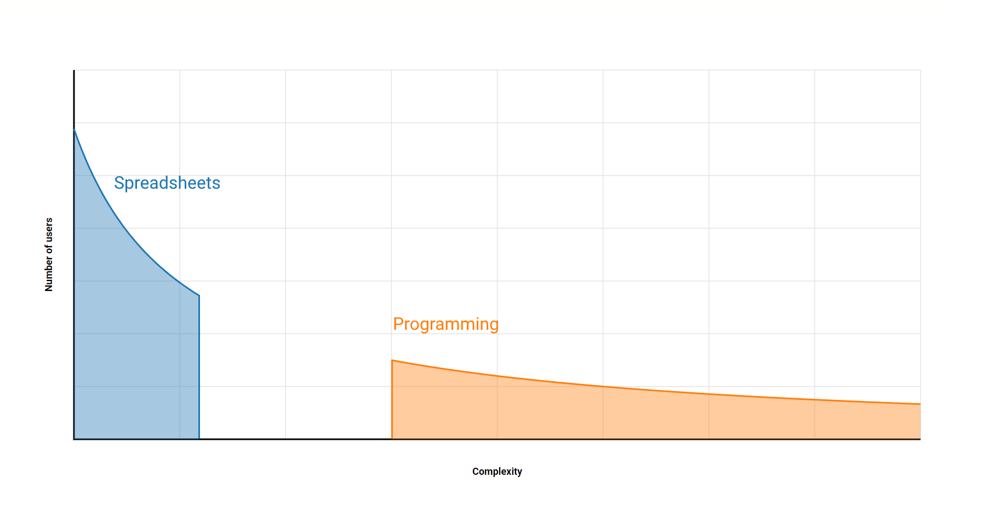
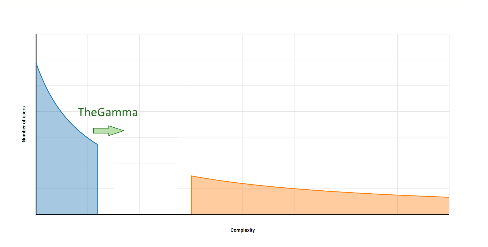

- title : Data exploration through dot-driven development 
- description : 
- author : Tomas Petricek
- theme : white
- transition : none

***************************************************************************************************

# Teaching old type systems<br/> new tricks with type providers

<br /><br /><br /><br /><br />

#### Tomas Petricek

_The Alan Turing Institute, London<br />
[http://tomasp.net](http://tomasp.net) |
[tomas@tomasp.net](mailto:tomas@tomasp.net) | 
[@tomaspetricek](http://twitter.com/tomaspetricek)_

***************************************************************************************************

<div class="sec">

# DATA SCIENCE

</div>

---------------------------------------------------------------------------------------------------


---------------------------------------------------------------------------------------------------

# DEMO<br />_Open, reproducible data visualizations_

---------------------------------------------------------------------------------------------------

### Tooling for data science 

_The gap between spreadsheets and programming_



---------------------------------------------------------------------------------------------------

### Tooling for data science 

_Making programming languages a bit easier_


---------------------------------------------------------------------------------------------------

### Tooling for data science 

_Learning from spreadsheet interaction model_



---------------------------------------------------------------------------------------------------

### Reading data

_Unsafe dynamic access in a typed language_

<div style="padding-top:20px">

    [lang=csharp]
    var url = "http://dvd.netflix.com/Top100RSS";
    var rss = XDocument.Load(topRssFeed);
    var channel = rss.Element("rss").Element("channel");

    foreach(var item in channel.Elements("item")) {    
      Console.WriteLine(item.Element("text").Value);
    }

</div>
<div class="fragment">
  <div class="tipbox" style="left:512px;top:-100px;width:84px;height:25px"></div>
  <div class="tiplbl" style="left:550px;top:-85px">Not found!</div>
</div>

---------------------------------------------------------------------------------------------------

### Reading data

_Unsafe dynamic access in a typed language_

<div style="padding-top:20px">

    [lang=csharp]
    var url = "http://dvd.netflix.com/Top100RSS";
    var rss = XDocument.Load(topRssFeed);
    var channel = rss.Element("rss").Element("channel");

    foreach(var item in channel.Elements("item")) {    
      Console.WriteLine(item.Element("title").Value);
    }

</div>
<div>
  <div class="tipbox" style="left:512px;top:-100px;width:98px;height:25px"></div>
  <br />
</div>

---------------------------------------------------------------------------------------------------

### Reading data

_Accessing data from external data sources_

<div class="fragment narrow" style="padding:20px 0px 105px 0px;">
<p><i class="fa fa-file-excel-o"></i> <em>Languages do not understand data</em></p>
<p><i class="fa fa-tags"></i> <em>There is rarely explicit schema</em></p>
<p><i class="fa fa-code"></i> <em>Manually define types to caputre it</em></p>
<p><i class="fa fa-wrench"></i> <em>Easier in dynamic languages</em></p>
</div>


---------------------------------------------------------------------------------------------------

### Aggregating data

_Athletes by number of gold medals from Rio 2016_

<div style="padding:40px 0px 60px 0px">

```
olympics = pd.read_csv("olympics.csv")
olympics[olympics["Games"] == "Rio (2016)"]
  .groupby("Athlete")
  .agg({"Gold": sum})
  .sort_values(by="Gold", ascending=False)
  .head(8)
```

</div>
<div class="fragment">
  <div class="tipbox" style="left:365px;top:-289px;width:200px;height:25px"></div>
  <div class="tiplbl" style="left:460px;top:-380px">Unknown file</div>
  <div class="tipbox" style="left:296px;top:-246px;width:90px;height:25px"></div>
  <div class="tiplbl" style="left:320px;top:-240px">Column name</div>
</div>

---------------------------------------------------------------------------------------------------

### Aggregating data

_Language and data source features you need to know_

<div class="fragment narrow" style="padding:20px 0px 105px 0px;">
<p><i class="fa fa-book"></i> <em>Python dictionaries <code>{"key": value}</code></em></p>
<p><i class="fa fa-eye"></i> <em>Generalised indexers <code>.[ condition ]</code></em></p>
<p><i class="fa fa-university"></i> <em>Operation names <code>sort_values</code></em></p>
<p><i class="fa fa-database"></i> <em>Data column names <code>"Athlete"</code></em></p>
</div>

***************************************************************************************************

<div class="sec">

# TYPE PROVIDERS

</div>

---------------------------------------------------------------------------------------------------

<div class="bigeq">

$\emptyset \vdash e : \tau$

</div>


---------------------------------------------------------------------------------------------------

<div class="bigeq bigeq2">

$\pi(~~~~~~~) \vdash e : \tau$


</div>

---------------------------------------------------------------------------------------------------

# DEMO<br />_Reading data from an RSS feed_

---------------------------------------------------------------------------------------------------

### F# Data library

_Type providers for structured data_

<div class="fragment narrow" style="padding:20px 0px 105px 0px;">
<p><i class="fa fa-adjust"></i> <em>Structural shape inference</em></p>
<p><i class="fa fa-sitemap"></i> <em>Language integration via type providers</em></p>
<p><i class="fa fa-bomb"></i> <em>Relative type safety</em></p>
</div>

---------------------------------------------------------------------------------------------------

<div class="diagram1">
<p>
  <span>{title&nbsp;:&nbsp;string,&nbsp;author&nbsp;:&nbsp;{age&nbsp;:&nbsp;int}}</span>
  <span style="margin-left:50px">{author&nbsp;:&nbsp;{age&nbsp;:&nbsp;float}}</span>
</p>  
<div class="fragment">
<p><span style="position:relative;top:55px;left:72px" class="arrow-down"></span></p>
<p>
  <span style="position:relative;top:30px;left:40px">{&nbsp;title&nbsp;:&nbsp;option&lt;string&gt;,
    &nbsp;author&nbsp;:&nbsp;{age&nbsp;:&nbsp;float}&nbsp;}</span>
</p>  
</div>
</div>

---------------------------------------------------------------------------------------------------

<div class="diagram2">
<p>
  <span>{&nbsp;coordinates&nbsp;:&nbsp;{lng:num,&nbsp;lat:num}&nbsp;}</span>
  <span style="margin-left:50px">string</span>
</p>  
<div class="fragment">
<p><span style="position:relative;top:55px;left:200px" class="arrow-down"></span></p>
<p>
  <span style="position:relative;left:70px;top:30px">
  {&nbsp;coordinates&nbsp;:&nbsp;{lng:num,&nbsp;lat:num}&nbsp;}&nbsp;+&nbsp;string&nbsp;</span>
</p>  
</div>
</div>

---------------------------------------------------------------------------------------------------

### Shape inference

_Pragmatic design choices for usability_

<div class="fragment narrow" style="padding:20px 0px 105px 0px;">
<p><i class="fa fa-wrench"></i> <em>Prefers records for tooling</em></p>
<p><i class="fa fa-clock-o"></i> <em>Predictable and stable</em></p>
<p><i class="fa fa-globe"></i> <em>Open world assumption about sums</em></p>
</div>

---------------------------------------------------------------------------------------------------

# DEMO<br />_Aggregating Olympic medalists_

---------------------------------------------------------------------------------------------------

### Dot-driven development

_Encoding complex logic via simple member access_

<div class="fragment narrow" style="padding:20px 0px 105px 0px;">
<p><i class="fa fa-cog"></i> <em>Type providers for member generation</em></p>
<p><i class="fa fa-pagelines"></i> <em>Laziness for scaling to large hierarchies</em></p>
<p><i class="fa fa-rocket"></i> <em>Fancy types for the masses!</em></p>
</div>

---------------------------------------------------------------------------------------------------

### _Row types and phantom types_

<br /><div>

**Row types to track names and types of fields**

<div style="padding:10px 0px 30px 0px;position:relative;left:-90px;transform:scale(0.8)">

$$$
\definecolor{cc}{RGB}{204,82,34}
\definecolor{mc}{RGB}{0,0,153}
\frac
  {\Gamma \vdash e : {\color{cc}[f_1:\tau_1, \ldots, f_n:\tau_n]}}
  {\Gamma \vdash e.\text{drop}~f_i : {\color{cc} [f_1:\tau_1, \ldots, f_{i-1}:\tau_{i-1}, f_{i+1}:\tau_{i+1}, \ldots, f_n:\tau_n]}}

</div></div><div class="fragment">

**Embed row types in provided nominal types**

<div style="padding:0px 0px 30px 0px;position:relative;left:-90px;transform:scale(0.8)">

$$$
\frac
  {\Gamma \vdash e : {\color{mc} C_1}}
  {\Gamma \vdash e.\text{drop}~f_i : {\color{mc} C_2}}
\quad{\small \text{where}}

$$$
\begin{array}{l}
\\[-0.5em]
{fields({\color{mc} C_1}) = {\color{mc} \{f_1:\tau_1, \ldots, f_n:\tau_n\}}}\\
{fields({\color{mc} C_2}) = {\color{mc} \{f_1:\tau_1, \ldots, f_{i-1}:\tau_{i-1}, f_{i+1}:\tau_{i+1}, \ldots, f_n:\tau_n\}}}
\end{array}

</div></div>

---------------------------------------------------------------------------------------------------

### Fancy types for the masses!

_Powerful idea that works in other contexts_

<div class="fragment narrow" style="padding:20px 0px 105px 0px;">
<p><i class="fa fa-table"></i> <em>Row types and phantom types</em></p>
<p><i class="fa fa-phone"></i> <em>Session types for communication</em></p>
<p><i class="fa fa-question"></i> <em>Add your own fancy type here!</em></p>
</div>


***************************************************************************************************

<div class="sec">

# BEHIND THE SCENES

</div>

---------------------------------------------------------------------------------------------------

### Structure of a type provider

<br /><div class="fragment">

_Context $L$ maps names to definitions and nested contexts_

<div style="padding:10px 0px 50px 60px">

$
L(C) = {\color{mc}\text{type}}~C(x:\tau) = \overline{m}, L'
$

</div></div><div class="fragment">

_Pivot provider takes schema and provides a class with context_

<div style="padding:10px 0px 50px 60px">

$
\text{pivot}(F) = C, L
$

</div></div>

---------------------------------------------------------------------------------------------------

# DEMO<br />_Fancy types in action_

---------------------------------------------------------------------------------------------------

### Pivot type provider

_Generate classes that drop individual columns_

<div style="padding:0px 0px 0px 0px">

</div>

---------------------------------------------------------------------------------------------------

### JSON type provider

_Generate class corresponding to a record shape_

<div style="padding:0px 0px 0px 0px">

</div>

---------------------------------------------------------------------------------------------------

### Relative type safety

<br />

_Well typed programs do not go wrong._

<div class="fragment">

<p><em style="color:#a00020">(As long as the world is well-behaved.)</em></p>

</div>

---------------------------------------------------------------------------------------------------

### F# Data and safety

<style>.reveal .math p em { font-style:italic; }</style>
<div style="margin-top:70px" class="math">

Given _representative samples_ and _an input_ value

$S(d)\sqsubset S(d_1, \ldots, d_n)$

</div><div class="fragment" style="margin-top:70px">

Any _program_ written using a _type provider_ reduces

$e_{user}[x\leftarrow {\color{mc}\text{new}}~C(d)] \rightsquigarrow^* v$

</div>

---------------------------------------------------------------------------------------------------

# DEMO<br />_Handling schema change and errors_

---------------------------------------------------------------------------------------------------

### F# Data and schema change

_Provided type can change only in limited ways_

<br />
<div class="fragment">

$C[e] \rightarrow C[e.M]$

$C[e] \rightarrow C[{\sf match}~e~{\sf with}~\ldots]$

$C[e] \rightarrow C[int(e)]$

</div>
<br />

***************************************************************************************************

<div class="sec">

# SUMMARY

</div>

---------------------------------------------------------------------------------------------------

### Future work

_Making programming with data easier_

<div class="fragment narrow" style="padding:20px 0px 105px 0px;">
<p><i class="fa fa-table"></i> <em>Learning from spreadsheets</em></p>
<p><i class="fa fa-user"></i> <em>Understanding programmer interactions</em></p>
<p><i class="fa fa-cogs"></i> <em>Handling joins and data cleaning</em></p>
<p><i class="fa fa-pie-chart"></i> <em>Read, analyse and visualize!</em></p>
</div>

---------------------------------------------------------------------------------------------------

# DEMO<br />_Learning from spreadhseets_

---------------------------------------------------------------------------------------------------

# Thank you!

<h2 style="font-size:28pt"><em>Teaching old type systems new tricks with type providers</em></h2>
<style type="text/css">.final strong { width:234px; display:inline-block; } .final p { margin:0px 0px 5px 0px; }</style>
<div class="final">

**Dot-driven** _Towards minimal calculus of interactions_

**Fancy types** _Encoding row types via type providers_

**Relative safety** _Necessity when working with data_


</div> 
<br /><br />

Tomas Petricek

_<i class="fa fa-envelope"></i> [tomas@tomasp.net](mailto:tomas@tomasp.net) | [@tomaspetricek](http://twitter.com/tomaspetricek) | [tomasp.net/academic](http://tomasp.net)<br/>
<i class="fa fa-globe"></i> [thegamma.net](http://thegamma.net) | [fslab.org](http://fslab.org) | [gamma.turing.ac.uk](gamma.turing.ac.uk)_

---------------------------------------------------------------------------------------------------

## References

_Don Syme, Keith Battocchi, Kenji Takeda, Donna Malayeri and Tomas Petricek. 
   **Themes in Information-Rich Functional Programming for Internet-Scale Data Sources**. In proceedings of DDFP 2013_

_Tomas Petricek, Gustavo Guerra and Don Syme. 
   **Types from data: Making structured data first-class citizens in F#**.  PLDI 2016_

_Tomas Petricek. **Data exploration through dot-driven development**. In proceedings of ECOOP 2017_