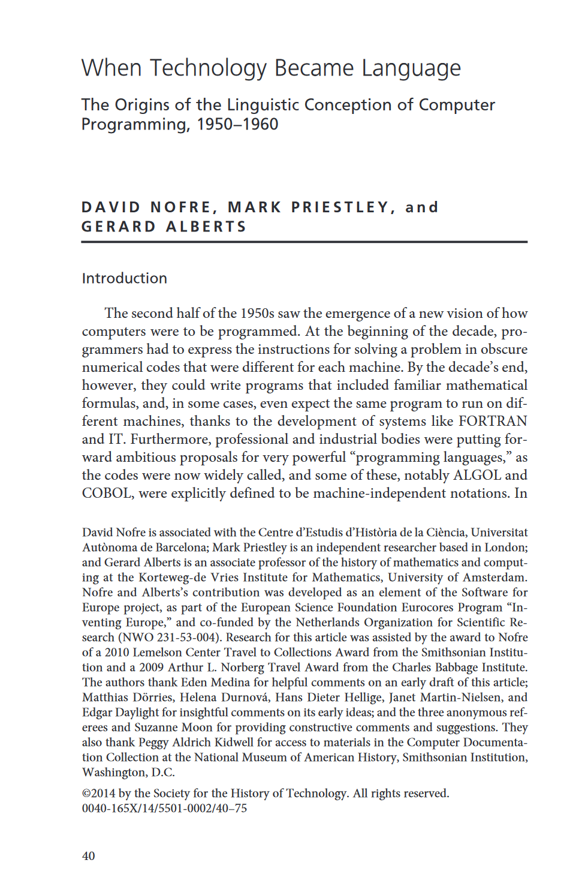
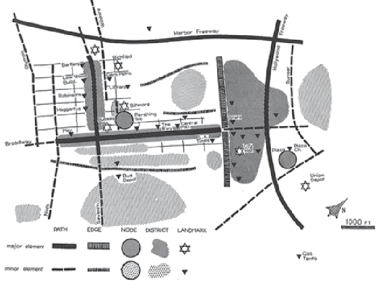
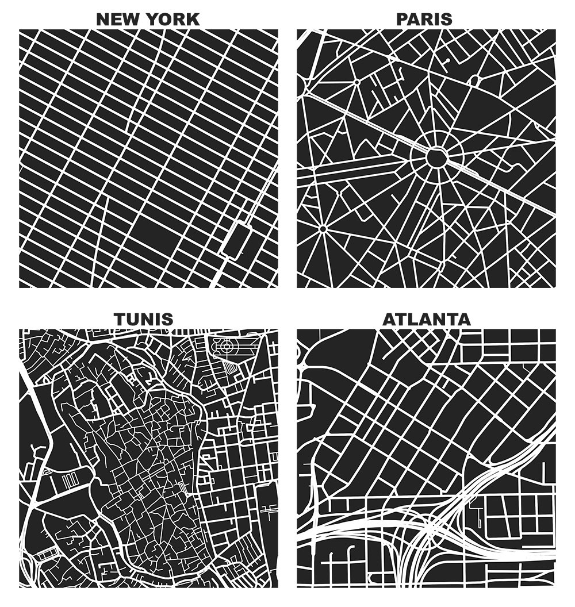

- title : Programming languages as a design problem
- description : Programming languages as a design problem
- author : Tomas Petricek
- theme : simple
- transition : none

****************************************************************************************************

# Programming languages as a design problem

      

**Tomas Petricek**

University of Kent 
[tomas@tomasp.net](mailto:tomas@tomasp.net) | [@tomaspetricek](http://twitter.com/tomaspetricek)

----------------------------------------------------------------------------------------------------

**Programming languages**

_As formal languages_

Metaphor determines  
what questions we ask

_Syntax, semantics,  
formal properties_

----------------------------------------------------------------------------------------------------

**Software engineering**

_Structured activity_

Metaphor determines  
questions we ask

_Reliability, safety  
Development process_

----------------------------------------------------------------------------------------------------

**Architecture and  
urban planning**

_Design problem_

Metaphor determines  
what questions we ask

_Dealing with complexity, evolution in time_

****************************************************************************************************
- class: part

# _Motivation_
## Is software like cities?

----------------------------------------------------------------------------------------------------

# _Kinds of complexity_

**Parnas on strategic defence**

 - _Analog systems_
 - _Repetitive digital systems_
 - _Non-repetitive digital systems_

**Modelling via code and tests**

 - _Problems of simplicity_
 - _Unorganized complexity_
 - _Organized complexity_

----------------------------------------------------------------------------------------------------

**Gradual development**

_Large computing systems are products of evolutio- nary development (...);
they became reliable through a process of slow testing and adaptation to an operational environment_

_(Weizenbaum on SDI)_

----------------------------------------------------------------------------------------------------

**Christopher Alexander**

_Things that are good have a certain structure. You can't get that except dynamically._

_In nature you've got continuous very-small-feedback-loop (...), which   
is why things get to be harmonious._

----------------------------------------------------------------------------------------------------

# _Beautiful theories_

**Radiant garden city beautiful**

 - _Le Corbusier's Ville Radieuse_
 - _Garden Cities in the UK_
 - _American City Beautiful_

**Programming languages**

 - _Simplified formal models_
 - _Object-oriented programming_
 - _Agile development methodology_

****************************************************************************************************
- class: part

# _Methodologies_
## Learning from urban planning and architecture

----------------------------------------------------------------------------------------------------

# _1. What actually works_

**The case of cities**

 - _Sidewalk life in Greenwich Village_
 - _Unslumming in North End_
 - _Why does it work?_

**The case of programming**

 - _R and JavaScript languages_
 - _No information hiding in MIDI_
 - _Ethnography done in HCI_

----------------------------------------------------------------------------------------------------

# _1. Peter Naur_

_It is curious how authors, who in the formal aspects of their work require
painstaking demonstration and proof, in the informal aspects are satisfied
with subjective claims that have not the slightest support, neither in argument
nor in verifiable evidence._

The Place of Strictly Defined  
Notation in Human Insight

----------------------------------------------------------------------------------------------------

# _2. How buildings evolve_

_[Almost all buildings are] designed not to adapt; also budgeted and financed not to,
constructed not to, administered not to, maintained not to, regulated and taxed not to,
even remodelled not to._

_But all buildings (...) adapt anyway, however poorly, because the usages in and around them are changing constantly._

----------------------------------------------------------------------------------------------------

# _2. How software evolves_

**How software evolves?**

 - _Separation of concerns_
 - _Know all usages?_
 - _Usages will change_

**Simondon's concretization**

 - _Parts with clear functions_
 - _Process of concretization_
 - _Functions get intermixed_

----------------------------------------------------------------------------------------------------

**3. Navigating through a city**

A pleasant city is legible

_[A legible city is] one whose districts or landmarks or pathways are easily identifiable
and are easily grouped into an overall pattern._

----------------------------------------------------------------------------------------------------

# _3. Navigating through a city_

**What makes city legible?**

 - Distinguishable districts
 - Visible landmarks
 - Paths and edges

**What makes code legible?**

 - How people navigate?
 - Path of program execution
 - Linking definitions to usage

****************************************************************************************************
- class: part

# _Ideas_
## Building software like cities

----------------------------------------------------------------------------------------------------

# _1. Adaptable software_
## Teaching good maintenance habits

_<i class="fa fa-wrench"></i>_ New buildings teach bad maintenance habits

_<i class="fa fa-building"></i>_ Once built, owners stop paying attention

_<i class="fa fa-cloud"></i>_ Chaos engineering in cloud systems

_<i class="fa fa-toolbox"></i>_ Build parts that will have to be replaced soon?

----------------------------------------------------------------------------------------------------

**1. Building materials**

Tale of vinyl siding

_Materials that look bad before they act bad_

_Problems with traditional materials are well understood_

----------------------------------------------------------------------------------------------------

# _2. Vernacular design method_

**Unself-conscious design**

 - _Christopher Alexander_
 - _Musgum mud huts_
 - _Develops by gradual adaptation_

**Self-conscious design**

 - _Design to satisfy requirements_
 - _Requires full understanding_
 - _Keeps reinventing form_

----------------------------------------------------------------------------------------------------

**Vernacular design method**

Can we build software without reinventing form?

_Buying and reconfiguring existing systems?_

----------------------------------------------------------------------------------------------------

# _3. Dealing with complexity_

**Jacobs on understanding cities**

 1. to think about processes
 2. to work inductively
 3. to seek for 'unaverage' clues

**Understanding software**

 - Non-reductionist view?
 - Look at unexpected cases?
 - Not proofs but illustrations?

****************************************************************************************************
- class: part

# _Conclusions_
## Building software like cities

----------------------------------------------------------------------------------------------------

 

**Programming** _as designing and intervening in complex systems that cannot be fully understood_

**Mathematical** _reductionism via statistics or logic cannot talk about all that matters_

----------------------------------------------------------------------------------------------------

# _Conclusions_

**Programming languages as a design problem**

 - Useful methodologies to follow    
   _What actually works? How software evolves?_
 - Concrete ideas about planning    
   _Design for adaptability? Avoid reinventing forms?_

  

**Tomas Petricek**, University of Kent 
[tomas@tomasp.net](mailto:tomas@tomasp.net) | [@tomaspetricek](http://twitter.com/tomaspetricek)
