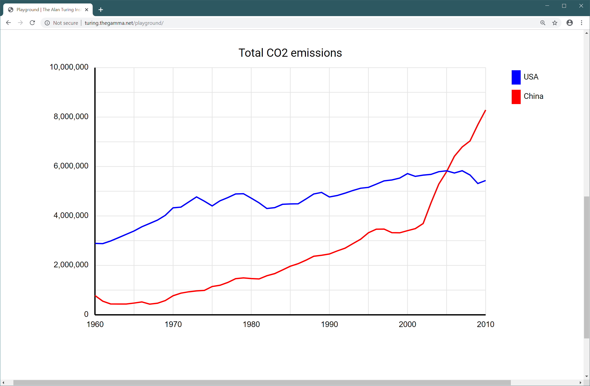
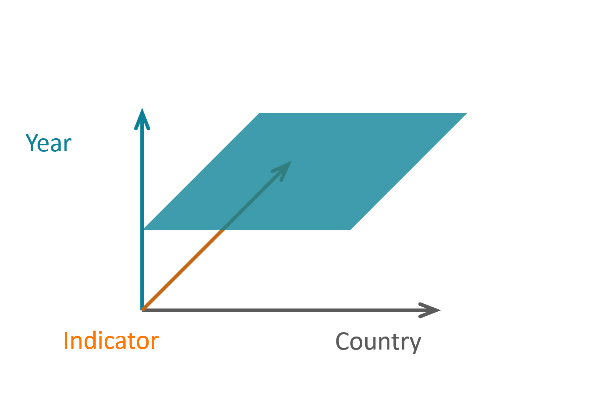
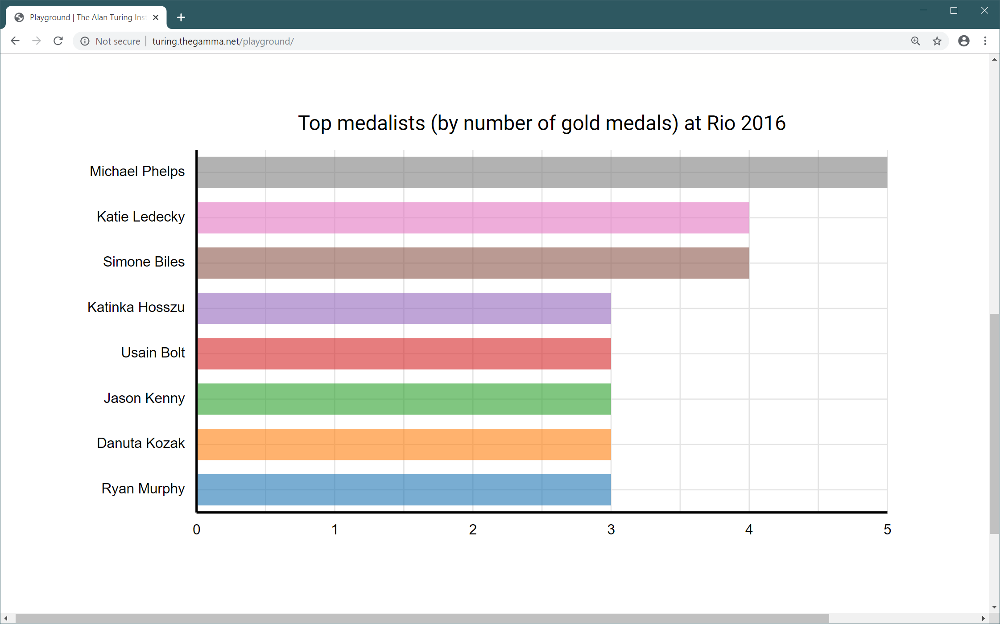
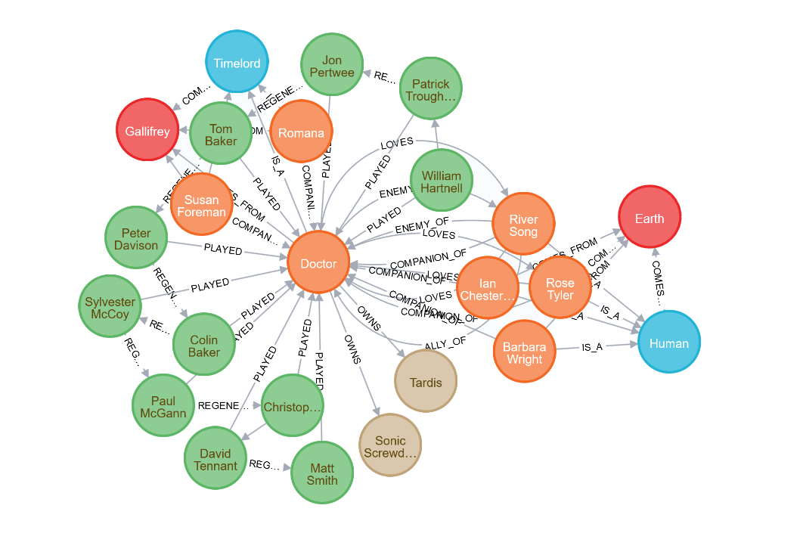
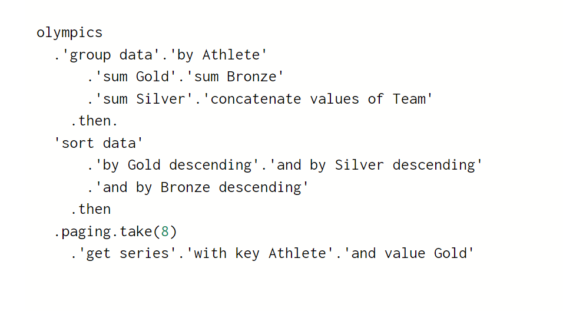

- title : The Gamma - Towards dot-driven data exploration
- description : The Gamma - Towards dot-driven data exploration
- author : Tomas Petricek
- theme : simple
- transition : none

****************************************************************************************************

# _The Gamma <span style="padding:10px">&</span> Histogram_
## Towards dot-driven data exploration

<br /><br /><br /><br /><br /><br />

**Tomas Petricek**

University of Kent<br />
[tomas@tomasp.net](mailto:tomas@tomasp.net) | [@tomaspetricek](http://twitter.com/tomaspetricek)

****************************************************************************************************
- class: part

# _Motivation_
## Data journalism practice

---------------------------------------------------------------------------------------------------


**Motivation**

_Open data analyses published by journalists_

----------------------------------------------------------------------------------------------------

<div style="background:black;position:absolute;width:200%;right:51%;height:400%;top:-100%;z-index:-1000;"></div>
<table style="width:100%"><tr><td style="width:50%;padding:0px" class="white">

### Spreadsheets

_<i class="fa fa-birthday-cake"></i> Easy to use_

_<i class="fa fa-table"></i> Simple problems_

_<i class="fa fa-redo-alt"></i> Not reproducible_

</td><td style="width:50%;padding:0px" class="fragment">

### Programming

_<i class="fa fa-university"></i> Expert skills_

_<i class="fa fa-globe"></i> Internet-scale_

_<i class="fa fa-code"></i> Reproducible_

</td></tr></table>

****************************************************************************************************
- class: part

# _Design principles_
## Dot-driven development by example

----------------------------------------------------------------------------------------------------

# _Design principles_
## Dot-driven data exploration

_<i class="fa fa-gavel"></i>_ Work with concrete, not abstract

_<i class="fa fa-code"></i>_ Record interactions to enable learning

_<i class="fa fa-cubes"></i>_ Make simple things easy

_<i class="fa fa-list"></i>_ Choosing over constructing

----------------------------------------------------------------------------------------------------



**DEMO**  
_Comparing CO2 emissions of China and US_

----------------------------------------------------------------------------------------------------


Ways of slicing data cubes

----------------------------------------------------------------------------------------------------



Ways of slicing data cubes

_Select a year_

_Plane with indicators for countries_

----------------------------------------------------------------------------------------------------


Ways of slicing data cubes

_Select a year_

_Select indicator_

_Line with value for each country_

----------------------------------------------------------------------------------------------------


Ways of slicing data cubes

_Select a year_

_Select indicator_

_Select country_

_Data point_

----------------------------------------------------------------------------------------------------



**DEMO**  
_Aggregating table of Olympic medal winners_

----------------------------------------------------------------------------------------------------


Wrapper over an SQL-like query language

_Offer meaningful options in a given context_  
_Joins are an interesting open problem_

----------------------------------------------------------------------------------------------------


**DEMO**  
_Querying the  
Dr Who graph database_

----------------------------------------------------------------------------------------------------



Querying graph databases

<div style="width:400px;overflow:hidden;position:relative;left:-40px">

```text
START a=node(1)
MATCH
  (a)-[:ALLY_OF]->(b)
     -[:APPEARED_IN]->(c)
RETURN b, c
```

</div>

----------------------------------------------------------------------------------------------------

# _Dot-driven development_
## Experimenting with a design principle

_<i class="fa fa-list"></i>_ All is done by choosing from a list

_<i class="fa fa-birthday-cake"></i>_ Does this make programming easier?

_<i class="fa fa-code"></i>_ Very different query languages underneath

_<i class="fa fa-brain"></i>_ Does knowledge of one transfer to another?

****************************************************************************************************
- class: part

# _Next steps_
## How to get closer to spreadsheets

----------------------------------------------------------------------------------------------------

# _Next steps_
## What can we learn from spreadsheets

_<i class="fa fa-user-ninja"></i>_ Interaction with the system matters

_<i class="fa fa-table"></i>_ Programming as interacting with data

_<i class="fa fa-hand-point-right"></i>_ Direct manipulation for program construction

_<i class="fa fa-file"></i>_ How to publish ideas on interaction?

----------------------------------------------------------------------------------------------------


**DEMO**  
_Histogram  
(Live 2019)_

****************************************************************************************************
- class: part

# _Dirty tricks_
## And crimes committed along the way

----------------------------------------------------------------------------------------------------

# _Dirty tricks_
## And crimes committed along the way

_<i class="fa fa-cog"></i>_ Type providers to hide fancy types

_<i class="fa fa-cog"></i>_ Reinventing scope with 'then'

_<i class="fa fa-cog"></i>_ I also need some lambdas sometimes!

_<i class="fa fa-cog"></i>_ Generating builder patterns

----------------------------------------------------------------------------------------------------



**Linearization**

Write everything as a single linear chain

_Except that 'then' is reinventing parenthesis_

_But it is second class construct..._

----------------------------------------------------------------------------------------------------

# _Type providers_
## Encoding complex logic via member access

_<i class="fa fa-cog"></i>_ Type providers for member generation

_<i class="fa fa-history"></i>_ Laziness for scaling to large hierarchies

_<i class="fa fa-rocket"></i>_ Fancy types for the masses!

---------------------------------------------------------------------------------------------------

## _Row types to track schema_

<div style="padding:0px 0px 30px 0px;position:relative;top:-50px;left:-120px;transform:scale(0.6)">

$$$
\definecolor{cc}{RGB}{204,82,34}
\definecolor{mc}{RGB}{0,0,153}
\frac
  {\Gamma \vdash e : {\color{cc}[f_1:\tau_1, \ldots, f_n:\tau_n]}}
  {\Gamma \vdash e.\text{drop}~f_i : {\color{cc} [f_1:\tau_1, \ldots, f_{i-1}:\tau_{i-1}, f_{i+1}:\tau_{i+1}, \ldots, f_n:\tau_n]}}

</div><div class="fragment" style="position:relative;top:-40px;">

## _Embed row types in nominal types_

<div style="top:-100px;padding:0px 0px 30px 0px;position:relative;left:-120px;transform:scale(0.6)">

$$$
\frac
  {\Gamma \vdash e : {\color{mc} C_1}}
  {\Gamma \vdash e.\text{drop}~f_i : {\color{mc} C_2}}
\quad{\small \text{where}}

$$$
\begin{array}{l}
\\[-0.5em]
{fields({\color{mc} C_1}) = {\color{mc} \{f_1:\tau_1, \ldots, f_n:\tau_n\}}}\\
{fields({\color{mc} C_2}) = {\color{mc} \{f_1:\tau_1, \ldots, f_{i-1}:\tau_{i-1}, f_{i+1}:\tau_{i+1}, \ldots, f_n:\tau_n\}}}
\end{array}

</div></div>

---------------------------------------------------------------------------------------------------

# _Type providers_
## Fancy types for the masses!

_<i class="fa fa-table"></i>_ Row types and phantom types

_<i class="fa fa-phone"></i>_ Session types for communication

_<i class="fa fa-question"></i>_ Add your own fancy type here!

---------------------------------------------------------------------------------------------------

# _Structure of a type provider_

_Context $L$ maps names to  
definitions and nested contexts_

<div style="padding:10px 0px 50px 60px">

$
L(C) = {\color{mc}\text{type}}~C(x:\tau) = \overline{m}, L'
$

</div><div class="fragment">

_Pivot provider takes schema and  
provides a class with context_

<div style="padding:10px 0px 50px 60px">

$
\text{pivot}(F) = C, L
$

</div></div>

---------------------------------------------------------------------------------------------------

# _Pivot type provider_
## Generate classes that drop individual columns

<div style="padding:0px 0px 0px 0px">

</div>

****************************************************************************************************
- class: part

# _Summary_
## Investigating programming

----------------------------------------------------------------------------------------------------

# Conclusions

## Towards dot-driven data exploration

<div style="margin-top:-30px;padding:0px 0px 20px 40px">

 - _Exploring an interesting design principle_
 - _Using a wide range of case studies_
 - _Can prove and evaluate a few things_
 - _Am I making falsifiable claims?_

</div>

TheGamma: _[thegamma.net](http://thegamma.net)_  
Demos: _[turing.thegamma.net](http://turing.thegamma.net)_  
Histogram: _[tomasp.net/histogram](http://tomasp.net/histogram)_

**Tomas Petricek**, [tomas@tomasp.net](mailto:tomas@tomasp.net)
