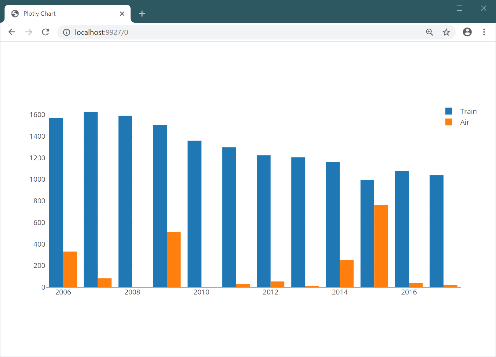

- title : Histogram - You have to know the past to understand the present
- description : Histogram - You have to know the past to understand the present
- author : Tomas Petricek
- theme : simple
- transition : none

****************************************************************************************************

# _Histogram_
## You have to know the past  to understand the present

     

**Tomas Petricek**

University of Kent 
[tomas@tomasp.net](mailto:tomas@tomasp.net) | [@tomaspetricek](http://twitter.com/tomaspetricek)

****************************************************************************************************
- class: part

# _Motivation_
## Programming as interaction

----------------------------------------------------------------------------------------------------

**DEMO**  
_Using modern programming environment for data analysis_

----------------------------------------------------------------------------------------------------

<table style="width:100%"><tr><td style="width:50%;padding:0px" class="white">

### Programs

_<i class="fa fa-file"></i> Just final result_

_<i class="fa fa-brain"></i> No creative process_

_<i class="fa fa-cocktail"></i> Only recipe_

_<i class="fa fa-code"></i> Syntactic entities_

</td><td style="width:50%;padding:0px" class="fragment">

### Programming

_<i class="fa fa-magic"></i> Creative activity_

_<i class="fa fa-undo"></i> Learn from mistakes_

_<i class="fa fa-cog"></i> Includes evaluation_

_<i class="fa fa-video"></i> User interactions_

</td></tr></table>

----------------------------------------------------------------------------------------------------

**Medium is the message**

_Formalism is great for talking about programs._

_Rules also fit in papers!_

How to convey ideas  
on user interaction?

****************************************************************************************************
- class: part

# _Histogram_
## Programming experiment

----------------------------------------------------------------------------------------------------

# _Design principles_
## Live programming environment

_<i class="fa fa-list-alt"></i>_ Represent programs as lists of interactions

_<i class="fa fa-caret-square-down"></i>_ Program by choosing from a list of options

_<i class="fa fa-th"></i>_ Move away from concrete syntax

_<i class="fa fa-chart-bar"></i>_ Explore the idea using data science use case

----------------------------------------------------------------------------------------------------

**DEMO**  
_Analysing aviation accidents with Histogram_

----------------------------------------------------------------------------------------------------

# _Interactions_

**Standard coding**

 - _Access member_
 - _Invoke operation_
 - _Define a value_

**Programming process**

 - _Evaluate component_
 - _Refactor as function_

----------------------------------------------------------------------------------------------------

# _Implications_
## Why is Histogram interesting

_<i class="fa fa-list-alt"></i>_ Type checking lists of interactions

_<i class="fa fa-check-square"></i>_ Evaluation can affect types

_<i class="fa fa-mouse-pointer"></i>_ Bind interactions to user interface

_<i class="fa fa-table"></i>_ Multiple views for the same program

----------------------------------------------------------------------------------------------------

**DEMO**  
_Representing code as spreadsheets and direct manipulation_

****************************************************************************************************
- class: part

# _Presentation_
## Interactive essays

----------------------------------------------------------------------------------------------------

# _Evaluation_
## How to talk about system design

_❶_ No established way of design evaluation

_❷_ Often seen as early work presentation

_❸_ Makes us shift focus to other questions

_❹_ "Evaluating programming systems design"

----------------------------------------------------------------------------------------------------

# _Evaluating interactive essays_

**Hacking and entity realism**

 - Are electrons real or models?
 - If you can spray them, they're real
 - Effect is theory independent

**Programming system design**

 - What is theory independent?
 - How to convey implications?
 - Simplify, but let users explore

****************************************************************************************************
- class: part

# _Summary_
## Investigating programming

----------------------------------------------------------------------------------------------------

# _[tomasp.net/histogram](http://tomasp.net/histogram)_

## A point in programming system design space

_<i class="fa fa-keyboard"></i>_ We should study programming not programs  

_<i class="fa fa-list"></i>_ Represent programs as lists of interactions  

_<i class="fa fa-caret-square-down"></i>_ Program by choosing not creating

_<i class="fa fa-microscope"></i>_ Allows interesting new experiences

  

**Tomas Petricek**, University of Kent 
[tomas@tomasp.net](mailto:tomas@tomasp.net) | [@tomaspetricek](http://twitter.com/tomaspetricek)
