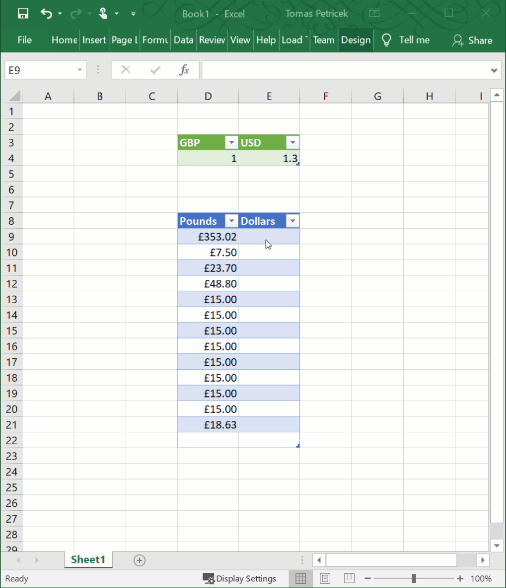
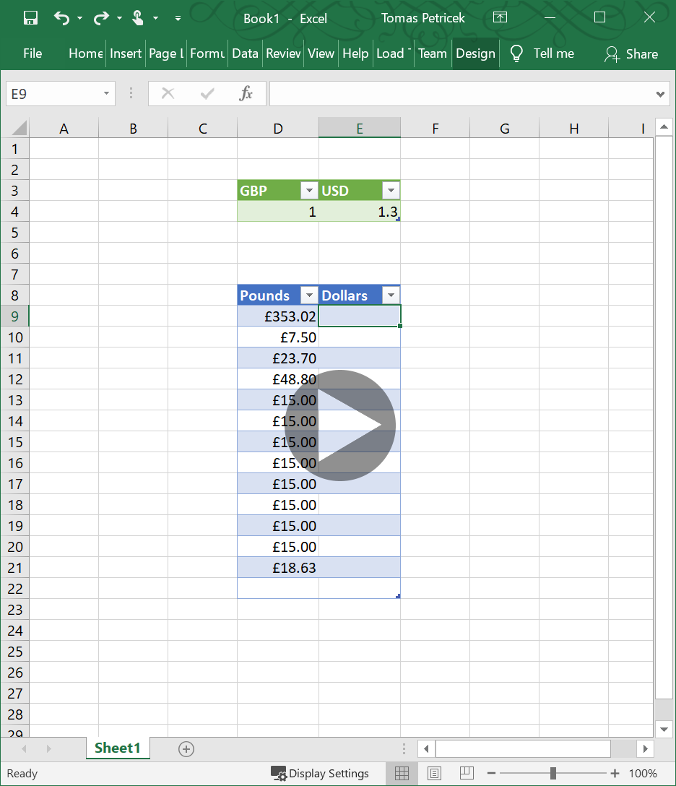

- title : Changing how we think about programming
- description : Changing how we think about programming
- author : Tomas Petricek
- theme : simple
- transition : none

****************************************************************************************************

# _Changing how we <br /> **think** about **programming**_
## From concurrency to data science

<br /><br /><br /><br /><br />

**Tomas Petricek**

email: [t.petricek@kent.ac.uk](mailto:t.petricek@kent.ac.uk)<br />
twitter: [@tomaspetricek](http://twitter.com/tomaspetricek)<br />

****************************************************************************************************
- class: part

# _Background_
## What are important programming<br /> research problems?

----------------------------------------------------------------------------------------------------

# _Programming research_
## What kind of science is computer science

_<i class="fa fa-flask"></i>_ Experiments to confirm hypotheses?

_<i class="fa fa-archway"></i>_ Build systems like engineers?

_<i class="fa fa-pencil-alt"></i>_ Prove theorems about theories?

_<i class="fa fa-magnet"></i>_ Even physics is not as obvious!

----------------------------------------------------------------------------------------------------

# _Programming research_


### Solving hard problems

- Verified operating systems
- Make JavaScript as fast as C
- Good scientific problems

<div class="fragment">

### Changing how we think

- Program as a formal linguistic entity
- Types as sets of values <span class="ref"><span>PLDI 2016</span></span> <span class="ref"><span>Onward! 2015</span></span>
- Philosophy of science challenge <span class="ref"><span>AISB 2014</span></span>

</div>

----------------------------------------------------------------------------------------------------

# _Changing how we think_
## From concurrency to data science

_<i class="fa fa-stopwatch"></i>_ Computations for **asynchronous programming**

_<i class="fa fa-cloud"></i>_ Unified notion of **context dependence**

_<i class="fa fa-database"></i>_ Types for working with **external data sources**

_<i class="fa fa-user"></i>_ Programming as **human data interaction**

****************************************************************************************************
- class: part

# _Concurrency_
## Non-standard kinds of computations

----------------------------------------------------------------------------------------------------

# _F# computation expressions_

<br />


Abstractions and syntax for reactive, concurrent and asynchronous programming.

----------------------------------------------------------------------------------------------------

# _Non-standard computations_


### Monads in programming

- Structure effectful computations
- Language support in Haskell, F#
- Inspired LINQ, JavaScript async

<div class="fragment">

### What are monads

- Mathematical abstraction with laws
- Social and cultural artifact <span class="ref"><span>Programming 2018</span></span>
- Non-standard computation <span class="ref"><span>PADL 2014</span></span>

</div>

---------------------------------------------------------------------------------------------------

# _Non-standard computations_
## Start with blocking imperative F# program

<br />

    let printAllPrices files =
      for url in files do
        let data = downloadCsv url
        for row in data.Rows do
          print "%o %f" row.Date row.Price

---------------------------------------------------------------------------------------------------

# _Non-standard computations_
## Non-blocking code using async workflows

<br />

    let printAllPrices files = async {
      for url in files do
        let! data = asyncDownloadCsv url
        for row in data.Rows do
          print "%o %f" row.Date row.Price }

<div class="fragment">
  <div class="tipbox" style="left:512px;top:-228px;width:86px;height:29px"></div>
  <div class="tiplbl" style="left:562px;top:-330px">Non-blocking code</div>
  <div class="tipbox" style="left:105px;top:-240px;width:72px;height:29px"></div>
  <div class="tiplbl" style="left:30px;top:-230px">Bind</div>
</div>

---------------------------------------------------------------------------------------------------

# _Non-standard computations_
## Non-blocking code using async workflows

<br />

    let printAllPrices files = asyncSeq {
      for url in files do
        let! data = asyncDownloadCsv url
        for row in data.Rows do
          yield row.Date, row.Price }

<div class="fragment">
  <div class="tipbox" style="left:512px;top:-228px;width:140px;height:29px"></div>
  <div class="tiplbl" style="left:592px;top:-330px">Non-blocking generator</div>
  <div class="tipbox" style="left:140px;top:-163px;width:90px;height:29px"></div>
  <div class="tiplbl" style="left:70px;top:-145px">Unit with monoid</div>
</div>


---------------------------------------------------------------------------------------------------
- class: part

# _Demo_
Async workflows and async sequences <span class="ref"><span>PADL 2011a</span></span>

---------------------------------------------------------------------------------------------------

# _Non-standard computations_
## Join calculus using pattern matching

<div id="chan">

    let putString = Channel<string>()
    let putInt = Channel<int>()
    let getString = ReplyChannel<string>()

    join {
      match! getString, putString, putInt with
      | repl, v, ? -> repl.Reply("Echo " + v)
      | repl, ?, v -> repl.Reply("Echo " + (string v)) }

</div>
<script>
document.getElementById("chan").children[0].children[0].children[0].children[1].children[0].children[0].children[22].className="k"
</script>

<div class="fragment">
  <div class="tipbox" style="left:312px;top:-346px;width:310px;height:29px"></div>
  <div class="tiplbl" style="left:570px;top:-450px">Join calculus channels</div>
  <div class="tipbox" style="left:70px;top:-240px;width:102px;height:29px"></div>
  <div class="tiplbl" style="left:150px;top:-340px">Non-standard match</div>
</div>

----------------------------------------------------------------------------------------------------

# _Non-standard computations_
## Computation expressions are not just monads

_<i class="fa fa-pen"></i>_ Syntax to support monad-like abstractions

_<i class="fa fa-code"></i>_ Further syntax requires further operations <span class="ref"><span>PADL 2014</span></span>

_<i class="fa fa-ruler"></i>_ Non-standard notion of pattern matching <span class="ref"><span>PADL 2011b</span></span>

_<i class="fa fa-brain"></i>_ Different **way of thinking** about computations

****************************************************************************************************
- class: part

# _Coeffects_
## Unified notion of context dependence

----------------------------------------------------------------------------------------------------

# _Context dependence_
## Neighbourhood in stencil computations

<div style="margin-top:-50px">

    let sum = inp.[cursor-1] + inp.[cursor] + inp.[cursor+1]
    if sum = 2 || (sum = 1 && inp.[cursor-1] = 0)
    then out.[cursor] <- 1 else out.[cursor] <- 0

<script src="//code.jquery.com/jquery-2.1.4.min.js"></script>
<script src="images/coeffects/interactive.js" type="text/javascript"></script>
<script src="images/coeffects/tips.js" type="text/javascript"></script>
<script type="text/javascript">
  window.toolTipsStopFunc = function(t) { return t == "absolute"; }
  window.toolTipsStopRelative = true;
  window.toolTipsRoot = function(el) {
    var res = el;
    while(res.prop("tagName") != "SECTION") res = res.parent();
    return res;
  }
</script>
<script src="images/coeffects/smoothie.js"></script>
<script src="images/coeffects/script.js" type="text/javascript"></script>
<style type="text/css">
.reveal #rule110 td { padding:0px !important; border-style:none !important; }
</style>
<div style="border:4px solid #404040;padding:5px;margin:10px 40px 5px 40px;background-color:#D5DB80;">
  <table id='rule110' style="overflow:hidden;"></table>
</div>
<div style="text-align:left;margin-left:40px;"><button id='rule110btn' data-light="transparent" data-dark="#F28E8E"
  data-size="4" class="btn" style="background:#f0f0f0;border-color:#e0e0e0;border-radius:0px;border-width:2px;
    padding:5px;width:170px;margin:0px 40px 5px 0px">Run</button></div>
</div>

----------------------------------------------------------------------------------------------------

# _Type system for coeffects_


### Effect systems

- What program **does** to the world
- Attached to program **output**
- Output, state, errors

<div class="fragment">

### Coeffect systems <span class="ref"><span>ICALP 2013</span></span><span class="ref"><span>ICFP 2014</span></span>

- What it **requires** from the world
- Attached to program **input**
- Neighbourhood, implicit parameters

</div>

----------------------------------------------------------------------------------------------------

<div style="display:none">

$$$
\definecolor{leff}{RGB}{177,35,43}
\definecolor{lcoeff}{RGB}{35,177,53}
\definecolor{ltyp}{RGB}{147,43,127}
\definecolor{lexpr}{RGB}{0,0,0}
\definecolor{lkvd}{RGB}{0,45,177}
\definecolor{lnum}{RGB}{43,177,93}

</div>

# _Simple type systems_

### Typing rule

<div style="position:relative;padding-top:20px;left:-20px;transform:scale(0.85)">

$x:{\color{ltyp} \text{int}},~ y:{\color{ltyp} \text{int}} \vdash x+y : {\color{ltyp} \text{int}}$

</div>

### Reading

 - Given a free variable context
 - Expression has a certain type

----------------------------------------------------------------------------------------------------

# _Effect type systems_

### Typing rule

<div style="position:relative;left:-20px;padding-top:20px;transform:scale(0.85)">

$hello : {\color{ltyp} \text{string}} \vdash {\color{lkvd} \text{print}}~hello : {\color{ltyp} \text{unit}} {\scriptsize \;\&\;} {\color{leff} \{ \text{io} \} }$

</div>

### Reading

- Given a free variable context
- Expression has a type **and produces effects**

----------------------------------------------------------------------------------------------------

# _Coeffect type systems_

### Typing rule

<div style="position:relative;left:-20px;padding-top:20px;transform:scale(0.85)">

$deadline : {\color{ltyp} \text{time}} {\scriptsize \;@\;} {\color{lcoeff} \{ \text{clock} \} }
  \vdash {\color{lkvd} \text{now}} \geq deadline : {\color{ltyp} \text{bool}}$

</div>

### Reading

- Given variables **and additional context**
- Expression has a certain type

----------------------------------------------------------------------------------------------------

# _Unified notion of context_


### Applications of coeffects

 - Available network resources
 - Dynamically scoped variables
 - Dataflow and liveness

<div class="fragment">

### What do they share

 - Attach information to context
 - Interesting functions treatment
 - Semantics based on comonads

</div>

----------------------------------------------------------------------------------------------------

# _Ordinary function_

### Typing rule

<div style="transform:scale(0.9);padding-top:10px">

$\dfrac
{\Gamma, x:{\color{ltyp} \tau_1} \vdash e : {\color{ltyp} \tau_2}}
{\Gamma \vdash {\color{lkvd} \text{fun}}~x \rightarrow e : {\color{ltyp} \tau_1} \rightarrow {\color{ltyp} \tau_2}}$

</div>

### Explanation

- If body can be typed in a context
- Then lambda has a function type

----------------------------------------------------------------------------------------------------

# _Effectful functions_

### Typing rule

<div style="transform:scale(0.9);padding-top:10px">

$\dfrac
{\Gamma, x:{\color{ltyp} \tau_1} \vdash e : {\color{ltyp} \tau_2 } {\scriptsize \;\&\;} {\color{leff} r} }
{\Gamma \vdash {\color{lkvd} \text{fun}}~x \rightarrow e : {\color{ltyp} \tau_1} \xrightarrow{~\color{leff} r~} {\color{ltyp} \tau_2} {\scriptsize \;\&\;} {\color{leff} \emptyset}}$

</div>

### Explanation

 - If evaluating body produces effects
 - Effects will happen on function call

----------------------------------------------------------------------------------------------------

# _Coeffectful functions_

### Typing rule

<div style="transform:scale(0.9);padding-top:10px">


$\dfrac
{\Gamma, x:{\color{ltyp} \tau_1} {\scriptsize \;@\;} {\color{lcoeff} r\wedge s} \vdash e : {\color{ltyp} \tau_2 } }
{\Gamma {\scriptsize \;@\;} {\color{lcoeff} r} \vdash {\color{lkvd} \text{fun}}~x \rightarrow e : {\color{ltyp} \tau_1} \xrightarrow{~\color{lcoeff} s~} {\color{ltyp} \tau_2}}$

</div>

### Explanation

 - If body requires certain context to run
 - It can come from declaration-site or call-site

----------------------------------------------------------------------------------------------------
- class: part

# _Demo_
Dataflow coeffects (see [tomasp.net/coeffects](http://tomasp.net/coeffects))

----------------------------------------------------------------------------------------------------

# _Coeffects_
## Unified notion of context-dependence

_<i class="fa fa-desktop"></i>_ What is the **context** in which programs run?

_<i class="fa fa-book"></i>_ Variables, resources, history, etc.

_<i class="fa fa-box"></i>_ Per-context and per-variable definitions

_<i class="fa fa-code"></i>_ Towards context-aware programming languages


****************************************************************************************************
- class: part

# _Type providers_
## External data as part of your type system

----------------------------------------------------------------------------------------------------

# _Reading data_
## Unsafe dynamic access in a typed language

    [lang=csharp]
    var url = "http://dvd.netflix.com/Top100RSS";
    var rss = XDocument.Load(topRssFeed);
    var channel = rss.Element("rss").Element("channel");

    foreach(var item in channel.Elements("item")) {    
      Console.WriteLine(item.Element("text").Value);
    }

<div class="fragment">
  <div class="tipbox" style="left:626px;top:-112px;width:86px;height:29px"></div>
  <div class="tiplbl" style="left:666px;top:-95px">Not found!</div>
</div>

---------------------------------------------------------------------------------------------------

# _Reading data_
## Unsafe dynamic access in a typed language

    [lang=csharp]
    var url = "http://dvd.netflix.com/Top100RSS";
    var rss = XDocument.Load(topRssFeed);
    var channel = rss.Element("rss").Element("channel");

    foreach(var item in channel.Elements("item")) {    
      Console.WriteLine(item.Element("title").Value);
    }

<div>
  <div class="tipbox" style="left:626px;top:-112px;width:104px;height:29px"></div>
  <br />
</div>

---------------------------------------------------------------------------------------------------

# _Reading data_
## Accessing data from external data sources

_<i class="fa fa-file-excel"></i>_ Languages do not understand data

_<i class="fa fa-tags"></i>_ There is rarely explicit schema

_<i class="fa fa-code"></i>_ Manually define types to capture it

_<i class="fa fa-wrench"></i>_  Easier in dynamic languages

---------------------------------------------------------------------------------------------------

<h1 style="text-align:center"><em>Type providers</em></h1>

<div class="bigeq">

$\emptyset \vdash e : \tau$

</div>


---------------------------------------------------------------------------------------------------

<h1 style="text-align:center"><em>Type providers</em></h1>

<div class="bigeq bigeq2">

$\pi(~~~~~~~) \vdash e : \tau$


</div>

---------------------------------------------------------------------------------------------------
- class: part

# _Demo_
Reading data from an RSS feed <span class="ref"><span>PLDI 2016</span></span>

---------------------------------------------------------------------------------------------------

# _F# Data library_
## Type providers for structured data

_<i class="fa fa-adjust"></i>_ Structural shape inference

_<i class="fa fa-sitemap"></i>_ Language integration via type providers

_<i class="fa fa-bomb"></i>_ Relative type safety

_<i class="fa fa-wrench"></i>_ Pragmatic choices for usability

---------------------------------------------------------------------------------------------------

<h1 style="text-align:center;margin-bottom:80px"><em>Structural shape inference</em></h1>

<div class="diagram1">
<p>
  <span>{title&nbsp;:&nbsp;string,&nbsp;author&nbsp;:&nbsp;{age&nbsp;:&nbsp;int}}</span>
  <span style="margin-left:50px">{author&nbsp;:&nbsp;{age&nbsp;:&nbsp;float}}</span>
</p>  
<div class="fragment">
<p><span style="position:relative;top:55px;left:72px" class="arrow-down"></span></p>
<p>
  <span style="position:relative;top:30px;left:40px">{&nbsp;title&nbsp;:&nbsp;option&lt;string&gt;,
    &nbsp;author&nbsp;:&nbsp;{age&nbsp;:&nbsp;float}&nbsp;}</span>
</p>  
</div>
</div>

---------------------------------------------------------------------------------------------------

<h1 style="text-align:center;margin-bottom:80px"><em>Structural shape inference</em></h1>

<div class="diagram2">
<p>
  <span>{&nbsp;coordinates&nbsp;:&nbsp;{lng:num,&nbsp;lat:num}&nbsp;}</span>
  <span style="margin-left:50px">string</span>
</p>  
<div class="fragment">
<p><span style="position:relative;top:55px;left:200px" class="arrow-down"></span></p>
<p>
  <span style="position:relative;left:70px;top:30px">
  {&nbsp;coordinates&nbsp;:&nbsp;{lng:num,&nbsp;lat:num}&nbsp;}&nbsp;+&nbsp;string&nbsp;</span>
</p>  
</div>
</div>

---------------------------------------------------------------------------------------------------

# _Relative type safety_
## Well typed programs do not go wrong...

---------------------------------------------------------------------------------------------------

# _Relative type safety_
## ...as long as the world is well-behaved!

---------------------------------------------------------------------------------------------------

# _Relative type safety_
## Safety guarantees provided by F# Data

<style>.reveal .math p em { font-style:italic; }</style>
<div style="margin-top:100px" class="math fragment">

Given **representative samples** and **an input** value

$S(d)\sqsubset S(d_1, \ldots, d_n)$

</div><div class="fragment" style="margin-top:70px">

Any **program** written using a **type provider** reduces

$e_{user}[x\leftarrow {\color{mc}\text{new}}~C(d)] \rightsquigarrow^* v$

</div>

---------------------------------------------------------------------------------------------------

# _Fancy types for the masses_
## Row types to track names and types of fields

<div style="margin-top:-50px;padding:0px 0px 30px 0px;position:relative;left:-110px;transform:scale(0.75)">

$$$
\definecolor{cc}{RGB}{204,82,34}
\definecolor{mc}{RGB}{0,0,153}
\frac
  {\Gamma \vdash e : {\color{cc}[f_1:\tau_1, \ldots, f_n:\tau_n]}}
  {\Gamma \vdash e.\text{drop}~f_i : {\color{cc} [f_1:\tau_1, \ldots, f_{i-1}:\tau_{i-1}, f_{i+1}:\tau_{i+1}, \ldots, f_n:\tau_n]}}

</div><div class="fragment">

## Embed row types in provided nominal types

<div style="margin-top:-60px;padding:0px 0px 30px 0px;position:relative;left:-110px;transform:scale(0.75)">

$$$
\frac
  {\Gamma \vdash e : {\color{mc} C_1}}
  {\Gamma \vdash e.\text{drop}~f_i : {\color{mc} C_2}}
\quad{\small \text{where}}

<div style="position:relative;top:-20px;">

$$$
\begin{array}{l}
\\[-0.5em]
{fields({\color{mc} C_2}) = {\color{mc} \{f_1:\tau_1, \ldots, f_{i-1}:\tau_{i-1}, f_{i+1}:\tau_{i+1}, \ldots, f_n:\tau_n\}}}\\
{fields({\color{mc} C_1}) = {\color{mc} \{f_1:\tau_1, \ldots, f_n:\tau_n\}}}
\end{array}

</div></div>

---------------------------------------------------------------------------------------------------

# _Fancy types for the masses_
## Powerful idea that works in other contexts

_<i class="fa fa-table"></i>_ Row types and phantom types

_<i class="fa fa-phone"></i>_ Session types for communication

_<i class="fa fa-question"></i>_ Add your own fancy type here!


****************************************************************************************************
- class: part

# _Data science_
## Programming as human data interaction

----------------------------------------------------------------------------------------------------


**Data journalism**

Can we make data science easy for journalists?

---------------------------------------------------------------------------------------------------

# _Aggregating data_
## Athletes by number of golds from Rio 2016

<div style="padding:0px 0px 60px 0px">

```
olympics = pd.read_csv("olympics.csv")
olympics[olympics["Games"] == "Rio (2016)"]
  .groupby("Athlete")
  .agg({"Gold": sum})
  .sort_values(by="Gold", ascending=False)
  .head(8)
```

</div>
<div class="fragment">
  <div class="tipbox" style="left:455px;top:-324px;width:220px;height:25px"></div>
  <div class="tiplbl" style="left:550px;top:-415px">Unknown file</div>
  <div class="tipbox" style="left:364px;top:-254px;width:90px;height:25px"></div>
  <div class="tiplbl" style="left:390px;top:-245px">Column name</div>
</div>

---------------------------------------------------------------------------------------------------

# _Aggregating data_
## Language features you need to know

_<i class="fa fa-book"></i>_ Python dictionaries `{"key": value}`

_<i class="fa fa-eye"></i>_ Generalised indexers `.[ condition ]`

_<i class="fa fa-university"></i>_ Operation names `sort_values`

_<i class="fa fa-database"></i>_ Data column names `"Athlete"`

----------------------------------------------------------------------------------------------------

<div style="background:black;position:absolute;width:200%;right:51%;height:400%;top:-100%;z-index:-1000;"></div>

<table style="margin-top:50px"><tr><td style="width:48%;color:white" class="fragment">

<h3 style="color:white;"><strong>Spreadsheets</strong></h3>

<div class="narrow" style="padding:20px 0px 105px 0px;">
<p style="color:white"><i class="fa fa-birthday-cake"></i> Easy to use</p>
<p style="color:white"><i class="fa fa-table"></i> Simple problems</p>
<p style="color:white"><i class="fa fa-redo-alt"></i> Not reproducible</p>
</div>

</td><td style="width:50%" class="fragment">

### **Programming**

<div class="narrow" style="padding:20px 0px 105px 0px;">
<p><i class="fa fa-university"></i> Needs expert skills</p>
<p><i class="fa fa-globe"></i> Internet-scale</p>
<p><i class="fa fa-code"></i> Open &amp; transparent</p>
</div>

</td></tr></table>

---------------------------------------------------------------------------------------------------



<script type="text/javascript">
  var p1 = false;
  document.getElementById("img1b").onclick = function() {
    document.getElementById("img1b").src = p1 ? "images/excel1.png" : document.getElementById("img1a").src;
    p1 = !p1;
  }
</script>

What makes spreadsheets so easy to learn and use?

How can programming tools learn from Excel?

<div class="fragment">

**Think of programming as interaction!**

</div>

---------------------------------------------------------------------------------------------------
- class: part

# _Demo_
The Gamma (see [gamma.turing.ac.uk](http://gamma.turing.ac.uk/playground)) <span class="ref"><span>ECOOP 2017</span></span>


---------------------------------------------------------------------------------------------------

# _Dot-driven development_
## Complex logic via simple member access

_<i class="fa fa-cog"></i>_ Type providers for member generation

_<i class="fa fa-balance-scale"></i>_ Cognitive cost of interactions

_<i class="fa fa-rocket"></i>_ Fancy types for the masses!

_<i class="fa fa-table"></i>_ Adding spreadsheet-like live experience

****************************************************************************************************
- class: part

# _Summary_
## Changing how we think about programming

----------------------------------------------------------------------------------------------------

# _Changing how we think_
## From concurrency to data science

 - Non-standard computations, context, types
 - Programming as interaction with data
 - Can we change how we think with just papers?

<br />
<br />
<br />
<br />

Tomas Petricek<br />
[t.petricek@kent.ac.uk](mailto:t.petricek@kent.ac.uk) | [@tomaspetricek](http://twitter.com/tomaspetricek)
