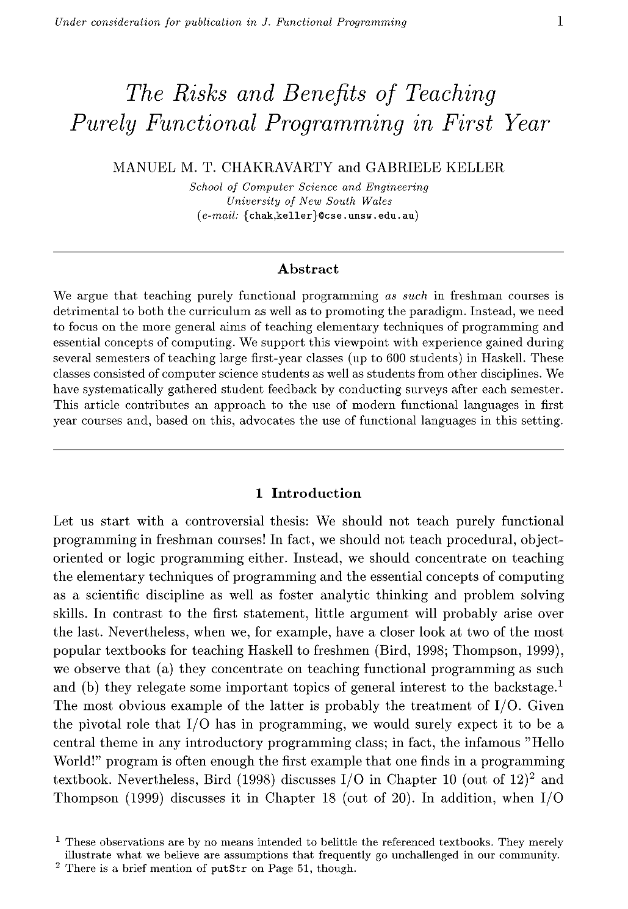
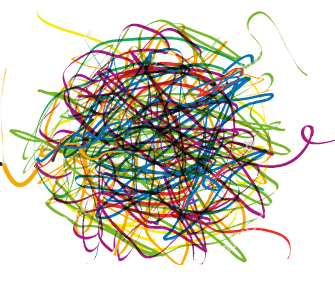

- title : Software Engineering
- description : Software Engineering
- author : Tomas Petricek
- theme : simple
- transition : none

****************************************************************************************************

# **Choosing the first programming language**

    
   

**Tomas Petricek**

email: [t.petricek@kent.ac.uk](mailto:t.petricek@kent.ac.uk) 
twitter: [@tomaspetricek](http://twitter.com/tomaspetricek) 

****************************************************************************************************
- class: part

# **Background**

----------------------------------------------------------------------------------------------------

# Methodology

**In this presentation**

- _Papers describing particular choices_
- _What reasoning they use_
- _Focuses on_ interesting _choices_

**Planned for final report**

- _Review common choices at UK universities_
- _Evaluation of the_ non-interesting _choices_
- _Perception in online discussions_

----------------------------------------------------------------------------------------------------

# Choosing the first programming language

### Why does first language matter?

_<i class="fa fa-heart"></i> Programmers are emotional about their favorites_

_<i class="fa fa-search"></i> Provides lens for further learning_

_<i class="fa fa-industry"></i> Immediately useful skills for students_

_<i class="fa fa-gavel"></i> Language determines many other tools_

----------------------------------------------------------------------------------------------------

**Legendary programming textbook for computer scientists**

_Taught to MIT undergrads between 1980s-2010s_

_Regarded as beautiful but quite hard and impractical_

****************************************************************************************************
- class: part

# **Argumentation**

----------------------------------------------------------------------------------------------------

# Choosing a language

### What properties of language get mentioned

_<i class="fa fa-object-group"></i>_ Orientation - _object-oriented, functional, procedural_

_<i class="fa fa-code"></i>_ Syntax - _ease of learning and simplicity_

_<i class="fa fa-industry"></i>_ Industry - _is this what practitioners use?_

_<i class="fa fa-gavel"></i>_ Tooling - _does it encourage good practices?_

_<i class="fa fa-robot"></i>_ Microworlds - _what tasks will students be solving_

----------------------------------------------------------------------------------------------------

# Choosing a language

### What aspects never get mentioned

_<i class="fa fa-image"></i>_ Aesthetics _- is it beautiful computer science idea?_

_<i class="fa fa-university"></i>_ Culture  _- what image does an institution maintain_

_<i class="fa fa-user-friends"></i>_ Politics _- who is in charge and what's their preference_

----------------------------------------------------------------------------------------------------

_In the 80s and 90s, engineers built complex systems by combining simple
and well-understood parts._

_This is no longer the case. Engineers now routinely write code
that they don't fully understand._

Nowadays, we do programming by poking.

----------------------------------------------------------------------------------------------------

_Technical advantages of functional languages are obvious._

We should not teach purely functional programming.  
We should teach essential programming concepts.

_Haskell works as an equaliser between students who know some programming and those who don't._

----------------------------------------------------------------------------------------------------

**Kent Recursive Calculator  
and Miranda**

_Having program and data in the same form leads to many confusions in Lisp that do not occur in KRC or Miranda._

Miranda makes it easier to prove equations

----------------------------------------------------------------------------------------------------

_Our experience suggests that undergraduate computer science courses should emphasize
basic notions of modularity, specification, and data abstraction, and should not let
these be displaced by more advanced topics._

****************************************************************************************************
- class: part

# **Discussion**

----------------------------------------------------------------------------------------------------

# Choosing a programming language

**It's more than a language**

 - _Python and poking approach_
 - _Racket with language levels_
 - _Haskell with focus on microworlds_

**What do we optimize for**

 - _Teaching concepts we find important_
 - _Teaching thinking we find important_
 - _Transition from elegant to industrial_

----------------------------------------------------------------------------------------------------

# Limitations of reviewed literature

**Bias in empirical studies**

 - _Only focuses on interesting choices_
 - _Led by enthusiastic teachers_
 - _What is a good learning experience?_

**Wicked problem**

 - _Defining criteria determines the solution_
 - _Interconnected with other problems_
 - _Large economic for change_

----------------------------------------------------------------------------------------------------

# Choosing the first programming language

**Tentative conclusions based on literature review**

 - _Choosing a language is a_ wicked problem?
 - _Good reasoning can support_ any choice?
 - Culture and politics _determines what we optimize for?_

 
 

Tomas Petricek 
_[t.petricek@kent.ac.uk](mailto:t.petricek@kent.ac.uk) | [@tomaspetricek](http://twitter.com/tomaspetricek)_

****************************************************************************************************

Notes

----------------------------------------------------------------------------------------------------

Programming by poking: why MIT stopped teaching SICP

 - "The SICP curriculum no longer prepared engineers for what engineering is like today.
    Sussman said that in the 80s and 90s, engineers built complex systems by combining simple
    and well-understood parts. The goal of SICP was to provide the abstraction language for
    reasoning about such systems.
 - "Today, this is no longer the case. Sussman pointed out that engineers now routinely write
    code for complicated hardware that they don’t fully understand. The same is true at the
    software level, since programming environments consist of gigantic libraries with enormous
    functionality. According to Sussman, his students spend most of their time reading manuals
    for these libraries to figure out how to stitch them together to get a job done. He said that
    programming today is “More like science. You grab this piece of library and you poke at it.
    You write programs that poke it and see what it does. And you say, ‘Can I tweak it to do the
    thing I want?'”. The “analysis-by-synthesis” view of SICP — where you build a larger system
    out of smaller, simple parts — became irrelevant. Nowadays, we do programming by poking.    

 - comment: "Programing by synthesis of well understood parts is graceful and beautiful and fun.
    Programming by trying to get never-well-documented libraries to barely do something is f***ing torture."

----------------------------------------------------------------------------------------------------

The risks and benefits of teaching purely functional programming in first year
 - Haskell
 - "we should not teach purely functional programming" -
   but we should teach essential programming concepts
 - problems with I/O and "hello world"

 AIMS
 - convey elementery techniques of programming
 - introduce essential computing concepts
 - develop analytic thinking and problem solving

 NOTES
 - technical advantages of functional languages are obvious
 - Haskell works as an equaliser between students who know some programming and those who don't
    -> female students coming from mathematics background
    -> also the case for SICP

----------------------------------------------------------------------------------------------------

Why calculating is better than scheming
 - KRC (Kent Recursive Calculator) / Miranda
 - SICP is too tightly linked to Scheme
 - lacks: pattern matching, syntax close to mathematical notation, lazy evaluation, static types
 - based on experience teaching both
 - Miranda makes it easier to prove equations (syntactically)
 - one exercise ("mobiles") and learning from that
    -> types help
    -> can define abstract data type
 - confusion about 'program is data' (vs. revelation that 'program is data')
 - you can still treat programs as data:
   -> "simple interpreter" example - showing what kinds of examples we care about    

----------------------------------------------------------------------------------------------------

The structure and interpretation of computer science curriculum   
 - SICP focused on CS concepts like abstraction
 - 2000 critique of SICP by Jackson & Chapin
    "our experience suggests that undergraduate computer science courses should emphasize
    basic notions of modularity, specification, and data abstraction, and should not let
    these be displaced by more advanced topics, such as design patterns, object-oriented
    methods, concurrency, functional languages, and so on"
 - series of teaching languages based on Scheme with increasing language complexity

 WANTS
 - whatever is needed in upstream courses
 - latest industry trends that they've read about in the news
 - students have different things they want to learn/do - will disappoint some
 - it's important to "explain our choice" well

  "Clearly, a computer science curriculum must not, and doesn’t have to,
   become a vocational training ground for the latest industrial programming
   language and programming tools."

 SCHEME
 - don't have to spend time explaining types
 - syntax is simple
 - SICP relies on complex CS domain knowledge - interesting for MIT students

----------------------------------------------------------------------------------------------------

From Principles to Practice with Class in the First Year
 - WANT TO teach industrial object-oriented language by the end of the first year
 - transition from teaching language (scheme, etc.) to object-oriented "professional"
   language through a series of small educational languages that add concepts
 - first semester with HTDP, second semester with Java?

----------------------------------------------------------------------------------------------------

Teaching Java with the BlueJ environment
 - BlueJ is educational Java environment that "allows students to concentrate on solving
   programming problems without becoming distracted by the mechanics of compiling and
   executing Java programs"
   -> Maybe that's what we should teach though :-)
 - problem with translating concepts from simple educational environment to the real one
    (K\"oling and Rosenberg, 1996)

----------------------------------------------------------------------------------------------------

Teaching Java First: Experiments with a Pigs - Early Pedagogy    
 - object-oriented concepts first
 - The Joint Task Force on Computing Curricula (2001) notes that Java and C++ are significantly
   more complex than classical languages. Unless instructors take special care to introduce the
   material in a way that limits this complexity, such details can easily overwhelm introductory
   students.
 - "Karel the Robot" approach - microworld
 - uses BlueJ

----------------------------------------------------------------------------------------------------

On Teaching How to Design Programs
 - HTPD includes things like "testing" and "refactoring"
 - "Findler et al. (2002) argue that the type systems of  Haskell  and  ML  are  too  sophisticated
    for  beginning  students,but that a first-order, monomorphic type system might be helpful for
    beginning students. Felleisen et al. (2004a) argue that dynamic typing is a benefit because
    students and teachers need not spend energy finding and explaining static type errors. (And when
    a type error occurs dynamically, it comes with an example!)"

----------------------------------------------------------------------------------------------------

Java as a teaching language - opportunities, pitfalls and solutions
 - How to introduce good object-oriented practices from the beginning
 - goodbye "hello world", introducing "micro worlds" of boxes

----------------------------------------------------------------------------------------------------

Helium, for learning Haskell
 - Haskell compiler with better error reporting

xx   
