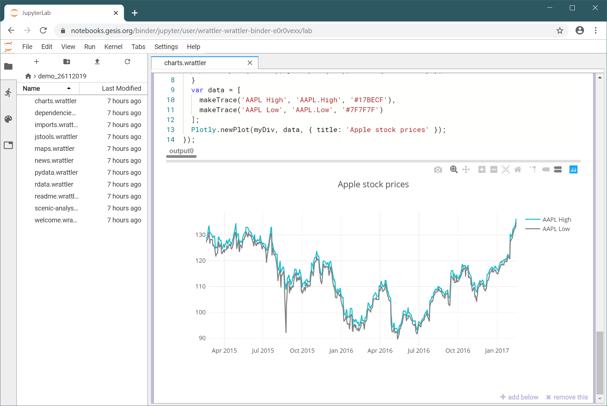
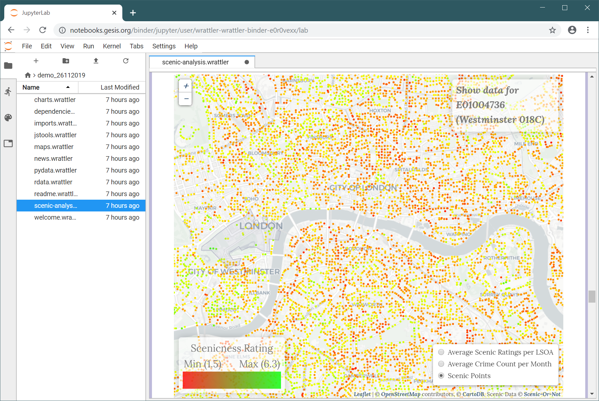

- title : Data exploration through dot-driven development
- description :
- author : Tomas Petricek
- theme : white
- transition : none

****************************************************************************************************

# Wrattler: _Interactive, smart  and polyglot notebooks_

<h4 style="margin-bottom:0px;margin-top:300px">Tomas Petricek, <em>The Alan Turing Institute</em></h4>

_[http://tomasp.net](http://tomasp.net/academic) |
[tomas@tomasp.net](mailto:tomas@tomasp.net) |
[@tomaspetricek](http://twitter.com/tomaspetricek)_

****************************************************************************************************

### What makes data science hard?

 

_<i class="fa fa-hand-spock"></i>_ Big data is big  
 _Hard-to-find special cases_

_<i class="fa fa-calendar-alt"></i>_ The Double Anna Karenina principle  
 _Every data set is different_

_<i class="fa fa-sync-alt"></i>_ Feedback loops everywhere  
 _Can't say what works until we've done it_

_<i class="fa fa-align-justify"></i>_ Death by a thousand cuts  
 _Many tasks are repetitive_

----------------------------------------------------------------------------------------------------

### Data science
_What tools do we need?_

 

_<i class="fa fa-comment"></i>_ Interactive – _give quick feedback_

_<i class="fa fa-retweet"></i>_ Reproducible – _be able to go back_

_<i class="fa fa-sign-language"></i>_ Polyglot – _mix tools that work_

_<i class="fa fa-flask"></i>_ Smart – _get help from the AI_

_<i class="fa fa-user"></i>_ Explainable – _no black boxes_

----------------------------------------------------------------------------------------------------

#### DEMO: Wrattler in BinderHub

----------------------------------------------------------------------------------------------------

## Traditional notebook architecture

_1 Limited reproducibility_  
_2 No rollback of state_  
_3 Limited interaction model_  
_4 One language per kernel_  

----------------------------------------------------------------------------------------------------

## Wrattler system architecture

----------------------------------------------------------------------------------------------------

## Wrattler system architecture

_1 Versioning and provenance_  
_2 Interactive development_  
_3 Platform for AI assistants_  
_4 Polyglot programming_  

****************************************************************************************************

### Recent developments
_New in Wrattler over the last 6 months_

 - _Integration with community-driven JupyterLab_
 - _Deployment via BinderHub, both locally and in the cloud_
 - _Integration with AI assistants for data wrangling_
 - _Easy access to dependency graph from notebooks_
 - _Performance and UX improvements_
 - _Experimental languages for dataviz_
 - _Work-in-progress homepage and documentation_

----------------------------------------------------------------------------------------------------

### DEMO: JupyterLab & Binder deployment
_Integrating with standard community-driven environment_

----------------------------------------------------------------------------------------------------

### JupyterLab and Binder deployment

 - _Joining the largest data science community_
 - _Try Wrattler as part of your Jupyter project_
 - _Support both "try now" and local deployment_

----------------------------------------------------------------------------------------------------

### DEMO: Analysis of scenic places
_Hosting and showcasing Turing research_

----------------------------------------------------------------------------------------------------

### DEMO: AI assistants
_Simplifying data wrangling with AI assistants_

----------------------------------------------------------------------------------------------------

### AI assistants

 - _Semi-automatic data wrangling tools_
 - _Developed as part of the AIDA project_
 - _Simple framework for writing new assistants_

----------------------------------------------------------------------------------------------------

### DEMO: Transparent data visualizations

- _Creating charts with linking & brushing_
- _From provenance to explaining computations_
- _Wrattler is great for hosting PL research!_

****************************************************************************************************

# Summary
_Platform for Turing data science research_

----------------------------------------------------------------------------------------------------

### Wrattler
_Platform for Turing data science research_

 

_<i class="fa fa-code"></i> New languages and tools for data science_

_<i class="fa fa-image"></i> Scenic places and other case studies_

_<i class="fa fa-magic"></i> AI assistants for data science_

----------------------------------------------------------------------------------------------------

## Where next & questions and answers

#### Data store – _Best data and annotation formats?_

#### Integration – _Languages? Jupyter integration?_

#### AI assistants – _What kinds of assistants?_

 
 

_[http://tomasp.net](http://tomasp.net/academic) |
[tomas@tomasp.net](mailto:tomas@tomasp.net) |
[@tomaspetricek](http://twitter.com/tomaspetricek)_
