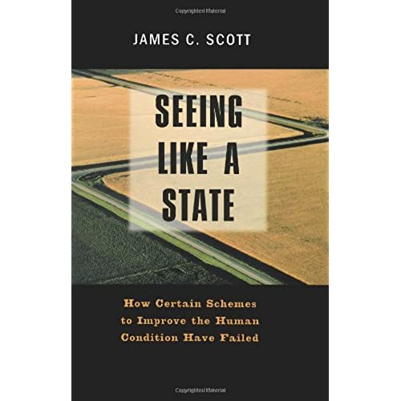

- title : Critique - Bicycles for the mind have to be see-through
- description :
- author : Tomas Petricek
- theme : white
- transition : none

****************************************************************************************************

## _Critique_: Bicycles for the mind have to be see-through (Kartik Agaram)

    

Tomas Petricek 
[tomasp.net](http://tomasp.net) | [tomas@tomasp.net](mailto:tomas@tomasp.net) | [@tomaspetricek](http://twitter.com/tomaspetricek)

****************************************************************************************************

## Convivial tools

----------------------------------------------------------------------------------------------------

## _Points to agree with_

_Convivial tools_  
Tool shouldn't just make some activity more convenient  
Tools should preserve individual agency!

_Avoiding 'bad' complexity_  
Don't paper over tool deficiencies with a second tool  
Maintenance leads to compounding claims on time  
Take the first tool out, think the problem anew

----------------------------------------------------------------------------------------------------

## _I admire the goals of Mu!_

> Mu is a stack designed from the ground up: to fit in a single brain and to not grow complex over time.

----------------------------------------------------------------------------------------------------

## Am I getting my bicycle...

----------------------------------------------------------------------------------------------------

## ...with a steel forge?

----------------------------------------------------------------------------------------------------

## Ways of thinking about tools?

_Pre-modern_  
Craftspeople crafting their own low-tech tools

_Modern_  
Scientist designs optimal tools for us

_Post-modern_  
Messy pluralist world that we need to navigate

****************************************************************************************************

## High modernism

----------------------------------------------------------------------------------------------------

## Seeing Like a State

----------------------------------------------------------------------------------------------------

## Design for legibility

_Scientific forestry_  
Spruce forests are easy to plant and harvest  
They get infected and are not resistant

_Soviet collectivization_  
Standardized organization of farming   
Not flexible enough to produce e.g. raspberries

----------------------------------------------------------------------------------------------------

## Design for legibility

* Trying to make sense of a thing, _affects its design_
* Leads to more legible designs _lacking other qualities_
* Certain schemes _have failed_, i.e. killed millions
* Leads to the creation of _dark twins_

----------------------------------------------------------------------------------------------------

## Mu and high modernism?

_Dark twins?_  
"As it executes instructions, the SubX emulator
monitors for labels that start with a `$watch-` prefix."

_Unexpected consequences?_  
What desirable systems would become hard to think/create using the Mu approach?

****************************************************************************************************

## Abstraction

----------------------------------------------------------------------------------------------------

## Abstraction is not convivial?

> Using fewer abstractions - carefully designed to leak in just the right
ways - can make the maintenance task more approachable to end users.

----------------------------------------------------------------------------------------------------

## Limiting abstraction

_Mu approach_ - pre-modern?  
Use with caution, make sure system 'fits in the brain'

_Haskell approach_ - modern?  
Optimal non-leaky abstractions designed by scientists

_Alternative approach?_ - post-modern?  
Cannot fit in the brain, but need to be able to cope..

----------------------------------------------------------------------------------------------------

## Cities: Don't fit the brain, but are legible

----------------------------------------------------------------------------------------------------

## Making sense of a city

 * I only know the _bits I need_ to know
 * I have some _general idea_ about the rest
 * I _can learn_ about other bits if I need to
 * Can we make software _more navigable_?

Kevin Lynch (1960). The Image of the City

****************************************************************************************************

## Conclusions

----------------------------------------------------------------------------------------------------

_Mu is an impressive attempt to address_

- We need convivial tools
- Abstraction is a major issue

_What is the approach and its dangers?_

- Is this pre-modern instead of post-modern?
- Is this suffering from high-modernist flaws?

 
 
 

Tomas Petricek | [tomas@tomasp.net](mailto:tomas@tomasp.net) | [@tomaspetricek](http://twitter.com/tomaspetricek)
