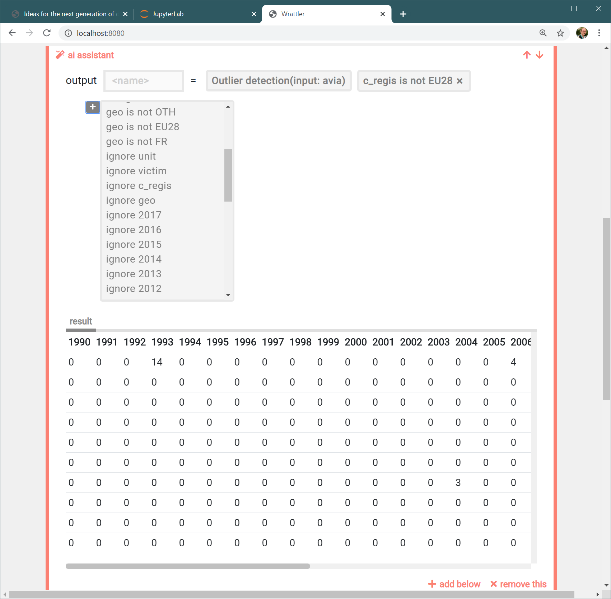

- title : TypeScript for F# Zealots
- description : TypeScript for F# Zealots
- author : Tomas Petricek
- theme : simple
- transition : none

****************************************************************************************************

# _**TypeScript** <br/> for F# zealots_

<br /><br /><br /><br /><br /><br />

**Tomas Petricek**

University of Kent and fsharpWorks<br />
[tomas@tomasp.net](mailto:tomas@tomasp.net) | [@tomaspetricek](http://twitter.com/tomaspetricek)

****************************************************************************************************


# _**TypeScript** <br/> for F# zealots_

<br /><br /><br /><br /><br /><br />

**Tomas Petricek**

University of Kent and fsharpWorks<br />
[tomas@tomasp.net](mailto:tomas@tomasp.net) | [@tomaspetricek](http://twitter.com/tomaspetricek)

****************************************************************************************************
- class: part

# _Wrattler_
## My experience with TypeScript

----------------------------------------------------------------------------------------------------


**Wrattler**

New notebook system for data science

_Interactive, smart dependency tracking and caching_

Client-side in TypeScript!

----------------------------------------------------------------------------------------------------

# _What Wrattler does_
## Next generation of data science notebooks

_<i class="fa fa-comments"></i>_ Polyglot _- mix multuple languages_

_<i class="fa fa-sync"></i>_ Reproducible _- dependency tracking_

_<i class="fa fa-hand-pointer"></i>_ Interactive _- do more in the browser_

_<i class="fa fa-brain"></i>_ Smart _- support for AI assistants_

----------------------------------------------------------------------------------------------------
- class: part

# _DEMO_
## Wrattler in Action

----------------------------------------------------------------------------------------------------

# _Building Wrattler_


**Why we choose TypeScript**

- _I'm an F# person!_
- _The team knew TypeScript_
- _Jupyter uses TypeScript_

<div class="fragment">

**Reflections on TypeScript**

- _The Good: Decent for functional programming!_
- _The Bad: Difficult trade-offs in type system_
- _The Ugly: You'd think it has simple syntax_

</div>

****************************************************************************************************
- class: part

# _The Good_
## Functional programming with TypeScript

----------------------------------------------------------------------------------------------------

# _Elm architecture_


**Wrattler code structure**

- _Immutable_ Model _and_ Event
- _Pure_ update _and_ render
- _Almost no dependencies_

<div class="fragment">

**Why not just use React**

- _Not very fancy user interface_
- _Avoid fast-paced JavaScript world_
- _Control over how things work_
- _Core React is pretty simple!_

</div>

----------------------------------------------------------------------------------------------------
- class: part

# _DEMO_
## Elm architecture in F#

----------------------------------------------------------------------------------------------------

# _Domain modelling_

**Modelling TODO list with F# types**

    [hide]
    open System

```
type Item = { Title : string; DueDate : DateTime }
type Model = list<Item>
type Message =
  | Add of Item
  | Reset
```

**Elm-architecture operations**

```
val update : Model -> Message -> Model
val render : (Message -> unit) -> Model -> Html
```

----------------------------------------------------------------------------------------------------

# _Functional TypeScript_


**Strict mode is great!**

- strictNullChecks _to avoid_ null
- noImplicitAny _to avoid_ any
- strict _for more good things_

<div class="fragment">

**Functional data types**

- _Interfaces for simple record types_
- _Unions with singleton types for DUs_
- _Discipline to avoid mutation :-)_

</div>

----------------------------------------------------------------------------------------------------
- class: part

# _DEMO_
## Elm architecture in TypeScript

----------------------------------------------------------------------------------------------------

# _Elmish in TypeScript_

**Model and discriminated union for events**

    interface Model {
      count : number | null
    }
    interface ResetEvent { kind:"reset" }
    interface UpdateEvent { kind:"update", by:number }
    type Event = ResetEvent | UpdateEvent

**Elm-architecture operations**

```
render : (trigger:((event:TEvent) => void), state:TState) => VNode
update : (state:TState, event:TEvent) => TState
```


****************************************************************************************************
- class: part

# _The Bad_
## Trade-offs in the type system

----------------------------------------------------------------------------------------------------


**Extensibility**

External language  
_Kernel with eval_

Language plugin  
_Block with custom user interface_

AI assistants  
_Clever component_

----------------------------------------------------------------------------------------------------

# _Language plugins_

**Custom user interface, evaluation, dependencies**

```typescript
interface LanguagePlugin {
  language : string
  editor : Editor<EditorState, any>

  parse(code:string) : Block
  evaluate(context:EvaluationContext, node:Graph.Node)
    : Promise<EvaluationResult>
  bind(context:BindingContext, block: Block)
    : Promise<BindingResult>
  save(block:Block):string;
}
```
----------------------------------------------------------------------------------------------------
- class: part

# _DEMO_
## Implementing language plugins

----------------------------------------------------------------------------------------------------

# _Classes vs. Interfaces (1/5)_

**When you might want a class**

 - _If you want object-oriented style_
 - _If you want checks using_ instanceof

**When you do not want a class**

 - _If you want somewhat lighter syntax_
 - _If you want somewhat more flexibility_

----------------------------------------------------------------------------------------------------

# _Classes vs. Interfaces (2/5)_

**Anonymous interface implementations are great!**

```typescript
const myLangPlugin : Langs.LanguagePlugin = {
  language: "merger",
  iconClassName: "fa fa-object-group",
  editor: mergerEditor,
  getDefaultCode: (id:number) => "",
  parse: (code:string) : MergerBlock => {
    let [outName, inputs] = code.split('=')
    return { language: "merger",
      output: outName, inputs: inputs.split(',') }
  }
}
```

----------------------------------------------------------------------------------------------------

# _Classes vs. Interfaces (3/5)_

**But switching to a class is pain**

```typescript
class MyLangPlugin implements Langs.LanguagePlugin {
  language = "merger"
  iconClassName = "fa fa-object-group"
  editor = mergerEditor
  getDefaultCode = (id:number) => ""
  parse(code:string) : MergerBlock {
    let [outName, inputs] = code.split('=')
    return { language: "merger",
      output: outName, inputs: inputs.split(',') }
  }
}
```

----------------------------------------------------------------------------------------------------

# _Classes vs. Interfaces (4/5)_

**Writing constructors is so much work!**

```typescript
export class JsLanguagePlugin implements LanguagePlugin  {
  readonly language: string
  readonly editor: Langs.Editor<JsState, JsEvent>
  readonly datastoreURI:string

  constructor(datastoreURI:string) {
    this.language = "javascript"
    this.editor= javascriptEditor
    this.datastoreURI = datastoreURI
  }
  parse (code:string): JavascriptBlockKind{
    return new JavascriptBlockKind(code);
  }
}
```

----------------------------------------------------------------------------------------------------

# _Classes vs. Interfaces (5/5)_

**Can I get F# implicit class syntax please?**

```
type JsLanguagePlugin(datastoreURI:string)
  let language = "javascript"
  let editor= javascriptEditor
  let datastoreURI = datastoreURI

  interface LanguagePlugin with
    member x.parse(code:string) =
      JavascriptBlockKind(code)
```

----------------------------------------------------------------------------------------------------

# _Breaking the type system (1/3)_

**You cannot fully avoid the any type**

```typescript
let response = await axios.get(url, {headers:{Inputs:header}});
let data = response.data;

return data.map(r => ({
    name: r.name,
    path: r.path.split("/").filter((p:string) => p != "")
  }));
```

_F# type providers are nice, but don't always help_

_You can get more checks with_ noImplicitAny

----------------------------------------------------------------------------------------------------

# _Breaking the type system (2/3)_

**It is still JavaScript underneath...**

```
interface Variable {
  name : string
}
type Scope = { [variable:string]: Variable }

function getVarLength(scope:Scope, k:string) : number {
  return scope[k] != undefined ? scope[k].name.length : -1;
}
```

_Can_ getVarLength _fail because_ name _is_ undefined?

----------------------------------------------------------------------------------------------------

# _Breaking the type system (3/3)_

**It is still JavaScript underneath...**

```
interface Variable {
  name : string
}
type Scope = { [variable:string]: Variable }

function getVarLength(scope:Scope, k:string) : number {
  return scope[k] != undefined ? scope[k].name.length : -1;
}

let evil = getVarLength({}, "toString") // Boom!
```

----------------------------------------------------------------------------------------------------

# _Poor type inference (1/3)_

**F# can typically infer types from the first use**

    [hide]
    let evaluateCode (code:string) (addOutput:string -> unit) : unit = ()

```
let mutable outputs = []
let addOutput = fun f ->
  outputs <- f::outputs

evaluateCode code addOutput
```

----------------------------------------------------------------------------------------------------

# _Poor type inference (2/3)_

**Type inference in the strict mode is poor**

```typescript
var outputs = [];
var addOutput = function(f) {
  outputs.push(f)
}
evaluateCode(code, addOutput)
```

----------------------------------------------------------------------------------------------------

# _Poor type inference (3/3)_

**Type inference in the strict mode is poor**

```typescript
var outputs : ((id:string) => void)[] = [];
var addOutput = function(f:(id:string) => void) {
  outputs.push(f)
}
evaluateCode(code, addOutput)
```

****************************************************************************************************
- class: part

# _The Ugly_
## Syntax for functional programming

----------------------------------------------------------------------------------------------------



**AI assistants**

Tools for semi-automated data wrangling

_New code block with custom user interface_

----------------------------------------------------------------------------------------------------
- class: part

# _DEMO_
## Wrattler AI assistants

----------------------------------------------------------------------------------------------------
- class: part

# _DEMO_
## Implementing AI assistant code block

----------------------------------------------------------------------------------------------------

# _Two function syntaxes (1/2)_

**Function definition using a lambda**

```typescript
let createAiaEditor = (assistants:AiAssistant[])
    : Langs.Editor<AiaState, AiaEvent> => ({
  initialize: (id:number, block:Langs.Block) => {  
    let aiaBlock = <AiaBlock>block
    return { id: id, block: aiaBlock, chain: [],
      expanded: false, assistants: assistants }
  }
});
```

----------------------------------------------------------------------------------------------------

# _Two function syntaxes (2/2)_

**Explicit function using a keyword**

```typescript
function createAiaEditor(assistants:AiAssistant[])
    : Langs.Editor<AiaState, AiaEvent> {
  return { initialize: (id:number, block:Langs.Block) => {  
    let aiaBlock = <AiaBlock>block
    return { id: id, block: aiaBlock, chain: [],
      expanded: false, assistants: assistants }
  } };
};
```

----------------------------------------------------------------------------------------------------

# _Generating HTML (1/2)_

**Building HTML nodes is hard work!**

```typescript
let previewButton =
  h('button', { onclick:() =>
    ctx.evaluate(cell.editor.id) }, ["Evaluate!"] )    
let spinner =
  h('i', {class: 'fa fa-spinner fa-spin' }, [])
let preview = h('div', {class:'preview'}, [
  (cell.code.value == undefined) ?
    (cell.evaluationState == 'pending') ? spinner : previewButton :
  (createOutputPreview(cell, cell.code.value))]);
```

----------------------------------------------------------------------------------------------------

# _Generating HTML (2/2)_

**F# comprehensions are so nice!**

```
let preview = h?div ["class"=>"preview"] [
  match cell.code.value, cell.evaluationState with
  | None, "pending" ->
      yield h?i ["class" => "fa fa-spinner" ] []
  | None, _ ->
      yield h?button [ "onclick" =!> fun _ _ ->
        ctx.evaluate cell.editor.id ] [ text "Evaluate!" ]
  | Some value, _ ->
      yield createOutputPreview cell value
]
```

****************************************************************************************************
- class: part

# _Conclusions_
## TypeScript for F# Zealots

----------------------------------------------------------------------------------------------------

# _TypeScript for F# Zealots_
## Lessons learned from Wrattler project

_<i class="fa fa-long-arrow-alt-right"></i> Can support functional patterns_

_<i class="fa fa-shapes"></i> Works fine with Elm architecture_

_<i class="fa fa-code"></i> Not designed for functional style_

_<i class="fa fa-user-secret"></i> Trying to be JavaScript or not?_

----------------------------------------------------------------------------------------------------

<div style="background:black;position:absolute;width:200%;right:51%;height:400%;top:-100%;z-index:-1000;"></div>
<table style="width:100%"><tr><td style="width:50%;padding:0px" class="white">

### F# for the web

_<i class="fa fa-dot-circle"></i> Functional core_

_<i class="fa fa-lock"></i> Safe and clean_

_<i class="fa fa-arrows-alt"></i> Extra integration_

_<i class="fa fa-money-bill"></i> Makes trade-offs_

</td><td style="width:50%;padding:0px" class="fragment">

### TypeScript

_<i class="fa fa-shapes"></i> Many styles_

_<i class="fa fa-object-group"></i> OOP, functional_

_<i class="fa fa-archive"></i> Does not hide JS_

_<i class="fa fa-cloud"></i> Cloudy mix of all_

</td></tr></table>

----------------------------------------------------------------------------------------------------

# _TypeScript for F# Zealots_


TypeScript experience  
_Elmish architecture works!_  
_Hard to be disciplined_

Project context  
_Team, community, app type_  
_Would I choose TypeScript again?_

<br />

**Tomas Petricek**, _University of Kent and fsharpWorks_<br />
[tomas@tomasp.net](mailto:tomas@tomasp.net) | [@tomaspetricek](http://twitter.com/tomaspetricek)
