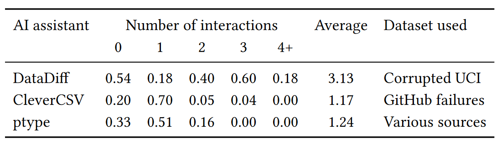

- title : AI assistants: A framework for semi-automated, accountable, and tooling-rich data wrangling
- description : AI assistants: A framework for semi-automated, accountable, and tooling-rich data wrangling
- author : Tomas Petricek
- theme : simple
- transition : none

****************************************************************************************************
- class: front

# _**AI assistants**: A framework for semi-automated, accountable, and tooling-rich data wrangling_

**Tomas Petricek**  
_with Gerrit J.J. van den Burg, Alfredo Nazabal, Taha Ceritli, Ernesto Jimenez-Ruiz, Christopher K. I. Williams_

_University of Kent & The Alan Turing Institute_ 
[tomas@tomasp.net](mailto:tomas@tomasp.net) | [@tomaspetricek](http://twitter.com/tomaspetricek)

****************************************************************************************************
- class: part

# _Motivation_
## AI tools for data wrangling

----------------------------------------------------------------------------------------------------

# _Data wrangling_

**Getting data into usable form**

- _Merge data from multiple sources_
- _Fix errors and missing data_
- _Add semantic information_

**Sure you want to be a data scientist?**

- _Takes 80% of data science project_
- _Tedious iterative manual process_

**Can automatic AI tools help with this?**

----------------------------------------------------------------------------------------------------
- class: part

# _DEMO_
## Merging real-world CSV files with datadiff

----------------------------------------------------------------------------------------------------

# _What do we want_
## Semi-automatic data wrangling tools that are

_<i class="fa fa-sync"></i>_ Interactive _- Let analyst guide and correct things_

_<i class="fa fa-plug"></i>_ Unified _- Share common structure_

_<i class="fa fa-search"></i>_ Accountable _- Not just opaquely transform data_

_<i class="fa fa-wrench"></i>_ Tooling-rich _- Integrate with notebook tools_

****************************************************************************************************
- class: part

# _Wrattler_
## A glimpse of the future

----------------------------------------------------------------------------------------------------

**Wrattler project**

Research extension for JupyterLab

_Mix languages, build interactive tools, analyse code provenance_

----------------------------------------------------------------------------------------------------
- class: part

# _DEMO_
## Wrattler and outlier detection

----------------------------------------------------------------------------------------------------

**How AI assistants work**

0. _Start with no constraints_
1. _Guess a cleaning script_  
2. _Run it to show preview_  
3. _Offer constraints to add_
4. _Continue from 1_

****************************************************************************************************
- class: part

# _Theory_
## Formalizing AI assistants

----------------------------------------------------------------------------------------------------
- class:mathslide

# _Formal model_

**AI assistant works with**

- $e$ _– expressions representing cleaning scripts_
- $\mathcal{D}$ _– assistant-specific data representation_
- $H$ _– traces of human interactions_

**AI assistant is defined by**

- $f(e, \mathcal{D})=\mathcal{D}'$ _– evaluation function_
- $\mathit{best}_{\mathcal{D}}(H)=e$ _– recommends best expression_
- $\mathit{choices}_{\mathcal{D}}(H)=(H_1, \ldots, H_n)$ _– offers constraints_
- $H_0$ _– empty human interaction trace_

----------------------------------------------------------------------------------------------------

# _Tooling support_
## Interacting with an AI assistant in Wrattler

----------------------------------------------------------------------------------------------------
- class:mathslide

# _Machine learning model_

**Over in the machine learning world**

- $Q_H(\mathcal{D}, e)$ _– objective (scoring) function_
- $E_H$ _– set of expressions allowed under_ $H$

**Optimization-based AI assistants**  
_Solve problem of finding best allowed expression_  

$\mathit{best}_{\mathcal{D}}(H) = \mathit{arg~max}_{e\in E_H}~Q_H(\mathcal{D}, e)$

----------------------------------------------------------------------------------------------------

# _Formal model_
## Why AI assistants need a formal model

_<i class="fa fa-magic"></i> Capture what an AI assistant really is_

_<i class="fa fa-puzzle-piece"></i> Formally define the interface_

_<i class="fa fa-wrench"></i> Explain how tools can use AI assistants_

_<i class="fa fa-clone"></i> Lets us easily capture many examples_

****************************************************************************************************
- class: part

# _Examples_
## Some useful AI assistants

----------------------------------------------------------------------------------------------------
- class: part

# _DEMO_
## Datadiff AI assistant

----------------------------------------------------------------------------------------------------
- class:mathslide

# _Datadiff AI assistant_

**Patches and constraints**

- Patches _– recode, permute, insert, delete, linear_
- Constraints _– nomatch, notransform, match_

**Optimization-based datadiff assistant**

- $H_0$ _– empty set of constraints_
- $e$ _– list of patches to apply_
- $E_H$ _– expressions allowed under conditions_ $H$

----------------------------------------------------------------------------------------------------
- class:mathslide

# _Outlier detection AI assistant_

**Different kind of interactivity**

- _Human builds expression by choosing_
- Choices _suggests possible filters to add_
- Best _simply returns the selected filters_

**Still fits with the formal model!**

- $\mathit{best}_{\mathcal{D}}(H)=H$ _– trace is an expression_
- $\mathit{choices}_{\mathcal{D}}(H)=(H\cup \{f_1\}, \ldots, H\cup\{ f_n \})$
- _Filters_ $f_1, \ldots, f_n$ _generated by clever AI_

****************************************************************************************************
- class: part

# _Evaluation_
## What can we do with this

----------------------------------------------------------------------------------------------------

# _Evaluation_
## What can we do with AI assistants

_<i class="fa fa-th"></i> Many existing tools fit this model!_

_<i class="fa fa-brain"></i> Can be extended for Bayesian framework_

_<i class="fa fa-user"></i> Qualitative evaluation using case studies_

_<i class="fa fa-stopwatch"></i> Count necessary human interactions_

----------------------------------------------------------------------------------------------------

# _Quantitative evaluation_

**Can wrangle more data with a few hints!**

- _But any evaluation is tricky_
- _About specific tools, not the framework_
- _Needs ad-hoc data set for each assistant_

****************************************************************************************************
- class: part

# _Conclusions_
## Framework of AI assistants

----------------------------------------------------------------------------------------------------

**AI assistants**: A framework for semi-automated, accountable, and tooling-rich data wrangling

 

- _Programming theory meets machine learning!_
- _Capture important class of ML tools!_
- _But where & how should we publish this??_

 

**Tomas Petricek**, _University of Kent_ 
[tomas@tomasp.net](mailto:tomas@tomasp.net) | [@tomaspetricek](http://twitter.com/tomaspetricek)
