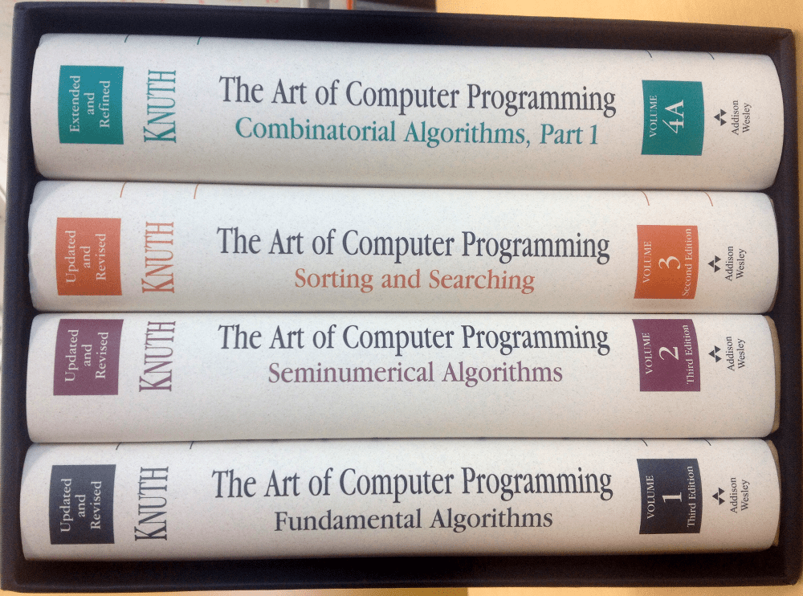
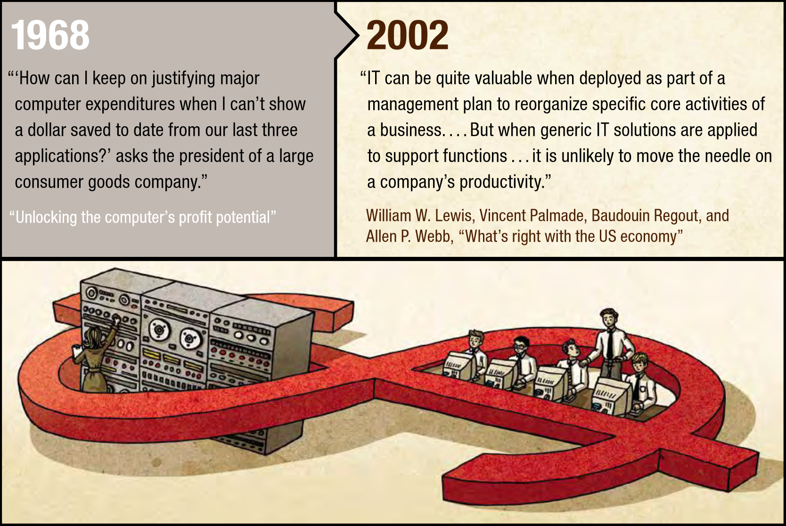

- title : Programming as architecture, urban planning and design?
- description : Programming as architecture, urban planning and design?
- author : Tomas Petricek
- theme : simple
- transition : none

****************************************************************************************************
- class: front

# _**Cultures of programming** An incomplete history of getting programs to behave_

**Tomas Petricek**, _University of Kent_ 
[tomas@tomasp.net](mailto:tomas@tomasp.net) | [@tomaspetricek](http://twitter.com/tomaspetricek)

****************************************************************************************************

## How did software get reliable without proof?

(Hoare, 1996)

_"Twenty years ago it was reasonable to predict that the size of software
would be severely limited by [its] unreliability."_

_"Fortunately, the problem of program correctness has turned out to be far less serious than predicted."_

_"So [a question arises]: why have twenty years of pessimistic predictions been falsified?"_

****************************************************************************************************
- class: part

# _Origins_
## From black art to a discipline

----------------------------------------------------------------------------------------------------

_"Programming in the early 1950s was a black art, a private arcane matter involving a programmer,
a problem, a computer, and perhaps a small library of subroutines and a primiti- ve assembly program"_

(Backus, 1976)

----------------------------------------------------------------------------------------------------

# _Establishing a discipline_

**Hacker culture of programming**

- _Learning through practice_
- _Favours individual skills_
- _Knowledge not written down_

**Establishing a discipline**

- _Mathematical computer science_
- _Programming as engineering discipline_
- _Programming as scientific management_

----------------------------------------------------------------------------------------------------

**Mathematical culture**

Programming as mathematics

_Notion of algorithm becomes central_

_Use formal methods to show correctness_

Worked well in academia!

----------------------------------------------------------------------------------------------------

**Engineering culture**

_The black art of programming has to make a way for the science of software engineering._

NATO 1968 and 1969 Conferences on Software Engineering

----------------------------------------------------------------------------------------------------

**Managerial culture**

Unlocking Computer’s Profit Potential (McKinsey, 1968)

_Control over budgets, complexity, scheduling and the workforce._

_Focus on organisation and development proces_

****************************************************************************************************
- class: part

# _Debugging_
## Getting programs to work

----------------------------------------------------------------------------------------------------

# _Debugging Epoch Opens (1965)_

Limiting factors for computing

- _Hardware until mid-1950s_
- _Programming until mid-1960s_
- _What now? Now: debugging._

Terminology in the 1960s

- _Program checkout_
- _Debugging and testing_
- _Error handling_

----------------------------------------------------------------------------------------------------

# _On-line debugging (1966)_

_"With some care, it has been possible, for example, to find a bug while at a breakpoint in
running a test case, call the [structure] editor to make a correction, run the program on a
simpler test case to verify the correctness of the change, then resume execution of the original
test case from the breakpoint."_

****************************************************************************************************
- class: part

# _Error handling_
## Recovering from failures

----------------------------------------------------------------------------------------------------

**ON in PL/1 (1964)**

_Allow writing  
robust programs_

_Handle 23 known errors_

**ERRORSET in LISP (1962)**

_More control to programmers_

----------------------------------------------------------------------------------------------------

# _Exceptions_

**John B. Goodenough (1975)**

- _Introduces "exceptions"_
- _Language feature_
- _Theory of exceptions_

**Exception as boundary object**

- _Studied formally_
- _Implemented in compilers_
- _Handled in reliable ways_

----------------------------------------------------------------------------------------------------

**Exceptions in telecom**

_One machine is not enough_

_When something goes wrong, kill the process_

_Supervisor process restars_

Exceptions as a basis for programming style

****************************************************************************************************
- class: part

# _Testing_
## Getting programs to solve the problem

----------------------------------------------------------------------------------------------------

**Computer Program Test Methods Symposium (1972)**

_Testing distinguished  
from debugging_

_Companies hire_ test managers _and_ test technicians

_Test automation establishes a_ test _as an artifact_

----------------------------------------------------------------------------------------------------

# _Growth of software testing_

(Gelperin & Hetzel, 1988)

**Demonstration period (1957-78)**

 - _Test to show that programs  
   work as required_
 - _Alternative to proofs_

**Destruction period (1978-82)**

  - _Test to find errors_
  - _Enables new tool developments_
  - _Mutation testing, random testing_

----------------------------------------------------------------------------------------------------

**Testing as part of the development process**

_Testing after coding in Waterfall (1970)_

Unit testing _separate from_ acceptance tests

----------------------------------------------------------------------------------------------------

# _Extreme programming_

**Test-Driven Development**

- _Programmers & customers_
- _Write tests first_
- _Then write code and improve_

**Development methodology**

- _From black art to engineering_
- _Engineering take on  
  managerial methods_

****************************************************************************************************
- class: part

# _Conclusions_
## Cultures of programming

----------------------------------------------------------------------------------------------------

**What happened  
to debugging?**

_Conceptually similar to '60s_  
_Learned through practice_  
_Hacker culture only_

No boundary object to exchange with other cultures?

----------------------------------------------------------------------------------------------------

# _Cultures of programming_
## Ways of trusting software systems

_<i class="fa fa-keyboard"></i>_ Hacker _- Trust person making it_

_<i class="fa fa-wrench"></i>_ Engineering _- Rely on tools_

_<i class="fa fa-project-diagram"></i>_ Managerial _- Rely on processes_

_<i class="fa fa-infinity"></i>_ Mathematical _- Trust formal proofs_

----------------------------------------------------------------------------------------------------
- class: front

# _**Cultures of programming**_
## A useful perspective for history of programming

_<i class="fa fa-subscript"></i> Mathematization of programming_

_<i class="fa fa-wrench"></i> Rise of software engineering_

_<i class="fa fa-terminal"></i> Interactive programming_

_<i class="fa fa-tape"></i> Programming with types_  

 

Papers: [http://tomasp.net/academic](http://tomasp.net/academic) 
Contact: [t.petricek@kent.ac.uk](mailto:t.petricek@kent.ac.uk)
