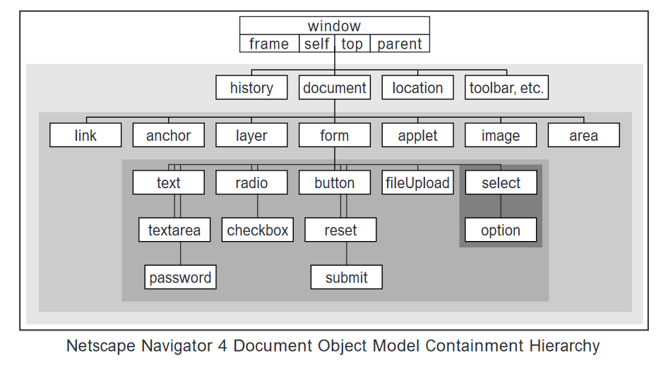
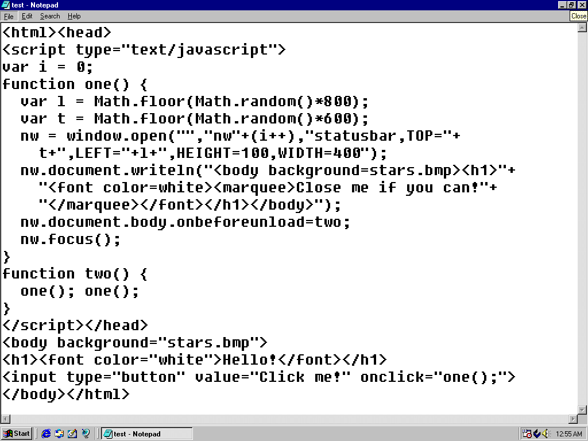
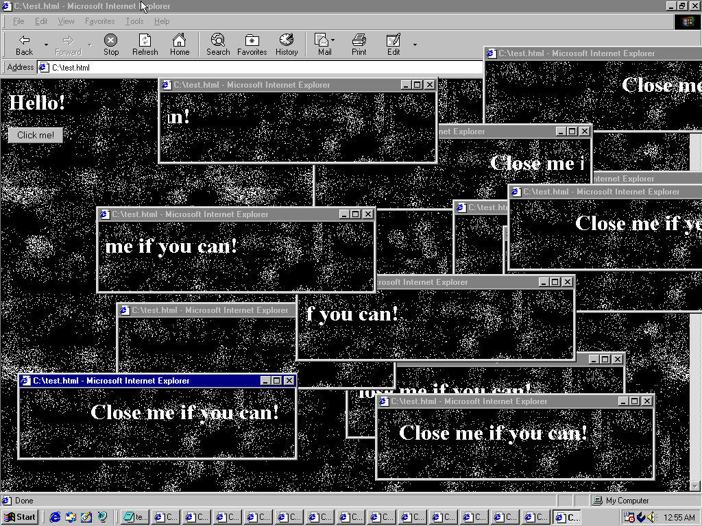
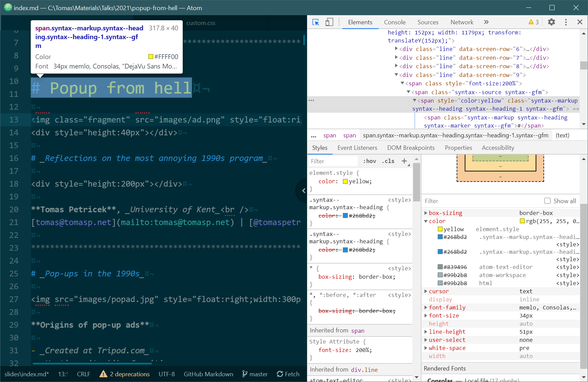
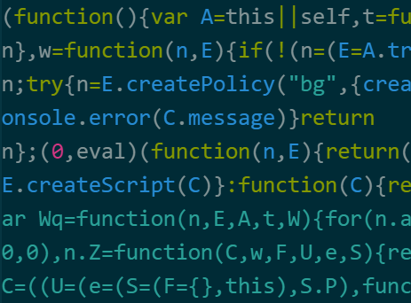
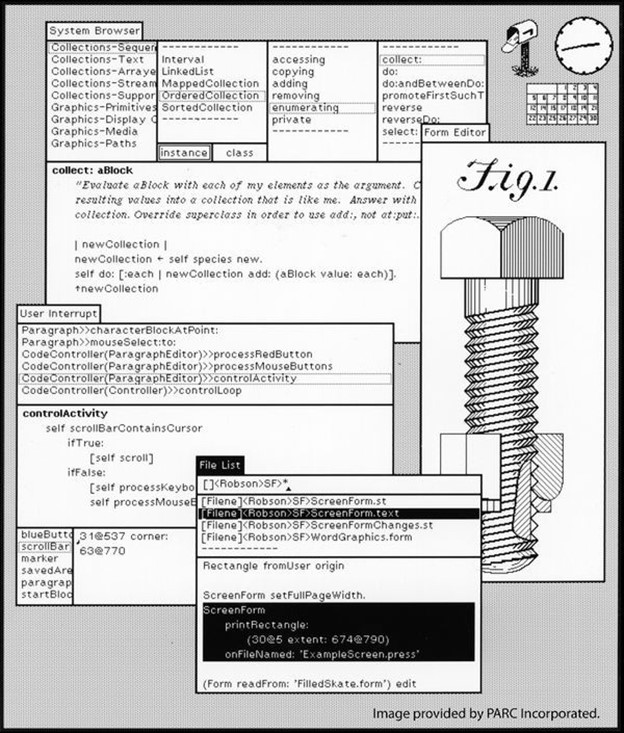

- title : Popup from hell
- description : Popup from hell
- author : Tomas Petricek
- theme : simple
- transition : none

****************************************************************************************************
- class: front

# Popup from hell

# _Reflections on the most annoying 1990s program_

**Tomas Petricek**, _University of Kent_ 
[tomas@tomasp.net](mailto:tomas@tomasp.net) | [@tomaspetricek](http://twitter.com/tomaspetricek)

****************************************************************************************************

# _Pop-ups in the 1990s_

**Origins of pop-up ads**

- _Created at Tripod.com_
- _Hosting site like Geocities_
- _Disassociate ad from content_

**Normal web design**

- _Custom dialog windows_
- _Manage window size & look_
- _Normal programs use windows!_

****************************************************************************************************

**Technical side**

JavaScript _first appeared in the Netscape Navigator browser in 1995_

window.open _and_ window.onunload _exist from version 1_

****************************************************************************************************

**Social side**

Geocities

_Fairly well-documented creative online community of the 1990s_

****************************************************************************************************
- class: part

# _DEMO_
## Popup from hell

----------------------------------------------------------------------------------------------------

----------------------------------------------------------------------------------------------------

****************************************************************************************************

**No more fun :-(**

Popup blocking commonplace in  the early 2000s

_Blocks popups on page load, unload and timer events, but not on click_

****************************************************************************************************

**Well, actually...**

_Same user experience, recreated using harder to block technique_

****************************************************************************************************
- class: part

# _Reflections_
## What is a program

****************************************************************************************************

# _What is a program_
## Popup from hell that cannot be closed

_<i class="fa fa-school"></i> Source code from my highschool years?_

_<i class="fa fa-globe"></i> Other equivalent code from the web?_

_<i class="fa fa-lightbulb"></i> More general idea of an evil popup?_

_<i class="fa fa-window-restore"></i> System change prevents it from working!_

_<i class="fa fa-user-secret"></i> Environment determines if it is "bad"_

****************************************************************************************************
- class: part

# _REFLECTIONS_
## Two eras of the web

****************************************************************************************************

<table class="ts" style="margin-top:40px"><tr><td style="width:45%;color:white" class="fragment tw">

### 1990s

<i class="fa fa-code"></i> <em>View source</em>

<i class="fa fa-paste"></i> <em>Copy & paste</em>

<i class="fa fa-window-restore"></i> <em>Windows work!</em>

</td><td style="width:45%" class="fragment">

### 2010s

<i class="fa fa-file"></i> <em>Compiled code</em>

<i class="fa fa-magic"></i> <em>Custom elements</em>

<i class="fa fa-cogs"></i> <em>WASM + Canvas</em>

</td></tr></table>

****************************************************************************************************

**Google Docs**

Replace built-in editable element with custom code (May 2021)

_Better performance_  
_Accessibility issues_  
_Affects extensions_

****************************************************************************************************

**Atom vs Code**

Mini-editor war  
of the 2010s

_Code enforces information hiding for performance, limits unexpected extensibility_

****************************************************************************************************
- class: part

# _REFLECTIONS_
## Evolution of systems

****************************************************************************************************

# _Growth of opacity_

**JavaScript code**

- _From small clear code_
- _To compiled and minified_
- _And compiled assembly_

**Browser element use**

- _From window.open to DOM_
- _And custom canvas element_
- _There are exceptions!_

****************************************************************************************************

# _Embedding_
## Use of system structure for program aspects

_<i class="fa fa-folder-open"></i> Program running in a system_

_<i class="fa fa-object-group"></i> Web page embedded in a browser_

_<i class="fa fa-desktop"></i> Smalltalk embedded in a host OS_

****************************************************************************************************

# _Deep vs. shallow_

**Shallow embedding**

- Reuse system features
- Limited control
- Legible to the system
- Allows accessibility, blocking

**Deep embedding**

- Redo everything from scratch
- Lose commonality, accessibility
- Gain control and flexibility

****************************************************************************************************

# _Deep embedding_
## Why and how did it happen?

_<i class="fa fa-window-restore"></i>_ Popups from hell  
_<i class="fa fa-xx"></i> Avoiding being understood by browser_

_<i class="fa fa-cogs"></i>_ Compilation to JavaScript  
_<i class="fa fa-xx"></i> Use "better" programming languages_

_<i class="fa fa-palette"></i>_ Replacing built-in features  
_<i class="fa fa-xx"></i> Programmers think they can do better_

****************************************************************************************************

# _Deep embedding_
## Is this an inevitable development?

_<i class="fa fa-puzzle-piece"></i> Attractive puzzle solving activity!_

_<i class="fa fa-users"></i> Community may be too small to do it_

_<i class="fa fa-recycle"></i> Community culture may favour reuse_

_<i class="fab fa-apple"></i> App Store may block doing this_

****************************************************************************************************
- class: part

# _Summary_
## Popup from hell

****************************************************************************************************

# _Summary_
## Popup from hell

_<i class="fa fa-city"></i>_ Laws of software system evolution?  
_<i class="fa fa-xx"></i> When is deep embedding inevitable?_

_<i class="fa fa-globe"></i>_ Embedding and information hiding  
_<i class="fa fa-xx"></i> Deep embedding hides information from system_

 

**Tomas Petricek**, _University of Kent_ 
[tomas@tomasp.net](mailto:tomas@tomasp.net) | [@tomaspetricek](http://twitter.com/tomaspetricek)
