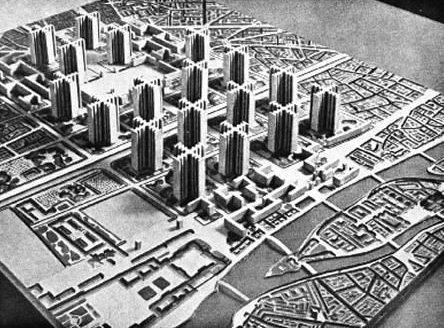
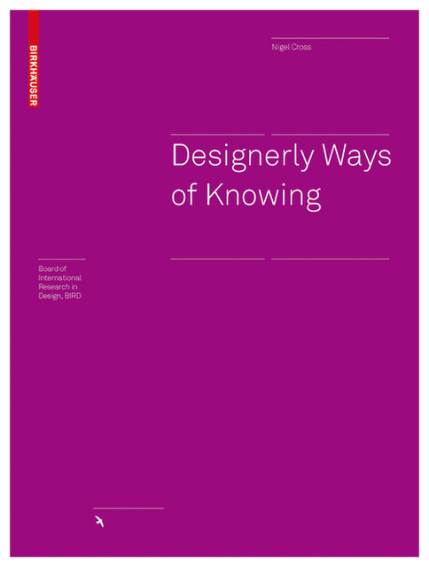

- title : Programming as architecture, urban planning and design?
- description : Programming as architecture, urban planning and design?
- author : Tomas Petricek
- theme : simple
- transition : none

****************************************************************************************************
- class: front

# _**Programming** as architecture, urban planning and design?_

**Tomas Petricek**, _University of Kent_ 
[tomas@tomasp.net](mailto:tomas@tomasp.net) | [@tomaspetricek](http://twitter.com/tomaspetricek)

----------------------------------------------------------------------------------------------------

# _Disclaimer_
## This talk should not be taken too seriously!

_<i class="fa fa-desktop"></i>_ What is this about?  
_<i class="fa fa-xx"></i> Programs, languages or programming?_

_<i class="fa fa-fire"></i>_ Anything goes?  
_<i class="fa fa-xx"></i> Inconsistencies maybe, pluralism certainly_

----------------------------------------------------------------------------------------------------

<table class="grid"><tr>
<td>

**What my boss thinks I do?**

Programming language theory, data science applications

</td>
<td class="fragment">

**What I think I actually do?**

Programming systems, cultures of programming, philosophy

</td>
<td class="fragment">

**What you will think I do?**

Architecture, urban planning and design

</td>
</tr></table>

#### You should read and cite my papers but this talk won't help :-)

----------------------------------------------------------------------------------------------------

# _Focus of the talk_

**Complex problems & systems**

- _Solving complex problems_
- _Using interactive systems_
- _Tackling essential complexity?_

#### Essential complexity (Brooks) E-programs (Lehman, 1980)

**Alternative paradigms**

- _Programming as mathematics?_
- _Programming as engineering discipline?_
- _Programming as something else?_

#### What about our way of working is historical accident?
#### Alternative paradigms, Chang's complementary science

****************************************************************************************************
- class: part

# _Design and urban planning_
## Does this even make sense?

----------------------------------------------------------------------------------------------------

# _Designerly Ways of Knowing_

**Science**  
_Study natural world using  
experiment aiming for truth_

**Art**  
_Study human experience using  
metaphor aiming for justice_

**Design**  
_Study the artificial using  
synthesis aiming for appropriateness_

----------------------------------------------------------------------------------------------------

# _Urban planning_

 
<table class="grid"><tr>
<td style="width:50%">

**<i class="fa fa-city"></i> Jacobs on cities**

Problems of simplicity  
_Fully analyzable_

Unorganized complexity  
_Statistically analyzable_

Organized complexity  
_Non-reducible_

</td>
<td class="fragment" style="width:50%">

**<i class="fa fa-rocket"></i> Parnas on software**

Analogy systems
_Continuous models_

Repetitive digital  
_Reduce via abstraction_

Non-repetitive digital
_Non-reducible_

</td></tr></table>

****************************************************************************************************
- class: part

# _Understanding_
## Conceptual coherence

----------------------------------------------------------------------------------------------------

# _Conceptual coherence_

> 
>
> Any product that is sufficiently big (...) must be conceptually coherent to the
> single mind of the user and at the same time desinged by many minds.
>
> 
Brooks (1995)

----------------------------------------------------------------------------------------------------

# _Two kinds of cities_

> The fact that the layout of the city (...)  
> lacks a consistent geometric logic does  
> not mean that it was at all confusing  
> to its inhabitants.
> Scott (1998)

----------------------------------------------------------------------------------------------------

# _Understanding cities_

**Legibility of a cityscape**

- _Old city privileges local knowledge_
- _Illegibility provides political safety_
- _Grid makes public services easy_

**Legibility of a software**

- _Hackers use local knowledge, engineers outside knowledge?_
- _How open-source communities work?_
- _Grid in spreadsheets for addressing?_

----------------------------------------------------------------------------------------------------

**Understanding cities**

I know areas around a couple of the stops and some links

_There is a way of learning new parts  
if I need that_

----------------------------------------------------------------------------------------------------

# _Image of a city_

**City as perceived by inhabitants**

- _Districts, landmarks, pathways_
- _Easily identifiable and groupable_
- _Subway & bike give different images_

**Can we build software like this?**

- _Messy but navigable?_
- _Shareable local knowledge?_
- _Inhabitable programming systems?_

#### Reference to Richard Gabriel & Christopher Alexander?

----------------------------------------------------------------------------------------------------

**Did we lose something along the way?**

_Interlisp and Smalltalk appear more inhabitable and navigable_

**Complementary science**

_Recover and update interesting past ideas!_

****************************************************************************************************
- class: part

# _Theories_
## Is there a place for elegant theories?

----------------------------------------------------------------------------------------------------

# _Programming as maths_

**Good research strategy**

- _Defines Kuhnian normal science_
- _Algorithm as a central concept_
- _Established it academically_

**Historical accident?**

- _Just one programming culture_
- _Focuses on mathematical questions_
- _Misses more important ones?_

----------------------------------------------------------------------------------------------------

**Utopian urban planning**

Modernism, radiant city and garden city plans

_Housing blocks in green or rural spaces_

_Clear organization of functions of the city_

----------------------------------------------------------------------------------------------------

# _Jane Jacobs_

**Life and Death of Great  
American Cities (1961)**

- _East Village & Boston North End_
- _Demolition and redevelopment?_
- _Lively city streets that work_

**How theory does not work**

- _Informal social control_
- _Enabled by mixed function_
- _Density and diversity_

----------------------------------------------------------------------------------------------------

# _Utopian Software_

**Rigorous software methods**

- _Non-reducibility of problems_
- _Are simple principles too simple?_
- _Abstraction & information hiding?_

**How to study such questions?**

- _Describe concrete cases  that work despite theory_
- _Focus on unaverage indicators_

****************************************************************************************************
- class: part

# _Conclusions_
## Design, architecture, urban planning

----------------------------------------------------------------------------------------------------

# _What did not fit_

**Vernacular architecture**

- _Architecture without architects_
- _Developed by gradual adaptation_
- _Longer time-frame in software?_

**Designing for maintenance**

- _Teaching maintenance habits_
- _Materials that look bad before going bad_

----------------------------------------------------------------------------------------------------

# _Programming_
## As architecture, urban planning and design?

_<i class="fa fa-city"></i> At least as good metaphor as  
<i class="fa fa-xx"></i> engineering and mathematics!_

_<i class="fa fa-globe"></i> Incommensurable paradigm  
<i class="fa fa-xx"></i> asking different questions?_

 

**Tomas Petricek**, _University of Kent_ 
[tomas@tomasp.net](mailto:tomas@tomasp.net) | [@tomaspetricek](http://twitter.com/tomaspetricek)
