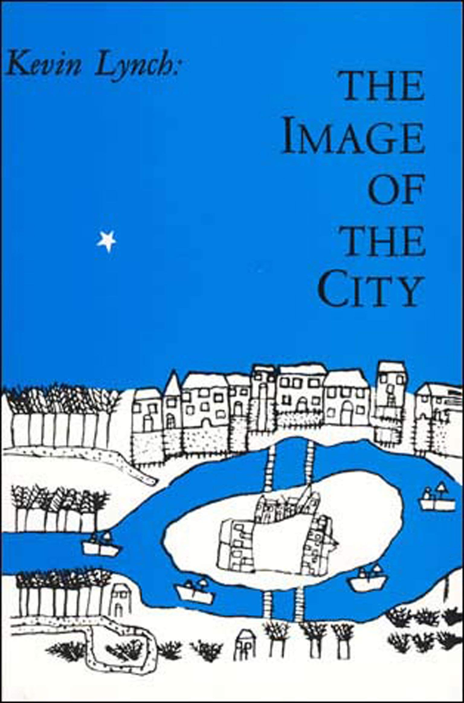

- title : Programming as architecture, urban planning and design?
- description : Programming as architecture, urban planning and design?
- author : Tomas Petricek
- theme : simple
- transition : none

****************************************************************************************************
- class: front

# **Programming**  as architecture, design,  and urban planning

**Tomas Petricek**, _University of Kent_ 
[tomas@tomasp.net](mailto:tomas@tomasp.net) | [@tomaspetricek](http://twitter.com/tomaspetricek)

****************************************************************************************************

## Dealing with complexity

> We may wish for easier, all-purpose analyses, and for simpler, magical all-purpose cures, but
> wishing cannot change these problems into simpler matters (…) no matter how much we try to evade
> the realities and to handle them as something different.

_**Jane Jacobs** (1961)  
The Death and Life of  
Great American Cities_

****************************************************************************************************

## What kind of a problem city is
### Why is urban planning difficult?

- **Problems of simplicity**  
  Admit precise analytical solution

- **Problems of disorganized complexity**
  Reducible via statistical analysis

- **Problems of organized complexity**
  Complexity cannot be abstracted away

_**Jane Jacobs** (1961)  
The Death and Life of  
Great American Cities_

****************************************************************************************************

## What kind of a problem software is
### Why anti-ballistic-missile system can’t work?

- **Analog systems**  
  Small _in_ change causes small _out_ change

- **Repetitive digital systems**  
  Large, but reducible, number of states

- **Problems of organized complexity**  
  Large irreducible number of states

_**Dave Parnas** (1985)  
Software Aspects of  
Strategic Defence Systems_

****************************************************************************************************

## Beautiful theories

> The pseudoscience of city planning and its  companion, the art of city design, have not yet broken
> with the specious comfort of wishes, familiar superstitions, oversimplifications, and symbols,
> and have not yet embarked upon the adventure of probing the real world.

_**Jane Jacobs** (1961)  
The Death and Life of  
Great American Cities_

****************************************************************************************************

## Utopian urban planning ideas

  

_**Le Corbusier** (1930s)  
La Ville Radieuse_

_**Ebenezer Howard** (1900s)  
Garden Cities_

****************************************************************************************************

## What cities actually work
### Greenwich Village and Boston North End

_**Jane Jacobs** (1961)  
The Death and Life of  
Great American Cities_

****************************************************************************************************

## Utopian programming system ideas
### Wishes, superstitions, oversimplifications

- **Fatal abstraction**  
  Puts software at risk of failure

- **Information hiding**  
  Hinders long-term maintainability

- **Formal models**  
  Often miss crucial aspects

 

_**Friedrich Steimann** (2018)  
Fatal Abstraction_

_**Colin Clark, Antranig Basman** (2017)  
Tracing a paradigm for externalization: Avatars and the GPII Nexus"_

----------------------------------------------------------------------------------------------------

## What programming systems actually work

> It is curious to observe how the authors in this field, who in the formal aspects of their work
> require painstaking demonstration and proof, in the informal aspects are satisfied with
> subjective claims that have not the slightest support.

_**Peter Naur** (1992)  
The place of strictly defined  
notation in human insight_

****************************************************************************************************

## Understanding complex systems

> In the case of understanding cities, I think the most important habits of thought are these:
> (1) to think about processes; (2) to work inductively; (3) to seek for ‘unaverage’ clues
> involving very small quantities, which reveal the way larger and more ‘average’ quantities
> are operating.

_**Jane Jacobs** (1961)  
The Death and Life of  
Great American Cities_

****************************************************************************************************

# **Call to action #1**

## _Study programming systems that work in their full complexity!_

****************************************************************************************************

## Conceptual coherence

> Conceptual [coherence] dictates that the design must proceed from one mind, or from a very small
> number of agreeing resonant minds.
>
> Any product that is sufficiently big (...) must be conceptually coherent to the single mind of
> the user and at the same time designed by many minds.

_**Fred Brooks** (1975)  
The Mythical Man-Month_

****************************************************************************************************

## Two kinds of cities
### Conceptual coherence vs.   Evolutionary process

****************************************************************************************************

## Making sense of a city

> The fact that the layout of the city [like Bruges], having developed without any overall design,
> lacks a consistent geometric logic does not mean that it was at all confusing to its inhabitants.
>   
> [T]he relative illegibility of some urban neighbourhoods has provided a
> vital margin of political safety from control by outside elites

_**James C. Scott** (1998)  
Seeing Like a State_

****************************************************************************************************

## The image of a city
### How do you find your way around?

_**Kevin Lynch** (1960)  
The Image of The City_

****************************************************************************************************

# **Call to action #2**

## _Start thinking about understandability, not conceptual coherence!_

****************************************************************************************************

## Adaptable software

> Almost no buildings adapt well. They’re designed not to adapt; also budgeted and financed not to,
> constructed not to, administered not to, maintained not to, regulated and taxed not to, even
> remodelled not to. But all buildings (...) adapt anyway, however poorly, because the usages
> in and around them are changing constantly.

_**Stewart Brand** (1994)  
How Buildings Learn_

****************************************************************************************************

## Maintenance and materials
### How to design maintainable buildings?

- **New buildings teach bad maintenance**  
  Inhabitants stop paying attention

- **Maintainability depends on materials**  
  Materials that look bad before they go bad

****************************************************************************************************

## Vernacular architecture
### Design without reinventing the form

- **Un-self-conscious architecture.**  
  Obtains ideal form over generations through small adaptations

- **Vernacular software?**  
  Configuration rather than programming, sharing as in Hypercard and 1990s web?

****************************************************************************************************

# **Call to action #3**

## _Invent programming ‘materials’ that age well and allow adaptation!_

****************************************************************************************************

# Conclusions

**Software engineering (1970s)**  
Response to increasing computer availability

**Light-weight methodologies (1990s)**  
Response to internet and faster market

**Architecture, design and urban planning**  
Do we have to wait for another change in  
the socio-technological context?

  

**Tomas Petricek**  
_University of Kent_

[http://tomasp.net](http://tomasp.net)  
[tomas@tomasp.net](mailto:tomas@tomasp.net)  
[@tomaspetricek](http://twitter.com/tomaspetricek)

