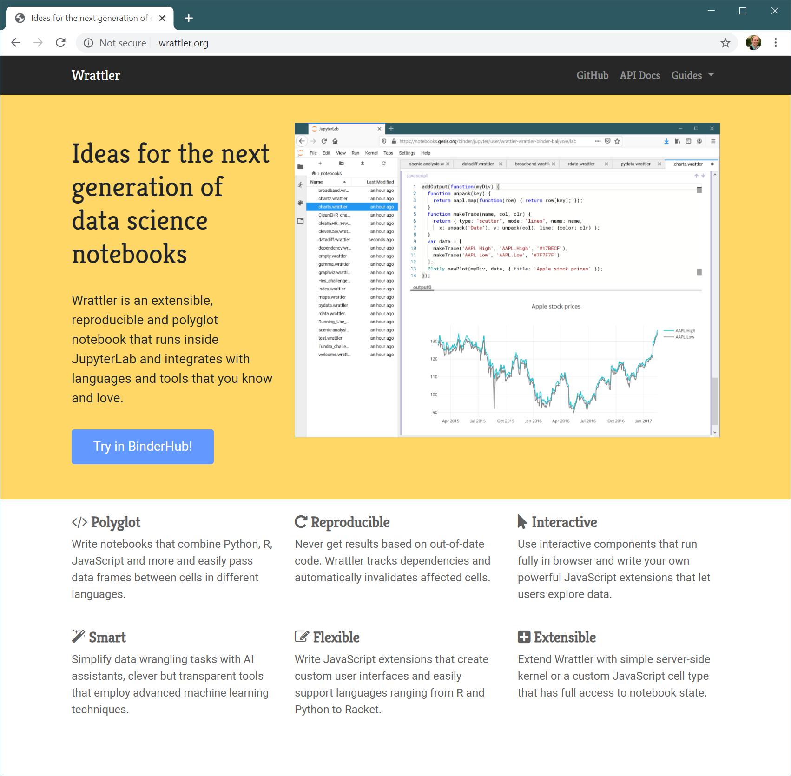

- title : Rethinking Data Exploration Tools
- description : Rethinking Data Exploration Tools
- author : Tomas Petricek
- theme : simple
- transition : none

****************************************************************************************************

# _Rethinking  Data Exploration Tools_

**Tomas Petricek**, University of Kent 
[tomas@tomasp.net](mailto:tomas@tomasp.net) | [@tomaspetricek](http://twitter.com/tomaspetricek)

****************************************************************************************************
- class: part

# _Introduction_
## Programming languages & data science

----------------------------------------------------------------------------------------------------

**What is this  
talk about?**

Making facts great again!

_Making simple data exploration accessible to non-experts_

----------------------------------------------------------------------------------------------------

# _Programming languages_

**Will deep net make  
my work obsolete?**

Machine learning  
_Solving hard problems!_

Programming languages  
_Change how we think!_

****************************************************************************************************
- class: part

# _TheGamma_
## Simplifying programmatic data exploration

----------------------------------------------------------------------------------------------------
- class: part

# _Demo_
## Exploring carbon emissions

----------------------------------------------------------------------------------------------------

# _TheGamma_
## Simple data exploration

_<i class="fa fa-database"></i> Language that understands data_

_<i class="fa fa-circle"></i> All programming using just 'dot'_

_<i class="fa fa-flask"></i> Powered by fancy type theory_

_<i class="fa fa-table"></i> Can non-experts use this?_

----------------------------------------------------------------------------------------------------

# _Data tooling gap_

----------------------------------------------------------------------------------------------------

# _Data tooling gap_

----------------------------------------------------------------------------------------------------
- class: part

# _Demo_
## Exploring Olympic medals

----------------------------------------------------------------------------------------------------

# _Fancy types for the masses_

Row types to track names and types of fields

$$$
\definecolor{cc}{RGB}{255,255,102}
\frac
  {\Gamma \vdash e : {\color{cc}[f_1:\tau_1, \ldots, f_n:\tau_n]}}
  {\Gamma \vdash e.\text{drop}~f_i : {\color{cc} [f_1:\tau_1, \ldots, f_{i-1}:\tau_{i-1}, f_{i+1}:\tau_{i+1}, \ldots, f_n:\tau_n]}}

Embed row types in provided nominal types

$$$
\frac
  {\Gamma \vdash e : {\color{mc} C_1}}
  {\Gamma \vdash e.\text{drop}~f_i : {\color{mc} C_2}}
\quad{\small \text{where}}

$$$
\begin{array}{l}
{fields({\color{mc} C_1}) = {\color{mc} \{f_1:\tau_1, \ldots, f_n:\tau_n\}}}\\[-0.25em]
{fields({\color{mc} C_2}) = {\color{mc} \{f_1:\tau_1, \ldots, f_{i-1}:\tau_{i-1}, f_{i+1}:\tau_{i+1}, \ldots, f_n:\tau_n\}}}
\end{array}

****************************************************************************************************
- class: part

# _Histogram_
## Programming beyond code

----------------------------------------------------------------------------------------------------

# _Histogram_
## System design principles

_<i class="fa fa-list-alt"></i> Programs as lists of interactions_

_<i class="fa fa-caret-square-down"></i> Program by choosing from a list_

_<i class="fa fa-th"></i> Forget concrete syntax_

_<i class="fa fa-chart-bar"></i> Focus on data science_

----------------------------------------------------------------------------------------------------
- class: part

# _DEMO_
## Analysing aviation accidents with Histogram

----------------------------------------------------------------------------------------------------

# _Interactions_

**Standard coding**

_Access member_  
_Invoke operation_  
_Define a value_  

**Programming process**

_Evaluate component_  
_Refactor as function_  

----------------------------------------------------------------------------------------------------

# _Implications_
## Why is Histogram interesting

_<i class="fa fa-list-alt"></i> Type checking lists of interactions_

_<i class="fa fa-check-square"></i> Evaluation can affect types_

_<i class="fa fa-mouse-pointer"></i> Bind interactions to user interface_

_<i class="fa fa-table"></i> Multiple views for the same program_

----------------------------------------------------------------------------------------------------
- class: part

# _Demo_
## Spreadsheets and direct manipulation

****************************************************************************************************
- class: part

# _AI assistants_
## Semi-automatic data wrangling

----------------------------------------------------------------------------------------------------

# _Data Wrangling_
## Getting data into the right format

_<i class="fa fa-percent"></i> Takes 80% of data analyst's time_

_<i class="fa fa-hand-spock"></i> Tedious manual process_

_<i class="fa fa-table"></i> Obtaining and merging data_

_<i class="fa fa-flask"></i> Fixing and resolving ambiguities_

----------------------------------------------------------------------------------------------------

**Wrattler project**

Research extension for JupyterLab

_Mix languages, build interactive tools, analyse code provenance_

----------------------------------------------------------------------------------------------------
- class: part

# _DEMO_
## Wrattler and outlier detection

----------------------------------------------------------------------------------------------------
- class:mathslide

# _What is an AI assistant?_

**AI assistant works with**

- $e$ _– expressions representing cleaning scripts_
- $\mathcal{D}$ _– assistant-specific data representation_
- $H$ _– traces of human interactions_

**AI assistant is defined by**

- $f(e, \mathcal{D})=\mathcal{D}'$ _– evaluation function_
- $\mathit{best}_{\mathcal{D}}(H)=e$ _– recommends best expression_
- $\mathit{choices}_{\mathcal{D}}(H)=(H_1, \ldots, H_n)$ _– offers constraints_
- $H_0$ _– empty human interaction trace_

----------------------------------------------------------------------------------------------------
- class: part

# _DEMO_
## Datadiff AI assistant

----------------------------------------------------------------------------------------------------
- class:mathslide

# _Datadiff AI assistant_

**Patches and constraints**

- Patches _– recode, permute, insert, delete, linear_
- Constraints _– nomatch, notransform, match_

**Optimization-based datadiff assistant**

- $H_0$ _– empty set of constraints_
- $e$ _– list of patches to apply_
- $E_H$ _– expressions allowed under conditions_ $H$

****************************************************************************************************
- class: part

# _Summary_
## Programming language perspective

----------------------------------------------------------------------------------------------------

----------------------------------------------------------------------------------------------------

# _Iterative prompting_
## Interaction principle behind all my demos

_<i class="fa fa-list-alt"></i> Programming by choosing from a list_

_<i class="fa fa-mouse-pointer"></i> Works with text or user interface_

_<i class="fa fa-table"></i> Works for data querying_

_<i class="fa fa-magic"></i> Works for data wrangling tools_

----------------------------------------------------------------------------------------------------

# _Rethinking data exploration_

Programming language design  
_Design new ways of thinking about problems_

Theoretical approach  
_Constraints are good for innovation_

Iterative prompting  
_Can you do anything this way?_

  

**Tomas Petricek**, University of Kent 
[tomas@tomasp.net](mailto:tomas@tomasp.net) | [@tomaspetricek](http://twitter.com/tomaspetricek)
