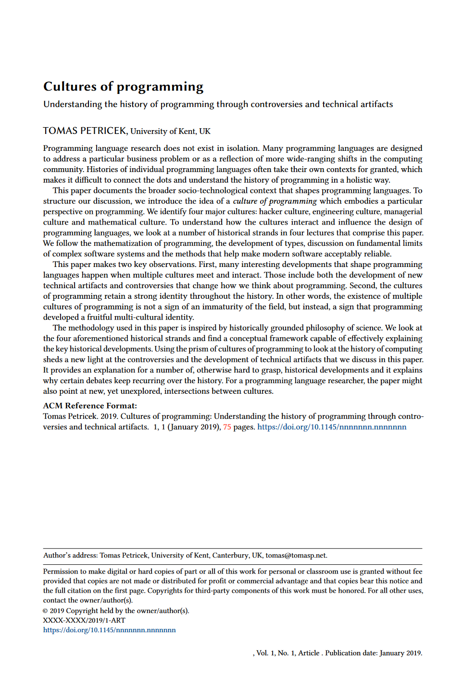

- title : Cultures of programming
- description : Cultures of programming
- author : Tomas Petricek
- theme : simple
- transition : none

****************************************************************************************************
- class: front

# _**Cultures of programming** Understanding the history of programming through technical  artifacts and controversies_

**Tomas Petricek**, _University of Kent_ 
[tomas@tomasp.net](mailto:tomas@tomasp.net) | [@tomaspetricek](http://twitter.com/tomaspetricek)

****************************************************************************************************

Learning to live with errors
_Programming, 2017_

Cultures of programming  
_Draft for HOPL IV_  
_Could this be a book?_

****************************************************************************************************
- class: part

# _Cultures_
## Introducing cultures of programming

----------------------------------------------------------------------------------------------------

# _Cultures of programming_

**Different cultures**

- _Hacker culture_
- _Mathematical culture_
- _Managerial culture_
- _Engineering culture_
- _Humanistic culture_

**When cultures meet**

- _Arguing about principles_
- _Contributing to a concept_

----------------------------------------------------------------------------------------------------

# _Hacker culture_
## Basic assumptions about programming

_<i class="fa fa-laptop-code"></i>_ Programming _is learned through practice_

_<i class="fa fa-chalkboard-teacher"></i>_ Advocate _direct access to computer_

_<i class="fa fa-file-image" style="position:relative;left:10px"></i>_ Exemplars _include Spacewar! and HAKMEM_

----------------------------------------------------------------------------------------------------

# _Mathematical culture_
## Basic assumptions about programming

_<i class="fa fa-laptop-code"></i>_ Programming _is a mathematical discipline_

_<i class="fa fa-chalkboard-teacher"></i>_ Advocate _proving programs correct_

_<i class="fa fa-file-image" style="position:relative;left:10px"></i>_ Exemplars _include ALGOL and PLT papers_

----------------------------------------------------------------------------------------------------

# _Managerial culture_
## Basic assumptions about programming

_<i class="fa fa-laptop-code"></i>_ Programming _is industrial production process_

_<i class="fa fa-chalkboard-teacher"></i>_ Advocate _organizational processes_

_<i class="fa fa-file-image" style="position:relative;left:10px"></i>_ Exemplars _include Waterfall and SCRUM_

----------------------------------------------------------------------------------------------------

# _Engineering culture_
## Basic assumptions about programming

_<i class="fa fa-laptop-code"></i>_ Programming _should be an engineering practice_

_<i class="fa fa-chalkboard-teacher"></i>_ Advocate _tools and development practices_

_<i class="fa fa-file-image" style="position:relative;left:10px"></i>_ Exemplars _include TDD and information hiding_

----------------------------------------------------------------------------------------------------

# _Humanistic culture_
## Basic assumptions about programming

_<i class="fa fa-laptop-code"></i>_ Programming _is a creative human activity_

_<i class="fa fa-chalkboard-teacher"></i>_ Advocate _improving the human condition_

_<i class="fa fa-file-image" style="position:relative;left:10px"></i>_ Exemplars _include oNLine System, Sonic Pi_

****************************************************************************************************
- class: part

# _How cultures meet_
## Controversies and technical artifacts

----------------------------------------------------------------------------------------------------

# _Controversies and artifacts_

**Programming controversies**

- _NATO conference (1969)_
- _Verification debate (1979)_
- _Dynabook vs iPad (2010)_
- _Haskell vs TypeScript (2012)_

**Programming concepts**

- _Programming languages_
- _(The real history of) types_
- _Testing and error handling_
- _Object-oriented programming_

****************************************************************************************************
- class: part

# _Technical artifacts_
## Multi-cultural programming concepts

----------------------------------------------------------------------------------------------------

# _Programming languages_
## Language as a machine-independent entity

_<i class="fa fa-terminal"></i>_ Hacker culture  
_<i class="fa fa-xx"></i> EDSAC initial orders and interpretative routines_  

_<i class="fa fa-infinity"></i>_ Mathematical culture  
_<i class="fa fa-xx"></i> Logic, formal languages and grammars_  

_<i class="fa fa-users"></i>_ Managerial culture  
_<i class="fa fa-xx"></i> Business need for cross-machine compatibility_  

----------------------------------------------------------------------------------------------------

# _Types_
## Types as sets, LCF and a great unification

_<i class="fa fa-users"></i>_ Managerial culture  
_<i class="fa fa-xx"></i> Records and business data processing_  

_<i class="fa fa-infinity"></i>_ Mathematical culture  
_<i class="fa fa-xx"></i> Lambda calculus models of PLs_  

_<i class="fa fa-wrench"></i>_ Engineering culture  
_<i class="fa fa-xx"></i> Clu and abstract data types_  

----------------------------------------------------------------------------------------------------

# _Testing_
## Professionalization of testing vs. debugging

_<i class="fa fa-terminal"></i>_ Hacker culture  
_<i class="fa fa-xx"></i> Program checkout, debugging and testing_  

_<i class="fa fa-wrench"></i>_ Engineering culture  
_<i class="fa fa-xx"></i> From demonstration to destruction_  

_<i class="fa fa-infinity"></i>_ Mathematical culture  
_<i class="fa fa-xx"></i> Designing comprehensive test suites_  

_<i class="fa fa-users"></i>_ Managerial culture  
_<i class="fa fa-xx"></i> Testing in Waterfall vs. testing in TDD_  

****************************************************************************************************
- class: part

# _Conclusions_
## Cultures of programming

----------------------------------------------------------------------------------------------------

**What happened  
to debugging?**

_Conceptually similar to '60s_  
_Learned through practice_  
_Hacker culture only_

No boundary object to exchange with other cultures?

----------------------------------------------------------------------------------------------------

# _Cultures of programming_
## Ways of trusting software systems

_<i class="fa fa-keyboard"></i>_ Hacker _- Trust person making it_

_<i class="fa fa-wrench"></i>_ Engineering _- Rely on tools_

_<i class="fa fa-project-diagram"></i>_ Managerial _- Rely on processes_

_<i class="fa fa-infinity"></i>_ Mathematical _- Trust formal proofs_

----------------------------------------------------------------------------------------------------

# _Cultures of programming_
## A useful perspective for history of programming

_<i class="fa fa-subscript"></i> Mathematization of programming_

_<i class="fa fa-wrench"></i> Rise of software engineering_

_<i class="fa fa-terminal"></i> Interactive programming_

_<i class="fa fa-tape"></i> Programming with types_  

 

[tomas@tomasp.net](mailto:tomas@tomasp.net) | [@tomaspetricek](http://twitter.com/tomaspetricek)
