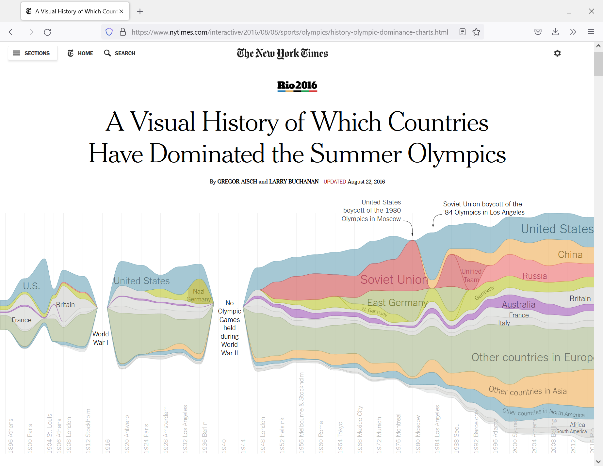
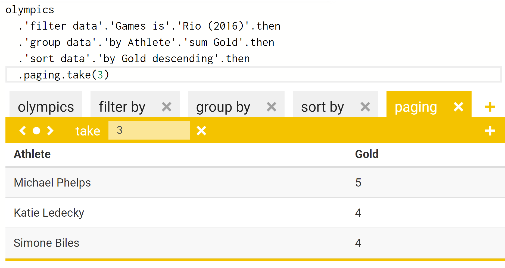
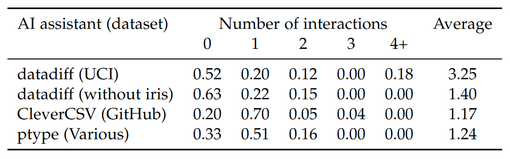
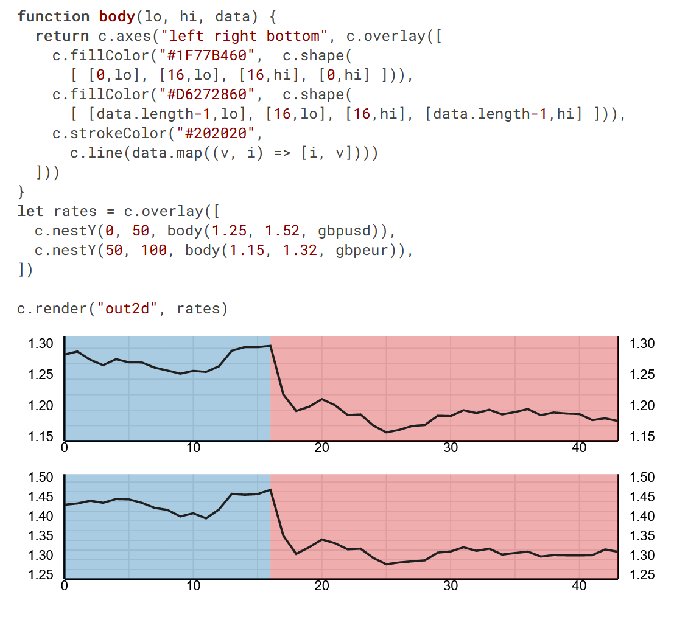
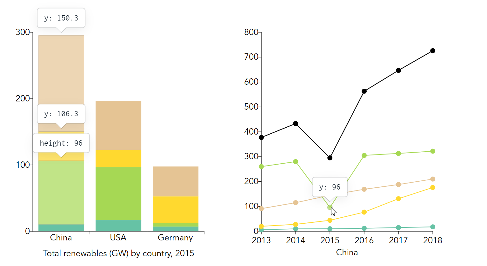
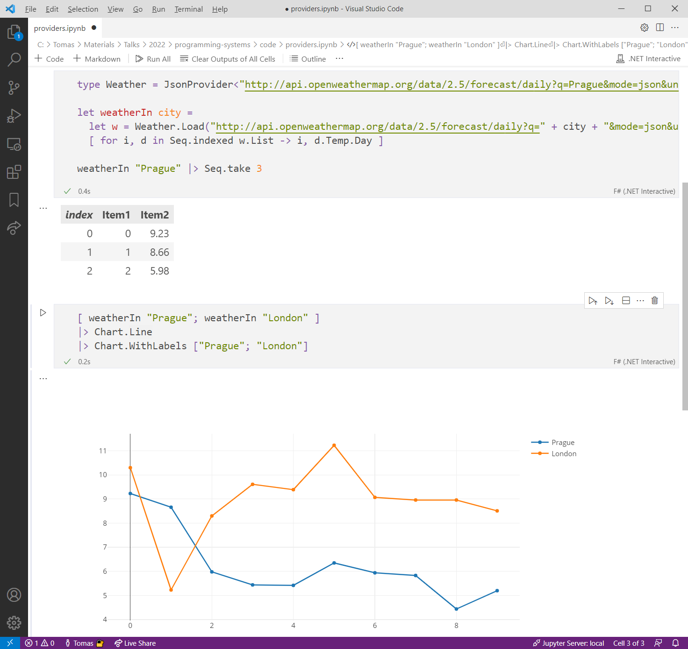

- title : Data exploration as a programming problem
- description : Data exploration as a programming problem
- author : Tomas Petricek
- theme : white
- transition : none

***************************************************************************************************

# _**Data exploration**_<br />as a programming problem

<br /><br /><br />
<br /><br /><br />
<br />

Tomas Petricek, _University of Kent_  
_[http://tomasp.net](http://tomasp.net/academic) <span style="margin:0px 6px 0px 6px">|</span>
[tomas@tomasp.net](mailto:tomas@tomasp.net) <span style="margin:0px 6px 0px 6px">|</span>
[@tomaspetricek](http://twitter.com/tomaspetricek)_

***************************************************************************************************

# _**Data exploration**_

---------------------------------------------------------------------------------------------------



---------------------------------------------------------------------------------------------------

# Motivation
_Simple, trustworthy and accountable data exploration_

<br />

# Approach
_Theoretical programming research in a new context_

---------------------------------------------------------------------------------------------------

<style type="text/css">
.bwtl h3 { color:white; }
</style>

<div style="background:black;position:absolute;width:200%;right:53%;height:400%;top:-100%;z-index:-1000;"></div>

<table style="margin-top:140px"><tr><td style="width:45%;color:white" class="fragment bwtl">

### _Spreadsheets_

<div style="padding:20px 0px 105px 0px;">

_<i class="fa fa-user"></i> Easy to use_

_<i class="fa fa-table"></i> Small tabular data_

_<i class="fa fa-redo-alt"></i> Not reproducible_

_<i class="fa fa-bug"></i> Error prone_

</div></td><td style="width:45%" class="fragment">

### _Programming_

<div style="padding:20px 0px 105px 0px;">

_<i class="fa fa-user-graduate"></i> Requires expert skills_

_<i class="fa fa-globe"></i> Internet-scale_

_<i class="fa fa-code"></i> Reproducible &amp; open_

_<i class="fa fa-robot"></i> Formally verifiable_

</div></td></tr></table>

---------------------------------------------------------------------------------------------------

# Best of both worlds

_Can we make data exploration tools_


<br />

_<i class="fa fa-user"></i> As simple as spreadsheets?_

_<i class="fa fa-globe"></i> As flexible as programming tools?_

_<i class="fa fa-robot"></i> Formally verifiable like programs?_

---------------------------------------------------------------------------------------------------

### DEMO

_Exploring Olympic medals <span class="ref"><span>ECOOP 2017</span></span> <span class="ref"><span>Programming 2020</span></span>_  

***************************************************************************************************

# _**Working with data**_

---------------------------------------------------------------------------------------------------

# Reading data

_Unsafe data access in a typed language_

<br />

    [lang=csharp]
    var url = "http://owm.org/forecast/daily?q=Prague";
    var forecast = JsonValue.Load(url);
    var days = forecast["list"];

    foreach(JsonValue day in days) {
      var hi = (double)day["temp"]["high"];
      Console.WriteLine(hi);
    }

<div class="fragment">
  <div class="tipbox" style="position:absolute;left:390px;top:305px;width:102px;height:30px"></div>
  <div class="tipbox" style="position:absolute;left:443px;top:421px;width:102px;height:30px"></div>
  <div class="tipbox" style="position:absolute;left:584px;top:421px;width:102px;height:30px"></div>
</div>
<div class="fragment">
  <div class="tiplbl" style="position:absolute;left:630px;top:475px">Not found!</div>
</div>

---------------------------------------------------------------------------------------------------

# Reading data

_Unsafe data access in a typed language_

<br />

    [lang=csharp]
    var url = "http://owm.org/forecast/daily?q=Prague";
    var forecast = JsonValue.Load(url);
    var days = forecast["list"];

    foreach(JsonValue day in days) {
      var hi = (double)day["temp"]["max"];
      Console.WriteLine(hi);
    }

<div class="fragmentt">
  <div class="tipbox" style="left:584px;top:-154px;width:86px;height:30px"></div>
  <br/>
</div>

---------------------------------------------------------------------------------------------------

# Reading data

_Accessing data from external data sources_

<br />

_<i class="fa fa-file-excel"></i> Languages do not understand data_

_<i class="fa fa-tags"></i> There is rarely explicit schema_

_<i class="fa fa-code"></i> Manually defined types can capture it_

_<i class="fa fa-wrench"></i> Easier in dynamic languages!_

<br /><br />

---------------------------------------------------------------------------------------------------

# Querying data

_Athletes by number of gold medals from Rio 2016_

<div style="padding:40px 0px 60px 0px">

```
olympics = pd.read_csv("olympics.csv")
olympics[olympics["Games"] == "Rio (2016)"]
  .groupby("Athlete")
  .agg({"Gold": sum})
  .sort_values(by="Gold", ascending=False)
  .head(8)
```

</div>
<div class="fragment">
  <div class="tipbox" style="left:455px;top:-324px;width:220px;height:25px"></div>
  <div class="tiplbl" style="left:550px;top:-415px">Unknown file</div>
  <div class="tipbox" style="left:364px;top:-254px;width:90px;height:25px"></div>
  <div class="tiplbl" style="left:390px;top:-245px">Column name</div>
</div>

---------------------------------------------------------------------------------------------------

# Querying data

_Language and data source features you need to know_

<br />

_<i class="fa fa-book"></i> Python dictionaries `{"key": value}`_

_<i class="fa fa-eye"></i> Generalised indexers `.[ condition ]`_

*<i class="fa fa-university"></i> Operation names `sort_values`*

_<i class="fa fa-database"></i> Data column names `"Athlete"`_

<br /><br />

***************************************************************************************************

# _**Type providers**_

---------------------------------------------------------------------------------------------------

<div class="bigeq">

$\emptyset \vdash e : \tau$

</div>


---------------------------------------------------------------------------------------------------

<div class="bigeq bigeq2">

$\pi(~~~~~~~) \vdash e : \tau$


</div>

---------------------------------------------------------------------------------------------------


### DEMO

_Parsing JSON weather forecast <span class="ref"><span>PLDI 2016</span></span>_

---------------------------------------------------------------------------------------------------

# F# Data

_Interesting theoretical aspects of data access_

<br />

_<i class="fa fa-adjust"></i> Pragmatic structural shape inference_

_<i class="fa fa-shapes"></i> Predictable handling of schema change_

_<i class="fa fa-bomb"></i> Relative type safety property_

<br /><br />
<br /><br />

---------------------------------------------------------------------------------------------------

<div class="diagram1">
<p>
  <span>{title&nbsp;:&nbsp;string,&nbsp;author&nbsp;:&nbsp;{age&nbsp;:&nbsp;int}}</span>
  <span style="margin-left:50px">{author&nbsp;:&nbsp;{age&nbsp;:&nbsp;float}}</span>
</p>  
<div class="fragment">
<p><span style="position:relative;top:55px;left:72px" class="arrow-down"></span></p>
<p>
  <span style="position:relative;top:30px;left:40px">{&nbsp;title&nbsp;:&nbsp;option&lt;string&gt;,
    &nbsp;author&nbsp;:&nbsp;{age&nbsp;:&nbsp;float}&nbsp;}</span>
</p>  
</div>
</div>

---------------------------------------------------------------------------------------------------

<div class="diagram2">
<p>
  <span>{&nbsp;coordinates&nbsp;:&nbsp;{lng:num,&nbsp;lat:num}&nbsp;}</span>
  <span style="margin-left:50px">string</span>
</p>  
<div class="fragment">
<p><span style="position:relative;top:55px;left:200px" class="arrow-down"></span></p>
<p>
  <span style="position:relative;left:70px;top:30px">
  {&nbsp;coordinates&nbsp;:&nbsp;{lng:num,&nbsp;lat:num}&nbsp;}&nbsp;+&nbsp;string&nbsp;</span>
</p>  
</div>
</div>

---------------------------------------------------------------------------------------------------

# Schema change

_Provided type can change only in limited ways_

<br />

$C[e] \rightarrow C[e.M]$

$C[e] \rightarrow C[{\sf match}~e~{\sf with}~\ldots]$

$C[e] \rightarrow C[int(e)]$

<br />
<br />
<br />
<br />

---------------------------------------------------------------------------------------------------

# Dot-driven development

_Encoding complex logic via simple member access_


<br /><br />

---------------------------------------------------------------------------------------------------

# The Gamma

_Interesting theoretical aspects of data querying_

<br />

_<i class="fa fa-tree"></i> Laziness for scaling to large hierarchies_

_<i class="fa fa-bell"></i> Fancy types for the masses <span class="ref"><span>ECOOP 2017</span></span>_

_<i class="fa fa-sync"></i> Efficient on-the-fly code evaluation <span class="ref"><span>Programming 2020</span></span>_

_<i class="fa fa-pen-fancy"></i> Can non-experts really do this? <span class="ref"><span>WiP 2022</span></span>_

<br /><br />

---------------------------------------------------------------------------------------------------

# Fancy types

_Row types track names and types of fields_

<div style="padding:0px 0px 40px 0px;position:relative;left:-80px;transform:scale(0.75)">

$$$
\definecolor{cc}{RGB}{204,82,34}
\definecolor{mc}{RGB}{0,0,153}
\frac
  {\Gamma \vdash e : {\color{cc}[f_1:\tau_1, \ldots, f_n:\tau_n]}}
  {\Gamma \vdash e.\text{drop}~f_i : {\color{cc} [f_1:\tau_1, \ldots, f_{i-1}:\tau_{i-1}, f_{i+1}:\tau_{i+1}, \ldots, f_n:\tau_n]}}

</div><div class="fragment">

_Embed row types in provided nominal types_

<div style="padding:-20px 0px 30px 0px;position:relative;left:-80px;transform:scale(0.75)">

$$$
\frac
  {\Gamma \vdash e : {\color{mc} C_1}}
  {\Gamma \vdash e.\text{drop}~f_i : {\color{mc} C_2}}

<div style="position:relative;top:-20px;" class="fragment">

$$$
\begin{array}{l}
\\[-0.5em]
{fields({\color{mc} C_1}) = {\color{mc} \{f_1:\tau_1, \ldots, f_n:\tau_n\}}}\\
{fields({\color{mc} C_2}) = {\color{mc} \{f_1:\tau_1, \ldots, f_{i-1}:\tau_{i-1}, f_{i+1}:\tau_{i+1}, \ldots, f_n:\tau_n\}}}
\end{array}

</div></div>

***************************************************************************************************

# _**AI assistants**_

---------------------------------------------------------------------------------------------------

# Data wrangling

_Getting data into the right format_

<br />

_<i class="fa fa-percent"></i> Manual process taking 80% of analyst's time_

_<i class="fa fa-table"></i> Obtaining, merging and fixing data_

_<i class="fa fa-cogs"></i> Automatic AI tools still need some help!_

_<i class="fa fa-gamepad"></i> Ad-hoc interfaces and feedback mechanisms_

----------------------------------------------------------------------------------------------------


# Wrattler

_Research platform for The Gamma<br/> and AI assistants_

<br />

_Mix languages, build interactive tools, analyse<br /> code provenance_

----------------------------------------------------------------------------------------------------
- class: part

### DEMO

_Wrattler and outlier detection <span class="ref"><span>TaPP 2018</span></span>_  

----------------------------------------------------------------------------------------------------
- class:mathslide

# AI assistants
_Semi-interactive tools for data wrangling <span class="ref"><span>Submitted 2022</span></span>_

<br />

<div class="fragment">

*A tuple $(\mathit{best}, \mathit{choices}, f)$ such that*

- $\mathit{best}_X(H)=e$ _– recommends best expression_
- $\mathit{choices}_X(H)=(H_1, \ldots, H_n)$ _– offers constraints_
- $f(e, X)=Y$ _– evaluation function_

</div>

----------------------------------------------------------------------------------------------------
- class: part

### DEMO

_Datadiff AI assistant <span class="ref"><span>Submitted 2022</span></span>_  

----------------------------------------------------------------------------------------------------

# AI assistants
_Empirical evaluation of number of interactions_



***************************************************************************************************

# _**Data visualization**_

---------------------------------------------------------------------------------------------------



# Compost.js

_Composable data visualization library <span class="ref"><span>JFP 2021</span></span>_  

<br />

_Functional ideas applied to data visualization_

<br /><br />

---------------------------------------------------------------------------------------------------



# Fluid

_Linked visualizations via Galois dependencies <span class="ref"><span>POPL 2022</span></span>_  

<br />

_Uses program slicing to make linking automatic_

<br /><br />

***************************************************************************************************

# _**Future work**_

---------------------------------------------------------------------------------------------------



# Notebooks for data exploration

<br />

_Programming as interaction with a stateful environment_  

---------------------------------------------------------------------------------------------------

# Programming languages
_Programs as expressions in a formal grammar_

<br />

# Programming systems
_Programs as lists of interactions with the evnrionment_

---------------------------------------------------------------------------------------------------

<div class="bigeq">

$e := e_1 + e_2~|~e_1~e_2~|~\lambda x.e$

</div>
<br /><br />

---------------------------------------------------------------------------------------------------

<div class="bigeq">

$p := a_1;~a_2;~\ldots;~a_n$

</div>
<br /><br />

---------------------------------------------------------------------------------------------------

# Data exploration

_Programming as a sequence of interactions_

<br />

_<i class="fa fa-table"></i> Accommodates manual data edits_

_<i class="fa fa-sort-alpha-up"></i> Supports user interface interactions_

_<i class="fa fa-not-equal"></i> Amenable to formal analysis_

_<i class="fa fa-external-link-alt"></i> Correctness, provenance etc. <span class="ref"><span>ICFP 2014</span></span>_

<br/><br/>

***************************************************************************************************

# _**Summary**_

---------------------------------------------------------------------------------------------------

# Thank you!

<br />

_<i class="fa fa-binoculars"></i> Programming research in a new context_

_<i class="fa fa-chart-line"></i> Data access, AI assistants, data visualization_

_<i class="fa fa-desktop"></i> From languages to programming systems_

<br /><br /><br />

Tomas Petricek, _University of Kent_  
_[http://tomasp.net](http://tomasp.net/academic) <span style="margin:0px 6px 0px 6px">|</span>
[tomas@tomasp.net](mailto:tomas@tomasp.net) <span style="margin:0px 6px 0px 6px">|</span>
[@tomaspetricek](http://twitter.com/tomaspetricek)_
