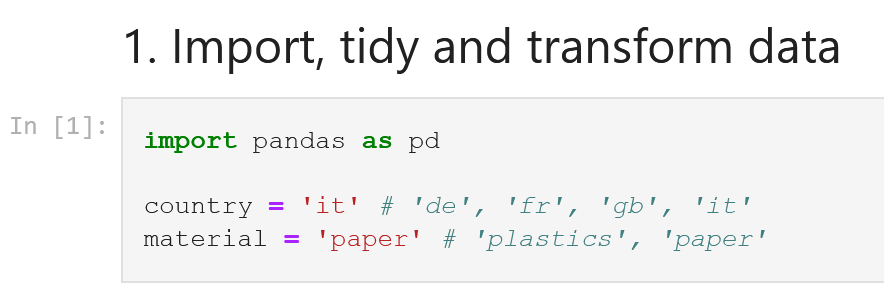
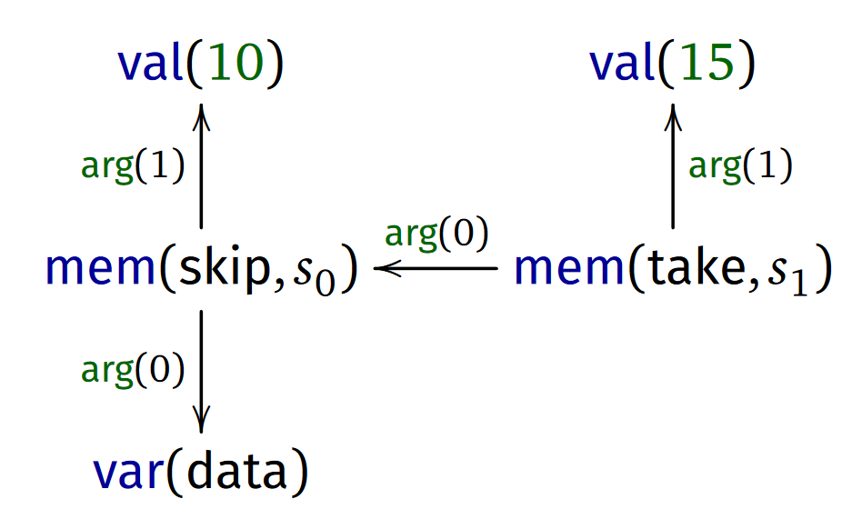
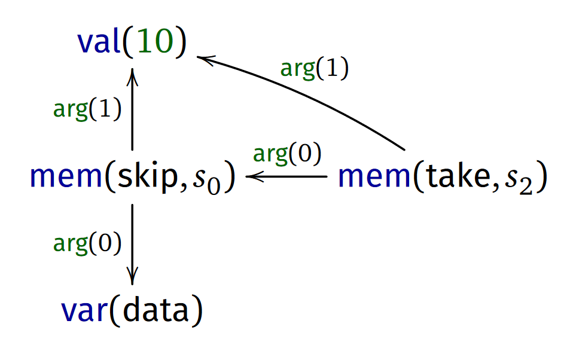
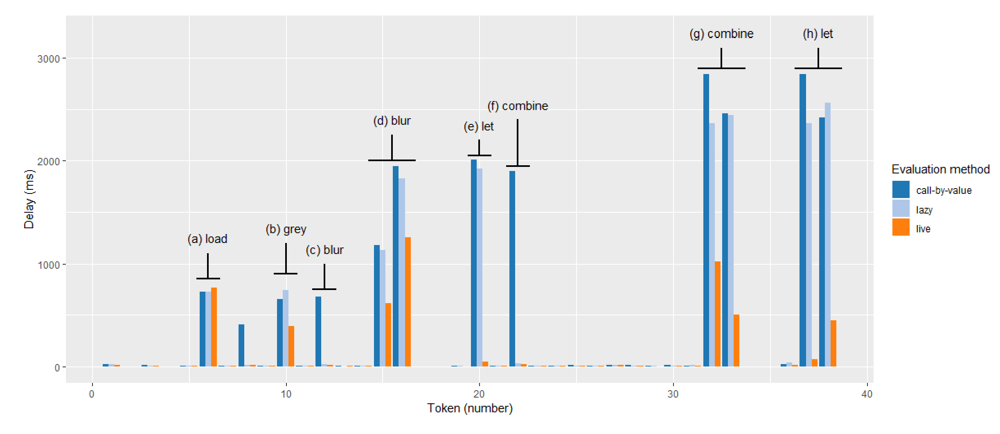

- title : Foundations of a live data exploration environment
- description : Foundations of a live data exploration environment
- author : Tomas Petricek
- theme : white
- transition : none

***************************************************************************************************
- class: intro

# Foundations of a live <br /> data exploration environment

<div style="height:400px"></div>

Tomas Petricek, _University of Kent_  
[tomas@tomasp.net](mailto:tomas@tomasp.net) <span style="margin:0px 6px 0px 6px">|</span>
[@tomaspetricek](http://twitter.com/tomaspetricek)

***************************************************************************************************
- class: intro

# <span style="text-decoration:line-through">Foundations of a live <br /> data exploration environment</span>

<br />

# **How the heck do data scientists<br />code and why we should care**

<div style="height:205px"></div>

Tomas Petricek, _University of Kent_  
[tomas@tomasp.net](mailto:tomas@tomasp.net) <span style="margin:0px 6px 0px 6px">|</span>
[@tomaspetricek](http://twitter.com/tomaspetricek)

***************************************************************************************************

# **Demo**
_Comparing air and rail travel in EU_

***************************************************************************************************


**Financial Times waste analysis**

_Note the clever abstraction mechanism!_

***************************************************************************************************



**Financial Times waste analysis**

_Note the clever abstraction mechanism!_

<div style="height:310px"></div>

***************************************************************************************************

# **Data scripting**
_Programs but not as we know them_


<br />

_<i class="fa fa-cog"></i> Most work done in external libraries!_

_<i class="fa fa-pen"></i> Limited need for top-level abstraction_

_<i class="fa fa-filter"></i> Functions only as arguments to operations_

_<i class="fa fa-redo"></i> Rapid feedback matters more than safety_

<br /><br />

***************************************************************************************************

# **Data exploration calculus**
_The essence of data exploration scripts_

<div style="transform:scale(0.8) translate(-100px);margin-top:30px" class="fragment">

$$$
\definecolor{kvdclr}{rgb}{0.0,0.0,0.6}
\newcommand{\kvd}[1]{\textcolor{kvdclr}{#1}}
\newcommand{\lsep}{\;\;|\;\;}
%
\begin{equation*}
\begin{array}{rlcl}
\text{(programs)}    && p &::=& c_1; \ldots; c_n\\
\text{(commands)}    && c &::=& \kvd{let}~x = t \lsep t\\
\text{(terms)}       && t &::=& o \lsep x \lsep t.m(e, \ldots, e)\\
\text{(expressions)} && e &::=& t \lsep \lambda x\rightarrow e\\
\text{(values)}      && v &::=& o \lsep \lambda x\rightarrow e\\
\end{array}
\end{equation*}

</div>

***************************************************************************************************

# **Demo**
_Exploring data in The Gamma project_

***************************************************************************************************

# **Script evaluation**
_Call-by-value evaluation of variables_


<div style="transform:scale(0.8) translate(-100px);margin-top:30px;margin-bottom:30px">

$$$
o_1;\; \ldots;\; o_{k};\; \kvd{let}~x=o;\; c_{1};\; \ldots; c_n \rightsquigarrow\\
\qquad  o_1;\; \ldots;\; o_{k};\; o; c_{1}[x\leftarrow o];\; \ldots; c_n[x\leftarrow o]

</div>

_Method evaluation specified externally_

<div style="transform:scale(0.8) translate(-100px);margin-top:30px">

$$$
\dfrac
  {o.m(v_1, \ldots, v_n) \rightsquigarrow_\epsilon o'}
  {C_p[o.m(v_1, \ldots, v_n)] \rightsquigarrow C_p[o']}

</div>

***************************************************************************************************

# **External library**
_Adding lists with map operation_

<div style="transform:scale(0.8) translate(-100px);margin-top:30px;margin-bottom:30px">

$$$
\dfrac
  {e[x \leftarrow n_i] \rightsquigarrow o_i \quad (\textit{for all $i\in 1\ldots k$})}
  {[ n_1, \ldots, n_k ].\text{map}(\lambda x\rightarrow e) \rightsquigarrow_\epsilon [ o_1, \ldots, o_k ]}

<br />

$$$
\dfrac
  {(\textit{otherwise})}
  {[ n_1, \ldots, n_k ].\text{map}(v_1, \ldots, v_n) \rightsquigarrow_\epsilon \bot}

</div>

***************************************************************************************************

# **Demo**
_Live previews in The Gamma system_

***************************************************************************************************

# **Live previews**
_Maintaining a dependency graph_

<br />


<div style="max-width:200px">

```
let x = 15
data.skip(10).take(x)
```

</div>
<br />
<div class="fragment">

_The user edits the source code to change value of x_

</div>

***************************************************************************************************

# **Live previews**
_Maintaining a dependency graph_

<br />


<div style="max-width:200px">

```
let x = 10
data.skip(10).take(x)
```

</div>
<br />

_Graph node representing the value 10 gets reused!_

***************************************************************************************************

# **Live previews**
_Efficient caching & evaluation of previews_


<br />

_<i class="fa fa-recycle"></i> Re-construct dependency graph after parsing_

_<i class="fa fa-book"></i> Cache nodes by their type and dependencies_

_<i class="fa fa-image"></i> Associate evaluated previews with nodes_

_<i class="fa fa-project-diagram"></i> Define evaluation over the graph structure_

<br /><br />


***************************************************************************************************

# **Demo**
_Performance of efficient live previews_

***************************************************************************************************

# **Performance evaluation**
_Delays per token edit in a case study_

<br />


***************************************************************************************************

# Thank you!

<br />

_<i class="fa fa-database"></i> Programs but not as we know them_

_<i class="fa fa-not-equal"></i> Data exploration calculus as foundation_

_<i class="fa fa-project-diagram"></i> Efficient live previews using dependency graph_


<br /><br /><br />

Tomas Petricek, _University of Kent_  
[tomas@tomasp.net](mailto:tomas@tomasp.net) <span style="margin:0px 6px 0px 6px">|</span>
[@tomaspetricek](http://twitter.com/tomaspetricek)
