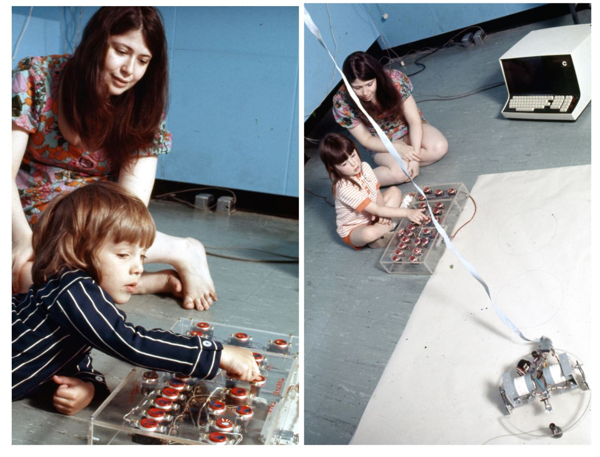
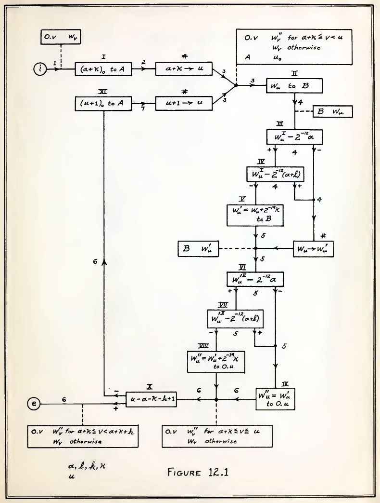
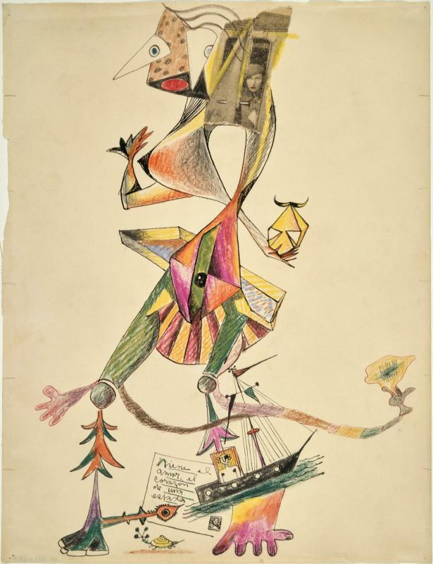
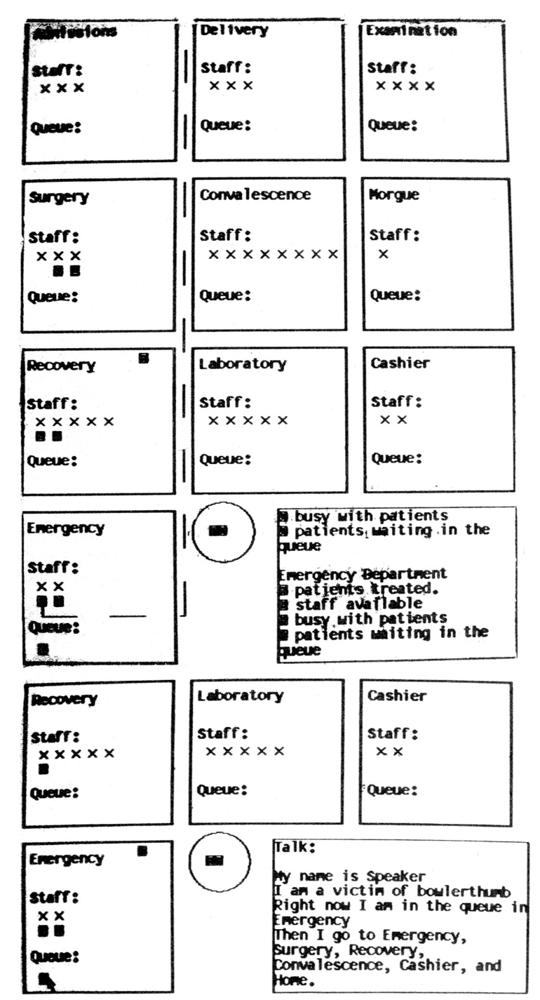
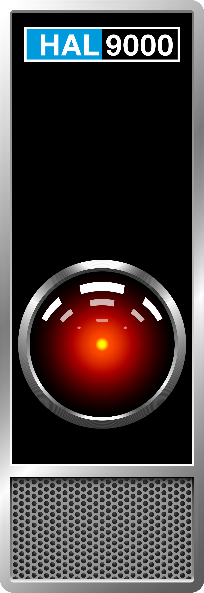

- title : Cultures of programming
- description : Cultures of programming
- author : Tomas Petricek
- theme : simple
- transition : none

****************************************************************************************************
- class: front

# _**PROGRAMme** Notations: There is no escape_

**PROGRAMme** _(leading auhtors: Troy Astarte, Maarten Bullynck, Felice Cardone, Martin Carlé, Liesbeth De Mol, Marie-José Durand-Richard,_  Tomas Petricek, _Mark Priestley, Henri Salha)_

****************************************************************************************************

**Perlman's button box**  
Programmable or not?

_1) Buttons control turtle_
_2) "Memory box" buttons_
_3) Kid interface for LOGO_  

----------------------------------------------------------------------------------------------------
- class:h1-center

     

# **machine** ⟷ **human**

----------------------------------------------------------------------------------------------------
- class:h1-center

     

# **machine** ⟷ notation ⟷ **human**

----------------------------------------------------------------------------------------------------

# _Meaning of notations_

**Negotiation of meaning**

- _Machine and human "understanding" differ_
- _Different users have different needs_
- _Meaning found in operational structure_

**High programmability**

- _Potential to establish new meaning_
- _Allows "meaningful" programming_

****************************************************************************************************
- class: part

# _Blind computation_

----------------------------------------------------------------------------------------------------

# _Blind computation_

**19th century English algebraists**

- _$\sqrt{a-b}$ only defined if $a\geq b$_
- _Independence from arithmetic_
- _Terms "general in form and value"_

**20th century mathematical logic**

- _Tackle decidability problems_
- _Mechanical rule following_

----------------------------------------------------------------------------------------------------

# _Operational meaning_

**Meaning in blind computation**

- _Establishes analogies that reveal new patterns_

**Reverse Polish notation**

- _Example:_ `3 2 + 5 4 2 * + *`
- _Notation matches evaluator!_

****************************************************************************************************
- class: part

# _Surprise of programming_

----------------------------------------------------------------------------------------------------

# _Electronic speed_

_[C]ontemplate the prospect of locking twenty people for two years during which they would be steadily performing computations. And you must give them such explicit instructions at the time of incarceration that at the end of two years you could return and obtain the correct result for your lengthy problem!_ (John von Neumann)

----------------------------------------------------------------------------------------------------

# _Notations for humans_

**Flowcharts**

- _John von Neumann for EDVAC_
- _Translated manually to instructions_

**Interpretive subroutines**

- _Wilkes et al. for EDSAC_
- _Symbolic codes_
- _Executed by initial orders_

----------------------------------------------------------------------------------------------------

**Opening of Pandora's box**

Many notations solving:

_1) Problem of control_  
_2) User problem_  
_3) Effectiveness problem_  

****************************************************************************************************
- class: part

# _Closing of Pandora's box_

----------------------------------------------------------------------------------------------------

**Like surrealist "exquisite corpse" drawings!**

1) Automatic programming  
2) Universal language  
3) Self-programmability  
4) Concrete notations  

----------------------------------------------------------------------------------------------------

1) Automatic programming  
_High-level notations..._  
_Could there be just one?_

2) Universal language  
_One language is not enough_  
_Could it be adaptable?_

3) Self-programmability  
_System as meta-medium_    
_Uses direct representation_

4) Concrete notations  
_Focus on directness_  
_No need for generality..._

----------------------------------------------------------------------------------------------------

# _Self-programmability_

**LISP**

- _Recursion & programs as data_
- _Adaptable meta-notation_
- _Time-sharing and IBM 704_

**Smalltalk**

- _Objects represent real things_
- _Programmable meta-medium_
- _Recursion on the notion of computer_

****************************************************************************************************
- class: part

# _There is no escape_

----------------------------------------------------------------------------------------------------

# _There is no escape_

**No-code programming**

- _Programming for end-users_
- _Visual and UI is also notation_
- _Low notational programmability_

**Automatic programming, revisited**

- _AI that "understands" human language_
- _No negotiation of meaning_
- _Human is programmed!_

----------------------------------------------------------------------------------------------------
- class:front

# _**PROGRAMme** Notations: There is no escape_

  

**Conclusions**

_<i class="fa fa-comments"></i>_ If we want  _meaningful programming_

_<i class="fa fa-language"></i>_ We get _notational pluralism_

_<i class="fa fa-cogs"></i>_ Ideally with _high notational programmability_

****************************************************************************************************
