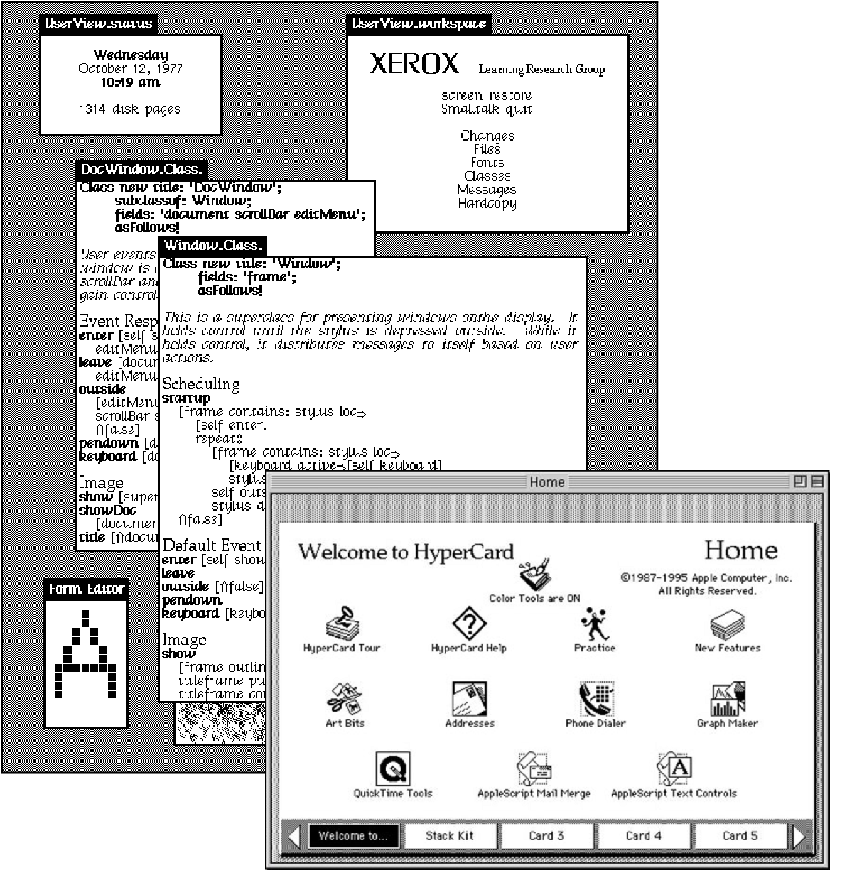

- title: Programming Systems Deserve a Theory Too!

*****************************************************************************************
- template: title

# Programming systems deserve a theory too!

---

**Tomas Petricek**, Charles University, Prague  
[tomas@tomasp.net](mailto:tomas@tomasp.net) |
[https://tomasp.net](https://tomasp.net) | [@tomaspetricek](http://twitter.com/tomaspetricek)  

with Joel Jakubovic and Jonathan Edwards

*****************************************************************************************
- template: lists
- class: smaller

# Programming language revolution

## From systems to languages

- Mixins, CLOS and Flavors
- Reality of a running system
- Relationships prescribed in code

## Scientific paradigm shifts

- The past is a foreign country
- Paradigms are incommensurable
- Old notions stop making any sense

*****************************************************************************************
- template: image

# Programming Languages

Programming is   
writing code

Formal semantics, implementation, paradigms

------

**We know how   
to study this!**

*****************************************************************************************
- template: image
- class: noborder

# Programming systems

Interacting with a stateful system

Feedback, interactive display, live update

------

**But how do we  
study this?**

*****************************************************************************************
- template: subtitle

# DEMO
## Commodore 64 BASIC

*****************************************************************************************
- template: lists
- class: smaller

# Why look at Commodore 64?

## Technical aspects

- Integrated REPL and editor
- Structure editing via line numbers
- Simple with POKE for hackers

## Social aspects

- Easy to get started with
- Program sharing in magazines
- Computer boots into programming system!

*****************************************************************************************
- template: image
- class: smaller

# How to look at Commodore 64?

**Complementary science approach by Hasok Chang**

Doing history to contribute to contemporary science

Recover ideas lost for scientific or social reasons

*****************************************************************************************
- template: image
- class: smaller

# Programming for  non-programmers

**Data exploration using Excel, JS and Python**

------

Data is an integrated  
part of the program

Programs are run once

We don't need no abstraction!

*****************************************************************************************
- template: subtitle

# DEMO
## Data exploration in The Gamma

*****************************************************************************************
- template: icons

# The Gamma
## What makes it interesting?

- *fa-diagram-project* Everything is a member access
- *fa-layer-group* Two-level conceptual structure
- *fa-book* All libraries are external
- *fa-gift* Abstractions from concrete examples

*****************************************************************************************
- template: lists
- class: noborder smaller

# Studying programming systems

## Technical dimensions

- Analyze interesting past systems
- Capture key characteristics
- Understand range of options

## Example dimensions

- Self-sustainability
- Feedback loops & modes of interaction
- Factoring of complexity & level of automation

*****************************************************************************************
- template: subtitle

# DEMO
## Programs as sequences of interactions

*****************************************************************************************
- template: title

# Conclusions

**Programming systems deserve theory too!**

- Take history seriously and learn from it
- Not everything needs proof or evaluation
- Disagree with our Technical Dimensions!

---

**Tomas Petricek**, Charles University, Prague  
[tomas@tomasp.net](mailto:tomas@tomasp.net) |
[https://tomasp.net](https://tomasp.net) | [@tomaspetricek](http://twitter.com/tomaspetricek)  

with Joel Jakubovic and Jonathan Edwards

*****************************************************************************************
- template: content
- class: condensed

# References & demos

- [**The Gamma**: Tools for open data-driven storytelling](https://thegamma.net/)
- [**The Gamma**: Democratizing data science](http://turing.thegamma.net/)
- [**Histogram**: You have to know the past to understand the present](https://tomasp.net/histogram/)
- [**The Lost Ways of Programming**: Commodore 64 BASIC](https://tomasp.net/commodore64/)

----

- J. Jakubovic, J. Edwards, T. Petricek (2022). [Technical dimensions of programming systems](https://github.com/jdjakub/papers/blob/master/prog-2022/prog22-master.pdf). To appear
- T. Petricek, J. Jakubovic (2021). [Complementary science of interactive programming systems](http://tomasp.net/academic/drafts/complementary/). HaPoC
- T. Petricek (2022) [The Gamma Programmatic Data Exploration for Non-programmers](http://tomasp.net/academic/papers/iterative/). VL/HCC
- J. Jakubovic, T. Petricek (2022) [Ascending the Ladder to Self-Sustainability](http://tomasp.net/academic/papers/self-sustainability/) Onward!
- J. Edwards, S. Kell, T. Petricek, L. Church (2019). [Evaluating programming systems design](http://tomasp.net/academic/papers/evaluating-systems/). PPIG
