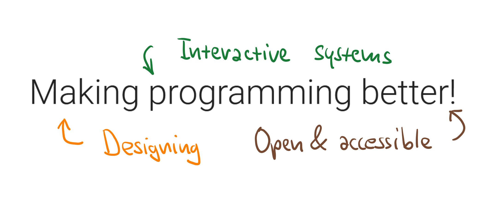
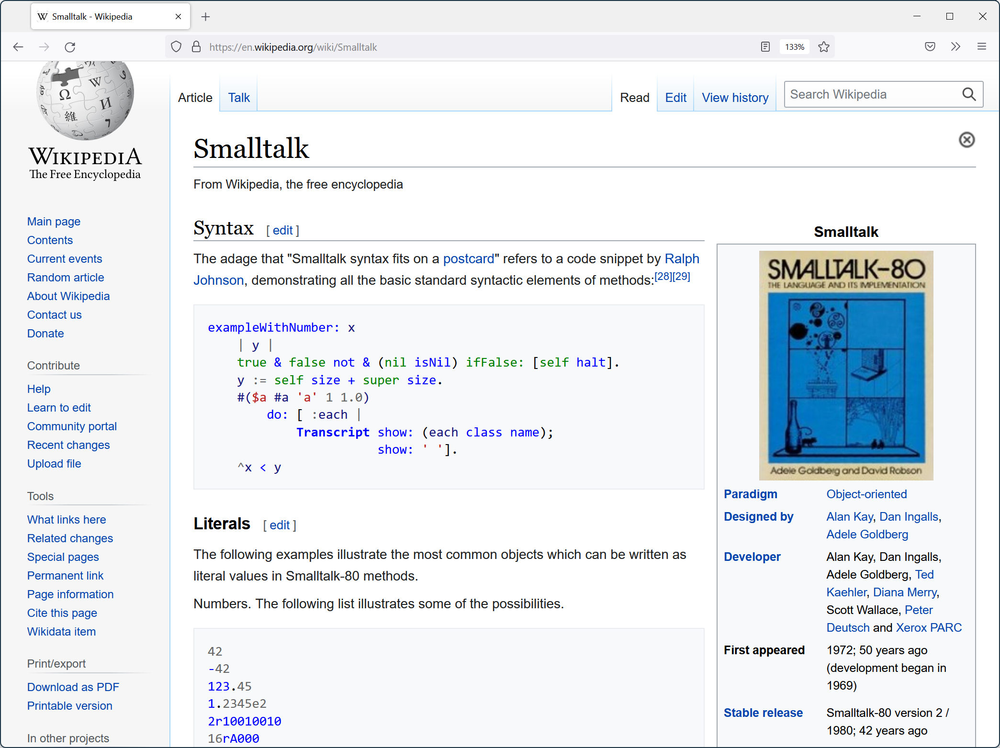
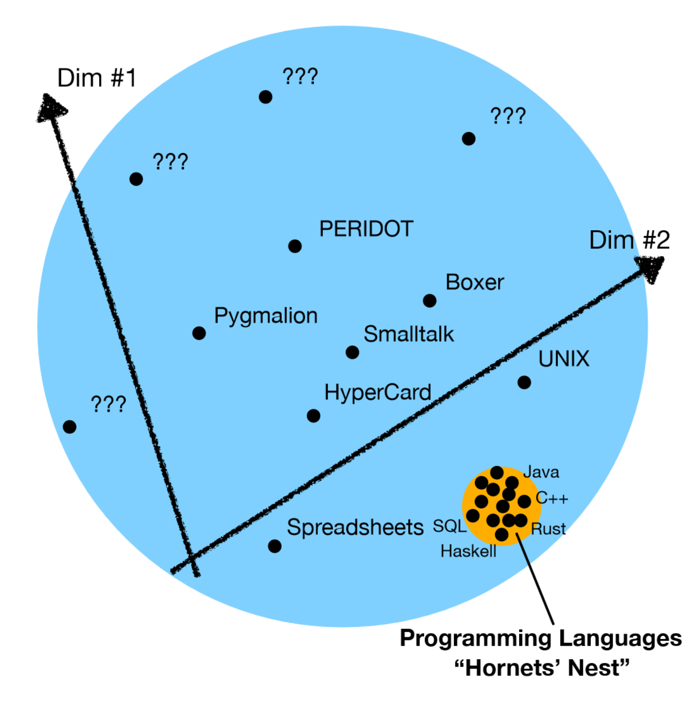
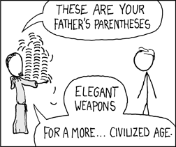
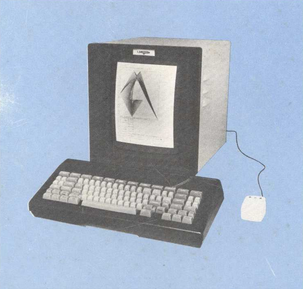
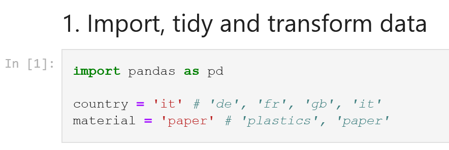

- title : Programming systems, not just for data science
- description : Programming systems, not just for data science
- author : Tomas Petricek
- theme : white
- transition : none

***************************************************************************************************
- class: intro

# *Programming systems*
## Not just for data science

<div style="height:330px"></div>

Tomas Petricek, _University of Kent_  
_[tomas@tomasp.net](mailto:tomas@tomasp.net) <span style="margin:0px 6px 0px 6px">|</span>
[@tomaspetricek](http://twitter.com/tomaspetricek) <span style="margin:0px 6px 0px 6px">|</span>
[http://tomasp.net](http://tomasp.net)_

***************************************************************************************************


---------------------------------------------------------------------------------------------------


---------------------------------------------------------------------------------------------------

# Making programming better
_Caricatures of conventional views_

<br />

_<i class="fa fa-laptop-code"></i>_ What is programming?   
_<i class="fa fa-xx"></i> Producing code in a programming language!_

_<i class="fa fa-file"></i>_ How to improve it?   
_<i class="fa fa-xx"></i> Write a research paper with a prototype!_

_<i class="fa fa-check-circle"></i>_ What matters about it?  
_<i class="fa fa-xx"></i> Safety, efficiency, usability!_

<br />

---------------------------------------------------------------------------------------------------


---------------------------------------------------------------------------------------------------



***************************************************************************************************

# _Technical dimensions_
_(with Joel Jakubovic and Jonathan Edwards)_

---------------------------------------------------------------------------------------------------


## **Programming Languages**

_Programming is writing code_

_Formal semantics, implementation, paradigms_

<div class="fragment">

We know how to study this!

</div>

---------------------------------------------------------------------------------------------------


## **Programming Systems**

_Interacting with stateful system_

_Visualizations, feedback, interaction_

<div class="fragment">

But how do we study this?

</div>

---------------------------------------------------------------------------------------------------



## **Language is<br />a small part**

_Together with editors, debuggers & other tools_

_Less interesting but overemphasized?_

---------------------------------------------------------------------------------------------------

# Technical dimensions
_Science of programming systems_

<br />

_<i class="fa fa-icons"></i> Academics & start-ups build interesting systems!_

_<i class="fa fa-hand-sparkles"></i> Disconnected and hard to compare_

_<i class="fa fa-clipboard-list"></i> Can we find a common language?_

_<i class="fa fa-archway"></i> Stand on the shoulders of giants?_

<br /><br />

---------------------------------------------------------------------------------------------------



## **Dimensions**

_Identify interesting characteristics_

Cover "good old" and new systems alike

_Allow qualitative comparison_

Don't say what's good!

---------------------------------------------------------------------------------------------------

<style> .narrow p, .narrow li { margin:2px; font-size:24pt; } </style>
<table class="narrow"><tr><td>

**Interaction**

- _Feedback Loops_
- _Modes of interaction_
- _Abstraction Construction_

**Notation**

- _Notational Structure_
- _Surface/Internal_
- _Primary/Secondary_
- _Expression Geography_
- _Uniformity_

**Error Handling**

- _Error Detection_
- _Error Response_

</td><td>

**Conceptual Structure:**

- _Integrity/Openness_
- _Composability_
- _Convenience_
- _Commonality_

**Customizability**

- _Staging_
- _Externalizability_
- _Additive Authoring_
- _Self-Sustainability_

**(Others)**

- _Degrees of Automation_
- _Learnability & Sociability_

</td></tr></table>

---------------------------------------------------------------------------------------------------

## _Abstraction Construction_


**From Concrete**

- _Generalize from examples_
- _Expanding range in Excel_
- _Pygmalion system_

<div class="fragment">

**From Abstract**

- _Define function first_
- _Most programming languages_
- _Coding done without values_

</div>

---------------------------------------------------------------------------------------------------

## _Notational Uniformity_



**Post-modernist**

- _Variety of different notations_
- _More to learn, but better problem fit_
- _Perl language, Web platform_

<div class="fragment">

**Modernist**

- _Small set of uniform primitives_
- _Not everything fits the notation_
- _Lisp and (partly) Smalltalk_

</div>

---------------------------------------------------------------------------------------------------

## _Self-sustainability_



**Separate language level**

- _Implementation vs. user level_
- _Limited changeability from within_
- _Java and other languages_

<div class="fragment">

**Integrated systems design**

- _Implemented & modifiable in itself_
- _Often changeable at runtime_
- _Smalltalk, Lisp Machines_

</div>

---------------------------------------------------------------------------------------------------

# Technical dimensions
_Why and how to use them_

<br />

_<i class="fa fa-hand-point-right"></i> Systems are more than languages_

_<i class="fa fa-language"></i> Trying to find a common language_

_<i class="fa fa-desktop"></i> New look at past programming systems?_

_<i class="fa fa-map"></i> Map for exploring new design ideas?_

<br /><br />

***************************************************************************************************

# _Data exploration_

---------------------------------------------------------------------------------------------------

# Querying data

_Athletes by number of gold medals from Rio 2016_

<div style="padding:40px 0px 60px 0px">

```
olympics = pd.read_csv("olympics.csv")
olympics[olympics["Games"] == "Rio (2016)"]
  .groupby("Athlete")
  .agg({"Gold": sum})
  .sort_values(by="Gold", ascending=False)
  .head(8)
```

</div>
<div class="fragment">
  <div class="tipbox" style="left:455px;top:-324px;width:220px;height:25px"></div>
  <div class="tiplbl" style="left:550px;top:-415px">Unknown file</div>
  <div class="tipbox" style="left:364px;top:-254px;width:90px;height:25px"></div>
  <div class="tiplbl" style="left:390px;top:-245px">Column name</div>
</div>

---------------------------------------------------------------------------------------------------

# Querying data

_Language and data source features you need to know_

<br />

_<i class="fa fa-book"></i> Python dictionaries `{"key": value}`_

_<i class="fa fa-eye"></i> Generalised indexers `.[ condition ]`_

*<i class="fa fa-university"></i> Operation names `sort_values`*

_<i class="fa fa-database"></i> Data column names `"Athlete"`_

<br />
<br />

---------------------------------------------------------------------------------------------------


# Notebooks

**Financial Times waste analysis**

_Note the clever abstraction mechanism!_

---------------------------------------------------------------------------------------------------



# Notebooks

**Financial Times waste analysis**

_Note the clever abstraction mechanism!_

<div style="height:305px"></div>

---------------------------------------------------------------------------------------------------

# The Gamma
_Programming through iterative prompting_

<br />

_<i class="fa fa-list"></i> Program just by using auto-complete!_

_<i class="fa fa-brain"></i> Recognition over recall principle_

_<i class="fa fa-sort-alpha-down"></i> Make correct and complete suggestions_

<br /><br />

---------------------------------------------------------------------------------------------------

# _Demo_
_Iterative prompting in The Gamma_

---------------------------------------------------------------------------------------------------

# The Gamma
_Technical dimensions analysis_

<br />

_<i class="fa fa-church"></i>_ Uniformity of notation _- everything is a member_

_<i class="fa fa-archive"></i>_ Self-sustainability _- all libraries external!_

_<i class="fa fa-layer-group"></i>_ Conceptual structure _- convenient at the top-level_

_<i class="fa fa-heart-broken"></i>_ Error detection _and prevention using types_

<br /><br />

---------------------------------------------------------------------------------------------------

# Histogram
_Programs as sequences of interactions_

<br />

_<i class="fa fa-code"></i> Creating code equal to using user interface_

_<i class="fa fa-not-equal"></i> Sequence of actions rather than expressions_

_<i class="fa fa-cut"></i> Extract function as a first-class feature_

_<i class="fa fa-play"></i> Integrate programming and execution_

<br /><br />

---------------------------------------------------------------------------------------------------

# _Demo_
_Data exploration in Histogram_

---------------------------------------------------------------------------------------------------

# Histogram
_Technical dimensions analysis_

<br />

_<i class="fa fa-pen-fancy"></i>_ Notational structure _- explicit structure editing_

_<i class="fa fa-truck"></i>_ Abstraction construction _- from concrete example_

_<i class="fa fa-hand-spock"></i>_ Modes of interaction _- editing & running in one mode_

_<i class="fa fa-archive"></i>_ Self-sustainability _- libraries remain external_

<br /><br />


***************************************************************************************************

# _Complementary science_

---------------------------------------------------------------------------------------------------


---------------------------------------------------------------------------------------------------


# Complementary science

<div style="margin-top:40px">

_Doing history to contribute to contemporary science_

Are there lost ideas worth recovering?

_Works even better in programming!_

<div>

---------------------------------------------------------------------------------------------------

# _Demo_
_Recovering Commodore 64 BASIC_

---------------------------------------------------------------------------------------------------

# Commodore 64
_Technical dimensions analysis_

<br />

_<i class="fa fa-hand-spock"></i>_ Modes of interaction _- editing & running in one mode_

_<i class="fa fa-gamepad"></i>_ Learnability _- use BASIC even to play games!_

_<i class="fa fa-newspaper"></i>_ Sociability _- code shareable in magazines_

_<i class="fa fa-plug"></i>_ Conceptual convenience _- high with escape hatches_

<br /><br />

***************************************************************************************************

# _Conclusions_

---------------------------------------------------------------------------------------------------


---------------------------------------------------------------------------------------------------
- class: intro

## Programming systems

_<i class="fa fa-chart-line"></i>_ Technical dimensions _to think about systems_

_<i class="fa fa-sync"></i>_ Iterative prompting _for non-expert data exploration_

_<i class="fa fa-hand-point-right"></i>_ Programming as interaction _to design new systems!_

_<i class="fa fa-archway"></i>_ Complementary science _to get more ideas!_

<br /><br />


Tomas Petricek, _University of Kent_  
_[tomas@tomasp.net](mailto:tomas@tomasp.net) <span style="margin:0px 6px 0px 6px">|</span>
[@tomaspetricek](http://twitter.com/tomaspetricek) <span style="margin:0px 6px 0px 6px">|</span>
[http://tomasp.net](http://tomasp.net)_
