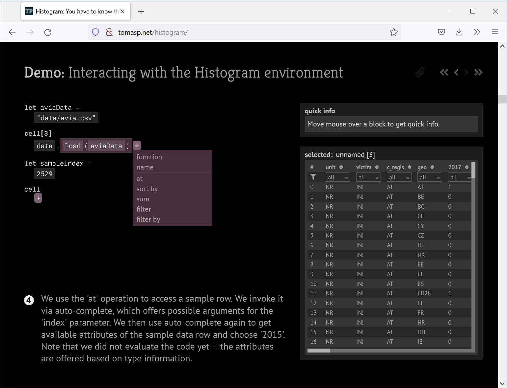

- title : Methodology of Programming Systems
- description : Methodology of Programming Systems
- author : Tomas Petricek
- theme : white
- transition : none

***************************************************************************************************
- class: intro

#  Methodology of **Programming Systems**

_Joel Jakubovic_, Tomas Petricek, _Jonathan Edwards_  
_[tomas@tomasp.net](mailto:tomas@tomasp.net) |
[@tomaspetricek](http://twitter.com/tomaspetricek)_

***************************************************************************************************

## **Programming Languages**

_We know how to study this!_

***************************************************************************************************

## **Programming Systems**

_But how do we study this?_

***************************************************************************************************

# **Theory bias**

_Establishing computer science as a legitimate theoretical discipline was (...) an essential
component in the professionalization agenda_

Within the status hierarchy of the university (...)
theory ranked higher than practice, and was therefore desirable for its own sake.

_It provided a means of distinguishing the competent professional from  the mere technician._

***************************************************************************************************

# **Communities**
_Communities looking at programming systems_

 

_<i class="fa fa-vector-square"></i> Programming experience and liveness (PX, LIVE)_

_<i class="fa fa-mouse"></i> Interaction and user experience (UIST, VL/HCC)_

_<i class="fa fa-not-equal"></i> Formal models of programming systems (POPL)_

_<i class="fa fa-church"></i> History and philosophy of programming (HaPoP)_

  

***************************************************************************************************

# **Methodologies**
_Different practices for evaluation_

 

_<i class="fa fa-not-equal"></i> We_ prove safety _of our tiny formal model..._

_<i class="fa fa-clock"></i> We implemented a system and it_ runs fast.

_<i class="fa fa-user"></i>_ Study shows _users can complete tasks 10% faster..._

_<i class="fa fa-award"></i> We describe this interesting past_ influential _system._

_<i class="fa fa-eye"></i> Here is a new system we built._ Behold!

  

***************************************************************************************************

## **The missing component**

Capture essential characteristics of system design!

_How the system makes you think_

_How the system makes you interact_

***************************************************************************************************

# **Possible answers**
_Evaluating programming systems design_

***************************************************************************************************

## **Formalism  done right?**

Program as a sequence of interactions with the environment

_More realistic, but narrow technical focus_

 

***************************************************************************************************

## **Videos and screencasts?**

Walkthrough showing concrete use case of working with a system

_How to generalize to get reusable knowledge?_

 

***************************************************************************************************

## **Interactive essays?**

Guided interaction, allowing the reader to explore independently

_Interaction focus systems, but what makes it rigorous?_

 

***************************************************************************************************

## **Complementary science?**

Recover interesting ideas about past programming systems

_Is a limited simulation accurate enough?_

 

***************************************************************************************************

## **Technical Dimensions of Programming Systems?**

***************************************************************************************************
