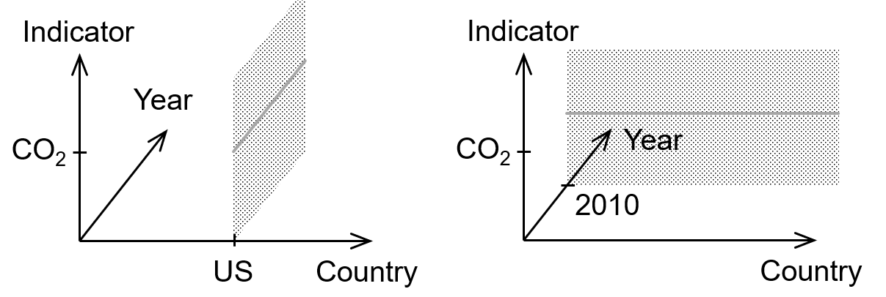
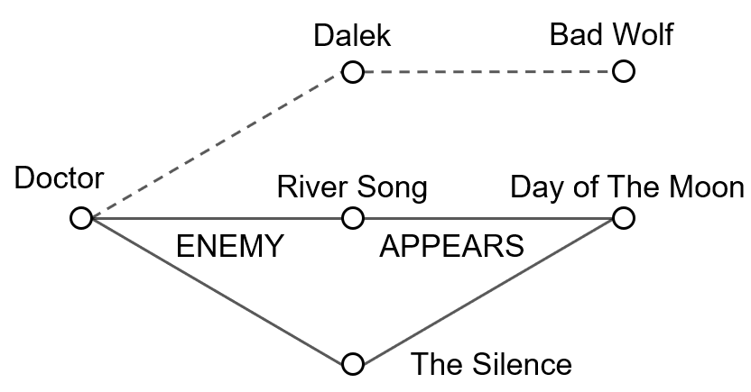

- title : Programming systems, not just for data science
- description : Programming systems, not just for data science
- author : Tomas Petricek
- theme : white
- transition : none

***************************************************************************************************
- class: intro

# The Gamma
## Programmatic data exploration for non-programmers

Tomas Petricek, _Charles University, Prague_  
_[tomas@tomasp.net](mailto:tomas@tomasp.net) |
[@tomaspetricek](http://twitter.com/tomaspetricek) |
[http://tomasp.net](http://tomasp.net)_

***************************************************************************************************

***************************************************************************************************

# Motivation
_Tools for open data-driven journalism_

 

_<i class="fa fa-chalkboard-teacher"></i> Simplicity and learnability without experts_

_<i class="fa fa-search"></i> Transparency through openness_

_<i class="fa fa-database"></i> Knowledge transfer across data sources_

 
 

***************************************************************************************************

# _Demo_
_Exploring Olympic medals in The Gamma_

***************************************************************************************************

# Iterative prompting
_Code completion as non-expert programming mechanism_

 

_<i class="fa fa-code"></i> Single interaction to construct code_

_<i class="fa fa-check"></i> Valid and complete mechanism_

_<i class="fa fa-plug"></i> Works with many type providers_

 
 

***************************************************************************************************

# _Demo_
_Exploring the World Bank data cube_

***************************************************************************************************

**Data cube provider**

_Multi-dimensional data cube slicing_

 

**Graph data provider**

_Finding connections in graph databases_

***************************************************************************************************

# Evaluation
_Data exploration for non-programmers_

 

_<i class="fa fa-chart-line"></i>_ Can you create interesting analyses?  
_<i class="fa fa-xx"></i> Yes! See case studies in the paper_

_<i class="fa fa-user-tie"></i>_ Can non-programmers use the tool?  
_<i class="fa fa-xx"></i> Yes! See the user study in the paper_

 
 

***************************************************************************************************
- class: intro

## The Gamma

_<i class="fa fa-magic"></i>_ What is new? _Yes, it is that simple!_

_<i class="fa fa-atlas"></i>_ Design space _of data exploration tools_

_<i class="fa fa-list"></i>_ Code completion _as coding mechanism_

_<i class="fa fa-sync"></i>_ Iterative prompting _interaction principle_

  

Tomas Petricek, _Charles University, Prague_  
_[tomas@tomasp.net](mailto:tomas@tomasp.net) |
[@tomaspetricek](http://twitter.com/tomaspetricek) |
[http://tomasp.net](http://tomasp.net)_
