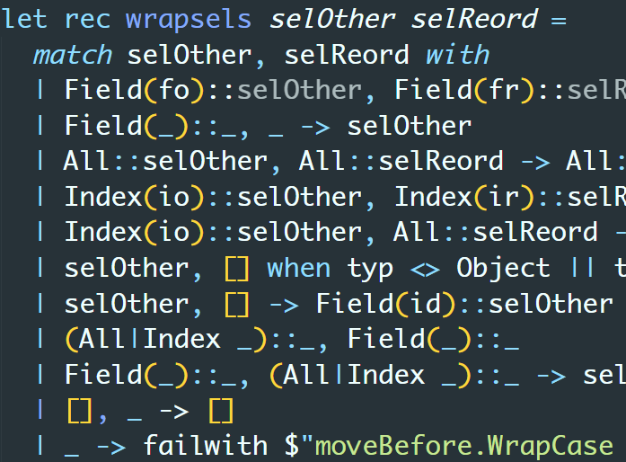

- title: Document-oriented programming based on edit history

*****************************************************************************************
- template: title

# **Document-oriented** programming based on **edit history**

---

**Tomas Petricek**, Charles University, Prague

_<i class="fa fa-envelope"></i>_ [tomas@tomasp.net](mailto:tomas@tomasp.net)  
_<i class="fa fa-globe"></i>_ [https://tomasp.net](https://tomasp.net) | [@tomaspetricek](http://twitter.com/tomaspetricek)    

*****************************************************************************************
- template: icons

# What I want?
## A programming system that is

- *fa-universal-access* **Accessible and simple** on first encounter
- *fa-cogs* But allows power-users to **modify the system**
- *fa-users* Can be used in **local-first collaborative** ways
- *fa-envelope-open-text* Open and can **explain its working**

*****************************************************************************************
- template: lists

# Two ideas

## Transparent document format

- Document with code and data
- Smalltalk image easier to navigate
- Also contain evaluation trace!

## Program as a sequence of edits

- Can be replayed to get the document
- Makes merging documents easier
- Record and/or analyse past edits?

*****************************************************************************************
- template: content
- class: nologo

# Demo: Conference planning

*****************************************************************************************
- template: subtitle

# Demo
## Add speaker & refactor list

*****************************************************************************************
- template: image

# Sample edits

**Shared baseline** with multiple sequences of edits added

**Typical local-first** workflow, with independent edits

*****************************************************************************************
- template: image

# Two ways  of merging

Do they result in **equivalent** documents?

Can we have a **conflict** that imposes order?

*****************************************************************************************
- template: icons

# Formulas
## Code as document elements

- *fa-tree* Store formulas as trees (AST) in document
- *fa-calculator* Render in a (somewhat) nicer way
- *fa-file-circle-plus* Evaluation adds edits to the log!
- *fa-heart-circle-xmark* Beware interactions with edit merging

*****************************************************************************************
- template: image

# Code is data

**Absolute selectors** only for now

**A selector**  
is a sequence of:

- Field name
- Index specifier
- All selector

*****************************************************************************************
- template: subtitle

# Demo
## Budget calculation & refactor list

*****************************************************************************************
- template: lists

# Merging of formulas

## Edit after formula add

- Formula exists in the document
- Structure edit edits structure   
  and all references in the doc

## Formula add after edit

- Selectors in newly added edits  
  reconciled with all new non-baseline edits
- Edit adds correct formula!

*****************************************************************************************
- template: icons

# Evaluation
## How it interacts with editing

- *fa-file-circle-plus* Evaluation adds edits that replace nodes!
- *fa-filter-circle-xmark* Same mechanism to reconcile edits as before
- *fa-trash* But conflicting edit removes evaluated edit!
- *fa-circle-question* Sometimes, they could adapt though...

*****************************************************************************************
- template: subtitle

# Demo
## Adding a speaker and evaluation

*****************************************************************************************
- template: subtitle

# Conclusions
## Possible future directions

*****************************************************************************************
- template: largeicons

# Future directions

- *fa-cog* **Formally show edits can always be merged?**  
  Maybe, but probably only for a very small subset
- *fa-cog* **Projectional editing for nicer experience**      
  Could editors written in the document itself?
- *fa-cog* **Rethinking abstraction and copy & paste**    
  Abstract past edits, programming by demonstration
- *fa-cog* **Add user interactions, also as edits**  
  How soon will this become unmaintainable?

*****************************************************************************************
- template: image

# Open positions in Prague

**Postdoc and PhD** funding available

**Growing PL group**  
with more people starting soon

**Email me to  
learn more!**

*****************************************************************************************
- template: title

# **Conclusions**

**Two ideas for better programming systems!**

- Document-oriented programming
- Programs as edit history
- Smalltalk ideal done differently?

---

**Tomas Petricek**, Charles University, Prague

_<i class="fa fa-at"></i>_ [tomas@tomasp.net](mailto:tomas@tomasp.net) | [@tomaspetricek](http://twitter.com/tomaspetricek)    
_<i class="fa fa-globe"></i>_ [https://tomasp.net](https://tomasp.net)  
