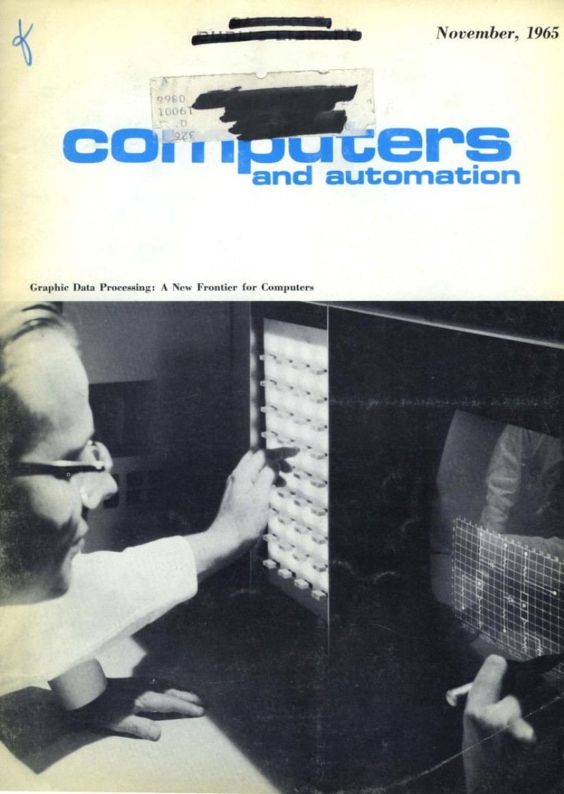

- title: Cultures of Programming

*****************************************************************************************
- template: title

# Cultures of Programming
## A Look at the History of Programming

---

**Tomas Petricek**, Charles University  
_<i class="fa fa-envelope"></i>_ [tomas@tomasp.net](mailto:tomas@tomasp.net)  
_<i class="fa-solid fa-circle-right"></i>_ [https://tomasp.net](https://tomasp.net)   
_<i class="fa-brands fa-twitter"></i>_ [@tomaspetricek](http://twitter.com/tomaspetricek)

*****************************************************************************************
- template: subtitle

# Introduction
## Cultures of Programming

-----------------------------------------------------------------------------------------
- template: image
- class: smaller noborder

# Twist the Lion's Tail

**Implemented new code replacing the "Power Peg",
deployed the change and enabled a flag to turn it on.**

----

Deployment failed, running old untested code. Rollback only made it worse!

----

**What should have been done to prevent this?**

-----------------------------------------------------------------------------------------
- template: lists
- class: smaller2x

# Counterfactual Speculations (1/2)

## Mathematical Culture

- "Formal Verification of Financial  
  Algorithms, Progress and Prospects"
- The bug was not in the algorithm

## Engineering Culture

- "Had [they] implemented an automated deployment system [the error] would have been avoided."
- Cautionary tale of the DevOps movement

-----------------------------------------------------------------------------------------
- template: lists
- class: smaller2x

# Counterfactual Speculations (2/2)

## Managerial Culture

- "system of risk management controls and supervisory procedures not reasonably designed" as required by the rule 15c3-5

## Hacker and Humanistic Cultures

- How can it take 45 minutes to stop it?
- Automated trading is not in line   
  with augmenting human intellect

-----------------------------------------------------------------------------------------
- template: icons

# Cultures of Programming
## What is this talk about

- *fa-microchip* Multi-disciplinary origins of programming
- *fa-user-lock* Cultures remain surprisingly stable over time
- *fa-explosion* Interesting things happen when they meet
- *fa-book-journal-whills* Useful fiction for understanding the history

*****************************************************************************************
- template: subtitle

# Case Study #1
## Mathematization of Programming

-----------------------------------------------------------------------------------------
- template: image

# Programming in the 1940s

**Planning the computation and wiring cables**

No idea of a programming language!

-----------------------------------------------------------------------------------------
- template: lists
- class: border

# Making Programming Easier

## Hacker tricks (late 1940s)

- Pseudo-instructions
- Translated or interpreted

## Mathematical theories (late 1950s)
- Chomsky's work on formal grammars

## Managerial needs (1950s)

- Computer installation managers
- Need cross-machine compatibility

-----------------------------------------------------------------------------------------
- template: image
- class: smaller

# When technology became language
(Nofre, Priestley, 2014)

**Meeting of hacker, mathematical and managerial culture!**

Birth of a single unified  
way of thinking?

-----------------------------------------------------------------------------------------
- template: icons

# Languages of the 1950s
## Different cultures think differently

- *fa-user-tie* **COBOL** - Common business-oriented language
- *fa-not-equal* **ALGOL** - Formal mathematical language
- *fa-brain* **LISP** - Symbolic manipulation with interactivity

-----------------------------------------------------------------------------------------
- template: image

# Goto Considered Harmful
(Dijkstra, 1968)

----

**Engineering**  
Code difficult to understand

**Mathematical**  
Breaks compositional reasoning

-----------------------------------------------------------------------------------------
- template: icons

# Structured Programming
## A better way of organizing code

- *fa-person-chalkboard* Coined by Dijkstra a year later in 1969
- *fa-square-check* Intended as a good programming practice
- *fa-arrows-rotate* Code corresponds to execution logic
- *fa-database* Later generalized to structured data

-----------------------------------------------------------------------------------------
- template: image

# Structured Programming

**Chief programmer teams methodology**

Adapts the idea for management purposes

**Organizing code vs.
Organizing people**

-----------------------------------------------------------------------------------------
- template: lists
- class: border

# Culture Clash

## Dijkstra disapproves

American _"management philosophy aiming at making companies as independent as possible of the competence of their employees"_

Anti-intellectualism characterized by "How to program if you cannot."

**Good code as part of engineering dignity!**

-----------------------------------------------------------------------------------------
- template: icons

# Clashes & Collaborations
## Proofs and social processes (1977)

- *fa-person-chalkboard* Proofs lack social processes of mathematics!
- *fa-scroll* A political pamphlet from the middle ages!
- *fa-syringe* Cleanroom methodology to ensure proofs check
- *fa-gears* Proof assistants check proofs mechanically

-----------------------------------------------------------------------------------------
- template: content

- mathematization - useful politically at university

*****************************************************************************************
- template: subtitle

# Case Study #2
## Interactive Programming

-----------------------------------------------------------------------------------------
- template: image
- class: smaller

# Batch processing

Adopted when big 1940s computers became useful

**Pass your stack of cards to the operator, wait hours/days for the result...**

Inefficient, but the  
norm in the 1950s

-----------------------------------------------------------------------------------------
- template: image

# MIT TX-0 "Hackers"

**Built for testing, loaned to MIT RLE in 1958**

Used interactively through terminal

Available in time slots 24 hours per day

-----------------------------------------------------------------------------------------
- template: icons

# Interactive Programming
## Struggles in the 1960s

- *fa-wave-square* Low performance LINC computer for $43,000
- *fa-network-wired* Interactive time-sharing systems via terminals
- *fa-clapperboard* "The Mother of All Demos" talk in 1968
- *fa-sack-dollar* Computers slowly become more affordable...

-----------------------------------------------------------------------------------------
- template: image
- class: smaller

# Smalltalk (1970s)

**Innovative system**

Graphical interface  
Object-oriented  

**Humanistic vision**

Programming for kids  
Personal dynamic medium  
Self-modifiable

-----------------------------------------------------------------------------------------
- template: lists

# Commercialization

## Xerox Star (1981)

- Adopts the graphical display
- Adopts "icons" and "desktop"
- Closed end-user applications!

## Commercial Smalltalk

- Adopted in the 1990s in banks
- Collaboration and IP protection hard
- Inspired modern development practices

-----------------------------------------------------------------------------------------
- template: image

# Interactive Programming Strikes Back

Microprocessors make it possible to build
computers cheap enough for everyone

**They do not do much!**

-----------------------------------------------------------------------------------------
- template: lists
- class: border

# The 1977 trinity

## Three minicomputers

- Widely accessible
- Commodore PET, Apple, TRS-80

## Hacker style of programming

- Start in interactive BASIC
- Copy programs from magazines
- Write code to load & run programs
- Actually accessible to (many) kids

-----------------------------------------------------------------------------------------
- template: icons

# Interactive Programming
## Struggles in the late 1970s

- *fa-table* Killer apps like dBASE and VisiCalc
- *fa-lock* Hacker and humanistic goals at odds
- *fa-user* Gradual shift from programming to using
- *fa-bridge* BASIC vs. "proper" engineering

*****************************************************************************************
- template: subtitle

# Case Study #3
## Software Engineering

-----------------------------------------------------------------------------------------
- template: lists
- class: smaller border

# Getting Programs to Behave

"Programming in the early 1950s  
was a black art, a private arcane  
matter involving a programmer, a
problem, a computer, and perhaps a small library of subroutines and a primitive assembly program."

**John Backus (1976)**

-----------------------------------------------------------------------------------------
- template: image

# Debugging TX-0

**UT3, FLIT, DDT**

Search memory, modify program in numeric, later symbolic, codes

"**Far from completely described even in internal memoranda**"

-----------------------------------------------------------------------------------------
- template: lists
- class: border

# Debugging Epoch Opens (1965)

## Limiting factors for computing

 - Hardware until mid-1950s
 - Programming until mid-1960s
 - What now? Now: debugging.

## Terminology in the 1960s

 - Program checkout - check it works!
 - Debugging - programs actually run
 - Testing - programs solve the problem

-----------------------------------------------------------------------------------------
- template: lists
- class: smaller border

# On-line Debugging (1966)

"With some care, it has been possible (..)  
to find a bug while at a breakpoint in running a test case, call the editor to make a correction, run the program on a simpler test case to verify the correctness (...) resume execution of the original test case.."

-----------------------------------------------------------------------------------------
- template: lists
- class: border

# Debugging & Testing Controversies

## Niklaus Wirth (1969)

"My worry is that the facility of quick response
leads to sloppy working habits"

## Edsger Dijkstra (1971-3)

"Program testing can be used very  
effectively to show the presence of  
bugs but never to show their absence."

-----------------------------------------------------------------------------------------
- template: icons

# Testing over Time
## Shifting Meaning of Testing

- *fa-square-check* Show that programs work (before 1978)
- *fa-chart-line* Testing as a process phase (since 1970s)
- *fa-square-xmark* Find errors in programs (after 1978)
- *fa-arrows-rotate* Test as an engineering tool (since 1990s)

-----------------------------------------------------------------------------------------
- template: image
- class: smaller

# Debugging today?

Similar to 1960s  
Learned through practice  
Hacker culture only

**No inter-cultural artifact?**

*****************************************************************************************
- template: subtitle

# Conclusions
## Cultures of Programming

-----------------------------------------------------------------------------------------
- template: lists
- class: smaller border

# Cultures Shape Programming

## Programming languages

- Mathematization a good political move
- Programming languages vs. systems

## Software engineering

- Test becomes a multi-cultural entity
- Also types, but not debugging!

## Interactive programming

- Breaks managerial & engineering needs
- Hard to study mathematically

-----------------------------------------------------------------------------------------
- template: icons

# Cultures of Programming
## Revealing Patterns in History

- *fa-comments* Cultures meet and collaborate
- *fa-shield-halved* Cultures clash over principles
- *fa-shuffle* Concepts shift between cultures
- *fa-crown* Struggle for control over programming

-----------------------------------------------------------------------------------------
- template: title

# Conclusions

**Cultures of Programming**

- Define basic assumptions and ways of working
- Surprisingly stable over the 70 year history
- Still shape teaching, hiring, safety today

---

**Tomas Petricek**, Charles University  
_<i class="fa fa-envelope"></i>_ [tomas@tomasp.net](mailto:tomas@tomasp.net)  
_<i class="fa-solid fa-circle-right"></i>_ [https://tomasp.net](https://tomasp.net)   
_<i class="fa-brands fa-twitter"></i>_ [@tomaspetricek](http://twitter.com/tomaspetricek)

-----------------------------------------------------------------------------------------
