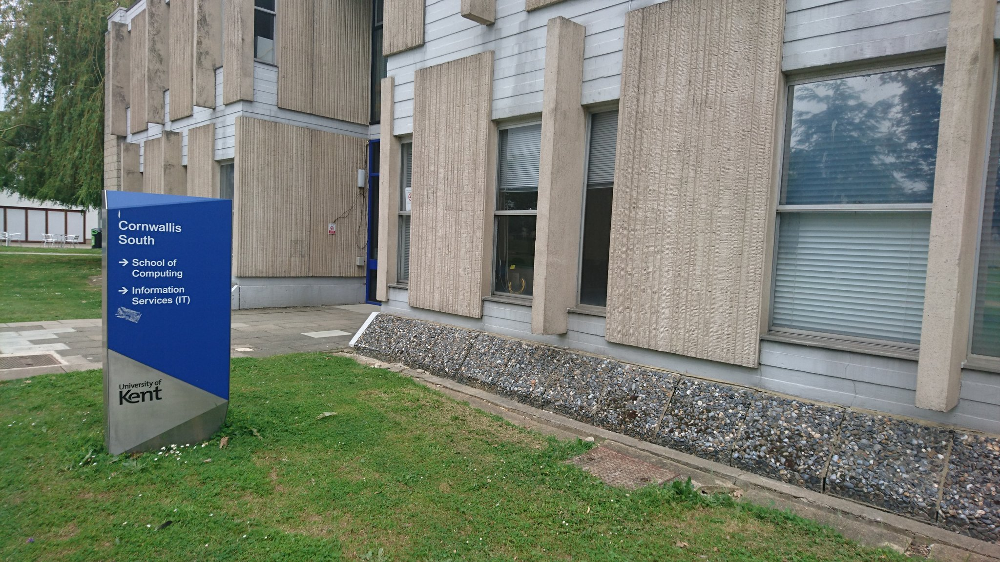
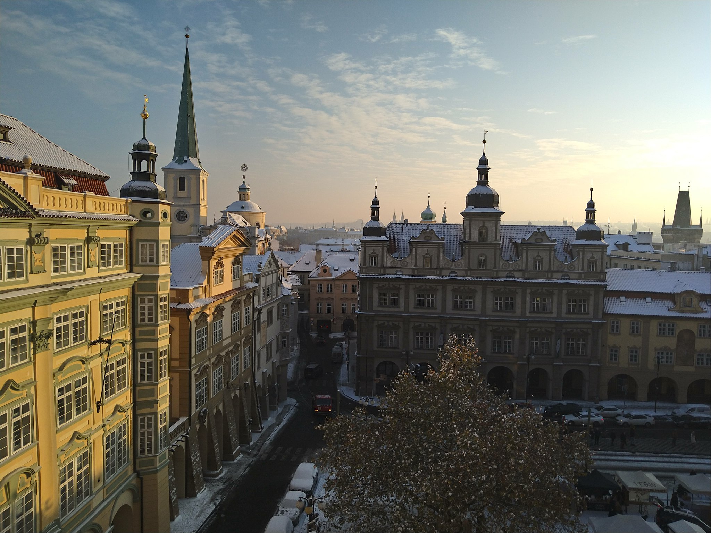
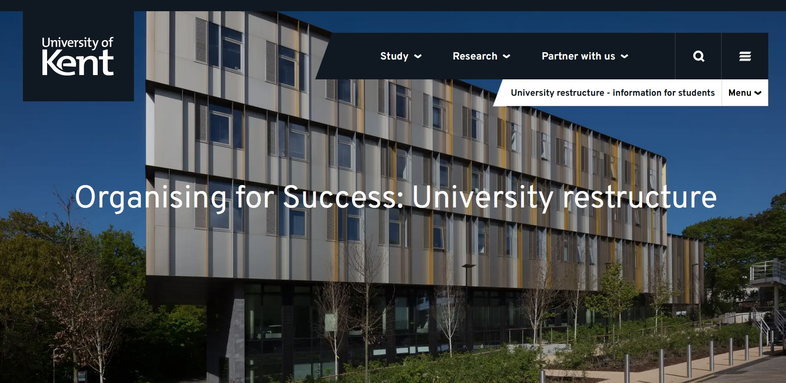
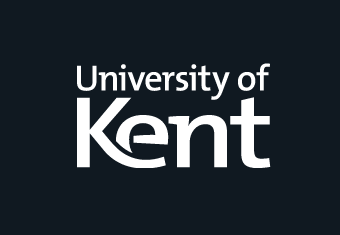
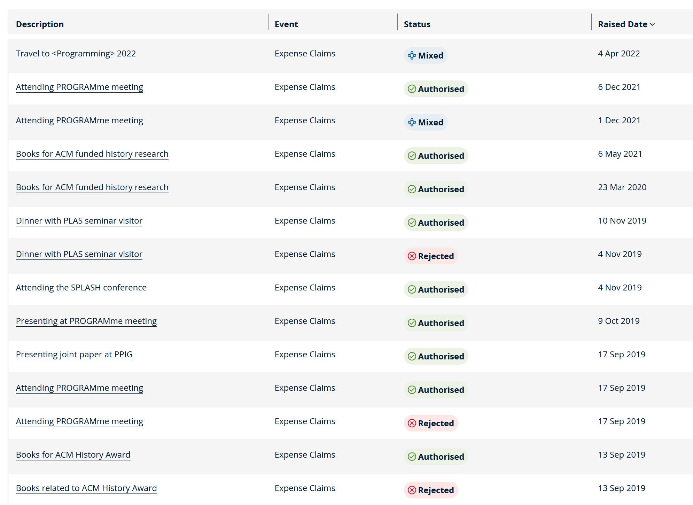
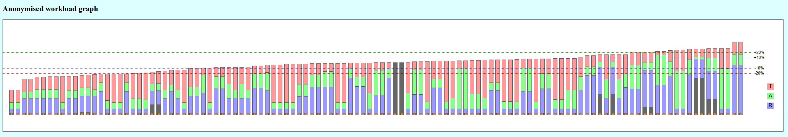
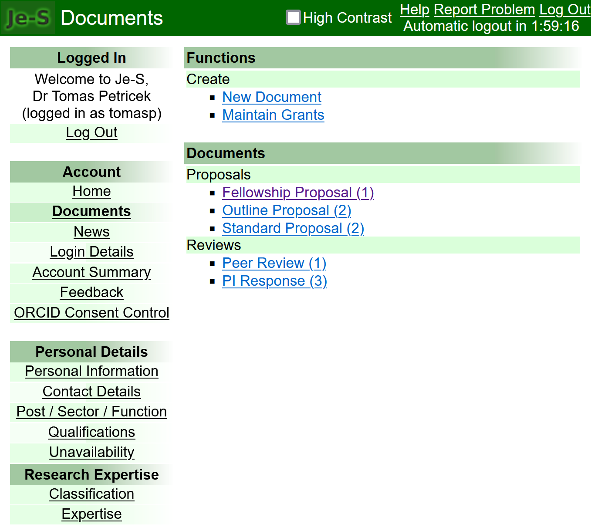
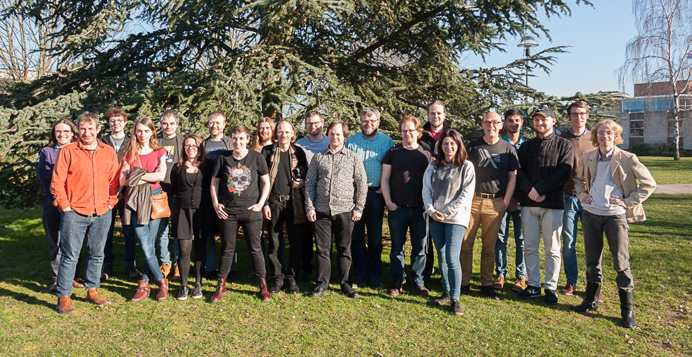
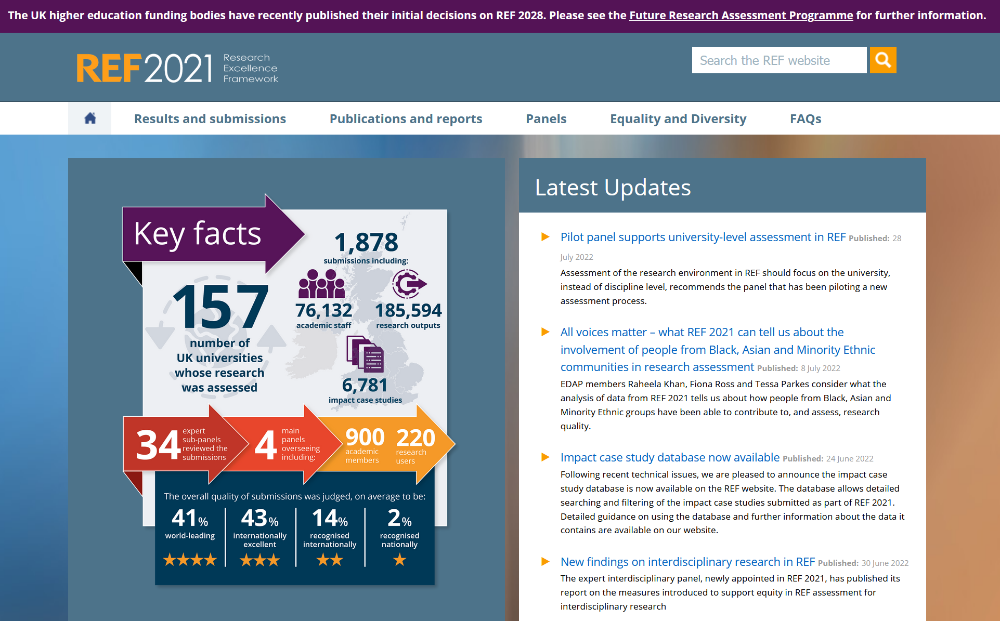
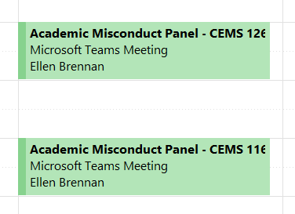

- title: Moving from Kent to Prague: One Year In

*****************************************************************************************
- template: title

# **Moving from Kent to Prague:**  One Year In

---

**Tomas Petricek**, Charles University

_<i class="fa fa-envelope"></i>_ [petricek@d3s.mff.cuni.cz](mailto:petricek@d3s.mff.cuni.cz)  
_<i class="fa-solid fa-circle-right"></i>_ [https://tomasp.net](https://tomasp.net)   
_<i class="fa-brands fa-twitter"></i>_ [@tomaspetricek](http://twitter.com/tomaspetricek)

-----------------------------------------------------------------------------------------
- template: image

# University of Kent

MSc Matfyz (2010)

PhD Cambridge (2017)

MSR (2014-16)

ATI London (2016-18)

Kent (2018-2022)

-----------------------------------------------------------------------------------------
- template: image

# Charles University

**Why come back?**

Personal reasons (kids, British housing)

Academic reasons (students, freedom?)

-----------------------------------------------------------------------------------------
- template: subtitle

# Administration

## What happens at which level

-----------------------------------------------------------------------------------------
- template: image

# Where was I?

Programming Lang-uages and Systems Research Group

School of Computing

CEMS division (1 of 6 university divisions)

-----------------------------------------------------------------------------------------
- template: lists
- class: smaller

# What happens at which level

## School level

- Study program structure
- Teaching allocation

## Division level

- Travel funding requests
- PhD scholarships

## University level

- IT decisions & administration
- Exam format & planning

-----------------------------------------------------------------------------------------
- template: image

# Travel expenses

Grant money vs. division money

**Things that got banned in 4 years**

Staying in Airbnb

Travel in general?

-----------------------------------------------------------------------------------------
- template: content

# Who does what?

Teaching / Admin / Research calculation scheme

Main influence is Grant income

-----------------------------------------------------------------------------------------
- template: subtitle

# Grants

## Applying for research funding

-----------------------------------------------------------------------------------------
- template: lists
- class: smaller

# Grants in Kent

## How the money is used?

- PI time "buyout"
- For post-docs, not PhDs
- Salaries decided centrally
- Hiring always a problem...

## Where people apply?

- Mainly EPSRC - from 1 to 10+ post-docs
- Many other UK and EU schemes

-----------------------------------------------------------------------------------------
- template: subtitle

# Demo

## Future Leader Fellowship application

-----------------------------------------------------------------------------------------
- template: image

# Grant applications

Direct effect on admin roles & how much of what you teach

**Very good "research support" services!**

Direct help with writing

Actively look for opportunities

-----------------------------------------------------------------------------------------
- template: subtitle

# Research

## The "actual work"

-----------------------------------------------------------------------------------------
- template: image

# Programming Languages and Systems group

10 staff (50% international)

15 PhDs (30% international)

Weekly seminar  
(during term)

-----------------------------------------------------------------------------------------
- template: image

# Research Evaluation

**Top 5 publications over last X years**

University managed - play it safe policy

Various other subtle incentives

Major admin role!

-----------------------------------------------------------------------------------------
- template: subtitle

# Teaching

## The other "actual work"

-----------------------------------------------------------------------------------------
- template: lists
- class: smaller

# What gets taught in Kent

## Several programmes
- Several BSc degrees
- Year in Computing
- Several MSc degrees  
  (Many non-Kent students)

## Scale of things
- Largest lecture has 400 students
- Largest I did about 200
- MSc around 80, YinCo about 20

-----------------------------------------------------------------------------------------
- template: icons

# Comparison
## Random assorted points

- *fa-brain* Matfyz students are generally smarter
- *fa-industry* Kent tries to produce employable programmers
- *fa-hammer* Many first-generation university students
- *fa-users* More coordination at school / year level
- *fa-building-columns* Changes approved at university level
- *fa-money-bill* No courses with <20 students

-----------------------------------------------------------------------------------------
- template: lists
- class: smaller

# Coordination

## Undergraduate studies

- Y1, Y2 fixed 8+8 courses (in Java)
- Y3 - choose from longer list

## How teaching works

- Courses co-taught by two people!
- What people like vs. have to teach
- I (voluntarily) did HCI and SWE

## Year in Computing review

- Things can change, but not so easy

-----------------------------------------------------------------------------------------
- template: lists
- class: smaller border

# Academic misconduct

## How people cheat

- Copy stuff, collaborate on exams
- Occasional clever cheat

## Academic misconduct process

- Fill out a form on suspicion
- Goes to Academic Misconduct Panel  
  Some 4 hours / week in the peak time
- Student + admin + 3 academics
- ~10 min / student  

-----------------------------------------------------------------------------------------
- template: title

# Thank you!

---

**Tomas Petricek**, Charles University  

_<i class="fa fa-envelope"></i>_ [petricek@d3s.mff.cuni.cz](mailto:petricek@d3s.mff.cuni.cz)  
_<i class="fa-solid fa-circle-right"></i>_ [https://tomasp.net](https://tomasp.net)   
_<i class="fa-brands fa-twitter"></i>_ [@tomaspetricek](http://twitter.com/tomaspetricek)
