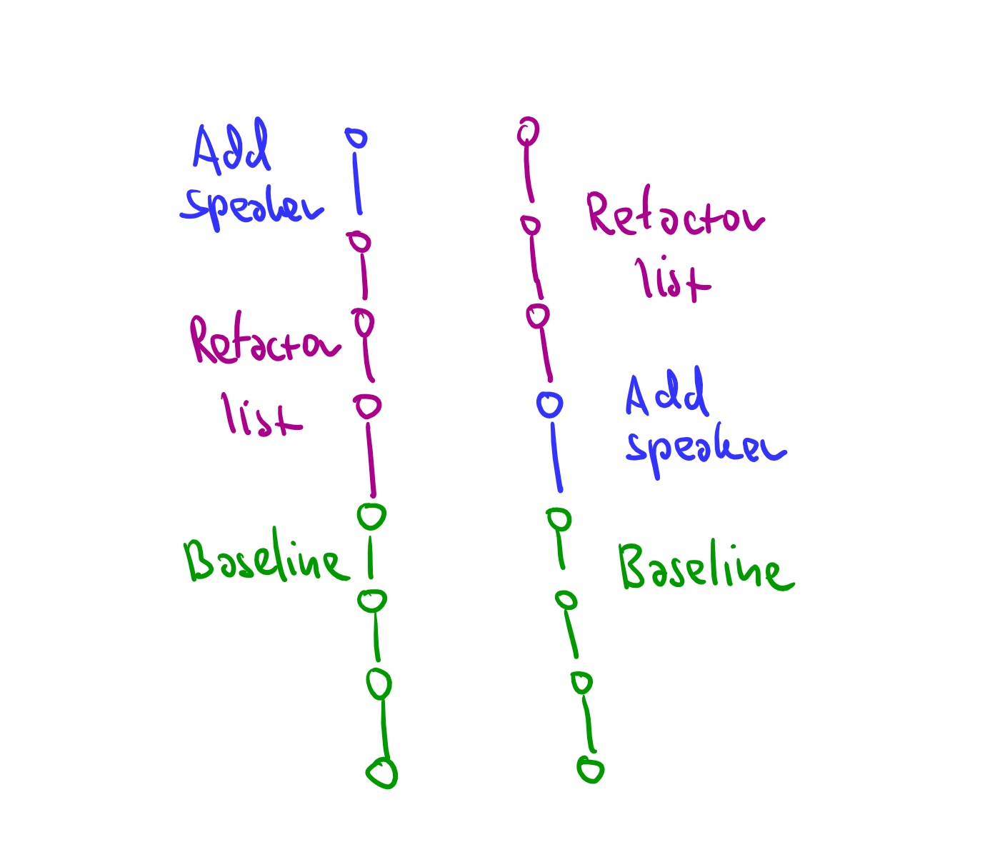

- title: Document-oriented programming based on edit history

*****************************************************************************************
- template: title

# _Exploring the design space of_ programming systems

---

**Tomas Petricek**, Charles University, Prague

_<i class="fa fa-envelope"></i>_ [tomas@tomasp.net](mailto:tomas@tomasp.net)  
_<i class="fa fa-globe"></i>_ [https://tomasp.net](https://tomasp.net)  
_<i class="fa-brands fa-twitter"></i>_ [@tomaspetricek](http://twitter.com/tomaspetricek)    

-----------------------------------------------------------------------------------------
- template: content
- class: three-column nologo

### What my boss thinks I do...

Context-aware programming languages

**Types for data science scripting**

---

### What I think I actually do...

History and philosophy of programming

**Cultures of Programming**

---

### What I will talk about today...

Programming systems design & methodology

**Documents and edit history**

-----------------------------------------------------------------------------------------
- template: icons

# How this fits together?
## Opening the software black box

- *fa-magnifying-glass* Systems that let users look inside
- *fa-user* Easy to use, understand and adapt!
- *fa-globe* What happened to the 1970s attempts?
- *fa-arrow-pointer* How to talk about interactive systems?

*****************************************************************************************
- template: subtitle

# Programming systems
## and their technical dimensions

-----------------------------------------------------------------------------------------
- template: image
- class: twolineh

# _Programming_ Languages

Programming is  
writing code

Formal semantics, implementation, paradigms, types

------

**We know how   
to study this!**

-----------------------------------------------------------------------------------------
- template: image
- class: noborder twolineh

# _Programming_ Systems

Interacting with a stateful system

Feedback, liveness, interactive user interfaces

------

**But how do we  
study this?**

-----------------------------------------------------------------------------------------
- template: lists
- class: border

# Paradigm shift in 1990s

## Scientific paradigm shifts

- The past is a foreign country
- Paradigms are incommensurable
- Old notions stop making any sense

## From systems to languages

- From CLOS and Flavors to mixins
- From running system to code
- From state & interaction to semantics

-----------------------------------------------------------------------------------------
- template: lists

# Looking at programming systems

## They are interactive

- Hard to see interaction "on paper"
- Screencast, interactive essay
- What makes for a rigorous demo?

## What to say about them

- Here is a cool new system!
- Essential characteristics?
- How to compare, advance and  
  stand on the shoulders of giants?

---------------------------------------------------------------------------------------------------
- template: lists

# Technical dimensions

## What is a dimension

- Capture interesting properties
- Cover old and new systems
- Allow qualitative comparison

## Example dimensions

- Modes of interaction
- Uniformity, conceptual structure
- Learnability & sociability

---------------------------------------------------------------------------------------------------
- template: image
- class: larger

# Technical dimensions catalogue

**Analysis of:**

LISP machines,  
UNIX, Hypercard, Spreadsheets,  
Haskell, Boxer,  
Web, Dark, etc.

---------------------------------------------------------------------------------------------------
- template: lists
- class: border

# How to use dimensions

## Analysis tool

- What makes system interesting?
- Compare against existing
- Does not say what's good!

## Design space mapping

- Discover design opportunities
- Are there blank areas?
- Graphical self-sustainable systems!

*****************************************************************************************
- template: subtitle

# Design exploration
## Documents and edit history

---------------------------------------------------------------------------------------------------
- template: icons

# What I want?
## A programming system that is

- *fa-universal-access* Accessible and simple on first encounter
- *fa-cogs* But allows power-users to modify the system
- *fa-users* Can be used in local-first collaborative ways
- *fa-envelope-open-text* Open and can explain its working

---------------------------------------------------------------------------------------------------
- template: lists

# Two ideas

## Transparent document format

- Document with code and data
- Smalltalk image easier to navigate
- Also contain evaluation trace!

## Program as a sequence of edits

- Can be replayed to get the document
- Makes merging documents easier
- Record and/or analyse past edits?

---------------------------------------------------------------------------------------------------
- template: content
- class: nologo

# Demo: Conference planning

---------------------------------------------------------------------------------------------------
- template: subtitle

# Demo
## Add speaker & refactor list

---------------------------------------------------------------------------------------------------
- template: image

# Sample edits

**Shared baseline** with multiple sequences of edits added

**Typical local-first** workflow, with independent edits

---------------------------------------------------------------------------------------------------
- template: image

# Two ways  of merging

Do they result in **equivalent** documents?

Can we have a **conflict** that imposes order?

---------------------------------------------------------------------------------------------------
- template: icons

# Formulas
## Code as document elements

- *fa-tree* Store formulas as trees (AST) in document
- *fa-calculator* Render in a (somewhat) nicer way
- *fa-file-circle-plus* Evaluation adds edits to the log!
- *fa-heart-circle-xmark* Beware interactions with edit merging

---------------------------------------------------------------------------------------------------
- template: image

# Code is data

**Absolute selectors** only for now

**A selector**  
is a sequence of:

- Field name
- Index specifier
- All selector

---------------------------------------------------------------------------------------------------
- template: subtitle

# Demo
## Budget calculation & refactor list

---------------------------------------------------------------------------------------------------
- template: lists

# Merging of formulas

## Edit after formula add

- Formula exists in the document
- Structure edit edits structure   
  and all references in the doc

## Formula add after edit

- Selectors in newly added edits  
  reconciled with all new non-baseline edits
- Edit adds correct formula!

---------------------------------------------------------------------------------------------------
- template: icons

# Evaluation
## How it interacts with editing

- *fa-file-circle-plus* Evaluation adds edits that replace nodes!
- *fa-filter-circle-xmark* Same edit reconciliation  as before
- *fa-trash* But conflicting edit removes evaluated edit!
- *fa-circle-question* Sometimes, they could adapt though...

---------------------------------------------------------------------------------------------------
- template: subtitle

# Demo
## Adding a speaker and evaluation

---------------------------------------------------------------------------------------------------
- template: largeicons

# Future directions

- *fa-not-equal* **Formally show edits can always be merged?**  
  Maybe, but probably only for a very small subset
- *fa-pen-to-square* **Projectional editing for nicer experience**      
  Could editors written in the document itself?
- *fa-copy* **Rethinking abstraction and copy & paste**    
  Abstract past edits, programming by demonstration
- *fa-i-cursor* **Add user interactions, also as edits**  
  How soon will this become unmaintainable?

*****************************************************************************************
- template: subtitle

# Complementary science
## Learning from past systems

-----------------------------------------------------------------------------------------
- template: subtitle

# DEMO
## How Tomas learned programming

-----------------------------------------------------------------------------------------
- template: lists
- class: border smaller

# Learning from past systems

## What's cool about 90s web?

- Source code available & accessible
- Easily extractable & copyable snippets
- Poor engineering in a poor language!

## Complementary science

- Do (serious) history to recover ideas
- Lost due paradigm shifts in science
- Even more powerful for computing!

-----------------------------------------------------------------------------------------
- template: icons

# Good old systems
## What have we forgotten about?

- *fa-hand-back-fist* **Pygmalion** - program by direct manipulation
- *fa-arrow-up-right-from-square* **HyperCard** - usability, levels, editing = running
- *fa-file* **Boxer** - program as transparent document
- *fa-cogs* **Interlisp** - code = data, modifiable, live coding!

-----------------------------------------------------------------------------------------
- template: subtitle

# DEMO
## Recovering Commodore 64 BASIC

-----------------------------------------------------------------------------------------
- template: icons

# Commodore 64
## What makes this interesting?

- *fa-keyboard* Editing & running as one mode of interaction
- *fa-gamepad* Load code even to run a game!
- *fa-newspaper* Learning by copying code from magazines
- *fa-plug* Convenience with escape hatches (POKE)

*****************************************************************************************
- template: subtitle

# Conclusions
## Programming systems

---------------------------------------------------------------------------------------------------
- template: image

# Open positions  in Prague

**Postdoc and PhD** funding available

**Growing PL group**  
with more people starting soon

**Email me to  
learn more!**

---------------------------------------------------------------------------------------------------
- template: title

# Systems ⊃ Languages

- **Need new research methodologies**  
  Qualitative, formal, historical, etc.
- **New designs outside of LISP or Smalltalk**  
  Document-based with edit history?

---

**Tomas Petricek**, Charles University, Prague

_<i class="fa fa-envelope"></i>_ [tomas@tomasp.net](mailto:tomas@tomasp.net)  
_<i class="fa fa-globe"></i>_ [https://tomasp.net](https://tomasp.net)  
_<i class="fa-brands fa-twitter"></i>_ [@tomaspetricek](http://twitter.com/tomaspetricek)    
